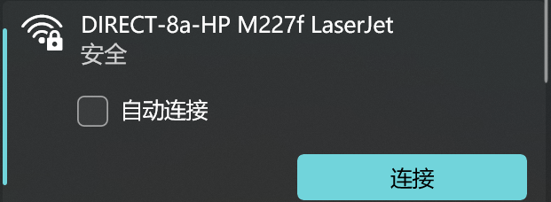
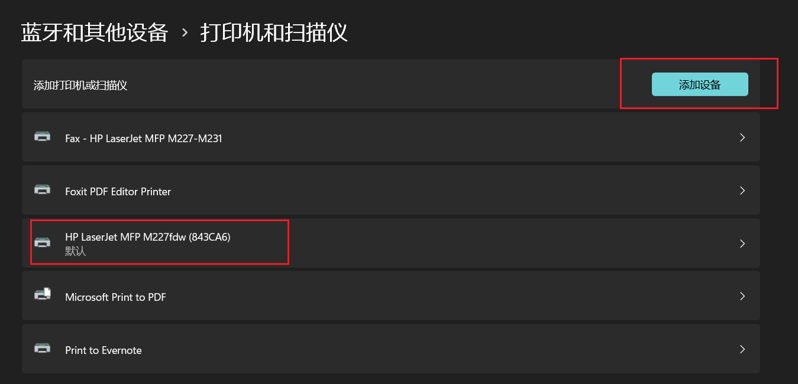
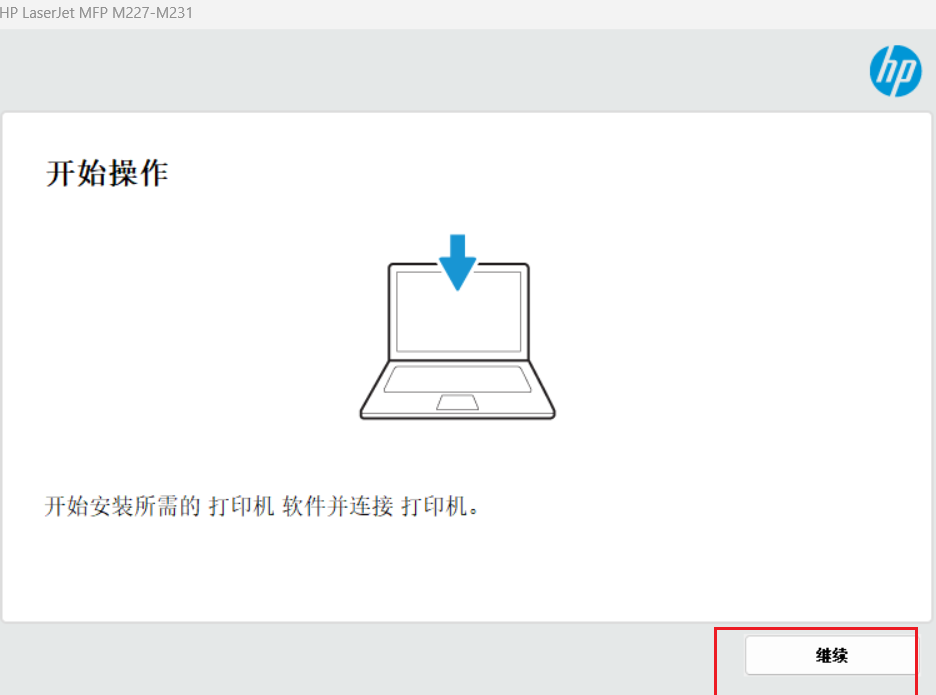
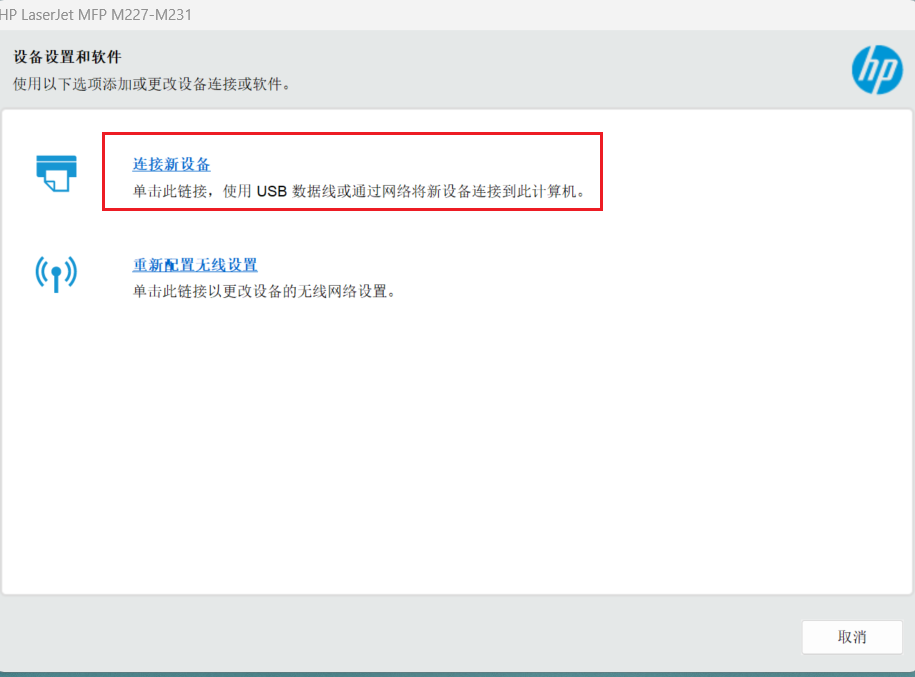
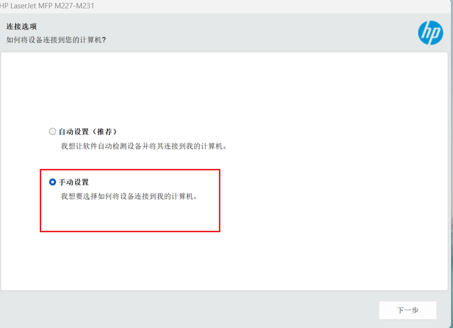
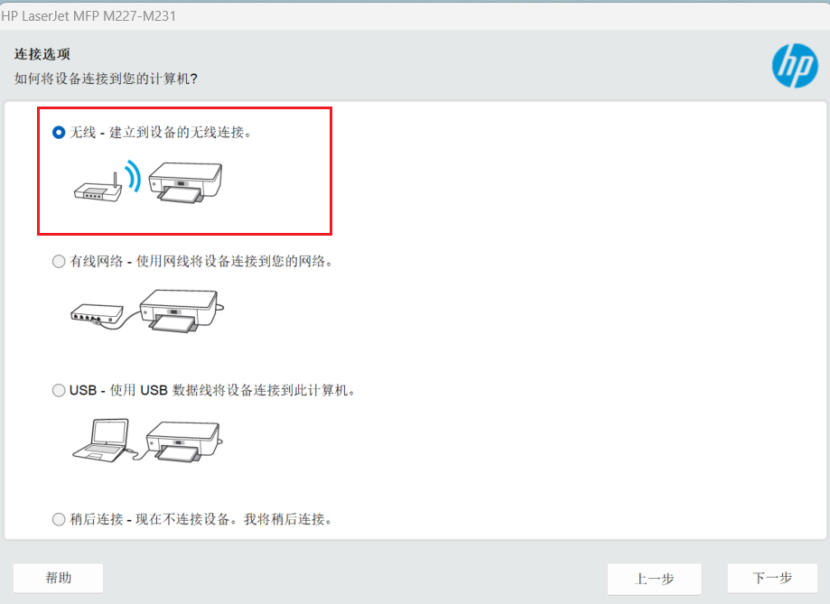

# 下面两种方式都是通过wifi-direct连接

## ==win11下连接实验室打印机==

1. 连接这个无线，密码是12345678
   
2. 打开系统打印机，点击添加设备，会出现下图所示的设备名称，添加后以后，选择这个打印机就可以打印了
   

## ==win10下连接实验室打印机==

1. 连接这个无线，密码是12345678
   

2. 打开下面这个安装包，点击继续，连接新设备，手动设置，无线连接，之后会扫描出一个设备，点击下一步安装就行，之后就可以打印了。
   

   

   

   

   

   

   