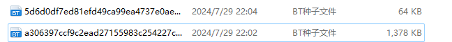

# ==一、知识参考链接==

[torch.save torch.load 四种使用方式 如何加载模型 如何加载模型参数 如何保存模型 如何保存模型参数](https://blog.csdn.net/qq_22815083/article/details/130137652)

[jupyter notebook：使用argparse包存在的问题及解决](https://blog.csdn.net/weixin_50005386/article/details/132753826)

[知识蒸馏简述（二）](https://zhuanlan.zhihu.com/p/92269636)
[知识蒸馏简述（一）](https://zhuanlan.zhihu.com/p/92166184)
[一文总览知识蒸馏概述](https://mp.weixin.qq.com/s?__biz=MzI4MDYzNzg4Mw==&mid=2247491154&idx=7&sn=2334b04b0025f52c18dd064df8986b50&chksm=ebb42686dcc3af90ffb25f003bac4678655c85e6272489e55b3691d3de29a1fd94dfe8e77b8f&scene=27)

[各类激活函数及其导函数](https://mp.weixin.qq.com/s?__biz=MzU0NjgzMDIxMQ==&mid=2247486222&idx=1&sn=2e8a3187c42a3bc25071f9a6dc4abeee&chksm=fb56e9e2cc2160f436938071a23f44dadc4cfcdcf8c7c418a08c0789db9f429b72986ffbd730&scene=27)

[深度学习（一）循环神经网络：BPTT算法、梯度消失、梯度爆炸](https://zhuanlan.zhihu.com/p/156932219?utm_id=0)

[ffmpeg安装教程](https://blog.csdn.net/baidu_37366055/article/details/139833145)

[VS Code不再支持remote SSH，只能下载1.85.2及之前的版本](https://blog.csdn.net/weixin_44728829/article/details/136643112)

[pytorch给dataloader设置num_workers的坑](https://zhuanlan.zhihu.com/p/645364089)

[在PyTorch框架上训练imagenet时，Dataloader加载速度慢怎么解决？](https://www.zhihu.com/question/400769887)

[冯·诺依曼瓶颈与突破逻辑](https://zhuanlan.zhihu.com/p/661940867)

[固态选购](https://www.zhihu.com/search?type=content&q=%E5%9B%BA%E6%80%81%E9%80%89%E8%B4%AD%E6%8C%87%E5%8D%97)

[如何关掉QQ面板的“频道”入口](https://mydown.yesky.com/news/2147473981.html)

[解决新创建的anaconda环境在C:\Users\xxx\.conda\envs\，而不在anaconda安装目录下的envs中----应该是老版本才有这个问题吧](https://blog.csdn.net/hshudoudou/article/details/126388686)

**jupyter 在非编辑模式下，按下M切换到markdown模式，按下Y切换到code模式**

# ==二、RNN==

RNN全称：Recurrent Neural Network；中文名称为：循环神经网络。
RNN其实是对线性层的复用。RNN Cell本质是一个线性层（linear），把一个维度映射到另一个维度（比如把输入的3维向量xt 变成输出5维向量 ht ）。 这个线性层与普通的线性层的区别是这个线性层是共享的。
==RNN Cell 具体计算过程:==
输入$$x_t ，h_{t-1}$$做线性变换。 $$x_t$$的维度是input_size，$$h_{t-1}$$的维度是hidden_size，输出$$h_{t}$$的维度 hidden_size.需要先把$$x_t$$的维度变成hidden_size，所以$$W_{ih}$$应该是一个 hidden_size * input_size的矩阵，$$W_{ih}$$ *  $$x_t$$得到一个 hidden_size的矩阵（就是维度为hidden_size的向量），bih是偏置。输入权重矩阵$$W_{hh}$$是一个hidden_size * hidden_size的矩阵。$$W_{hh}$$ * $$h_{t-1}$$ + $$b_{hh}$$ 和 $$W_{ih}$$ *  $$x_t$$ + $$b_{ih}$$相加 ，把信息融合起来。
再用tanh做激活，得到这一层的隐藏层输出$h_t$​。
==上面说的维度都是第二个维度==

 ```python
class RNN(nn.Module):
    def __init__(self, input_size, hidden_size):
        super().__init__()
        self.w_ih = torch.randn(input_size, hidden_size)
        self.w_hh = torch.randn(hidden_size, hidden_size)
        self.b_ih = torch.randn(1, hidden_size)
        self.b_hh = torch.randn(1, hidden_size)
        
    def forward(self, inputs, h_0):
        L,N,d = inputs.shape # 分别对应序列长度、批量大小和特征维度
        H = h_0[0]  # 因为h_0的形状为（1，N，h），我们需要使用（N,h）去计算
        outputs = torch.zeros(L,N,H.shape[1])
        for t in range(L):
            X_t = inputs[t]
            H = torch.tanh(X_t @ self.w_ih + self.b_ih + H @ self.w_hh + self.b_hh)
            outputs[t] = H
        h_n = outputs[-1].unsqueeze(0)  # h_n实际上就是h_L，但此时的形状为(N,h)
        return outputs,h_n
 ```

# ==ImageNet2012数据集下载==

[下载参考链接](https://blog.csdn.net/weixin_43490422/article/details/123718182)
[ImageNet中英文类别对照](https://blog.csdn.net/weiyichenlun/article/details/100134317?utm_medium=distribute.pc_feed_404.none-task-blog-2~default~BlogCommendFromBaidu~Rate-6.pc_404_mixedpudn&depth_1-utm_source=distribute.pc_feed_404.none-task-blog-2~default~BlogCommendFromBaidu~Rate-6.pc_404_mixedpud)

1. 介绍：ImageNet2012数据集（又说ILSVRC2012）分类部分，共有1000个分类；常用训练集和验证集作为论文研究，训练集137G左右，验证集6G左右。训练集每个类大概1300张图片，共计约130万张图片。验证集每个类50张图片，共5万张图片。

2. 下载：

   * 训练集种子：
     ```
     http://academictorrents.com/download/a306397ccf9c2ead27155983c254227c0fd938e2.torrent
     ```

   * 测试集种子

     ```
     http://academictorrents.com/download/5d6d0df7ed81efd49ca99ea4737e0ae5e3a5f2e5.torrent
     ```

   * 上面两个下载完是两个种子，如该图   

   * 之后迅雷会直接使用这两个种子进行下载的，下载完之后需要对数据集进行解压，并对验证集进行分类，这就用到了官方提供的两个脚本，在window系统下，右键选择Git Bash Here然后命令执行 ==extract_ILSVRC.sh== 这个脚本，在执行过程中会出现一个报错，如下所示：

     ```
     ./extract_ILSVRC.sh: line 63: wget: command not found
     ```

     这是因为win10中没有wget操作，而观察extract_ILSVRC.sh脚本的第62行是一个通过wget下载sh脚本并执行的命令

     ```
     wget -qO- https://raw.githubusercontent.com/soumith/imagenetloader.torch/master/valprep.sh | bash
     ```

     如何解决？只需要手动下载下来并执行就可以了。
     点进[==valprep.sh==](https://raw.githubusercontent.com/soumith/imagenetloader.torch/master/valprep.sh)链接，按Ctrl + S保存到**imagenet/val**中，保存的名称就是valprep.sh，接着在此目录中鼠标右键选择Git Bash Here输入 `./*.sh` 执行这个脚本即可。
     ==valprep.sh==这个脚本是用来给验证集中的一张张图片分进一个个目录中的。

   * 


