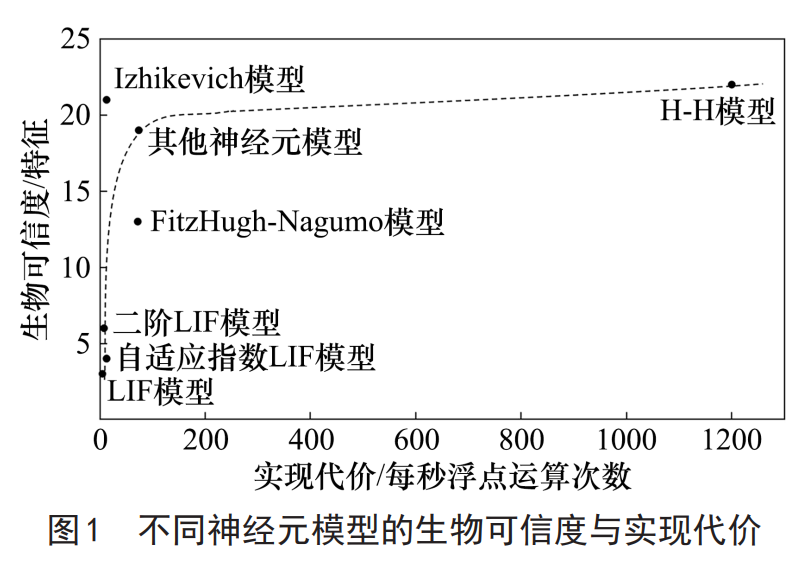
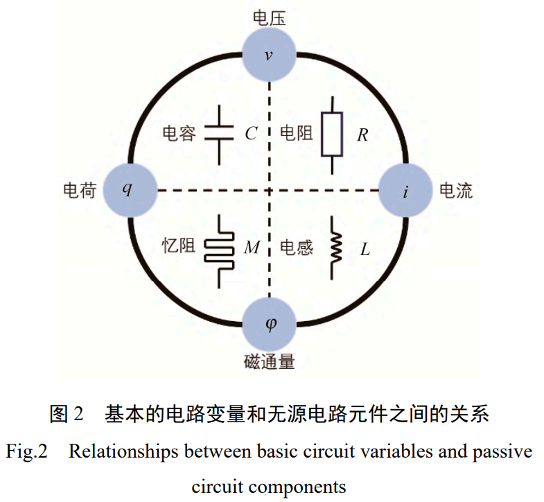
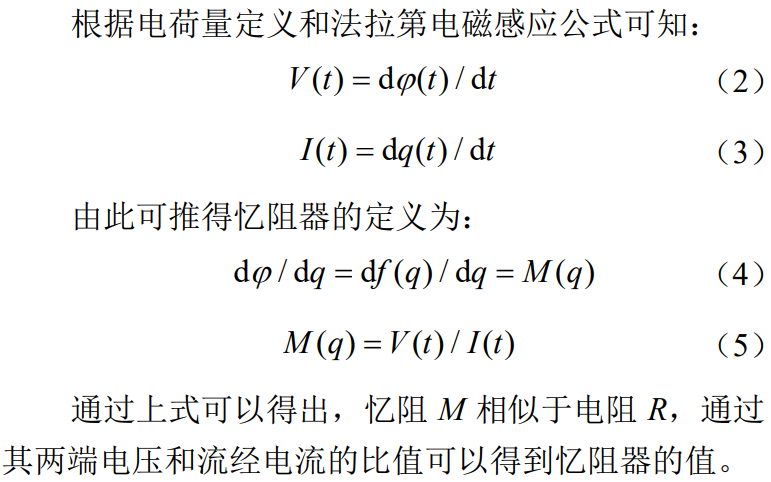
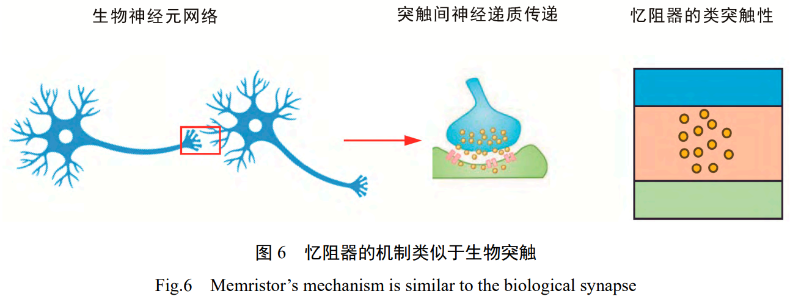
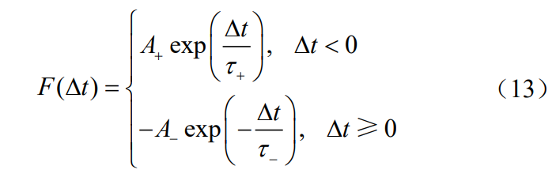
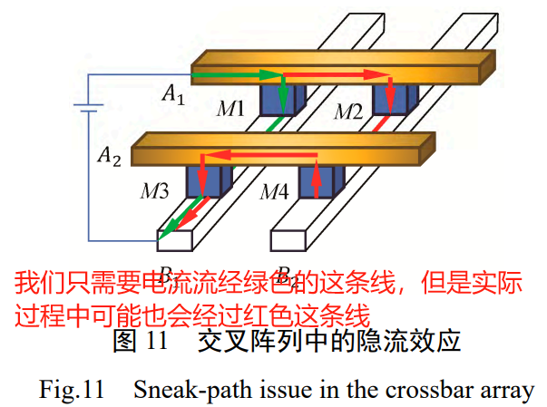
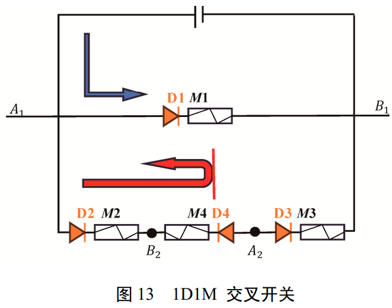

---

---

# 关于文献阅读

阅读完文献后，至少要回答以下问题:

1. 这篇文章到底在解决什么问题？
2. 这个问题为什么在这个领域重要？
3. 这些作者是如何解决这个问题的？
4. 这个问题的解决有什么亮点，局限，有什么应用？

# 脉冲神经网络研究现状与应用进展

A Review of Recent Advances and Application for Spiking Neural Networks

关键词：脉冲神经网络；类脑计算；学习算法；神经形态芯片；应用场景

* **摘要：** 脉冲神经网络（SNN）是更具生物可解释性的新一代人工神经网络，具有独特的信息编码处理方式、丰富的时空动力学特性、低功耗事件驱动工作模式等优势，近年来受到广泛关注并在医疗健康、工业检测、智能驾驶等方向获得探索性应用。

  ==主要内容：== 本文介绍了SNN的基本要素和学习算法，包括经典的神经元模型、突触可塑性机制、常用的信息编码方式，分析了各类学习算法的优缺点，总结了主流的SNN软件模拟器、脉冲神经形态硬件的研究情况；细致梳理了SNN在计算机视觉、自然语言处理、推理决策等方面的研究以及行业应用场景，发现SNN在目标检测、动作识别、语义认知、语音识别等任务中具有突出的潜力，显著提升了相应的计算性能。

  我国在SNN领域的研究与应用发展，重在加强关键核心技术攻关、推动技术成果转化应用、持续优化产业生态格局，以尽快实现与国际先进水平的接轨；类脑复杂系统、类脑控制等理论与方法的深入研究和逐步突破，也将促进大规模SNN新模型的构建，有望拓展人工智能的更广阔应用前景。 

* **介绍：** 

  * 脉冲神经网络的基本要素和学习方法

    ==主要包括：== 具有动力学特性的**神经元模型**、**突触可塑性机制**、基于脉冲序列的**信息编码方式**，进而形成低能耗、高鲁棒性、高认知能力的新一代人工智能模型。

    SNN领域的核心训练算法和技术主要包括：**有监督学习、无监督学习、ANN2SNN和其他进化算法。**

    1. 神经元模型

       HH模型（每模拟1ms 约需要1200次浮点运算，计算复杂，仿真度高）

       LIF模型（每模拟1ms 约需要6-7次浮点运算，计算简单，仿真度低）

       Izhikevich模型（每模拟1ms 约需要13次浮点运算，计算复杂度介于两者之间）

       脉冲响应模型（Spike Response Model，SRM，基于LIF模型，在1 ms的情况下，使用脉冲响应模型（SRM）进行模拟大约需要约201次浮点运算（假设脉冲响应长度为100））

       

    2. 突触可塑性机制

    3. 信息编码

       频率编码，时间编码(时滞编码，排序编码--可与LIF神经元进行结合，相位编码)，群编码

       ==缺乏一种可以通用的编码机制。== 

    4. 学习算法 

       有监督--大部分基于梯度下降，替代梯度。

       无监督--基于Hebb学习规则建立，STDP是典型的代表，应用于多层网络时准确性较差。

       ANN to SNN(转化)--有关ANN转SNN的研究主要集中在开发新结构的转换技术和减少与ANN之间的性能差距，对SNN特性的研究不深入，不利于推动SNN的进一步发展。

       ANN to SNN(进化)--将进化算法与SNN结合起来，提高SNN对复杂问题的求解能力。在解决大规模问题方面不足，且进化算法的计算非常耗时。

  * 脉冲神经网络软件与硬件研究进展

    1. SNN模拟器：NEURON、 NEST、Nengo、BindsNET、NeuCube、CARLsim、 Brain 2 等，目的都是神经元仿生
    2. 硬件实现：模拟电路，全数字电路以及 数模混合电路。
       数模混合电路的神经形态芯片：BrainScaleS，Neurogrid，ROLLS，DYNAPs。
       基于数字电路的神经形态芯片：TrueNorth，SpiNNaker，Loihi 1，TianJic，Darwin 2

  * 脉冲神经网络应用研究进展

    1. 计算机视觉任务：图像分类，目标检测，动作识别，光流估计
    2. 自然语言任务：文本分类，语音识别，情感分析
    3. 推理决策任务：因果生成，音乐生成，资源分配，路径规划（全用的STDP算法）
    4. 行业应用场景：医疗健康，工业检测，民生消费，智能交通，安防联控，智慧金融。

  * SNN技术发展及前瞻

    1. 需要研究并构建具备生物可信度、多模态协作和多时空尺度联合表征的高效脉冲编码理论 与模型；
    2. 探索多突触可塑性的协调机制和生物神经网络的全局可塑性机制，建立高效的深度SNN学习算法，实现多认知任务协同背景下的类脑智能学习、推理和决策；
    3. 研究在小样本和非完全信息环境下的高效自主SNN学习算法，提高在不同任务中的高效、鲁棒决策能力；
    4. 针对大规模深层SNN,研究高性能的学习算法，并探索其在大规模复杂实际场景中的应用。

# 基于脉冲序列标识的深度脉冲神经网络时空反向传播算法

Spiking Sequence Label-Based Spatio-Temporal Back-Propagation Algorithm for Training Deep Spiking Neural Networks

* **摘要：** 受尖峰放电速率标识的时空反向传播算法的启发，该文提出一种面向深度脉冲神经网络训练的基于时间脉冲序列标识的监督学习算法，通过定义==突触后电位和膜电位反传迭代因子==分别分析脉冲神经元的空间和时间依赖关系，使用替代梯度的方法解决反传过程中不连续可微的问题。

* **介绍：**

  1. SNN的监督学习算法

     * ANN到SNN的训练迁移法（ANN to SNN）

     * 标识数据集的直接训练法 （将BP算法直接推广到SNN的训练）

       1. 基于尖峰放电速率标识监督学习算法

          放电速率标识的损失函数是SNN输出的放电速率与放电速率标识值之间的误差的均方值，这类算法多数采用时间反向传播(Backpropagation Through Time, BPTT)的方法实现网络输出误差在隐藏层之间的时间递归传播。

          **代表性算法：** Spatio-Temporal Back Propagation, STBP，将SNN输出的时间脉冲序			列转换为放电速率，

          **缺点：** 使得SNN失去了时间结构信息的学习能力

       2. 基于脉冲时间序列标识监督学习算法

          脉冲序列标识的损失函数是SNN输出的时间脉冲序列与时间脉冲序列标识值之间的Hamming距离或van Rossum 距离的均方值，这类方法使得 SNN获得了学习时间结构信息的能力。

          **缺点：** 计算复杂，阻碍了脉冲时序标识指导的学习算法的发展。

          **代表性算法：** 

          * SpikeProp算法，基于单个脉冲放电时间的SNN监督学习的BP算法。由于该算法及其变体要求每个神经元只能发放一个脉冲，其他脉冲固定不变，也就限制 了该算法在实际任务中的应用。
          * SuperSpike，忽略了膜电位的时间依赖关系，没有考虑反向传播的时间迭代，难以应用于深度SNN的训练。
          * 脉冲时间序列反向传播 Temporal Spike Sequence Learning via Back Propagation, TSSL-BP，使用van Rossum距离评价输出时间脉冲序列和标识时间脉冲序列之间的误差作为网络损失，通过分析神经元间和神经元内的依赖性来分解误差进行反向传播， 该算法充分考虑了误差在时间和空间结构上的传播，并在通用数据集上取得了较好的学习效果。但其梯度的计算依赖于神经元放电时间，该算法由于 它的分段枚举性，当实际输出中第一个脉冲产生时 间晚于目标序列的首个脉冲放电时间时，将导致此 部分误差无法进行计算回传，使得在长时程脉冲时 间序列标识样本的情况下训练变得困难

     * **本文工作：** 受尖峰放电速率标识的时空反向传播算法（STBP）的启发，本文将时空反向传播算法推广到脉冲序列标识的深度SNN的训练中，既保持了时空反向传播算法具有的简单高效时间递归的空间反向传播形式，又保留了SNN具备的学习时间动态变化能力。

       1. 脉冲神经元模型：LIF
       2. 脉冲网络模型：网络中各层级间的空间依赖关系主要发生在(PostSynaptic Potential, PSP)，时间依赖关系主要来自膜电位。
       3. 时空反向传播：现有研究表明替代函数的选择对结果并没有显 著的影响。
       4. 本文提出一种基于脉冲时间序列标识的新型时空递归误差反向传播算法，不同于现有的基于放电脉冲速率标识的时空反向传播算法，它通过计算两脉冲串之间的Hamming距离或van Rossum距离来评估学习损失，分析脉冲神经元的膜电位和PSP上的空间和时间依赖性，完成误差的反向传播，引入替代梯度在解决脉冲生成函数不可微分问题的同 时，也避免了长时程脉冲序列标识计算复杂和当脉冲神经元不发放时误差无法反向传播的问题。

     

# 基于忆阻器突触的脉冲神经网络综述

Review of spiking neural networks based on memristor synapses 

* **摘要：**  忆阻器是一种具有非易失性、类突触可塑性和多值性的新型存储器件，能够模拟生物神经元和突触的功能，实现神经形态计算的存算一体化。脉冲神经网络是一种基于生物神经系统信息处理机制的第三代人工神经网络，具有高效性、并行性、稀疏性和自适应性的特点，能够处理复杂的时空信号。利用忆阻器构建的脉冲神经网络是神经形态计算的一个重要研究方向，已经在图像处理、语音识别、自然语言处理、机器学习等领域实现突破性的进展。

  ==本文总结忆阻器脉冲神经网络的基本原理、主要应用和存在的挑战，并对其未来的发展趋势和研究方向进行展望。==

  **关键词：忆阻器；脉冲神经网络；脉冲时序依赖可塑性规则；忆阻器阵列**

* **介绍：** 

  1. 忆阻器：忆阻器作为第 4 种基本电路元件，是除电阻、电容和电感以外，用来反映电荷与磁通量之间的关系，具有结构简单、运算速度快、能耗低、可扩展性强和阻变性能丰富的特点。其阻值具有动态特性，会随着通过它的电荷量的变化而变化，同时其具有非易失性，当外部施加的激励信号终止时，阻值保持不变。忆阻器具备的特性恰好符合这些方面的要求。因此，它能够实现神经突触值的自适应调节，而无需额外的存储器。它的电导值和电压值的乘积等于通过的电流大小(等价于电流=电压/电阻)，这与脉冲神经网络中突触权值和神经元释放的脉冲的加权乘积计算相一致。

     

     

     

     漂移模型原理: 在外加偏压的影响下，忆阻器呈现出磁滞回线的效应。**线性漂移忆阻模型**

     自旋模型原理：参考层的磁化方向是固定的，而在自由层中，电流通过时磁化方向会发生变化，各部分的阻值由它们与参考层的相对磁化方向来决定，即自由层的阻值随着其磁化方向与参考层的一致性而变化，当二者平行时，阻值达到最小；当二者反向时， 阻值达到最大。

  2. 脉冲神经网络架构介绍
     神经形态硬件计算电路的核心是==仿生突触==，因为它们是大脑认知活动的基础单元。

     * 忆阻器的仿突触性能

       ​	一般来说，对于单个突触的模拟需要将多个晶体管和电容组合，导致在单个集成电路中突触数量有限，远不及生物大脑中的数目。这种传统方法能耗非常高，密度也达不到生物大脑的水平。

       ​	突触具有两个特性，第1个特性是突触效能（兴奋或抑制），第 2 个特性是突触可塑性（连接强度），而忆阻器从理论上来说恰好满足这些方面的需求。

       

     * 脉冲神经网络中的仿生机制

       ​	忆阻器拥有有效的 STDP 学习机制，这是其关键特性之一。

       ​	STDP典型的数学模型：

       

       ​	侧抑制机制是脉冲神经网络中的一种神经元相互作用机制，它的特点是当一层中的某个神经元激活时，它会通过突触连接降低周围神经元的响应。这样， 只有与已经放电的神经元相连的突触才能参与学习过程。在脉冲神经网络中，常用的侧抑制机制有全局侧抑制和局部侧抑制。

       ​	全局侧抑制是指网络中的所有神经元都受到抑制，从而限制网络的总体活动水平。因此，在全局抑制机制中，==只有最早的学习行为才有效==。局部侧抑制是指只有部分神经元受到抑制，而其他神经元则不受影响。这种机制是为了==促进不同的神经元学习不同的特征。==

       ​	兴奋性神经元的放电频率受输入的脉冲序列的影响，而侧抑制的作用会使这种频率差异更加明显。然而，研究中需要保证所有的神经元的放电速率近似相同，以避免某个神经元占据反应模式的主导地位，并保证==神经元的感受野的分化==。为了达到这一目的，研究者们引入了==内稳态机制==。用硬件来实现内稳态的方式是==基于全局突触可塑性（global synaptic plasticity，GSP）==，目前研究并运用较多的内稳态机制是==膜阈值适应（membrane threshold adaptation，MTA）。==
       ​	**在脉冲神经网络中，这种机制的具体表现是：兴奋性神经元的膜电位阈值不仅取决于 $V_{th}$这一常数，还取决于一个变量θ，它在神经元每次放电后增加，然后指数型减小。因此，神经元放电越多，它的膜阈值电压就越高，就需要更多的输入脉冲才能触发它的放电行为。 利用这种机制，神经元的放电率就会受到控制。**

  3. 神经元模型研究

     ​	和上一篇论文描述的一样。HH模型，LIF模型，SRM模型。 

     ​	SRM模型与LIF神经元模型区别为：它不需要设定一个固定的阈值电压，而是根据神经元的状态和刺 激来动态调整阈值。

  4. 忆阻脉冲神经网络的构建

     ​	==脉冲神经网络硬件化==是神经网络研究的关键课题。忆阻器的特点是尺寸小、不易丢失、功耗低、不会消失，这些特点使得它能够构建出性能优良的脉冲神经网络，这些网络不仅节省资源、稳定可靠、运算迅速，还能够通过算法调节突触权值。

     ​	理论研究的最终目标是==利用硬件电路实现脉冲神经网络的学习算法。==   并行计算和编程的能力。

     ​	遗忘忆阻器是一种易失性忆阻器，其权重具有易变性，能够==根据信号输入的有无快速调整短期权重，并使其逐渐趋于长期权重==，这与生物神经元的信息遗忘机制相符。

  5. 忆阻器交叉栅阵列设计

     ​	忆阻交叉栅阵列是一种实现人工神经网络的高密度集成方案，但是，交叉阵列中存在的隐流效应会严 重影响神经网络的运行效果。因此，有必要研究阵列中的隐流效应，并选择适当的阵列电压读取方法。

     ​	忆阻交叉栅阵列的隐流效应：相邻存储单元之间的串扰可能导致误读。

     

     ​	隐流效应的解决方法：

     ​	

     ​	1D1M 单元结构由 2 个元件组成：1 个二极管和 1个忆阻器，这 2 个器件串联在一起。正向偏压二极管的电流相对较大，而当二极管反向偏压时，电流会被阻断。通过将单极性电阻开关器件与该二极管串联，这种双器件结构可显示出具有整流特性的电阻开关行为。因此，这种整流特性可用于抑制潜行电流。串联二极管还充当外部负载电阻，以抑制电阻过渡期间的过流，从而显著改善集成电池的周期分布。

* **总结：**忆阻器脉冲神经网络是一种神经形态计算平台，具有存算一体化、高效并行、低功耗等特点, 有助于在人工智能领域达到类脑的智能计算水平。但是，忆阻器脉冲神经网络也存在一些难题和挑战，例如忆阻器的非理想性、脉冲神经网络的编码和学习问题、硬件实现的可靠性和可扩展性问题等，亟待进一步的研究和探索。

# 十二

# ==1==

* **摘要：**  
* **介绍：**
* **方法：**
* **试验：**
* **讨论与总结：**