# ==一、 Bag of Tricks for lmage Classification with Convolutional Neural Networks==

李沐  2018年   [==参考链接==](https://blog.csdn.net/qq_41776136/article/details/137920956)

* **摘要：**  使用之前深度学习中用的一些优化策略，并进行消融实验，最终去评估使用哪一个或者哪些策略能够提升模型的效果。

* **一、Introduction：** 改进包括**损失函数的变化、数据预处理和优化方法**。在本文中，我们将检验一些训练过程和模型架构的改进，这些改进提高了模型的精度，但几乎没有改变计算的复杂度。

* **二、Training Procedures：**  训练过程    表 2

  需要首先训练基模型并和原始文献中的训练结果作对比。

  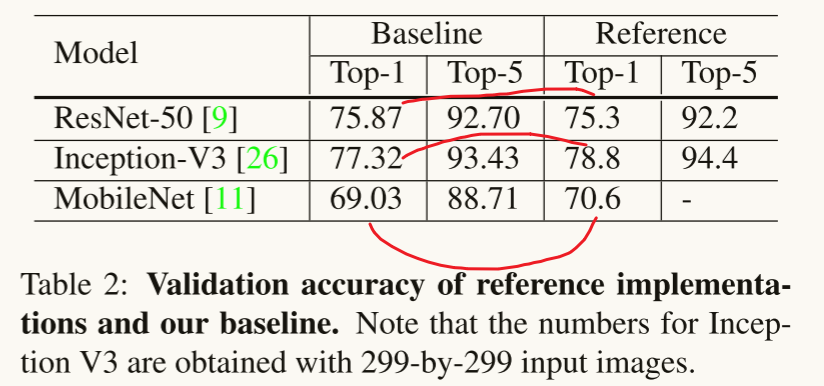

  1. Baseline Training Procedure  基线训练过程

     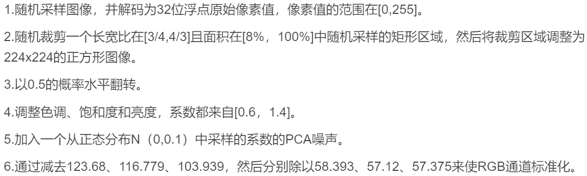

     对图像训练数据集的预处理。

     在==验证过程==中，我们将每幅图像的短边调整为256像素，同时保持其长宽比。接下来，我们在中心裁剪出224x224的区域，并和训练过程一样将RGB通道规范化（第6步）。我们在验证期间不执行任何随机增强。

     ==网络初始化算法：==  **Xavier算法**。

     ==两种初始化算法的比较：==

     * Kaiming 初始化（也称为 He 初始化）适用于使用ReLU激活函数且深度较深的网络，目的是保证不发生梯度消失或者梯度爆炸的问题。 保证权重为正值且为输入方差的2倍，有效缓解relu激活函数只保留正值的带来的信息损失问题。

     * 

       ```python
       import torch
       import torch.nn as nn
       
       # 定义一个简单的神经网络
       class SimpleNN(nn.Module):
           def __init__(self):
               super(SimpleNN, self).__init__()
               self.fc1 = nn.Linear(784, 256)
               self.fc2 = nn.Linear(256, 10)
       
               # 应用 Kaiming 初始化
               nn.init.kaiming_normal_(self.fc1.weight, mode='fan_in', nonlinearity='relu')
               nn.init.kaiming_normal_(self.fc2.weight, mode='fan_in', nonlinearity='relu')
       
           def forward(self, x):
               x = torch.relu(self.fc1(x))
               x = self.fc2(x)
               return x
       ```

       

     * Xavier 初始化（也称为 Glorot 初始化）

       Xavier初始化特别适用于Sigmoid和Tanh激活函数的网络层。它的目标是使得每层的输入和输出保持在一个适当的范围内，从而加速训练过程并提高模型的收敛性。

       

       ```python
       import torch
       import torch.nn as nn
       
       # 定义一个简单的神经网络
       class SimpleNN(nn.Module):
           def __init__(self):
               super(SimpleNN, self).__init__()
               self.fc1 = nn.Linear(784, 256)
               self.fc2 = nn.Linear(256, 10)
       
               # 应用 Xavier 初始化
               nn.init.xavier_uniform_(self.fc1.weight)
               nn.init.xavier_uniform_(self.fc2.weight)
       
           def forward(self, x):
               x = torch.tanh(self.fc1(x))
               x = self.fc2(x)
               return x
       ```

       ==学习率采取的是阶跃变化：== 学习率初始化为0.1，然后在第30个、第60个和第90个阶段除以10。

  2. Experiment Results
     上面的表2显示出由于训练流程的不同，ResNet网络得到的结果超过了参考结果，而Inception-v3和MobileNet略低于参考结果。
     数据集为Imagenet2012数据集，自己本地下载的数据，训练集有1000个类别，每个类别有1300张图片，测试集也有1000个类别，每个类别有50张图片。

     

* **三、Efficient Training：**    表3---实验结果    表4--消融实验
  由于硬件的发展，许多与性能相关的权衡的最佳选择都发生了变化，现在在训练过程中使用较低的数值精度和更大的批处理规模更有效

  1. Large-batch training

     * Linear scaling learning rate.

       **问题引入：** 小批量SGD将多个样本分组到一个小批中，以提高并行性和降低通信成本。然而，使用大的批处理可能会减缓训练进度。**对于凸问题，收敛速度随着批处理大小的增加而减小**。

       在小批量SGD中，梯度下降是一个随机过程，因为在每个批中样例都是随机选择的。增加批大小不会改变随机梯度的期望，而会减小其方差。换句话说，==大批量减少了梯度中的噪声，所以我们可以提高学习率，沿梯度方向取得更大的步长。==  --------------**大批量适合使用大的学习率，小批量适合小的学习率。**

     * Learning rate warmup.

       训练初，因为所有参数都是随机的，此时使用较大的学习率会导致数值不稳定。前几次稳定增加学习率到初始值，后几次稳定降低学习率到0。  
       使用SGD进行训练时，使用的训练方法  ---- [Accurate, Large Minibatch SGD](https://zhuanlan.zhihu.com/p/91182469)     [另外一篇讲解](https://zhuanlan.zhihu.com/p/482133692)
       [梯度下降更新方法SGD,Mini-batch,Momentum, Nesterov, RMSprop](https://zhuanlan.zhihu.com/p/105788925)
       [AdamW, SGD和L2正则化以及权重衰减](https://blog.csdn.net/candice12321/article/details/143182880)
       [十分钟速通优化器原理，通俗易懂（从SGD到AdamW）](https://zhuanlan.zhihu.com/p/686410423)
       [pytorch 指定参数进行权重衰减](https://blog.csdn.net/qq_17792451/article/details/120853652)
  
       在Imagenet2012数据集上，he等人使用0.1作为b=256时的初始学习率。
  
     * Zero $γ$​​.
  
       在初始化时，将最后一个块的所有BN中的参数γ置为0，这样的话经过这个块时，输入等于输出，让网络在初期更容易训练。

     * No bias decay.

       权重衰减通常应用于所有可学习的参数，包括权重和偏差。**无偏置衰减启发式**遵循了这一建议，它只将权重衰减应用于**卷积层和全连接层**中的权重。 BN层中的偏差、γ和β，都不使用权重衰减。

  2. Low-precision training  低精度训练
     TFLOPS 是“万亿次浮点运算每秒”（Tera Floating Point Operations Per Second）
  
     Nvidia V100在FP32中提供14个TFLOPS，但在FP16中提供超过100个TFLOPS。如表3所示，在V100上，从FP32切换到FP16后，整体训练速度加快了2~3倍。
  
     
  
  3. Experiment Results
  
     
  
* **四、Model Tweaks：**  模型的调整  使用resnet来演示
  
  这是对网络架构的一个小调整，几乎不会改变计算的复杂度，但可能对模型的精度产生不可忽视的影响。
  
  
  
  红色修改的是块中，紫色修改的是刚开始的输入流，绿色修改的是残差连接。
  
  1. ResNet Architecture
  2. ResNet Tweaks    ResNet 调整
  3. Experiment Results  表5
  
  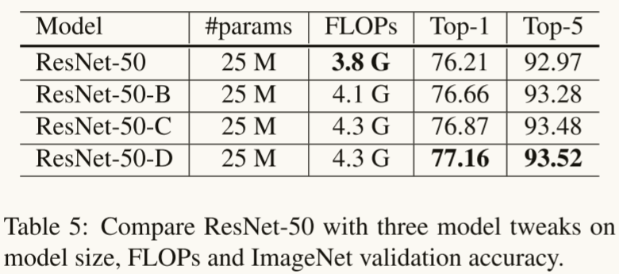
  
* **五、Training Refinements：**

  

  ==一种想法是前60次迭代学习率使用阶跃衰竭，后60次迭代学习率使用余弦退火衰减。==

  ==两种想法的融合应该是每隔几个epoch，就降低一次学习率==

  1. Cosine Learning Rate Decay

  2. Label Smoothing（为了解决过拟合问题）

     ​	原始的交叉熵损失函数以及依据真实值构建的损失函数，鼓励输出分数的显著不同，这可能会导致过拟合。

     ​	使用标签平滑以后，模型会鼓励来自全连接层的有限输出，减小过拟合的风险。

     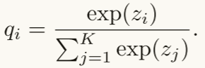     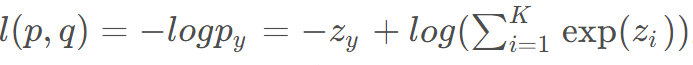 
     	此时，关于函数的最优解为$z^* = inf$。 

     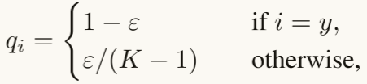  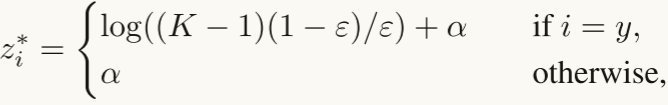  

     注意，上面的这个$应该是p_i而不是q_i，而q_i还是和之前的一样，是指数形式的除法$ 
     标签平滑以及最优解的求导，其中设置 $α$​ 为一个实值，其实就是非目标神经元的输出值。求解过程如下：
     

     ​	当 $ε = 0$ 时，目标神经元的最优输出值与其他神经元最优输出值的 $gap = log((K-1)(1-ε)/ε) = ∞$ ，随着$ε$增大，gap减小。特别是当 $ε = (K-1)/K$ , 所有最优的 $z^*$ 均为 $α$，下面的图是示例：

     

     ​	第二个图是使用标签平滑和没有使用标签平滑在验证集上的gpa分布，就是神经元输出值的差距，可以看出，使用标签平滑具有较少的极值。

  3. Knowledge Distillation

     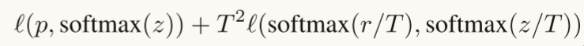  
     其中，T为温度超参数，使softmax输出更平滑，从而从教师模型的预测中提取出标签分布的知识。

  4. Mixup Training  混合训练    --------------  需要更长的训练epoch来更好地收敛（从120到200）

      
     随机抽取两个样本，然后使用上述公式得到一个新的样本，在混合训练中只使用这些新的样本。
     $λ∈[0,1]是从Beta（α，α）$ 分布中抽取的一个随机数。 $Beta（α，α）$​ 是什么？
     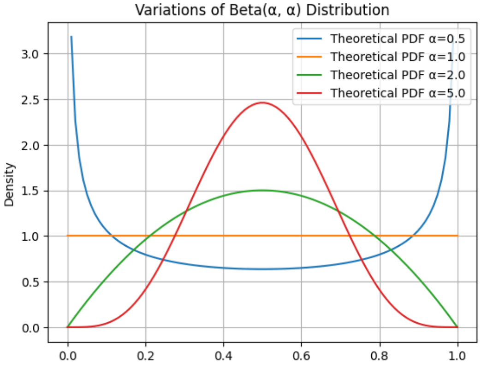       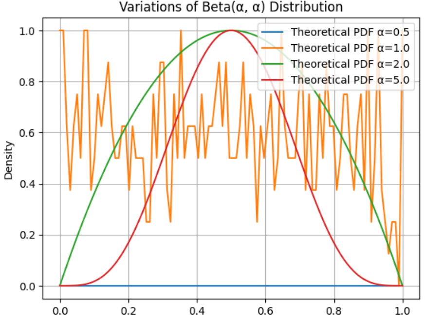

     第一个图是归一化之前的理论概率密度，第二个是归一化之后的理论概率密度。   
     ==上述两个图是gpt给的代码生成的，感觉不太对==                     

  5. Experiment Results      w/o表示的是without     w/表示with

     

     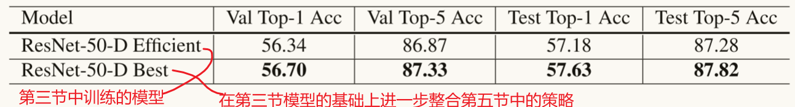

* **六、Transfer Learning：**

  1. Object Detection   目标检测的目标是定位图像中对象的边界框。

     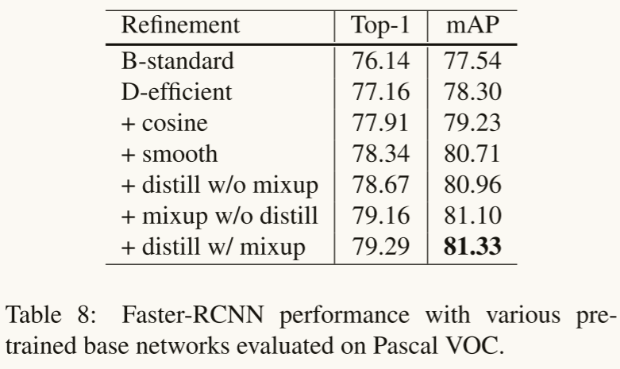

     

  2. semantic segmentation  语义分割从输入的图像中预测每个像素的类别。

     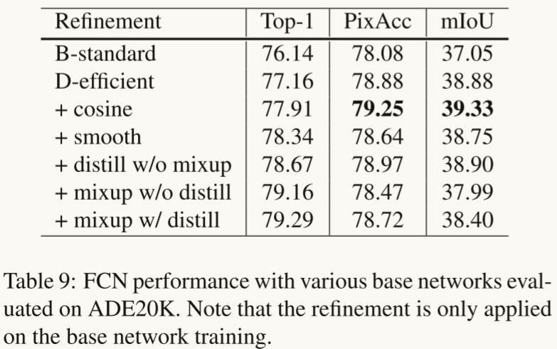

* **讨论与总结：** 

  ​	在本文中，我们调查了十几种训练深度卷积神经网络以提高模型精度的技巧。这些技巧对**模型体系结构**、**数据预处理**、**损失函数**和**学习率计划**进行了微小的修改。

Nesterov Accelerated Gradient（NAG） 优化算法。

- **加速收敛**：相比标准的梯度下降方法，NAG 能够更快地接近最优解。
- **减少振荡**：它有效地减少了在曲面上振荡现象，使优化过程更平滑。


# ==深度神经网络模型训练中的 tricks（原理与代码汇总）==

[参考链接](https://mp.weixin.qq.com/s?__biz=MzI1MjQ2OTQ3Ng==&mid=2247623923&idx=1&sn=62e0171a281b870211c45813182b4435&chksm=e9efed78de98646e8334ff83b707050098d5ba313c6369ce0d80a483550dead3f24f2dbc82f6&scene=27)

* **warmup：**    
  因为从一个很小的学习率一下变为比较大的学习率可能会导致训练误差突然增大。论文[3]提出了gradual warmup来解决这个问题，即从最开始的小学习率开始，每个iteration增大一点，直到最初设置的比较大的学习率。

  ```python
  # 学习率调度函数
  def create_lr_scheduler(optimizer,
                          num_step: int,
                          epochs: int,
                          warmup=True,
                          warmup_epochs=1,
                          warmup_factor=1e-3,
                          end_factor=1e-6):
      assert num_step > 0 and epochs > 0
      if warmup is False:
          warmup_epochs = 0
  
      def f(x):
          """
          根据step数返回一个学习率倍率因子， 这个倍率因子乘以学习率等于我们最终使用的lr
          注意在训练开始之前，pytorch会提前调用一次lr_scheduler.step()方法
          """
          if warmup is True and x <= (warmup_epochs * num_step):
              alpha = float(x) / (warmup_epochs * num_step)
              # warmup过程中lr倍率因子从warmup_factor -> 1
              return warmup_factor * (1 - alpha) + alpha
          else:
              current_step = (x - warmup_epochs * num_step)
              cosine_steps = (epochs - warmup_epochs) * num_step
              # warmup后lr倍率因子从1 -> end_factor
              return ((1 + math.cos(current_step * math.pi / cosine_steps)) / 2) * (1 - end_factor) + end_factor
  
      return LambdaLR(optimizer, lr_lambda=f)
  ```
  
  
  
* **Linear scaling learning rate**：

  ​	Linear scaling learning rate是在论文[3]中针对比较大的batch size而提出的一种方法。

  ​	在凸优化问题中，随着批量的增加，收敛速度会降低，神经网络也有类似的实证结果。随着batch size的增大，处理相同数据量的速度会越来越快，但是达到相同精度所需要的epoch数量越来越多。也就是说，使用相同的epoch时，大batch size训练的模型与小batch size训练的模型相比，验证准确率会减小。

  ​	上面提到的gradual warmup是解决此问题的方法之一。另外，linear scaling learning rate也是一种有效的方法。在mini-batch SGD训练时，梯度下降的值是随机的，因为每一个batch的数据是随机选择的。增大batch size不会改变梯度的期望，但是会降低它的方差。也就是说，大batch size会降低梯度中的噪声，所以我们可以增大学习率来加快收敛

  ​	具体做法很简单，比如ResNet原论文[1]中，batch size为256时选择的学习率是0.1，当我们把batch size变为一个较大的数b时，学习率应该变为 0.1 × b/256。

* **Label-smoothing**

  ```python
  # 最终得到的就是标签平滑后的张量，使用独热编码
  import torch
  import torch.nn as nn
  class LSR(nn.Module):
      def __init__(self, e=0.1, reduction='mean'):
              super().__init__()
              self.log_softmax = nn.LogSoftmax(dim=1)
              self.e = e
              self.reduction = reduction
      def _one_hot(self, labels, classes, value=1):
          """
              Convert labels to one hot vectors
              思路就是：首先创建一个二维张量，接着按照标签的个数创建一个值为 value 的列，使二维张量对应的标签位置加上这个值。
          Args:
              labels: torch tensor in format [label1, label2, label3, ...]
              classes: int, number of classes
              value: label value in one hot vector, default to 1
          Returns:
              return one hot format labels in shape [batchsize, classes]
          """
          one_hot = torch.zeros(labels.size(0), classes)
  #         labels and value_added  size must match
          labels = labels.view(labels.size(0), -1)
          value_added = torch.Tensor(labels.size(0), 1).fill_(value)
          value_added = value_added.to(labels.device)
          one_hot = one_hot.to(labels.device)
          # (dim, index, src)
          one_hot.scatter_add_(1, labels, value_added)
          return one_hot
  
      def _smooth_label(self, target, length, smooth_factor):
          """convert targets to one-hot format, and smooth
          them.
          Args:
              target: target in form with [label1, label2, label_batchsize]
              length: length of one-hot format(number of classes)
              smooth_factor: smooth factor for label smooth
          Returns:
              smoothed labels in one hot format
          """
          one_hot = self._one_hot(target, length, value=1- smooth_factor)
          one_hot += smooth_factor / length
          return one_hot.to(target.device)
      
  
  # 使用交叉熵损失函数时，如何使用标签平滑
  class LabelSmoothing(nn.Module):
      """NLL loss with label smoothing.
      """
      def __init__(self, smoothing=0.0):
          """Constructor for the LabelSmoothing module.
          :param smoothing: label smoothing factor
          """
          super(LabelSmoothing, self).__init__()
          self.confidence = 1.0 - smoothing
          self.smoothing = smoothing
  
      def forward(self, x, target):
          logprobs = torch.nn.functional.log_softmax(x, dim=-1)
          nll_loss = -logprobs.gather(dim=-1, index=target.unsqueeze(1))
          nll_loss = nll_loss.squeeze(1)
          smooth_loss = -logprobs.mean(dim=-1)
          loss = self.confidence * nll_loss + self.smoothing * smooth_loss
          return loss.mean()
    
  # 使用CrossEntropyLoss 可以直接设置标签
  loss_func = nn.CrossEntropyLoss(label_smoothing = 0.3)
  v = torch.LongTensor([2, 1, 0])
  loss_func(predict ,v)
  # tensor(1.3883)
  ```

* **Random image cropping and patching**

  Random image cropping and patching (RICAP)[7]方法随机裁剪四个图片的中部分，然后把它们拼接为一个图片，同时混合这四个图片的标签。

  RICAP在caifar10上达到了2.19%的错误率。

  

  
  
* **Knowledge Distillation**

  ​	提高几乎所有机器学习算法性能的一种非常简单的方法是在相同的数据上训练许多不同的模型，然后对它们的预测进行平均。但是使用所有的模型集成进行预测是比较麻烦的，并且可能计算量太大而无法部署到大量用户。
  ​	Knowledge Distillation[8]方法就是应对这种问题的有效方法之一。 

  ​	==依据上面讲的论文==

* **Cutout**

  ​	Cutout [9] 是一种新的正则化方法。原理是在训练时随机把图片的一部分减掉，这样能提高模型的鲁棒性。它的来源是计算机视觉任务中经常遇到的物体遮挡问题。通过cutout生成一些类似被遮挡的物体，不仅可以让模型在遇到遮挡问题时表现更好，还能让模型在做决定时更多地考虑环境(context)。

  ```python
  import torch
  import numpy as np
  
  class Cutout(object):
      """
      Randomly mask out one or more patches from an image.
      Args:
          n_holes (int): Number of patches to cut out of each image.
          length (int): The length (in pixels) of each square patch.
      """
      def __init__(self, n_holes, length):
          self.n_holes = n_holes
          self.length = length
      def __call__(self, img):
          """
          Args:
              img (Tensor): Tensor image of size (C, H, W).
          Returns:
              Tensor: Image with n_holes of dimension length x length cut out of it.
          """
          h = img.size(1)
          w = img.size(2)
          mask = np.ones((h, w), np.float32)
          for n in range(self.n_holes):
              y = np.random.randint(h)  # 在 0到h之间产生一个随机整数
              x = np.random.randint(w)
              y1 = np.clip(y - self.length // 2, 0, h) # 确保y1在0到y之间，下同
              y2 = np.clip(y + self.length // 2, 0, h)
              x1 = np.clip(x - self.length // 2, 0, w)
              x2 = np.clip(x + self.length // 2, 0, w)
              mask[y1: y2, x1: x2] = 0.  # 将这部分图像的像素置为0
              mask = torch.from_numpy(mask) # NumPy 数组转换为 PyTorch 张量 (tensor)
              mask = mask.expand_as(img) # mask 张量的形状扩展为与 img 张量相同的形状
              img = img * mask # 执行逐元素乘法操作，即将两个张量 img 和 mask 中对应位置的元素相乘
          return img
  ```
  
* **Random erasing**

  Random erasing[6]其实和cutout非常类似，也是一种模拟物体遮挡情况的数据增强方法。区别在于，cutout是把图片中随机抽中的矩形区域的像素值置为0，相当于裁剪掉，random erasing是用随机数或者数据集中像素的平均值替换原来的像素值。而且，cutout每次裁剪掉的区域大小是固定的，Random erasing替换掉的区域大小是随机的。

  ```python
  class RandomErasing(object):
      '''
      probability: The probability that the operation will be performed.
      sl: min erasing area
      sh: max erasing area
      r1: min aspect ratio 最小高宽比，一般指的是宽高比
      mean: erasing value
      '''
      def __init__(self, probability = 0.5, sl = 0.02, sh = 0.4, r1 = 0.3, mean=[0.4914, 0.4822, 0.4465]):
          self.probability = probability
          self.mean = mean
          self.sl = sl
          self.sh = sh
          self.r1 = r1
      def __call__(self, img):
          if random.uniform(0, 1) > self.probability:
              return img
          for attempt in range(100):
              # 总区域大小
              area = img.size()[1] * img.size()[2]
              # 目标区域大小  比例*总区域大小
              target_area = random.uniform(self.sl, self.sh) * area
              # 让高宽比在 这两个值之间
              aspect_ratio = random.uniform(self.r1, 1/self.r1)
              # 擦除区域的高
              h = int(round(math.sqrt(target_area * aspect_ratio)))
              # 擦除区域的宽
              w = int(round(math.sqrt(target_area / aspect_ratio)))
              # 挑选擦除区域 高和宽的 起始点
              if w < img.size()[2] and h < img.size()[1]:
                  # 高的起始点
                  x1 = random.randint(0, img.size()[1] - h)
                  # 宽的起始点
                  y1 = random.randint(0, img.size()[2] - w)
                  # 如果图像是三通道
                  if img.size()[0] == 3:
                      img[0, x1:x1+h, y1:y1+w] = self.mean[0]
                      img[1, x1:x1+h, y1:y1+w] = self.mean[1]
                      img[2, x1:x1+h, y1:y1+w] = self.mean[2]
                  # 图像是单通道
                  else:
                      img[0, x1:x1+h, y1:y1+w] = self.mean[0]
                  # 返回擦除的图像
                  return img
          # 尝试100次都没有找到需要擦除的图像后就返回原图像
          return img
  ```
  
* **Cosine learning rate decay**

  ​	在warmup之后的训练过程中，学习率不断衰减是一个提高精度的好方法。其中有step decay和cosine decay等，前者是随着epoch增大学习率不断减去一个小的数，后者是让学习率随着训练过程曲线下降。

  step decay

  ```python
  
  ```
  
  
  
* **Mixup training**

  ​	Mixup[10]是一种新的数据增强的方法。Mixup training，就是每次取出2张图片，然后将它们线性组合，得到新的图片，以此来作为新的训练样本，进行网络的训练，如下公式，其中x代表图像数据，y代表标签，则得到的新的xhat, yhat。

  ```python
  for(images, labels) in train_loader:
      l = np.random.beta(mixup_alpha, mixup_alpha)
      index = torch.randperm(images.size(0))
      images_a, images_b = images, images[index]
      labels_a, labels_b = labels, labels[index]
      mixed_images = l * images_a + (1- l) * images_b
      outputs = model(mixed_images)
      loss = l * criterion(outputs, labels_a) + (1- l) * criterion(outputs, labels_b)
      acc = l * accuracy(outputs, labels_a)[0] + (1- l) * accuracy(outputs, labels_b)[0]
  ```
  
  
  
* **AdaBound**

  AdaBound是最近一篇论文[5]中提到的，按照作者的说法，AdaBound会让你的训练过程像adam一样快，并且像SGD一样好。

  ```python
  pip install adabound
  optimizer = adabound.AdaBound(model.parameters(), lr=1e-3, final_lr=0.1)
  ```

* **AutoAugment**

  ​	数据增强在图像分类问题上有很重要的作用，但是增强的方法有很多，并非一股脑地用上所有的方法就是最好的。那么，如何选择最佳的数据增强方法呢？AutoAugment[11]就是一种搜索适合当前问题的数据增强方法的方法。该方法创建一个数据增强策略的搜索空间，利用搜索算法选取适合特定数据集的数据增强策略。此外，从一个数据集中学到的策略能够很好地迁移到其它相似的数据集上。

  ​	AutoAugment在cifar10上的表现如下表，达到了98.52%的准确率。

* **其他经典的tricks**

  - Dropout
  - L1/L2正则
  - Batch Normalization
  - Early stopping
  - Random cropping
  - Mirroring
  - Rotation
  - Color shifting
  - PCA color augmentation

* 


# 二  Paying more attention to attention: improving the performance of convolutional neural networks via attention transfer

中文：将更多的注意力放在注意力上。  通过注意力的迁移提高卷积神经网络的性能。

* **摘要：**  注意力在人的视觉体验中发挥着关键作用。此外，最近的研究表明，注意力在将人工神经网络应用于计算机视觉和自然语言处理等领域的各种任务中也可以发挥重要作用。在本研究中，==我们展示了通过正确定义卷积神经网络的注意力，我们可以利用这种信息显著提高学生卷积神经网络的性能，方法是强迫其模仿强大教师网络的注意力图。==为此，我们提出了几种新颖的注意力转移方法，在多种数据集和卷积神经网络架构中表现出一致的改善。

* **介绍：**
  虽然残差网络的主要动机是增加深度，但 Zagoruyko & Komodakis（2016）后来证明，在达到一定深度后，改进主要来自网络的容量增加，即参数数量（例如，经过实验证明，具有 16 层的宽深残差网络能够学习到与一个很薄的 1000 层网络同样好或更好的表示，前提是两者使用的参数数量相当）。
  基于上述事实以及很薄的深层网络的并行化能力不如宽网络，我们认为知识转移需要重新审视，与 FitNets 的方法相对，我们尝试学习较少深度的学生网络。我们用于转移的注意力图与上述提到的基于梯度和基于激活的图相似，它们在 FitNets 中扮演的角色类似于“提示”，尽管我们并没有引入新的权重。

  

* **方法：**

  在本节中，我们将解释我们用来定义卷积神经网络空间注意力图的两种方法，以及在每种情况下，我们如何将注意力信息从教师网络转移到学生网络。

  1. Activation-based attention transfer

     

     为了定义这样的空间注意力映射函数，我们在本节中作出的隐含假设是，当网络在给定输入上进行评估时，隐藏神经元激活的绝对值可以用作指示该神经元相对于特定输入重要性的依据。因此，通过考虑张量A中元素的绝对值，我们可以通过计算这些值在通道维度上的统计信息来构建空间注意力图（见图3）:

     

     

     

     

     当教师-学生网络都是残差网络且教师网络更深时的   教师-学生注意力迁移示意图

     ​	不失一般性，我们假设转移损失放置在具有相同空间分辨率的学生和教师注意力图之间，但如果需要，注意力图可以通过插值来匹配其形状。令S、T 和WS,WT分别表示学生网络、教师网络及其权重，令L(W,x)表示标准交叉熵损失。同时，令 $I$ 表示我们希望转移注意力图的所有教师-学生激活层对的索引。

     

     这里用的是$l2$ 范数，但是同样可以使用 $l1$ 范数

     注意力转移也可以与知识蒸馏（Hinton et al., 2015）相结合，在这种情况下，只需将一个额外的项（对应于教师和学生标签上软化分布之间的交叉熵）加入到上述损失中。当二者结合时，注意力转移几乎不会增加计算成本，因为教师的注意力图可以在前向传播过程中轻松计算，这正是蒸馏所需的。

  2. Gradient-based attention transfer

     

     实现这个是先进行一次前向传播，接着进行反向传播（需要设置模型参数不可导，而输入数据可导？不太确定）

     

     

     接着再次进行反向传播

     

     flip表示的是水平翻转。

     

* **试验：**

  

* **讨论与总结：**


### CNN 的 Inductive Bias

1. **局部连接（Local Connectivity）**
   - 卷积神经网络使用卷积层，在每个卷积核下只考虑输入的局部区域。局部连接的假设是图像的局部区域中的点更可能具有相似的特征。这意味着卷积层可以专注于提取局部特征，比如边缘、纹理等，而不需要关注全局信息。这种局部性假设在图像处理中是合理的，因为许多视觉特征都在空间上是局部的。
2. **权重共享（Weight Sharing）**
   - 在 CNN 中，同一卷积核在整个输入图像上滑动（卷积），并应用相同的权重。这种权重共享的机制假设同一个特征在不同位置上具有相似的表示能力。例如，边缘特征在图像的不同位置都可能出现，因此使用相同的卷积核来检测边缘十分合理。这种设计显著减少了模型的参数数量，使得网络可以更好地泛化。
3. **平移不变性（Translation Equivariance）**
   - 如前所述，卷积操作使得 CNN 对输入的平移保持不变。也就是说，如果在图像中移动某个物体，CNN 仍然能够识别出该物体。这种平移不变性的假设使得 CNN 成为处理图像等具有空间结构数据的理想选择。
4. **层次特征学习（Hierarchical Feature Learning）**
   - CNN 提供了多层结构，其中低层卷积层提取基础特征（如边缘和角点），而高层卷积层组合这些基础特征以学习更复杂的概念（如物体、脸部、场景等）。这种层次特征学习的假设认为视觉信息可以通过简单的模式组合成复杂的模式，这在许多视觉任务中是有效的。
5. **稀疏连接（Sparse Connectivity）**
   - CNN 中的每个神经元与输入仅有一小块对应区域连接，而不是与整个输入连接（全连接层才是输入与输出的全连接，卷积中输出神经元的值仅与卷积核扫描的那个区域的几个值相关）。这样可以高效地使用计算资源，并更好地利用局部特征的假设。稀疏连接还可以降低过拟合的风险，因为模型需要学习的参数量减少。

### 归纳偏差的意义

归纳偏差在机器学习中至关重要，因为它可以帮助模型在有限的数据上进行更好的泛化。针对不同任务和数据类型，合理的归纳偏差可以极大地提高模型的学习能力。对于 CNN 而言，正因为其特有的局部连接、权重共享等设计，使得它能够在图像处理任务中达到优异的性能。

[ViT和SwinTransformer详解](https://blog.csdn.net/zengxiaoyao/article/details/140192174)   VIT这篇文章的写作很好，可以当做范文来学习。

SwimTransformer网络中掩码的解释：  [B站论文讲解](https://www.bilibili.com/video/BV13L4y1475U/?spm_id_from=333.337.search-card.all.click&vd_source=3be4a0eefc99c3ec4109b6e4f90586d1)     [Swin Transformer结构梳理](https://www.cnblogs.com/lushuang55/p/17551134.html)


# 三  A ConvNet for the 2020s

中文：卷积网络-----ConvNets     本文网络：ConvNeXt 网络  

* **摘要：**   

  ConvNeXt完全由标准卷积网络模块构成，在准确性和可扩展性方面与Transformer竞争，达到了87.8%的ImageNet top-1准确率，并在COCO检测和ADE20K分割任务上超越了Swin Transformer，同时维持了标准卷积网络的简单性和高效性。

* **介绍及方法：**

  

  Modernizing a ConvNet: a Roadmap   现代化卷积网络：路线图

  

  1. Training Techniques

     附录1中包含了训练参数的一些设置

     

     其中EMA指的是**指数移动平均（Exponential Moving Average, EMA）** ，是一种常用于时间序列数据分析和信号处理的统计技术。它通过给予最新的数据点更高的权重，从而使得最近的观测值对平均值的影响更大。EMA 在捕捉数据变化趋势方面比简单移动平均（Simple Moving Average, SMA）更为敏感。

     计算公式： $EMA_t=α*X_t + (1−α)*EMA_{t−1}$

  2. Macro Design

     * Changing stage compute ratio.

       ResNet 中各阶段计算分配的原始设计在很大程度上是经验性的。Swin-T 遵循相同的原则，但阶段计算比略微不同，为 1:1:3:1。对于更大的 Swin Transformers，该比例为 1:1:9:1。根据这一设计，我们将 ResNet-50 中每个阶段的块数==从 (3, 4, 6, 3) 调整为 (3, 3, 9, 3)==，这也使得 FLOPs 与 Swin-T 对齐。这将模型准确率从 78.8% 提高到了 79.4%。

     * Changing stem to “Patchify”.

       在标准 ResNet 中，干细胞(数据刚输入进来需要经过的层，目的是为了减少特征图的H和W)包含一个步幅为 2 的 7x7 卷积层，后接最大池化层，这导致输入图像的 4 倍下采样。在 vision Transformers 中，使用了一种更激进的“patchify”策略作为干细胞，这对应于较大的卷积核大小（例如，卷积核大小 = 14 或 16）和不重叠的卷积。Swin Transformer 使用了类似的“patchify”层，但由于该架构的多阶段设计，采用了较小的 4 的 patch 大小。==我们用一个 4x4、步幅为 4 的卷积层来替换 ResNet 风格的干细胞==。准确率已从 79.4% 改为 79.5%。这表明，ResNet 中的干细胞可以用更简单的“patchify”层（类似于 ViT）替代，从而实现相似的性能。我们将在网络中使用“patchify stem”（4x4 不重叠卷积）。

  3. ResNeXt-ify

     使用深度卷积，这是一种特殊的分组卷积，其中组的数量等于通道的数量。遵循 ResNeXt 提出的策略，我们将网络宽度增加到与 Swin-T 相同的通道数（从 64 增加到 96）。 ==深度可分离卷积的使用。==
     [ResNeXt代码复现＋超详细注释](https://blog.csdn.net/weixin_43334693/article/details/128664382)
     [经典神经网络论文超详细解读（八）——ResNeXt学习笔记（翻译＋精读＋代码复现）](https://developer.aliyun.com/article/1309422)
     [ResNeXt网络](https://zhuanlan.zhihu.com/p/698401977)
     [深度学习·CNN模型(2)：ResNet、ResNeXt](https://zhuanlan.zhihu.com/p/696450974)

  4. Inverted Bottleneck

     

     图 3 (a) 到 (b) 说明了配置情况。尽管深度卷积层的 FLOPs 增加了，但由于下采样残差块的快捷 1×1 卷积层显著减少了 FLOPs，这一变化使整个网络的 FLOPs 降低到了 4.6G。有趣的是，这导致性能略有改善（从 80.5% 提升到 80.6%）。在 ResNet-200 / Swin-B 方案中，这一步带来了更大的收益（从 81.9% 提升到 82.6%），同时也减少了 FLOPs。==我们现在将使用反向瓶颈==。

  5. Large Kernel Sizes

     在这里，我们重新审视了ConvNets的大内核大小卷积的使用。

     * Moving up depthwise conv layer.  将深度卷积层往上移动（见图 3 (b) 到 (c)）

       这是一个在 Transformers 设计中也显而易见的设计决策：多头自注意力（MSA）块放置在 MLP 层之前。

       由于我们有一个反向瓶颈块，这就是一个自然的设计选择——复杂/低效的模块（MSA，大内核卷积）将使用较少的通道，而高效的、密集的 1×1 层将承担繁重的计算任务。这个中间步骤将 FLOPs 降低到 4.1G，导致性能暂时下降到 79.9%。

     * Increasing the kernel size.

       采用更大内核尺寸的卷积带来的好处是显著的。我们尝试了几种内核尺寸，包括 3、5、7、9 和 11。网络性能从 79.9%（3×3）提升到 80.6%（7×7），而网络的 FLOPs 大致保持不变。此外，我们观察到，在 7×7 时，大内核尺寸的好处达到了饱和点。我们在大容量模型中也验证了这种行为：当我们将内核尺寸增加到超过 7×7 时，ResNet-200 方案的模型并没有表现出进一步的增益。==我们将在每个块中使用 7×7 的深度卷积==。

     到此，我们已经完成了对网络架构的宏观考察。

  6. Micro Design

     在本节中，我们探讨在微观层面上的几个其他架构差异——这里的大部分探索都是==在层级上进行==的，重点关注激活函数和归一化层的特定选择。

     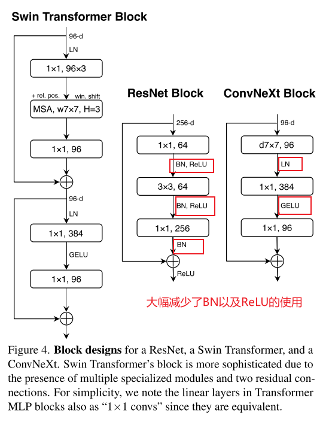

     * Replacing ReLU with GELU.

       ==可以使用GELU替代ReLU，虽然准确率保持不变。==

     * Fewer activation functions. 更少的激活函数

       Transformer 和 ResNet 块之间的一个小区别在于，Transformers 的激活函数较少。

       如图 4 所示，我们从残差块中删除所有的 GELU 层，除了两个 1×1 层之间留有一个，从而复制 Transformer 块的风格。这个过程将结果提升了 0.7% 至 81.3%，几乎匹配 Swin-T 的性能。==现在我们将在每个块中使用一个 GELU 激活。==

     * Fewer normalization layers.

       Transformer 块通常也有更少的归一化层。==在这里，我们删除两个 BatchNorm（BN）层，只保留一个在 1×1 卷积层之前的 BN 层==。这进一步将性能提升到 81.4%，已经超越了 Swin-T 的结果。值得注意的是，我们每个块中的归一化层甚至比 Transformers 还少，因为我们实证发现，在块的开头添加一个额外的 BN 层并没有改善性能

     * Substituting BN with LN.

       BatchNorm 是卷积网络中的一个重要组成部分，因为它能改善收敛并减少过拟合。然而，BN 也有许多复杂性，可能对模型的性能产生不利影响。尽管有许多尝试开发替代的归一化技术，但在大多数视觉任务中，BN 仍然是首选选项。另一方面，更简单的层归一化（Layer Normalization，LN）已在 Transformers 中使用，导致在不同应用场景中表现良好。直接在原始 ResNet 中用 LN 替代 BN 会导致次优的性能。经过所有网络架构和训练技术的修改，我们在此重新审视用 LN 替代 BN 的影响。我们观察到，我们的卷积网络模型在使用 LN 时没有任何训练困难；事实上，性能稍有提升，准确率达到 81.5%。==从现在开始，我们将在每个残差块中使用一个 LayerNorm 作为我们的归一化选择。==

       [机器学习基础系列笔记8—BN、LN、IN、CIN、GN](https://zhuanlan.zhihu.com/p/631481753)

     * Separate downsampling layers.  单独的下采样层

       在 ResNet 中，空间下采样是通过每个阶段开始时的残差块实现的，使用步幅为 2 的 3×3 卷积（在快捷连接中使用步幅为 2 的 1×1 卷积）。在 Swin Transformers 中，在各阶段之间增加了单独的下采样层。我们探索了一种类似的策略，即使用步幅为 2 的 2×2 卷积层进行空间下采样。这一修改出乎意料地导致了训练发散。进一步的调查显示，在每次改变空间分辨率时添加归一化层有助于稳定训练。这些包括在 Swin Transformers 中也使用的几个 LN 层：==一个在每个下采样层之前，一个在主干之后，以及一个在最终全局平均池化之后。==我们可以将准确率提高到 82.0%，显著超越 Swin-T 的 81.3%。==我们将使用单独的下采样层。这将带来我们的最终模型，我们称之为 ConvNeXt。==  ResNet、Swin 和 ConvNeXt 块结构的比较可以在图 4 中找到。ResNet-50、Swin-T 和 ConvNeXt-T 的详细架构规格比较可以在表 9 中找到。

       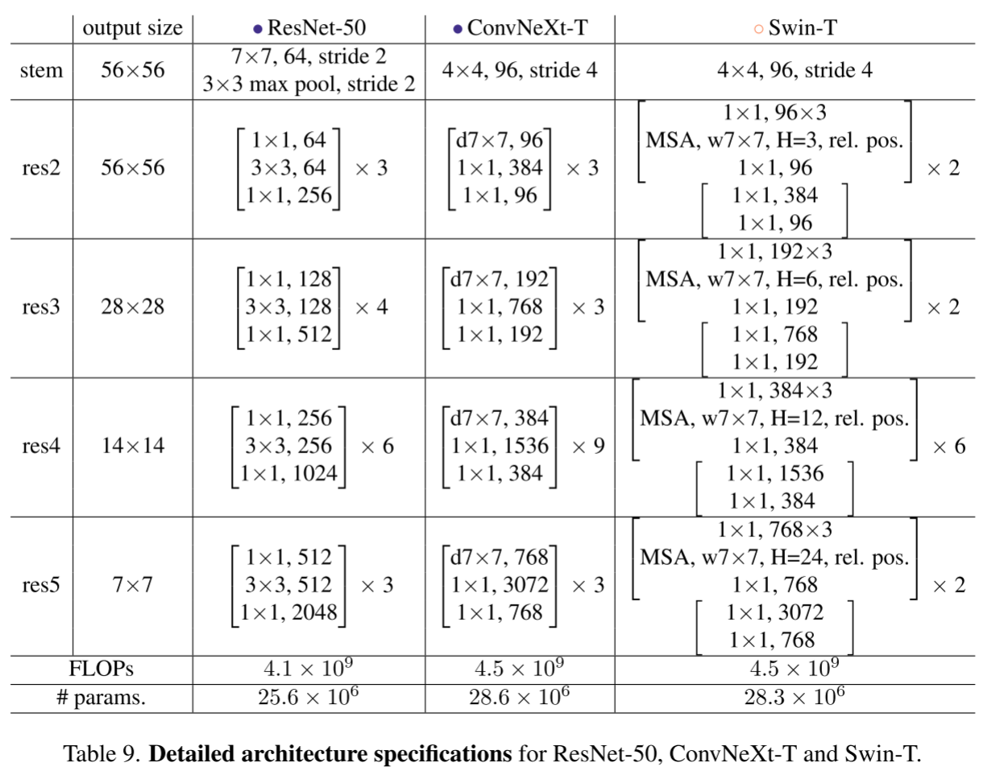

     * Closing remarks.

       我们完成了第一次“试验”，发现了 ConvNeXt，一个纯粹的卷积网络，在这种计算条件下可以超越 Swin Transformer 在 ImageNet-1K 分类中的表现。

* **试验：**

  ​	我们构建了不同的 ConvNeXt 变体：ConvNeXt-T/S/B/L，以使其复杂度与 Swin-T/S/B/L [45] 相似。ConvNeXt-T/B 是分别对 ResNet-50/200 结构进行“现代化”处理后的最终产品。此外，我们还构建了一个更大的 ConvNeXt-XL，以进一步测试 ConvNeXt 的可扩展性。这些变体仅在通道数 C 和每个阶段的块数 B 上有所不同。遵循 ResNet 和 Swin Transformers 的设计，在每个新阶段，通道数翻倍。我们在下面总结了这些配置：

  

* **讨论与总结：**

Inference throughput如何计算是参考文献45的。


* Isotropic ConvNeXt vs. ViT   各向同性的 ConvNeXt 与 ViT

  在这项消融实验中，我们考察了我们的 ConvNeXt 块设计是否可以推广到 ViT 风格的各向同性架构 [20]，这些架构没有下采样层，并且在所有深度保持相同的特征分辨率（例如：14⇥14）。我们使用与 ViT-S/B/L (384/768/1024) 相同的特征维度构建了各向同性的 ConvNeXt-S/B/L。深度设置为 18/18/36，以匹配参数数量和 FLOPs。块结构保持不变（见图 4）。我们参考了 DeiT [73] 的监督训练结果作为 ViT-S/B 的基准，而 ViT-L 则使用 MAE [26] 的结果，因为它们采用了比原始 ViTs [20] 更改进的训练程序。ConvNeXt 模型在之前的设置下进行训练，但采用更长的热身周期。2242 分辨率下 ImageNet-1K 的结果见表 2。我们观察到，ConvNeXt 的表现一般与 ViT 相当，这表明我们的 ConvNeXt 块设计在非层次模型中具有竞争力。

  

* **Empirical Evaluation on Downstream Tasks：** 在下游任务的实验评估

  1. Object detection and segmentation on COCO.

     在不同模型复杂度下，ConvNeXt 的性能与 Swin Transformer 相当或更好。当扩展到更大的模型（ConvNeXt-B/L/XL），并在 ImageNet-22K 上进行预训练时，在许多情况下，ConvNeXt 在盒子 AP 和掩码 AP 方面显著优于 Swin Transformers（例如，+1.0 AP）。查看表3。

     

  2. Semantic segmentation on ADE20K.

     在表 4 中，我们报告了多尺度测试下的验证 mIoU。ConvNeXt 模型在不同模型容量下都能实现竞争性能，进一步验证了我们架构设计的有效性。

     

  3. Remarks on model efficiency.

     在相似的 FLOPs 下，使用深度卷积的模型（加了group的conv层）通常比仅使用密集卷积（普通conv层）的 ConvNets 更慢且消耗更多内存。但是在本文证明了convnext吞吐量还是较为优秀的。

* **Related Work：**

  1. Hybrid models

     在 ViT 之前和之后的时代，结合卷积和自注意力的混合模型一直受到积极研究。在 ViT 出现之前，研究的重点是通过自注意力/非局部模块 [8, 55, 66, 79] 来增强 ConvNet，以捕获长程依赖关系。原始的 ViT [20] 首次研究了混合配置，大量后续工作集中于将卷积先验重新引入 ViT，既可以是显式 [15, 16, 21, 82, 86, 88] 方式，也可以是隐式 [45] 方式。

  2. Recent convolution-based approaches

     Han 等 [25] 显示局部 Transformer 自注意力等同于非均匀动态深度卷积。接着，Swin 中的 MSA 块被动态或常规深度卷积所取代，取得了与 Swin 相当的性能。一项同时进行的工作 ConvMixer [4] 展示了在小规模设置中，深度卷积可以用作一种有前景的混合策略。ConvMixer 使用较小的补丁大小以实现最佳结果，使得吞吐量远低于其他基准。GFNet [56] 采用快速傅里叶变换（FFT）进行标记混合。FFT 也是一种卷积形式，但具有全局卷积核大小和循环填充。==与许多最新的 Transformer 或 ConvNet 设计不同，我们研究的一个主要目标是深入探讨现代化标准 ResNet 的过程，并实现最先进的性能。==

* **Conclusions：**

  

# [AAAI 2024 | 时间序列和时空数据论文总结](https://mp.weixin.qq.com/s/zE3UUPgyoUTnxP_N4fXefQ)

AAAI今年共有12100篇投稿（Main Technical Track），有9862篇经过严格审稿，共录取了2342篇论文，录取率23.75%。

本文总结了2024 AAAI上有关**时空数据（spatial-temporal）时间序列（time series）数据**相关论文。

**时空数据Topic**:交通预测，轨迹表示学习，信控优化等

**时间序列Topic**：时间序列预测，分类，异常检测，因果发现等