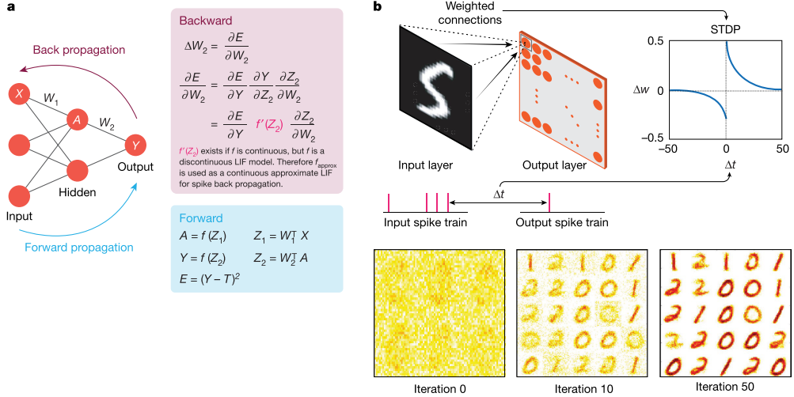
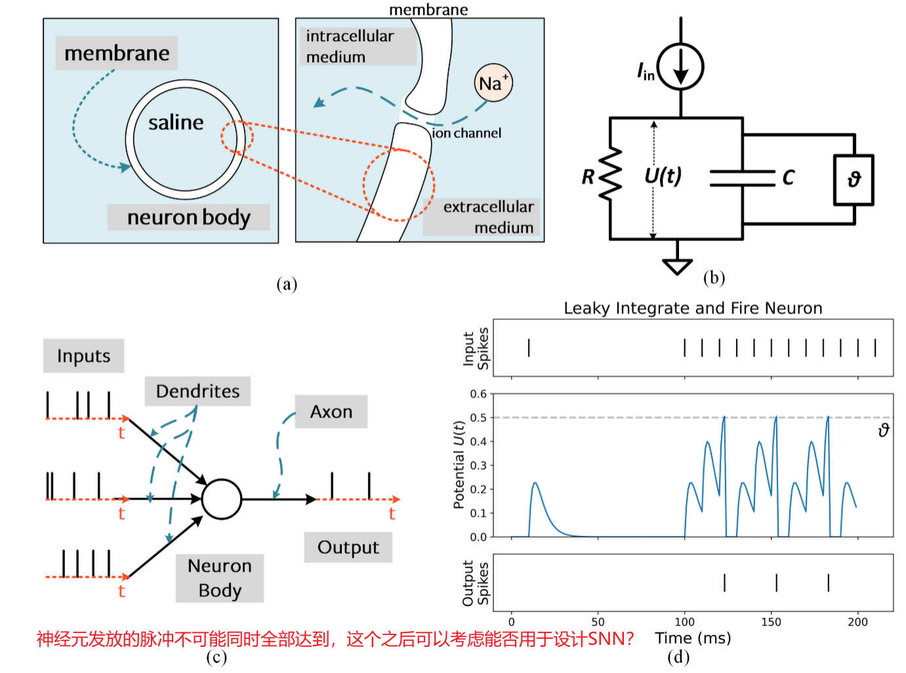

# 关于文献阅读

阅读完文献后，至少要回答以下问题:

1. 这篇文章到底在解决什么问题？
2. 这个问题为什么在这个领域重要？
3. 这些作者是如何解决这个问题的？
4. 这个问题的解决有什么亮点，局限，有什么应用？

看5-10遍，能够回忆起研究目的，研究方法，研究过程，研究成果，研究结论就可以了，至于公式的推导，确实需要花费大量时间的，不重要的可以不去推导。

文献可以分为写的好的和写的差的，写的差的没必要看懂，写的很好的看不懂就很正常了。

不要只看不写，早点动手写论文。

前期是大量的泛读，然后总结。通过标题摘要大概了解这个领域多少人用了什么类型的方法，有全局的思维，基础的了解。之后有选择的精读文献。 精度不是一次就读懂，需要慢慢来。对好的文章多读。

对自己领域的文章进行精读是确保不要让自己和别人想法一样或者自己想法已经被证明是错误的。


--------------------------

-----------------------------------------

总结当前训练SNN的方式：**STDP训练**，**ANN to SNN**, **Surrogate gradient**，**ANN distill SNN**（包含了多种方式，大体过程为训练一个强大的ANN，接着去构建一个结构相似的小型SNN，这个小型SNN也可以是抽取ANN的中间层并进行转换的,最后使用SNN训练ANN, 这个训练可以使用替代梯度+BPTT，也可以使用稳态下的平均发放率去掉时间这个维度，接着使用正常的梯度下降就行。），**Hybrid SNN Training**（ANNtoSNN +  Surrogate gradient训练SNN），**Using ANN to Enhance SNN**（参考MAE和SpikformerV2，就是在训练过程中，用ANN当做解码器来训练SNN抽取特征的能力，接着用SNN去下游任务微调。）


# ==文献阅读   SNN综述性文章==

1. ## ==**Towards spike-based machine intelligence with neuromorphic computing(基于神经形态计算的脉冲机器智能)**==

* **期刊：**nature 64.8 1区top

* **摘要：**SNN这一跨学科领域始于硅电路在生物神经系统中的应用，在2018年中期就已经发展到算法的硬件实现部分了。这篇文章将系统阐述神经形态计算的算法和硬件的发展，并强调学习和硬件框架的基础。重点是算法硬件的协同设计。

* **介绍：**

  之前科学家认为大脑中信息的传输就像无线电一样，现在大脑被认为是和计算机一样。

  大脑的功耗将近20W，而电脑进行1000种对象识别的功耗为250W。

  大脑功能依赖于：vast connectivity, structural and functional organizational hierarchy, and time-dependent neuronal and synaptic functionality。

  大脑和硅基计算机的计算原理之间存在的鲜明对比：（计算和存储的是否连接，大脑的三维连接以及连接的数量，大脑的随机性）

  1.  计算机中的计算（处理单元）和存储（记忆单元）分离，这与大脑中的计算（神经元）和存储（突触）机制形成了鲜明对比；
  2.  大脑中的大规模三维连接目前超出了硅技术的范围，硅技术受到二维连接和有限数量的互连金属层和路由协议的限制;
  3.  晶体管在很大程度上被用作开关，以构建==确定性==的布尔（数字）电路，与大脑中固有的==随机性==基于尖峰的事件驱动计算相反。尽管如此，硅计算平台（例如，图形处理单元（GPU）云服务器）一直是当前深度学习革命的推动因素之一。然而，阻碍实现“泛在智能”（跨越基于云的服务器到边缘设备）的主要瓶颈是大的能量和吞吐量要求。例如，在由典型的2.1瓦时电池支持的嵌入式智能玻璃处理器上运行深度网络，将在25分钟内完全耗尽电池。-----==主要还是说了能耗的问题，同时表明虽然现有的加速硬件与大脑机制相反，但是其仍然在推动深度学些前进的过程中发挥了巨大作用。从这一段开始便引出了SNN==

  在当前情况下，发展SNN首先需要解决算法的问题，包括不同的学习机制，同时需要重点考虑时序这一特点。

  我们可以将神经形态计算领域描述为一种协同努力，它在硬件和算法领域具有同等的权重，以实现基于脉冲的人工智能。

  首先讨论算法在视觉任务方面的应用，接着讨论了算法-硬件协同设计的前景，其中==算法弹性(resilience)可以用来对抗硬件脆弱性==，从而实现能量效率和准确性之间的最佳折衷。 

* **Algorithmic outlook 算法展望**

  

  * **Spiking neural networks 脉冲神经网络**

    * LIF模型，突触可塑性。
    * 神经形态工程师的主要目标是建立一个具有突触可塑性的尖峰神经元模型，同时利用基于事件的数据驱动更新（使用基于事件的传感器16,17），以实现计算高效的智能应用，如识别和推理等。

  * **Exploiting event-based data with SNNs**  使用SNN开发基于事件的数据（事件相机？）

    * 他们相信SNN的最终优势来自于其可以充分利用基于时空时间的信息的能力。
    * 研究人员证明了使用基于事件的传感器进行跟踪和手势识别的好处，然而，这些应用中的大多数使用DLN来做的。SNN之所以没有被使用的原因是其==缺乏适当的训练算法。==，这个算法的要求是能够有效的利用脉冲神经元的时间信息
    * 在准确度方面，SNN比较弱。
    * SNN的另外一个限制是==基于峰值的数据可用性==，说人话就是==没有合适的训练数据==。  编码技术使SNN可以在传统静态图像数据集上进行训练测试。
    * ==SNN最终的能力应该来自于他们处理和感知==来自不断变化的真实世界中的连续输入流的能力，说人话就是==各种宏观上离散，但是个体上连续的数据==。对于所有变量来说是离散的，但是每一个变量本身都是连续的。

  * **Learning in SNNs**  SNN中的学习（搭建SNN，训练SNN）

        

    

    * **Conversion-based approaches**  基于转换的方式
      ANN-SNN，这种方法确实可以实现较高的准确率，不过由于激活函数的不同，ANN会产生负值，但是SNN没有负值，只能选择丢弃这个值，这就带来了准确率的下降，且ANN-SNN的转换推理时间非常长(几千个时间步)，这就与我们使用SNN的本意相违背。

      一个是速率只有正值，另外一个就是如何获得每一层的最佳发射速率(29-31，这些工作在训练DLN中引入了额外的噪音以及 leaky ReLU),

      ==如何高效转换应该是一个关键，或者说不是转换，而是借鉴ANN有用的一些思想，结合SNN，形成一个基于ANN的SNN==

    * **Spike-based approaches**   基于脉冲的方法

      监督或者无监督

      只使用SNN，极大地利用SNN的优势：稀疏性以及效率，但是深层网络训练困难，因为产生了之前ANN发展初期也存在的一个问题：梯度消失——在SNN中称为消失的前向脉冲传播。

      当前的两种类型的算法：

      ==固定SNN的输出，去探寻SNN的反向传播规则==；  也就是正确的类别平均脉冲发放率应该是多少？

      ==对(实值)膜电位进行随机梯度下降，不固定输出数量，而是认为正确的输出神经元将发射更多的脉冲==。  正确类别发放的脉冲就应该是最多的

      将局部学习应用于复杂任务的每一层是非常具有挑战性。所以使用分层训练的思想

      有学者提出：分层进行局部学习训练，全局反向传播，思想很好，准确率还是低一点。

      

      这里的$f^{'}(Z_2)$ 显示出的问题就是SNN中梯度不可导的问题。

    * **Implications for learning in the binary regime**  使用二进制制度进行学习时所产生的影响
      ==解释：==在神经网络中，有时候会使用二进制方式来进行计算，这种计算方式利用二进制计算的速度快、存储空间小的优势。

      目前也存在二进制，三进制的ANN，此时神经元输出以及权重仅能使用-1,0,1，三进制的ANN同样可以获得较高的分类精度

      那么，我们能否利用这种 SNN 时空处理架构和适当的学习方法，以最小的精度损失将权重训练压缩为二进制，还有待观察。

      LIF神经元的神经元动力学中的随机性可以提高网络对外部噪声的稳健性。我们是否可以使用SNN的这种时间处理结构和适当的学习方法，并在最小精度损失的情况下将权重训练压缩到二进制状态，还有待观察。

  * **Other underexplored directions**  其余探索不足的地方

    * **Beyond vision tasks**   视觉任务之外的任务
      SNN在自然语言处理上的应用很少很少。作者相信SNN处理传感器数据应该是很有前景的方向。
    * **Lifelong learning and learning with fewer data**    终身学习和用更少的数据学习
      深度学习模型在持续学习时会遭受灾难性的遗忘。例如，当一个在任务A上训练的网络后来暴露给任务B时，它会忘记所有关于任务A的信息，只记得任务B。
      我们需要考虑==SNN中数据处理的额外时间维度是否可以帮助我们实现持续学习==。
    * **Forging links with neuroscience**   加强与神经科学的联系
      ==个人认为这应该是最需要研究的方法，多学科结合应当能够产生强大的力量，甚至超越所有的ANN，实现真正的人工智能，但其实困难在于算法的发展受限于硬件设备的发展，所以只能找折中的办法==

* **Hardware outlook**  硬件展望
  电路可能需要实现很复杂的功能才有可能模拟大脑的一部分。

  * **The emergence of neuromorphic computing**  神经形态计算的出现
    某位学者没有专注于基于 AND 和 OR 门 的布尔计算，而是专注于模仿神经元和突触的模拟分布式电路。  这种设备与电路的协同设计是目前神经形态计算中最有趣的领域之一。

  * **The ‘Big Brain’ chips**  大脑芯片
    该芯片的特点是集成了数百万个神经元和突触。

  * **Asynchronous address event representation**   异步地址事件表示
    传统的芯片设计是参考全局时钟部分（分步？）执行的。 由于SNN是稀疏的，所以使network-on-chip Non-volatile technologies 片上网络非易失性技术----用异步事件驱动的计算更合适。

  * **Network-on-chip.**    NOCs  片载网络
    大规模芯片中使用NOCs是必要的，因为传统工艺的连接主要是二维的

  * **Beyond-von-Neumann computing** 超越冯诺依曼计算

  * **Non-volatile technologies**  
    Non-volatile technologies指的是一类存储技术，其特点是在断电情况下能够保持数据的存储状态，而不会丢失。==这与易失性存储技术相对==，易失性存储技术在断电后会丢失其中的数据。因此，==非易失性存储技术通常用于存储需要长期保存==、不容丢失的数据，如固态硬盘、闪存存储等。

    该技术表现出了生物突触的两个最重要的特征：突触效能和可塑性。

  * **Silicon (in-memory) computing**    硅（内存）计算
    事实上，目前几乎所有主要的存储器技术都在探索各种形式的内存计算。虽然这些工作大多数都集中在通用计算应用程序，如加密和DLN，但他们可以很容易地在SNN中找到应用。

* **Algorithm–hardware codesign**  软硬协同设计

  * **Mixed-signal analog computing** 混合信号模拟计算
    从本质上讲，无论是以局部化学习的形式，还是使用树突学习等范式，我们认为一类更好的、具有较强容错性的==局部学习算法==——即使要增加学习参数的代价——将是推动模拟神经形计算前进的关键。此外，芯片上学习的容错性可以用于开发低成本的近似模拟-数字转换器，而不会降低目标应用程序的准确性。

  * **Memristive dot products**   忆阻点积

    忆阻点积是实现原位神经形态计算的一种可行方法。

    Memristive dot products”可以理解为在神经形态计算中使用的一种技术，它涉及到使用memristor（一种基于电阻变化的器件）来执行点积运算。在人工智能和神经形计算中，点积运算用于将神经元的输入信号和相应的权重进行加权求和，这对于模拟大脑神经元之间的连接和计算起到了关键作用。

    在神经形计算中，memristive dot products技术可以用于模拟神经元之间的连接强度和权重，从而实现类似于大脑内部信息处理的功能。利用memristive dot products技术，可以实现更高效的神经形计算，而且这样的计算方式还能更好地模拟人类大脑的工作原理。

    遗憾的是，在表示点积的忆阻阵列中产生的电流既与空间有关，也与数据有关，这就使得交叉条电路分析成为一个很复杂的问题。  ==大多数工作都集中在DLN，而不是SNN==

    我们相信基于最先进设备的交叉阵列模型的抽象版本，以及努力建立点积误差的理论界限，是迫在眉睫的一件事。这将使算法设计人员能够探索新的训练算法，同时考虑硬件不一致性，而无需进行耗时且反复迭代的设备-电路-算法模拟。

  * **Stochasticity**  随机性
    由于存在固有随机性的新兴设备，随机SNNs具有重要意义。最近关于实现随机二值SNNs的大部分研究都侧重于小规模任务，例如MNIST数字识别。这些研究的共同主题是利用随机STDP-like本地学习规则来生成权重更新。我们认为，在STDP学习中的时间维度为权重更新提供了额外的带宽，使其朝着正确的方向（朝着实现整体准确性）前进，即使受到二进制范围的限制。==将这种二元局部学习方案与基于梯度下降的学习规则相结合==，用于大规模任务，同时利用硬件中的随机性，为能效神经形态系统提供了有趣的机会。

  * **Hybrid design approaches** 混合设计方法
    ==结合各种有效的方法来最大程度实现SNN的训练及性能的提升==
    作者团队相信，这种结合的本地-全局学习方案可以用来降低硬件复杂性，同时也最大限度地减少最终应用程序的性能下降。

* **Conclusion**
  **“智能”是跨学科研究的中心主题。**
  如今，在我们周围几乎所有的技术中实现“智能”已成为跨越各种学科的研究的核心主题。在这方面，这篇观点阐述了神经形态计算作为一种能够通过硬件（计算）和算法（智能）的协同进步来实现机器智能的能效方式。我们首先讨论了使用脉冲神经范式的算法意义，这与传统深度学习范式中的实值计算形成对比，脉冲神经范式采用了事件驱动的计算。我们已经描述了实现学习规则（如基于脉冲的梯度下降学习、无监督STDP以及相关的从深度学习转换到脉冲领域的方法等）在标准分类任务中的优势和局限性。未来的算法研究应该利用基于脉冲的信息处理的稀疏和时间动态，结合可以实现实时识别的补充神经形态数据集；而硬件开发应专注于事件驱动计算、存储器和计算单元的联合位置，以及模拟动态神经突触功能。特别值得关注的是新兴的非易失性技术，可以实现原位混合信号模拟计算。我们还讨论了促进算法-硬件代码设计的跨层优化的前景，例如利用算法上的韧性（如局部学习）和硬件可行性（如实现随机基元的简便性）。最后，利用传统和新兴设备构建基于脉冲的能效智能系统的前景符合当前推动实现普遍智能的兴趣。现在是时候进行跨学科的交流，通过跨越设备、电路、架构和算法的跨学科努力，最终合成一种真正能效和智能的机器。

2. ## ==**Neural heterogeneity promotes robust learning**==   神经异质性促进稳健学习

   * 期刊：Nature Communications  IF:16.6  1区top

   * **摘要**：作者团队比较了具有不同异质性的脉冲神经网络性能，发现异质性大大提高了任务性能。对于时序性较强的任务异质性作用更明显。  训练后的神经网络中神经元参数的分布与实验观察到的相似。

     大脑中观察到的异质性可能不仅仅是嘈杂过程的副产品，而可能起着让动物在不断变化的环境中保持学习的作用。

     ==神经异质性解释：== 神经异质性是指神经元之间或不同区域之间的结构和/或功能上的差异性。这种异质性可以出现在不同层面，包括形态学、电生理学和分子水平上。在形态学上，神经异质性可以指不同神经元的形态特征、突触连接的密度和位置等方面的差异。电生理学上的神经异质性可能表现为不同神经元的兴奋性和抑制性表现的不同，或者说不同区域之间的电活动特征差异。分子水平上的神经异质性则可能表现为在不同神经元或不同区域中表达的离子通道、神经递质受体和信号传导分子的差异。这种神经异质性对神经系统的功能和信息处理起着重要作用，因为它可以提供神经网络更丰富的功能和适应能力。研究神经异质性有助于更好地理解神经网络的复杂性，并有助于揭示不同神经元类型和区域在脑功能中的作用。

     **假设大脑在发育过程中，神经异质性的发育也是多方面同步发展的，进而造就一个人逐渐变得可以处理多种复杂的事情，那么如果我们只深入研究一种方向，是否就可以得到一个专注于某类型任务的SNN？------借鉴于ANN的发展道路**

     ==文中的异质主要指的是神经元的时间常数不同。==

   * **介绍**：在神经元的时间尺度中引入异质性，提高了整体性能，网络学习到的结果与试验观察结果有一样的神经参数分布，故作者认为大脑中观察到的异质性是适应新环境能力的重要组成部分。

   * **Results**

     * **Time scale heterogeneity improves learning on tasks with rich temporal structure.**

       * 三层脉冲神经网络（输入层，循环连接层，输出层）

       * 通过给每个神经元一个单独的膜和突触时间常数，引入了异质性。

       * 我们比较了四种不同的条件：初始值（==膜时间常数和突触时间常数==）可以是同质的或异质的，训练可以是标准的或异质的。更详细地，时间常数或用单个值初始化(同质初始化)，或者根据gamma分布随机初始化(异质初始化)。在这两种类型的训练中，使用代理梯度下降来优化模型的参数。突触权重在标准训练和异质训练中都是可训练的，而时间常数在标准训练中保持不变，在异质训练中可以修改。

         

         ​	图 1 网络架构和训练配置的示意图。A 模型架构。输入神经元的一层向一个 recurrently 连接的脉冲神经元层发出脉冲列，随后是一个读取层。B 配置。训练可以是标准的（仅学习突触权重）或异构的（heterogeneous）（学习突触权重以及膜和突触时间常数）。初始化可以是均匀的（homogeneous 所有突触和膜时间常数初始化为相同的值）或异构的（突触和膜时间常数通过从给定的概率分布中采样随机初始化给每个神经元）。
         -----==推论：如果我们足够相信网络，那么只需要异构的初始化即可，但现实是训练也需要异构才可能达到更好的效果==

         

       * 引入异质性可以在只增加非常少量参数的情况下大幅提高性能（SHD为0.23%，因为我们添加了一些特定于神经元的参数，但没有添加任何特定于突触的参数，而且绝大多数参数是突触权重），而且无需使用任何额外的神经元或突触。因此，异质性是一种代谢高效的策略。它还是一种对神经形态学计算有兴趣的计算高效策略，因为在模型模拟时，向模型添加异质的时间常数会使内存使用和计算时间增加O(n)，而添加更多神经元会增加O(n2)（因为该模型是完全连接的，因此突触权重的数量与神经元数量的平方成正比）。

       * 使用的数据集中，对于F-MNIST，是将图像灰度值当成了输入电流。  N-MNIST和F-MNIST具有最小的时间结构，因为他们都是来自静态图片。DSV128具有一些时间结构，但是丢弃这种时间信息可以获得更好的结果。

       * 作者证明了得到的结果不是他们对时间常数进行调优的结果，是进行多次比较得到的。

       * 作者表明，增加更多的神经元同样会带来准确度的升上，但时间上会慢很多。==这里有个重点是：从之前的ANN中我们其实也能得到经过优化的小网络也能在部分任务上获得好的甚至更高的性能，这恰恰符合大脑在面对自然界中的各种信息，所表现出来的优越性能，所以是否后面发展SNN可以朝着小且复杂的方向？ 但复杂仍然会带来高功耗的问题，这又和大脑低功耗相违背。==   答案应该是----较宽的SNN网络

       * 作者还尝试了改变==脉冲发射阈值和重置电位==，但是没有什么影响，他认为改变这些等同于对膜电位常数进行缩放而不是改变膜电位。Bellec等人发现，引入==自适应阈值==确实提高了性能，作者认为大概是自适应阈值允许更丰富的时间动态。

       

       图 2 训练配置和数据集的时间结构对测试准确性的影响，以及在不同时间尺度下训练时的膜时间常数分布和性能。==A== 在具有低（N-MNIST，F-MNIST）、中等（DVS）和高（SHD）时间复杂度的数据集上的测试数据准确性改进。阴影区域对应于 10 次试验的均值标准误差（在某些情况下小到不可见）。初始化可以是均匀的（蓝色/绿色）或异构的（橙色/红色），训练可以是标准的，仅权重（蓝色/橙色）或包括时间常数的异构训练（绿色/红色）。异构配置在时间复杂度较高的数据集上获得了更好的测试准确性。异构初始化还为 F-MNIST 导致了更稳定和强健的训练轨迹，从而整体上获得更好的性能。==B== 每个数据集在训练前（左）和训练后（右）的膜时间常数分布。坐标轴上方的直方图表示异构初始化，坐标轴下方的直方图表示均匀初始化。在标准训练（仅权重）的情况下，初始分布（左）与训练后的最终时间常数分布相同。==C== 实验观察到的时间常数分布（从上到下）：小鼠耳蜗核，多个细胞类型（172 个细胞）；小鼠 V1 4 层，棘突（假定为兴奋性）细胞（164 个细胞）；人类中颞回，棘突细胞（236 个细胞）。==D== SHD 数据集（语音数字）中一单样本的输入脉冲的 raster 图，在三种不同时间尺度下。==E== 在 SHD 数据集上进行多种时间尺度训练（从灰色分布中随机选择）后各配置的准确性。==F== 当时间常数的初始分布为时间尺度 1.0 调整，但训练和测试在不同时间尺度下进行时，SHD 数据集上的准确性。

     * **Predicted time constant distributions match experimental data**

       * 有趣的是，实验数据中每种细胞类型的分布参数也是不同的，这是我们模拟中没有复制的特征，因为所有细胞都是相同的。这表明，在引入不同细胞类型方面进一步增加多样性可能会导致更好的性能。

     * **Heterogeneity improves generalisation: speech learning across time scales.** 
       异质性提高了泛化能力：在不同时间尺度上的语音学习。

       * 时间常数的异构初始化本身就足以实现这种更好的泛化性能，而时间常数的训练提高了峰值性能，但没有提供额外的泛化能力。意思是多次训练并不能带来泛化性能的提高。

     * **Heterogeneity improves robustness against mistuned learning.**
       异质性提高了对误调学习的稳健性。
       "mistuned learning" 意指学习误调，即学习过程中出现了错误的信息或者不准确的数据。在这种情况下，因为学习的内容不准确或者不适当，可能会导致对所学知识的误解或者错误的应用。因此，所谓的“mistuned learning”指的就是出现了学习偏差或错误的情况。

       这里做的实验就是将在某一个数据集上表现最好的超参数应用到另外一个数据集上，去测试表现，结果得到的是异质网络仍然能够变现良好，同质网络无法训练（**个人认为这一点是显然的，在ANN中早就验证过了。**）

   * **Discuss**

     * 对于异质网络来说，学习更为稳健，网络能够学习来自一系列不同环境的信息，即使学习的超参数被错误地调整。
     * 当学习规则允许调整时间常数以及突触权重时，发现了一致的时间常数分布，类似于对数正态分布或伽玛分布，这在定性上与实验数据中测得的时间常数相匹配。我们的模型与这两种可能性是一致的，即这些时间常数分布是在个体的一生中学习到的，或者它们是作为进化过程的结果而被发现的。我们从中得出结论，神经异质性是大脑一种代谢效率高的策略。异质网络在神经元或突触数量上没有额外的成本，并且表现与拥有数量级更多神经元的同质网络一样好。这一收益也延伸到神经形态计算系统，因为向神经元模型中添加异质性仅增加O(n)的时间和内存成本，而添加更多的神经元则成本为O(n2)（因为所有神经元都是相互连接的）。此外，在某些神经形态系统如BrainScaleS中，这种异质性已经作为制造过程的一部分而存在。除了整体性能更好之外，异质网络更稳健且能够在更广泛的环境中学习，这在生态学上显然是有利的。同样，在神经形态计算和潜在的机器学习中，这也具有相应的益处，因为它降低了超参数调整的成本，而这往往是开发这些模型的最大成本之一。
     * 我们的计算结果显示，异质性具有明显的优势，这在直觉上是合理的。在一个层中具有不同时间常数的异质性使得网络能够以不同的时间尺度整合传入的脉冲，对应于更短或更长的记忆痕迹，从而使读取层能够捕捉多个尺度上的信息并表示更丰富的函数集。延伸这一思路并找到异质性优势的严格理论解释将非常有价值。
     * 

3. # ==Direct Training High-Performance Deep Spiking Neural Networks: A Review of Theories and Methods==

   * **期刊：** Frontiers in Neuroscience 之前是医学类的2区top，现在是医学类的3区

   * **作者及单位：**  鹏程实验室，哈工大，北大等等

   * **摘要：**

     脉冲神经网络（SNNs）因其高度的生物 plausibility、丰富的时空动态和事件驱动计算，为人工神经网络（ANNs）提供了一种有前景的节能替代方案。基于代理梯度方法的直接训练算法为设计新颖的 SNN 架构及探索 SNN 的时空动态提供了足够的灵活性。根据之前的研究，模型的性能高度依赖于其规模。最近，直接训练的深度 SNN 在神经形态数据集和大规模静态数据集上取得了显著进展。值得注意的是，==基于 Transformer 的 SNN 显示出与其 ANN 对应物可比的性能==。在本文中，我们提供了一个新的视角，以系统和全面的方式总结深度 SNN 高性能训练的理论和方法，包括理论基础、脉冲神经元模型、先进的 SNN 模型和残差架构、软件框架与神经形态硬件、应用及未来趋势。所审阅的论文被汇集在 [Awesome-Spiking-Neural-Networks](https://github.com/zhouchenlin2096/Awesome-Spiking-Neural-Networks) 中。

   * **1.Introduction-介绍：** 

     考虑到直接训练的深度SNN的重大益处和快速进展，特别是高性能的基于Transformer的SNN的出现，本文系统且全面地总结了==直接训练深度SNN的理论和方法==。结合**理论基础、脉冲神经元模型、先进的SNN模型和残差架构、软件框架与神经形态硬件、应用及未来趋势**，本文为SNN领域提供了新的视角。本文的结构如下：**第二部分**介绍脉冲神经元模型的演变和近期进展。**第三部分**介绍脉冲神经网络的基本原理。**第四部分**重点介绍最近的先进SNN模型和架构，特别是基于Transformer的SNN。这些高性能模型的性能和其他细节在表2中展示。**第五部分**总结了训练SNN的软件框架和神经形态硬件的发展。**第六部分**总结深度SNN的应用。最后，**第七部分**指出未来的研究趋势并结束本次评述。

   * **2.Spiking Neuron Models-脉冲神经元模型：**、

     LIF神经元：

     

     

     ​	LIF在实际应用中也存在显著的限制。例如，LIF需要手动调整超参数，如膜时间常数τ和发放阈值Vth，这限制了其表达能力。此外，LIF在建模上较为简单，这限制了神经元动态的范围。总体而言，LIF缺乏多样性和灵活性，这需要更先进的神经元模型来增强SNN的性能并拓宽其应用。表1列出了最近开发的一些脉冲神经元模型及其在典型任务上的性能。

     

     * Spiking Neurons with Trainable Parameters

       修改时间常数为可学习的

       

       

       修改阈值为可学习的

       

       后续设计的大体思想可以归结为：在神经元发放脉冲后，阈值上升并呈指数衰减。

       KLIF： 在充电和放电之间插入一个可训练的比例因子k和ReLU激活函数

       

       GLIF（Yao et al., 2022）引入了一个门控单元，融合了多种生物特征，这些特征的比例由可训练的门控因子调整。此外，受到大脑神经元多种脉冲模式的启发，LIFB（Shen et al., 2023）具有三种模式：静息、规则发放和突发放电。突发放电的密度可以自动学习，这极大地丰富了神经元的表示能力。为了减少网络中二值化脉冲传输所导致的性能损失，MT-SNN（Wang et al., 2023d）引入了多级发放阈值。

       **补充知识：**  ==“Burst spiking” 是神经科学和生物学中的一个术语，主要描述神经元的特定放电模式。在这个模式下，神经元在短时间内以快速、强烈的脉冲或“爆发”方式发放多个动作电位，随后可能会进入一个相对不活动的状态。这种放电模式在神经信息传递中具有重要意义，尤其是与感知、学习和记忆相关的过程。==

     * Parallel Spiking Neurons 并行脉冲神经元

       房等（Fang et al., 2023b）提出了一种并行脉冲神经元（PSN），PSN的充放电过程可以表示为如下的非迭代式：

       

       $其中W_{t,i}是输入X[i]与膜电位H[t]之间的权重。对于LIF神经元，W_{t,i} = \frac{1}{τ_m}(1 −\frac{1}{τ_m})^{t−i}。$ PSN的动态特性如下：

       

       $其中X是输入，W和B分别是可训练的权重和可训练的发放阈值。H是充电后的膜电位，S表示神经元是否发放脉冲。$

       $N和T分别是批量大小和时间步数。为了逐步的串行前向计算和可变长度序列处理，还推导出了带掩码的PSN和滑动PSN。$

       masked PSN and the sliding PSN

       

       ==随机并行脉冲神经元（stochastic parallel spiking neuron, SPSN）==（Yarga和Wood，2023）采用了与PSN类似的思路，通过去除重置机制。SPSN的神经元动态包含两个部分，即并行泄漏积分器和随机发放。泄漏积分器是一个线性时不变系统，可以转换到傅里叶域以实现并行计算。随机发放通过可训练参数自适应地调整发放概率，提高了网络在动态和高效信息处理中的能力。

       ==时不变系统：表示的是在不同时刻输入的相同数据，得到的结果都是一样的。==

   * **3.Fundamentals of Spiking Neural Networks-脉冲神经网络的基本原理：**

     * Information Coding

       要通过脉冲神经网络（SNN）处理图像数据，首先需要将数据编码为脉冲列。

       1. 速率编码（Adrian和Zotterman，1926）是SNN中最常用的信息编码方法，其中特征的发放频率与输入信号的强度成正比，脉冲通常由泊松过程生成（Wiener和Richmond，2003）。为了更准确地编码信息，速率编码需要更长的时间窗口，这导致信息传输速率较慢。相反，使用更短的时间窗口可能会导致编码过程中信息的丢失，因此在信息传输中存在速度和准确性之间的权衡。

       2. 与速率编码不同，时间编码通过脉冲的时机来表示信息。首次脉冲时间（TTFS）（Guo等，2021b；Park等，2020）因其在时间编码中的简单性和效率而脱颖而出，它使用神经元发出的第一个脉冲的时间来表示输入信号。TTFS有效地减少了脉冲的总数，从而加速了SNN的计算。TTFS算法可以描述如下：

          

          $其中S[t]表示在编码后时间t是否发放脉冲，tmax表示编码过程中允许的最大时间，X和Xmax分别表示输入信号及其最大$ $值。在TTFS编码方法中，输入信号的较大值会导致脉冲的较早发放.$

     * Network Training

       1. Surrogate Gradient

          sew-resnet中使用的替代梯度如下所示：

          

          

          Li等人提出了可微脉冲（Dspike）（Li et al., 2021）作为克服Heaviside函数不可微性问题的另一种方法，不同的b带来不同的替代梯度：

          

          

          Meng等人提出的脉冲表示微分（Differentiation on Spike Representation，DSR）（Meng et al., 2022）编码脉冲列，并将其表示为子可微映射，这也避免了反向传播中的不可微问题。

       2. Loss Function and Backpropagation

          损失函数是神经网络训练的关键，针对脉冲神经网络（SNN）的性能提升，提出了不同的损失函数。
          例如，IM-Loss（Guo et al., 2022a）旨在最大化网络中的信息流。

          

          markdown划线的公式： $\overline{\text{上划线}}$     ~~中划线~~  $\underline{\text{下划线}}$
          其中 $\overline{\text{U}}_l为第l层的所有时间步的平均膜电位$

          然而，==尽管OTTT和SLTT显示出比BPTT更好的训练内存消耗，直接训练高性能SNN仍然主要依赖于BPTT与替代梯度的结合==，如SGLFormer（Zhang et al., 2024）、Spikformer（Zhou et al., 2023c）等。因此，研究同时具有效率和效果的直接训练方法显得尤为重要。 

          

       3. Batch Normalization

          在脉冲神经网络（SNN）中，bn是不可或缺的组成部分，尤其是在深度SNN相比于人工神经网络（ANN）训练和收敛难度较大的背景下。为了解决SNN的退化问题，Zheng等人提出了阈值依赖的批归一化（tdBN）（Zheng et al., 2021），其描述如下：

          

          其中，α是一个超参数，Vth是神经元的发射阈值，$X_k$是第k个通道的特征，γk和βk是可训练参数，µ和σ²分别是均值和方差，ϵ是一个微小常数。

          

          时间有效批归一化（TEBN）（Duan et al., 2022）通过在不同时间步骤采用不同参数的批归一化来规范化时间分布。由Kim等人提出的时间批归一化（BNTT）（Kim和Panda, 2021）与TEBN类似，也对不同时间步骤的特征图采用不同的批归一化参数。此外，Guo等人将批归一化应用于LIF神经元内部，以在发放脉冲之前规范化膜电位的分布（Guo et al., 2023b）。

   * **4.SNN Architecture Developments-SNN架构的发展：**

     ​	本综述聚焦于最新的脉冲神经网络（SNN）模型。最近，残差块的演变显著增强了深度SNN的规模和性能。此外，将SNN与Transformer相结合打破了SNN性能的瓶颈。因此，本综述主要关注这两种架构在直接训练深度SNN中的应用：Transformwer在4.1章节，残差连接在4.2章节。表2总结了它们在主流数据集（ImageNet-1K、CIFAR10、CIFAR100、DVS128 Gesture、CIFAR10-DVS）上的性能。

     

     * Transformer-based Spiking Neural Networks

       

       为了在SNN中采用Transformer结构，Zhou等人设计了一种新颖的脉冲形式自注意力机制，称为脉冲自注意力（SSA）（Zhou et al., 2023c），使用稀疏的脉冲形式查询（Query）、键（Key）和值（Value），且无需softmax操作。SSA的计算过程可表示如下：

       

       ==Spikformer，Spikingformer，Spikformer V2，QKformer， 看到QKformer提出来，自己内心有点无语，因为这和自己之前看论文时的想法一样。==  

       Zhou 等人（2023a）讨论了 Spikformer（Zhou et al., 2023c）和 SEW-ResNet（Fang et al., 2021a）的非脉冲计算问题（整数与浮点数乘法），该问题是由激活后加法短路所引起的。为了避免突触计算中的非脉冲计算问题，提出了 Spikingformer（Zhou et al., 2023a），使用了预激活短路。实验分析表明，Spikingformer 在突触计算中的能耗仅为 Spikformer 的约 43%，且只包含累加操作和较低的发火率。CML（Zhou et al., 2023b）专门为 SNN 设计了一种下采样结构，以解决大多数最先进深度 SNN（包括 Spikformer）中的不精确梯度反向传播问题。

       Zhou 等人（2024a）提出了 QKFormer，这是一种新颖的分层脉冲变换器，使用 Q-K 注意力，可以轻松对代币或通道维度的重要性进行二值建模，且对代币（或通道）数量具有线性复杂度。QKFormer 在 ImageNet 上达到了显著的里程碑，使用直接训练方法，4个时间步的 top-1 准确率超过了 85%。

     * Residual Architectures in Spiking Neural Networks

       SNN中的一些残差连接的改进以及他们的优缺点

       

       

       预激活快捷方式 ( Pre-activation shortcut ) 可以追溯到 Activation-Conv-Bn paradigm，这是二元神经网络（Binary Neural Networks , BNNs）的基本构建模块（Liu et al. (2018); Guo et al. (2021a); Zhang et al. (2022d); Liu et al. (2020)).

       一些使用预激活快捷方式的代表性SNN包括MS-ResNet（Hu等，2021b）、Spikingformer（Zhou等，2023a）、基于脉冲的变换器（Spike-driven transformer）（Yao等，2023a）。==MS-ResNet==成功地直接训练了基于卷积的SNN，将深度扩展到482层而未出现退化问题，有效验证了这种方法的可行性。==Spikingformer==（Zhou等，2023a）表明，预激活快捷方式能够有效避免非脉冲计算，从而在突触计算中比以前的快捷方式具有更低的能耗，通过避免整数-浮点乘法问题，并且具有更低的发火率。==然而，预激活快捷方式需要在残差分支中传输大量浮点数。==总体而言，适合SNN特性的残差学习需要进一步探索。

       在我们看来，存在梯度问题的加后激活快捷方式不适合直接训练深度SNN，但在ANN到SNN转换（ANN2SNN）领域是可行的。加前激活快捷方式有一些替代方案，可以通过稍微牺牲性能来确保SNN的特性，例如在聚合操作中用AND或IAND替换ADD。预激活快捷方式需要进一步分析浮点传输的影响，并需要更多努力通过协同硬件优化和设计来发掘其优势。

     * Others

   * **5.Software Frameworks and Neuromorphic hardware for spiking neural networks-软件框架和神经形态硬件：**

     * Software Frameworks for Training Spiking Neural Networks  训练SNN的软件框架

       其中一种框架的类别包括脑模拟器，如NEURON（Hines和Carnevale，1997）和Brian（Goodman和Brette，2009），这些模拟器不仅增强了模型的可扩展性和计算效率，还包括感知、决策和推理等认知功能。由这些框架构建的SNN展示了高度的生物合理性，使其适合于研究真实神经系统的功能。它们支持生物可解释的学习规则，如脉冲时序依赖性可塑性（STDP）（Bi和Poo，1998），在推进神经科学领域中起着重要作用。然而，这些框架缺乏深度学习所需的核心计算功能，如自动微分，因此无法执行机器学习任务。

       

       其中，BindsNet（Hazan等，2018）主要关注机器学习和强化学习；NengoDL（Rasmussen，2019）转换ANNs以获得深度SNN，但不支持使用代理梯度方法直接训练SNN；SpyTorch是一个演示框架，仅提供基本的代理梯度示例；SpyTorch（Mozafari等，2019）引入了一种新的代理梯度方法，称为SuperSpike。这些框架能够实现一些简单的机器学习和强化学习模型，但仍缺乏SNN的深度学习能力。Norse试图引入SNN的稀疏性和事件驱动特性，并支持许多典型的脉冲神经元模型。它仍处于开发阶段，尚未正式发布。SNNTorch支持一些更符合生物学合理性的在线反向传播算法变体，并支持大规模SNN计算。SpikingJelly（Fang等，2023a）是一个完整的工具包，用于对仿生数据集进行预处理、构建深度SNN、优化参数以及在仿生芯片上部署SNN，显示出卓越的可扩展性和灵活性，使用户能够通过多级继承和半自动代码生成以低成本加速定制模型。

       

       总之，现有软件框架的发展本质上仍处于初级阶段，功能增强和性能优化还任重道远。

     * Neuromorphic Hardware for Spiking Neural Networks

       统计如表4所示：

       

       

     * Software and Hardware Interplay  软硬交互

       类脑硬件为神经网络模型提供计算能力，在大规模类脑神经网络中发挥着至关重要的作用。高效的硬件可以显著加速大规模类脑模型的训练、评估、迭代和实际应用。与通用处理器相比，深度学习芯片和类脑芯片是专门针对深度学习任务和类脑计算任务计算效率的专用芯片，旨在实现更好的功率/性能/面积比。

       从架构的角度来看，目前的类脑芯片主要可以分为两类：模拟-数字混合电路和全数字电路（见表4）。当前的深度学习芯片，像一般的CPU，基于冯·诺依曼架构，具有分开的计算和存储单元。==类脑芯片通过设计高效的存储和计算层次结构来提高计算效率，使得数据流并行并实现高效重用，从而改善计算效率==。受到大脑神经系统同时计算和存储能力的启发，类脑芯片通常采用近内存计算（NMA）或内存计算架构（CIM），在每个计算核心内集成紧密耦合的计算和存储资源（Akopyan et al., 2015；Pei et al., 2019）。高效的芯片内和芯片间互连能够实现大规模的计算并行性和高局部内存，从而降低计算功耗。

       近内存计算架构指的是在每个处理单元中存储和计算的分离，但又保持近距离。该类别的关键芯片包括IBM的TrueNorth（Akopyan et al., 2015）、英特尔的Loihi（Davies et al., 2018, 2021）、曼彻斯特大学的SpiNNaker（Painkras et al., 2013）、斯坦福大学的Neurogrid（Benjamin et al., 2014）、海德堡大学的BrainScaleS（Schemmel et al., 2010；Pehle et al., 2022）、清华大学的天机芯片（Pei et al., 2019）和浙江大学的达尔文芯片（Shen et al., 2016；Ma et al., 2017）。它们利用==类脑脉冲计算的特性，如稀疏性、脉冲求和和异步事件驱动处理，来实现超低功耗==，目前主要支持基于STDP、Hebb等的模型推理和局部在线学习。例如，ROLLS（Qiao et al., 2015）、ODIN（Frenkel et al., 2018）和MorphIC（Frenkel et al., 2019）支持脉冲驱动的突触可塑性（SDSP）规则，而Loihi增加了用于STDP规则的学习模块。在SpiNNaker（Painkras et al., 2013）和BrainScaleS（Schemmel et al., 2010）中，通过时间戳记录和学习电路展示了STDP学习。在它们的下一代中（Pehle et al., 2022），由于存在嵌入的可编程单元，更多灵活的学习规则是可能的。清华大学的天机芯片作为第一个支持SNN与ANN计算融合的芯片，基于ANN提高了准确性，并基于SNN实现了丰富的动态、高效率和鲁棒性。这种模式也被BrainScaleS-2（Pehle et al., 2022）、SpiNNaker-2和Loihi-2（Davies et al., 2021）所采用。

       最近，BPTT已被应用于SNN，相比于局部学习规则，取得了更高的准确率（Wu et al., 2018, 2019）。一些工作，如H2Learn（Liang et al., 2021）和SATA（Yin et al., 2022），为SNN中的BPTT学习设计了特定的架构。未来，学习规则的整合将变得越来越重要，以探讨类脑计算（BIC）芯片中大型和复杂的类脑模型。

   * **6.Applications of deep spiking neural networks-DSNN的应用：**

     ==脉冲神经网络（SNN）由于其事件驱动的特性和时间处理能力，提供了强大的计算能力==。理论上，SNN可以应用于任何传统深度神经网络（DNN）可以应用的领域。随着深度SNN的训练方法和编程框架变得更加强大，深度SNN吸引了越来越多的关注，并被应用于更多领域，主要包括计算机视觉、强化学习和自主机器人、生物视觉系统建模、生物信号处理、自然语言处理、设备安全监测等。需要注意的是，本文仅列出近年来一些常见应用领域的典型例子，并不旨在全面回顾所有相关研究。

     * Applications in Computer Vision

       与传统的DNN一样，SNN最常见的应用在计算机视觉任务中。

       ==SNN主要有两种视觉输入类型，即来自传统相机的RGB帧或来自类脑视觉传感器的事件==。类脑视觉传感器在高速和低光照条件下的计算机视觉任务中展示了巨大的潜力（Li和Tian, 2021）。由于其事件驱动的特性和能效高的计算能力，SNN是处理类脑信号的优秀候选者。识别任务在深度SNN的快速发展中发挥了重要作用。SNN通常在静态数据集（如CIFAR10、CIFAR100、ImageNet）以及类脑数据集（如CIFAR10DVS和DVS128-Gesture）上进行测试。

       除了常见的识别任务，深度SNN也越来越多地应用于更多的计算机视觉任务，包括目标检测/跟踪、图像去噪/生成、图像/视频重建、视频动作识别、图像分割等。

       * Object Detection and Object Tracking

         Su等（2023）提出了EMS-YOLO，这是首个直接训练的深度SNN用于目标检测，在帧基础的MS-COCO数据集和事件基础的Gen1数据集中仅用4个时间步就达到了与ANN相应模型相当的性能，同时消耗了更少的能量。

       * Image Generation/Denoising and Image/Video Reconstruction

         生成任务在脉冲神经网络（SNN）中越来越受到关注。

         ==Liu等（2023）提出了一种脉冲扩散模型，在多个数据集上超越了现有的基于SNN的生成模型。Castagnetti等（2023）开发了一种基于直接训练的脉冲自编码器的图像去噪解决方案，在Set12数据集上实现了竞争性的信噪比，并且能耗显著降低。==

         ==视觉信息重建对于类脑视觉传感器至关重要，因为人类无法直接从事件中感知视觉场景。==Zhu和Tian（2023）对事件的视觉重建方法进行了全面的综述。Duwek等（2021）提出了一种混合ANN-SNN模型，成功实现了对N-MNIST和N-Caltech101数据集中简单场景的图像重建。Zhu等（2021a）提出了一种结合DVS和Vidar信号的图像重建算法，利用DVS的高动态范围来提高重建效果。随后，他们开发了一种具有编码器-解码器结构的深度SNN，用于基于事件的视频重建，能耗仅为传统ANN的0.05x，实现了相当的性能（Zhu et al., 2022a）。

       * Others

         除了上述任务，深度脉冲神经网络（SNN）还应用于一些其他计算机视觉任务，包括**视频动作识别**（Panda 和 Srinivasa，2018；Chakraborty 和 Mukhopadhyay，2023；Wang 等，2019；Zhang 等，2022c）、**图像分割**（Liang 等，2022；Parameshwara 等，2021；Kim 等，2022；Zhang 等，2023a）、**光流估计**（Lee 等，2020a；Kosta 和 Roy，2023；Cuadrado 等，2023）、**深度预测**（Ranc¸on 等，2022；Wu 等，2022；Zhang 等，2022b）、**点云处理**（Zhou 等，2020；Ren 等，2023a）、**人体姿态跟踪**（Zou 等，2023）、**唇读**（lip-reading  Bulzomi 等，2023）、**情感/表情识别**（Wang 等，2022；Barchid 等，2023）、**医学影像分类**（Shan 等，2022；Qasim Gilani 等，2023）等。

     * Applications in Other Fields

       除了计算机视觉任务，脉冲神经网络（SNN）在许多领域展现出逐渐扩展的应用前景，包括**强化学习和自主机器人、 生物视觉系统建模、生物信号处理、自然语言处理、设备安全监测**等。

       * Reinforcement Learning and Autonomous Robotics

         由于强化学习（RL）对人类和动物的生存至关重要，应用脑启发式脉冲神经网络（SNN）进行强化学习的兴趣日益增加。Asgari 等（2020）在硬件上实现了一种具有强化学习能力的 SNN，以学习刺激-反应关联，在通过闭环感知-运动系统控制机器人方面表现良好。Chen 等（2022）构建了深度脉冲 Q 网络（deep spiking Q-network, DSQN），以端到端深度强化学习的方式直接从高维感官输入中学习鲁棒策略，并在 17 个 Atari 游戏上进行了测试，在大多数游戏中超越了基于人工神经网络（ANN）的深度 Q 网络（DQN）。为了减少脉冲强化学习的延迟，Qin 等（2023）应用可学习的矩阵乘法来编码和解码脉冲。

         由于良好的生物 plausibility 和高能效 (high energy efficiency)，SNN 被长期应用于自主机器人技术，这是一个仍在蓬勃发展的研究方向，主要包括模式生成（walk, trot, or run 步行，小跑或奔跑）、运动控制和导航（simultaneous localization and mapping，SLAM）。Yamazaki 等（2022）已经对相关研究进行了很好的综述，在本次评审中我们不再详细讨论这个主题，而是主要集中在深度 SNN 上。

         **Simultaneous Localization and Mapping (SLAM)**，即**同时定位与地图构建**，是机器人和计算机视觉领域中的一项重要技术。SLAM的主要目标是在未知环境中实现同时的定位和地图构建，使自动化系统（如机器人、无人机、自驾车等）能够创建环境地图的同时确定自己的位置。

       * Biological Visual System Modelling and Biological Signal Processing  生物视觉系统建模和生物信号处理

         人工神经网络（ANN）在建模生物视觉通路中发挥着重要作用。然而，由于使用了时间脉冲序列，脉冲神经网络（SNN）更符合生物学原理。因此，几个研究采用 SNN 来建模生物视觉皮层。

         Huang 等（2023a）首次应用深度 SNN 来建模视觉皮层，其相似性得分高于其 ANN 对应物，显示了 SNN 的有效性。此外，他们在深度 SNN 中添加了一个启发自大脑的递归模块，在自然电影刺激下优于前向深度 SNN（Huang 等，2023b）。Zhang 等（2023b）比较了深度 SNN 和卷积神经网络（CNN）在三个大脑区域对自然刺激的视觉反应预测中的表现。Ma 等（2023）提出了一种时间条件脉冲潜变量模型，以产生更逼真的脉冲活动。

         由于其内在动态，SNN 也被应用于处理生物信号。Xiong 等（2021）提出了一种用于电子鼻嗅觉识别的卷积 SNN。Feng 等（2022b）应用转换方法获得了一个用于心电图（ECG）分类的 14 层 SNN 模型。==Li 等（2023c）回顾了近期在信号分类和基于生物信号（包括 EEG、ECG、EMG 等）的疾病诊断中应用 SNN 的研究。== 
         **论文：Review of medical data analysis based on spiking neural networks**

       * Others

         脉冲神经网络（SNN）还被应用于自然语言处理、设备安全监测、语义通信、多模态信息处理等领域。为了解决基于人工神经网络（ANN）的大型语言模型的高能耗问题，一些研究采用了基于 SNN 的架构，包括 SpikBERT（Lv 等，2023）和 SpikeGPT（Zhu 等，2023）。与设备安全监测相关的应用主要包括电池健康监测（Wang 等，2023b,a）、自动驾驶车辆传感器故障诊断（Wang 和 Li，2023）以及轴承故障诊断（Xu 等，2022）。在语义通信中的应用主要试图减轻传输带宽的限制（Wang 等，2023c）。在多模态信息处理中的应用目前出现在视听零样本学习任务中（Li 等，2023a,b）。

     * Discussion on SNN Applications

       深度脉冲神经网络（SNN）在许多领域取得了很大的成功，但仍然存在一些需要解决的限制。首先，尽管许多研究表明，深度 SNN 在多个任务上达到了与其人工神经网络（ANN）对应物相当的准确率，但在处理大型数据集（如 ImageNet）时，它们仍然落后于传统的 ANN 最佳技术，特别是在这一领域还需要更多的努力。其次，许多研究声称所提出的 SNN 与 ANN 相比消耗了更少的能量，这主要是通过计算加法操作的数量来实现的，而未考虑其他操作（如数据移动）所带来的成本。因此，在神经形态芯片或相应模拟器上部署高性能的 SNN 是有意义的，这样可以充分利用事件驱动的特性并测量实际的能量成本。**第三，对于需要高处理速度和低功耗的应用，例如机器人技术，采用神经形态视觉/音频传感器和神经形态处理芯片是有前景的，除了网络剪枝和权重量化以外**。与此同时，为了充分发挥事件的优势，需要更多的努力探索如何使用 SNN 直接处理神经形态感知事件，而不是像当前研究通常做的那样将事件转换为帧。第四，对于用于语言或视频处理的基于变压器的 SNN，如何选择一个模拟步骤的输入片段，以调和输入序列的时间分辨率和 SNN 的模拟步骤，是一个值得研究的问题。最后但同样重要的是，SNN 具有额外的时间维度，如何实现与人类相似的速度-准确性权衡是一个值得研究的问题。换句话说，如何确定合适的仿真持续时间或如何决定何时做出选择，是实现计算成本与预测准确性之间平衡的重要问题。

   * **7.Future trends and conclusions-未来趋势和总结：**

     本文概述了深度脉冲神经网络（SNN）在各种理论和方法方面的最新进展，包括相关基础知识、各种脉冲神经元模型、先进模型和架构、蓬勃发展的软件工具与硬件平台，以及在各个领域的应用。然而，仍然存在许多限制和挑战。

     * (1) 目前，只有少数智能大脑的方面被应用于指导 SNN 的构建和训练，缺乏足够的生物合理性。因此，为了提高 SNN 的能力，有必要引入更多类型的脉冲神经元、丰富的连接结构、多尺度的局部-全局协作学习规则、系统的自稳态等，以更准确地模拟大脑中出现的认知和智能特征。例如，需要更多的努力使用自监督学习训练 SNN，因为儿童在成长过程中主要接收未标记的数据。此外，大脑实际上是一个复杂的网络，因此，尽管已经有一些尝试，仍值得更多的努力去研究图 graph SNN。
     * (2) 最近的神经科学研究发现 ，星形胶质细胞可以自然实现Transformer操作，这为 SNN 的改进提供了新的方向。此外，星形胶质细胞具有调节神经元发放活动和突触修剪的功能，这为未来 SNN 的性能提升和轻量化提供了思路。
     * (3) **SNN 的信息编码方法和训练算法主要基于平均发放率**，缺乏充分表现时间动态的能力。应进一步探索时间依赖的信息编码策略和相应的训练算法，以增强 SNN 的时空动态特性，并增强其时间处理能力。
     * (4) SNN 的训练主要采用时间依赖的方法，如反向传播通过时间（BPTT），与常规深度神经网络（DNN）相比，显著增加了训练成本。因此，**需要开发可以并行训练的类脑 SNN**，以及支持其计算的专用软件和硬件，从而降低训练时间和功耗。
     * (5) 由于不同神经形态平台之间存在转换和交互的障碍，需要建立一个共同标准以改善互操作性。此外，应将更多的类脑原则或技术纳入神经形态系统的设计，以提升芯片在处理速度和能效方面的计算性能。
     * (6) 大规模 SNN 主要应用于分类任务。它们在处理需要连续输入流的任务（如视频、语言、来自动态视觉传感器的事件等）方面的潜力尚未得到充分探索。此外，将各种神经形态传感器和神经形态芯片引入自主机器人，与常规传感器和处理芯片协作，可能是实现具身智能的有效途径。还需要进一步研究，以充分利用 SNN 的特征和优势。
     * 总之，SNN 的研究和应用正在快速增长，但在提高 SNN 的有效性和效率方面仍具有很大的潜力。应在多个方向上努力，包括模型架构、训练算法、软件框架和硬件平台，以促进模型、软件和硬件的协调进展。

   

4. ## ==Supervised learning in spiking neural networks: A review of algorithms and evaluations==

   脉冲神经网络中的监督学习：算法和评估综述

* **期刊：**Neural Networks  IF = 7.8  2020年  1区top

* **作者及单位：**  Wang Xiangwen 西北师范大学    被引用210次

* **摘要：** 作为一种新的类脑计算模型，脉冲神经网络通过准确定时的脉冲序列来编码和处理神经信息。脉冲神经网络由生物学合理的脉冲神经元组成，已成为处理复杂的时间或时空信息的工具。然而，由于其==复杂、不连续和隐含的非线性机制==，为脉冲神经网络制定高效的==监督学习算法==是困难的，也成为这个研究领域中的重要问题。本文对脉冲神经网络的监督学习算法进行了全面的综述，并从定性和定量两个方面进行了评估。首先，对脉冲神经网络与传统人工神经网络进行了比较。然后介绍了脉冲神经网络监督学习的一般框架和一些相关理论。此外，还从适用于脉冲神经网络架构和监督学习算法固有机制的角度对近年来的监督学习算法进行了综述。还对一些代表性算法的脉冲序列学习性能进行了比较。此外，==我们提供了五个定性性能评价标准==，用于评估脉冲神经网络的监督学习算法，并基于这五个性能评价标准提出了一个==新的分类系统==。最后，概述了这个研究领域的一些未来研究方向。

* **介绍：** 近年来提出的SNN的监督学习算法可以从不同的角度分为几类。

  从适用于网络架构的角度来看，它们可以分为单层SNN，多层前馈SNN和递归SNN的监督学习算法。

  从运行模式的角度来看，它们可以分为在线学习算法和离线学习算法（或批量学习算法）。

  从信息编码的角度来看，可以将它们分为产生单个脉冲和对输入的时间或时空数据产生脉冲序列作为输出的算法。

  从结构动力学的角度来看，它们可以分为固定SNN结构中的学习和不断变化的SNN结构中的学习（上一篇文章中讲的同质异质为时间常数的差别）。

  从知识表征的角度看，可以将它们分为非知识型的学习和知识表征学习。

  

  

* **Comparison between SNNs and traditional ANNs**    SNN与传统ANN的比较

  

  * 解释上面的表格：

    1. 信息编码和表示。SNN使用时间编码方案将信息编码为脉冲序列，而ANN使用速率编码方案将信息编码为标量。这是SNN与ANN之间的基本差异之一。因此，SNN在信息表示能力上比ANN更为强大，特别是对于复杂的时空数据。

    2. 计算单元和网络模拟。SNN的基本计算单元是脉冲神经元，由微分方程表示，而ANN的基本计算单元是人工神经元，其中输入由激活函数处理。这是SNN和ANN之间的另一个基本差异。针对SNN的相应模拟策略主要是基于时钟驱动和事件驱动，而ANN的模拟策略是逐步进行的模拟过程。

    3. 突触可塑性和学习。SNN的突触可塑性机制强调了突触前后神经元之间的时序相关可塑性（STDP），而ANN的机制通常满足Hebb规则。在设计有监督学习算法时，**SNN通常具有各种思路（参见第4-6节），而ANN主要基于寻找损失函数的导数**。

       ==Hebb规则==  该规则简洁地总结为：“同时或连续激活的神经元应该具有较强的突触连接”。更具体地说，Hebb规则描述了神经元之间突触连接发生可塑性的机制。当一个神经元的活动持续地导致另一个神经元兴奋时，突触连接将被增强，这被称为正向突触可塑性。而当一个神经元的活动持续地抑制另一个神经元时，突触连接将被削弱，这被称为反向突触可塑性。

    4. 并行和硬件实现。**SNN可以实现快速和大规模的并行信息处理，而ANN相对较弱**。SNN使用离散脉冲序列而不是模拟信号来传输信息，这在能耗更低的硬件实现中更为适用（Farsa、Ahmadi、Maleki、Gholami和Rad，2019）。

* **Basic theories of supervised learning for SNN**   SNN的监督学习基本理论

  1. 监督学习的通用框架
     从随机生成的初始突触权重矩阵W开始，SNN的每个监督学习过程可以分为以下四个阶段：

     1. 通过某些特定的编码方法将输入数据编码成脉冲序列 $s_i^n(t)∈S_i$.
     2. 将脉冲序列 $s_i^n(t)$ 输入到SNN中，然后使用某种特定的仿真策略来运行网络。最终，可以获得实际输出的脉冲序列  $s_a^m(t)∈S_a$.
     3. 根据期望的输出脉冲序列 $s_d^m(t)∈S_d$.，计算误差函数 $E(S_a,S_d)$ 的值，并调整突触权重：W ←W + ∆W。
     4. 确定通过学习过程获得的SNN的误差是否达到了预设的最小误差，或者学习周期的上限是否已经超过。如果不满足终止条件，则重复学习过程。经过监督学习后，网络的输出脉冲序列 $S_a$ 通过特定的解码方法进行解码。

  2. 监督学习相关理论

     1. 神经信息的编码与解码

        输入和输出脉冲序列的编码对 SNN 监督学习算法的性能有很大影响

        编码指的是将样本数据或刺激信号转换为脉冲序列，而解码则是编码的反向过程，将脉冲序列映射到输出或特定的响应。时间编码策略：首次脉冲法、延迟-相位法、种群编码法和Ben的 脉冲算法。

     2. 脉冲神经元的计算模型
        脉冲神经元是SNN的基本计算单元。根据复杂性，**脉冲神经元的计算模型可以分为三类：具有生物合理性的生理模型、具有脉冲响应的非线性模型和具有固定阈值的线性模型。** 一些脉冲神经元模型，例如霍奇金-赫胥黎模型，过于复杂，因此很难利用它们实现大规模的SNN模拟；而一些简单的脉冲神经元模型，比如integrate-and-fire neuron 和脉冲响应模型（SRM），具有解析表达式，因此常用于SNN模拟，尤其是在监督学习中。

        [脉冲神经网络基础](https://zhuanlan.zhihu.com/p/110496615)
        [SNN_SRM模型](https://www.cnblogs.com/KarryChiang/p/16661804.html)

     3. SNN的仿真策略
        分为时钟驱动型和事件驱动型（后续应该会大力发展的方向，其更加符合SNN提出的目的），另外还有混合仿真策略。研究结果表明，不同的仿真策略会影响SNN的动态特性和学习性能。

     4. 脉冲序列的相似度度量
        脉冲序列的相似度度量是一种定量方法，用于计算脉冲序列之间的相似程度。通过计算脉冲序列的误差，一方面可以计算监督学习的精度。另一方面，在某些监督学习算法（如基于梯度下降的监督学习算法）中，定义的特定误差函数被应用于推导学习规则。

* **单层SNN的监督学习**

  1. 单层SNN

  2. 单层SNN的学习算法

     

     * 基于感知机的算法

       脉冲神经元的监督学习相当于通过调整突触权重来正确区分神经元在运行过程中所产生的期望输出脉冲的时间和其他时间。
       [SNN系列｜学习算法篇(1)Tempotron](https://blog.csdn.net/ly18846826264/article/details/105214150/)

       1.tempotron学习规则    看第一次汇报的PPT即可。

     * 突触可塑性算法  
       [STDP参考链接](https://zhuanlan.zhihu.com/p/138626220)

       

       ​         位于0左侧的数据点表示突触前神经元先于突触后神经元发放，此时突触的权重增加，称为长时程增强LTP；位于0右侧的数据点表示突触后神经元比突触前神经元更先发放，此时权重增长为负，称为长时程抑制LTD。两个神经元发放的时间间隔越小，长时程增强/抑制的效果表现越明显。

     * 脉冲序列卷积算法

       就是设计算法来评估输出的脉冲序列和实际期望的脉冲序列的差距，以此来进行参数迭代。

     * 其余监督学习算法

       无需了解

  3. 脉冲序列学习的性能比较

     * ==总结：== 对于不同的算法，脉冲序列的长度和脉冲发放速率都会影响最终的结果，且从迭代次数来看，各个算法基本都能在迭代600次达到最佳准确率。

* **多层前馈SNN监督学习**

  1. 结构

     

  2. 学习算法

     [SNN编码方式的了解](https://zhuanlan.zhihu.com/p/587646331)

     * 梯度下降算法  [SpikeProp](https://blog.csdn.net/ly18846826264/article/details/105359305/)   [SpikeProp解释2](https://zhuanlan.zhihu.com/p/478630386)
       有学者提出了 SpikeProp 算法，其中使用了SRM，这是一种多层前馈SNN的反向传播训练算法。SNN中的所有神经元都被限制为仅发射单个脉冲。之后就是其他学者不断对该算法进行改进了。

     * 突触可塑性算法
       研究人员提出了各种结合突触可塑性与梯度下降规则的多层前馈SNNs的监督学习算法。

     * 脉冲序列卷积算法
       无需了解

     * 其余监督学习算法

       无需了解

* **脉冲序列学习的性能比较**

  * ST-SpikeProp， Multi-ReSuMe and Multi-STIP(具有最高精度)
    Multi-STIP算法具有学习精度高、运行时间短等优点，适合于大规模前馈神经网络的训练。

* **Supervised learning for recurrent SNNs**   循环SNN的监督学习

  1. 循环SNN的架构
     **完全循环SNN和局部循环SNN.**  尽管完全循环SNN具有丰富的动态行为，但其结构非常复杂，难以分析和训练。因此，在实际应用中，通常需要简化完全循环SNN的结构。一种常见的简化方法是将反馈连接引入到多层前馈SNN中，所得到的网络称为局部循环SNN，其中主要连接是前向连接，同时包含一组反馈连接。根据反馈连接的方式，局部循环SNN可分为带外部反馈的循环SNN和带内部反馈的循环SNN。

     

     **具有外部反馈的循环SNN称为Jordan循环神经网络**，其中输出层和隐藏层神经元之间的连接构成了反馈回路。图13。

     

     **具有内部反馈的循环SNN称为神经Moore机或Elman循环神经网络，**其中隐藏层神经元的输出不仅向前输入到输出层，而且也返回到隐藏层自身。图14显示了带内部反馈的循环SNN的架构。

     

  2. 循环SNN的学习算法

     * 梯度下降
       Back-propagation through time（BPTT）是循环神经网络的监督算法之一。学者们扩展了该算法到SNN，形成了时序SpikeProp（SpikeProp through time ）(SPTT) 监督学习算法。

       还有其余基于梯度下降的算法

     * KL（Kullback-Leibler）散度算法
       一种通用的循环SNN监督学习规则：

     * 其余监督学习算法

  3. 脉冲序列学习性能比较

     * 在这一节，比较了FOLLOW（Gilra & Gerstner, 2017）和R-STKLR（Lin & Shi, 2018）的脉冲序列学习表现

* **Qualitative performance evaluation and taxonomy**    定性性能评估和分类方法

  1. 有监督学习算法的定性性能评价
     主要从以下几个方面进行评估：

     * 脉冲序列的学习能力
       尽管监督学习算法的应用与所选择的脉冲编码方法有关，从监督学习算法本身的表现来看，一些算法可以实现多脉冲学习任务，而另一些算法只能实现单脉冲学习任务。一般来说，基于脉冲序列学习的监督学习算法具有更强的学习能力和更广泛的适用性，但也比单脉冲学习算法更为复杂。

     * 离线和在线处理性能
       对于在线学习算法，学习时期内的突触权重被更新多次。突触权重的时变调整通常表示为∆w(t)。相比之下，离线学习算法中，学习时期内的突触权重只被更新一次，突触权重的调整通常表示为∆w。一些算法不仅可以在离线模式下运行，还可以在在线模式下运行，而另一些则只能在离线模式或在线模式下运行。对于能够以两种模式运行的算法，在线学习和离线学习中突触权重的更新具有以下关系：

       

     * 学习规则的局部性质
       局部性意味着学习规则仅由神经元的突触前和突触后活动以及突触权重本身决定。

     * 最优解的稳定性

     * 脉冲神经元的适用性
       脉冲神经元是SNNs的基本计算单元。有许多SNN的监督学习算法，尤其是基于梯度下降的算法，仅限于使用分析可追踪的脉冲神经元模型，例如SRM等。然而，一些监督学习算法仅显式依赖于脉冲时间，而不涉及特定的脉冲神经元模型的属性。预期该算法应该独立于所使用的脉冲神经元模型正确地运行。

  2. **A taxonomy for supervised learning algorithms**  监督学习算法的分类体系

     从脉冲序列学习维度对监督学习算法的分类。
     PBSNLR，基于感知机的脉冲神经元学习规则；
     SPTT，通过时间的 SpikeProp；
     STKLR，脉冲序列核学习规则；
     ST-SpikeProp，脉冲序列 SpikeProp。

     

     * 脉冲序列学习
       单脉冲或多脉冲序列学习。
     * 运行模式
       离线或者在线。
     * 局部性

     * 最优解的稳定性

     * 脉冲神经元模型

* **未来方向：**
  一般来说，SNN的监督学习是一个重要的研究领域。国内外学者对此进行了大量的研究，取得了一系列丰硕的成果。然而，由于SNN固有的复杂性，很难构建具有广泛适用性的监督学习算法。有许多难题需要解决，新的学习机制和算法需要探索。通过分析和总结目前SNN的监督学习算法，我们可以预测未来需要解决的主要问题。

  1. Online supervised learning for real-time problems  实时问题的在线监督学习
     目前，面向 SNN 的在线监督学习算法较少，特别是基于梯度下降的监督学习算法。通过定义脉冲序列的实时误差函数并设定合理的突触权重调整方式，可以实现 SNN 中突触权重的实时调整。
  2. Supervised learning with various synaptic plasticity   基于多种突触可塑性的监督学习
     研究表明，突触前和突触后脉冲列的时序可以引起突触的长时程增强或长时程抑制。突触增强和抑制的诱导还伴有突触前神经元总体兴奋性的双向改造。突触增强或抑制能够逆行并快速传递到突触前神经元树突上的突触。突触前神经元的这种特异且快速的突触可塑性反向传播，与反向传播算法中的机制相似。它可以在生物神经网络中存在并发挥作用。面向复杂 SNN 结构构建利用多种生物突触可塑性机制的监督学习算法具有重要意义
  3. Supervised learning for hybrid SNNs    混合SNN的监督学习
     前馈 SNN 已被广泛研究用于处理非时态问题。然而，前馈 SNN 不能很好地解决现实世界的时态任务。循环 SNN 能够表示更加复杂的时间变化系统。将前馈 SNN 和循环 SNN 的优点结合构建高效的混合 SNN 具有重要意义。  ==强调了结构的动态性==
  4. Supervised learning for deep SNNs    深度SNN的监督学习
     未来有必要构建融合传统人工神经网络与 SNN 深度学习的有效计算模型，如脉冲深度信念网络和脉冲卷积神经网络。此外，应针对大规模脉冲深度神经网络构建高效的监督学习算法。
  5. Hardware implementation of supervised learning  监督学习的硬件实现

  6. Large-scale SNNs for pattern recognition   用于模式识别的大规模SNN
     由于 SNN 具有精确的脉冲时序编码和脉冲驱动的非线性动力学，因此它具有很强的自适应性和容错性。然而，由于现实世界中时间或时空数据复杂，SNN 大规模应用于模式识别的范围还不够广，解决复杂问题不够准确。

* **总结：**

  * 针对 SNN 脉冲精准时间编码和神经信息处理的特点，本文对 SNN 的监督学习算法进行了全面的综述。

 brain-inspired artificial intelligence  类脑人工智能 

# ==5. A Survey of Neuromorphic Computing and Neural Networks in Hardware==

硬件中神经形态计算与神经网络研究综述
正文只有22页，第22-88页全是参考文献

* **期刊：** arxiv 2017.05.19

* **作者及单位：**  Catherine D. Schuman  

* **摘要：** 在这项工作中，我们对神经形态计算的研究和动机进行了全面调查。

  概括归纳为：发展动机，变化历史，模型，算法，学习，硬件实现，支持组件，通信方案，软件系统，应用类型，前瞻总结与挑战。

  

* **介绍：** 这些神经形态架构以其高度连接和并行性、低功耗以及将存储与处理协同放置而备受瞩目。虽然神经形态架构本身就很有趣，但由于摩尔定律接近尾声、登纳德缩放所关联的能量需求增加，以及所谓的冯·诺伊曼瓶颈——CPU和内存之间的低带宽，导致人们对神经形态架构的关注越来越多。神经形态计算机有潜力以比传统冯·诺伊曼架构更快、更节能、占地面积更小的方式执行复杂计算。这些特征提供了发展采用神经形态架构的硬件的充分理由。机器学习提供了对神经形态计算兴趣浓厚的第二个重要原因。这种方法显示出在改善某些任务的整体学习性能方面有潜力。这将从硬件的好处转移到了理解神经形态计算的潜在应用优势，承诺发展能够进行在线、实时学习的算法，类似于生物大脑的学习方式。神经形态架构似乎是未来实施机器学习算法最适合的平台。

* **动机：** 

  * 本文的重点并非直接放在人工神经网络或神经科学本身，而是关于开发非冯·诺伊曼硬件来模拟人工神经网络或生物神经系统。

  * **神经形态早期阶段：并行性，速度以及实时性是他的三个主要优势。**

  * 神经形态系统的最受欢迎的动机是：低功耗，体积小。

  * 神经形态计算开发的另一个常见动机是解决冯·诺伊曼瓶颈[22]，这是由于目前系统中存储器和处理器的分离以及处理器和存储器技术之间性能差距所导致的。在神经形态系统中，存储和处理是合并的，减轻了冯·诺依曼瓶颈带来的问题。

  * 近年来，**在线学习**被定义为在任务发生变化时适应这些变化的能力，这已成为神经形态系统的一个关键动机。

    

  * 很明显，动机主要就是图中的几条：**实时性能、并行性【早期，自定义硬件】、冯·诺依曼的瓶颈、可扩展性、低功耗【人类大脑：20W】、封装大小、容错、速度更快、在线学习、神经科学**

* **方法：**  

  * 如果神经形态设备的目标是利用设备以比传统冯·诺依曼结构更快的速度模拟生物大脑进行神经科学研究，那么就需要一个具有生物学逼真和/或合理的模型。如果应用是需要高准确性的图像识别任务，那么实现卷积神经网络的神经形态系统可能是最好的选择。

  1. Neuron Models  神经元模型
     神经元模型一般分为以下几类：

     * 生物可行性：明确模拟生物学中观察到的行为类型。
     * 生物启发：试图复制生物神经系统的行为，但不一定用生物上可行的方式。
     * 神经元+其他：神经元模型包括其他生物启发组件，通常不包括在其他神经形态神经元模型中，如轴突、树突或胶质细胞。
     * 整合-激发模型（Integrate-and-fire）：生物启发脉冲神经元模型的简化类别。
     * McCulloch-Pitts：神经元模型是原始McCulloch-Pitts神经元的衍生物，它是人工神经网络文献中使用的。对于这个模型，神经元j的输出受以下方程控制：
       

     已经在硬件中实现了各种生物可行和生物启发的神经元模型。这些模型可能包括以下组成部分：细胞膜动力学，负责控制神经元细胞膜上的电荷泄漏等因素；离子通道动力学，负责控制离子进出神经元，改变神经元的电荷水平；轴突模型，可能包括延迟组成部分；树突模型，控制前后突触神经元对当前神经元的影响。
     生物可行性；生物启发；神经元+其他生物启发机制；整合-激发模型；McCulloch-Pitts Neurons(麦卡洛-皮茨神经元)

  2. Synapse Models   突触模型
     分为两类：

     * 受生物启发的突触实现
       包括基于脉冲的突触系统。
     * 用于传统人工神经网络 ANN 的突触实现。
       例如前馈神经网络

     特点：突触在神经学系统中最为丰富，许多硬件实现集中在优化突触实现上，因此突触往往相对简单。更        

     ​           复杂的突触模型中使用的是STDP(突触可塑性)。

     突触响应也非常复杂；突触的学习规则。

  3. Network Models  网络模型
     在选择网络模型时有许多因素需要考虑。其中一个因素显然是在前面章节中讨论的神经元和突触模型的生物启发和复杂性。另一个要考虑的因素是网络的拓扑结构；第三个因素是现有的训练或学习算法对所选网络模型的可行性和适用性；网络模型的一般适用性对一组应用也可能在选择适当的网络模型上发挥作用


# ==**6. Training Spiking Neural Networks Using Lessons From Deep Learning**==

本文作为一个教程和视角，展示了如何将几十年来在深度学习、梯度下降、反向传播和神经科学方面的研究经验应用于生物学上合理的尖峰神经网络。

* **摘要：**  大脑是寻找灵感以开发更有效的神经网络的理想场所。我们的突触和神经元的内部工作方式让我们得以一窥深度学习的未来。
  	本文作为一个教程和视角，展示了如何将几十年来在深度学习、梯度下降、反向传播和神经科学方面的研究经验应用于生物学上合理的脉冲神经网络。
  	我们还探讨了将数据编码为脉冲和学习过程之间的微妙相互作用;将基于梯度的学习应用于SNN的挑战和解决方案;时间反向传播和脉冲时间依赖的可塑性之间的微妙联系;以及深度学习如何向生物学上合理的在线学习发展。
  	有些想法在神经形态工程界中被广泛接受和普遍使用，而另一些想法则是首次提出或证明。还提供了一系列使用我们的Python包snnTorch对本文进行补充的配套交互式教程。 [==参考链接==](https://snntorch.readthedocs.io/en/latest/tutorials/index.html)

* **关键词：** 

  Deep learning; neural code; neuromorphic; online learning; spiking neural networks (SNNs).

* **介绍：**

  这除了处理大量的感官输入之外，还要确保我们的无意识生物过程不会中断。如果我们的大脑像最先进的深度学习模型一样散发热量，那么自然选择早在我们发明机器学习之前就会抹去人类。公平地说，没有一个作者能够模仿莎士比亚的风格，或者用与ChatGPT相同的艺术风格写出音乐吉他谱。

  A. Neuromorphic Computing: A Quick Snapshot

  1. Neuromorphic sensors
     神经形态传感器受生物传感器（如视网膜或耳蜗）的启发，通常记录信号的变化而非定期对其进行采样。只有在发生变化时才会产生信号，这种信号被称为“脉冲”。
     ==这里有个疑问：如果是只对变化产生信号，那不就意味着采样间隔时间是非常短的？连续采样， 或者解释为连续采样某些最容易变得点的值，而不是像传统信号记录一样，每次采样记录全部的值，这就能解释功耗大大降低了。==

  2. Neuromorphic algorithms

     SNNs是指能够学习理解脉冲的神经形态算法。与浮点数值不同，SNNs使用单比特的二进制激活（脉冲），而非以强度表示信息，而是通过时间编码信息。因此，SNNs利用低精度参数以及高空间和时间稀疏性。
     图1为SNN的使用提供了一个小窗口，它们的领域只会继续扩展。尖峰算法已被用于在医疗、机器人和混合现实领域以及许多其他领域实现低功耗人工智能算法。考虑到它们的功率效率，最初的商业产品通常针对边缘计算应用程序，靠近数据记录的地方。

  3. Neuromorphic hardware
     这些模型的设计考虑了在专用类脑硬件上高效能的执行。稀疏激活减少了芯片内外的数据移动，从而加速了类脑工作负载，相较于在传统硬件上执行相同任务，这种方式可带来显著的功耗和延迟优势。
     （说的是好处）

  B. Neuromorphic Systems in the Wild  自然环境中的神经形态系统

  ​	整体目标是将已经在广泛领域证明了其价值的人工神经网络（ANNs）与脉冲神经网络（SNNs）的潜在高效性相结合[34]。脉冲算法已被用于在医学、机器人学和混合现实等领域实现低功耗人工智能算法，此外还有更多其他领域。

  ​	领域包含：初期的商业产品--边缘计算应用，生物信号监测--脑机接口，脉冲信号分类，生物信号异常监测，无人机芯片，音频信号的处理，追踪天空中的卫星，监测材料应变---电力远距离传输，玩游戏---桌上足球，测试关于自然只能如何产生的理论---从大脑高级学习规则和记忆如何形成到神经元和突触层的更低层级的。

​       C. Overview of This Article

​	

* **2. From artificial to spiking neural nerworks：**

  “the three S’s"

  1. Spikes
     	脉冲神经网络与低精度ANN不同，因为时间这个维度，同时可使用分布在数字电路上的时钟信号来实现。
     	在层之间以及芯片之间传递高精度激活信息需要耗费大量资源。将高精度激活值与高精度权重相乘需要先将其转换成整数，然后将乘法转化为多次加法，这会引入进位传播延迟。另一方面，基于脉冲的方法只需要将权重与脉冲（“1”）相乘。这种方法通过简单地从内存中读取权重数值来替代繁琐的乘法过程。

  2. Sparsity

     ​	矩阵所占用的存储空间随数量的增多而增多，但是脉冲序列的存储只需要存储非零值的位置，大大减小空间使用。

  3. Static suppression

     ​	感觉外周包含多种机制，这些机制在受到动态、变化刺激时能提高神经元的兴奋性，同时抑制其对静态、不变信息的反应。  
     ​	空间对比或边缘区域------空间不变区域------------神经节细胞和初级视觉皮层
     ​	变化频率------静态频率-----------频谱时间感受野  spectrotemporal receptive fields  

     Dynamic Vision Sensor (DVS)  动态视觉传感器 or  silicon retina  硅视网膜
     每个像素独立于其他像素被激活

     A. Spiking Neurons: LIF神经元   

     ​	所有输入脉冲同时到达神经元体的可能性极低。这表明存在一种时间动态，这种动态使得膜电位能够在时间维度上保持稳定。 ----==设计SNN网络时加入这个脉冲无法同时达到的机制？==

     ​	在深度学习中，输入的权重因子通常是可学习的参数。如果我们放宽到目前为止所做的物理上可行的假设，那么方程（3）中的输入电流的系数（1 - β）可以被整合进一个可学习的权重W中。

     

     

     

     B. Alternative Spiking Neuron Models

     ​	IF,LIF(一阶低通滤波)
     ​	Current-based(CuBa,二阶低通滤波，相比LIF更加平滑)
     ​	Recurrent neurons(神经元的输出被重新连接到输入，可用于任何神经元的拓扑结构，one to one和all to all,  其中all to all 其实就是全连接层，每一个神经元在反馈到自己时，需要和所有的神经元进行加权求和。one to one 就是自己反馈给自己)。
     ​	Kernel-based models（也叫做spike-response model脉冲响应模型，将内核定义为任何形状的选择提供了灵活性。）
     ​	Deep learning inspired spiking neurons (SpikeGPT，transformer用于改善长程记忆依赖)
     ​	Higher complexity neuroscience-inspired models（Hodgkin–Huxley模型，Izhikevich模型）

  ​       主要观点总结如下：根据你的任务选择合适的神经元模型。对于追求能效的深度学习，LIF（泄漏积分发放）模型更为适用。而要提升性能，可能需要采用递归脉冲神经网络（SNN）。如果希望进一步提高性能（往往以效率为代价），则可能需要借助深度学习衍生的方法，比如脉冲长短期记忆网络（LSTM）和递归脉冲变换器。或者，也许深度学习并不是你的目标。如果你旨在构建一个大脑模型，或者探索将底层动力学（如离子、导电驱动等）与高阶大脑功能相联系的过程，那么更为详细和生物物理准确的模型将会对你很有帮助。

  ​	在以离散时间递归形式构建脉冲神经元后，我们可以“借用”在训练递归神经网络（RNNs）和基于序列的模型中所取得的进展。这种递归通过“隐式”递归连接来展示，以描述膜电位的衰减，并与“显式”递归相区别，后者是将输出脉冲反馈到输入中，类似于递归脉冲神经网络。
  ​	需要注意的是，基于核的神经元模型将隐式递归替换为一个时变滤波器。

  

* **3. Neural Code:**

  ​	光是我们所见，当视网膜将光子转化为脉冲时。气味是我们所闻，鼻子将挥发的分子处理为脉冲。触觉感知是我们所感知，当神经末梢将压力转化为脉冲。大脑以脉冲这一全局通用的“货币”进行交流。如果所有脉冲都被一视同仁，那它们又如何传递意义呢？关于脉冲编码，神经网络的两个部分必须分开处理。
  ​	**A. Input Encoding**

  ​	输入数据到脉冲神经网络并不一定要被编码为脉冲。可以接受连续值作为输入，类似于光的感知开始于不断照射到我们光感受器细胞上的光子数量。静态数据，例如图像，可以视作直流（dc）输入，在每个时间步长将相同的特征传递给SNN的输入层。然而，这并未充分利用SNN从时间数据中提取意义的方式。一般来说，关于输入数据，有三种编码机制受到广泛关注。

  

  1) Rate coding ：converts input intensity into a firing rate or spike count.
     	最简单的方法是对一个神经元施加输入刺激，统计其产生的动作电位总数，再将其除以实验的时间长度。虽然这一过程相对直接，但问题在于神经元的动态变化随着时间而不同。我们无法保证实验开始时的放电率与结束时的放电率相近。
  
  2) Latency (or temporal) coding： converts input intensity to a spike time.
  
  3) Delta modulation： converts a temporal change of input intensity into spikes and otherwise remains silent.
  
    
  
    **B. Output Decoding**
  
    ​	将输入数据编码为脉冲可以视为感觉外围向大脑传递信号的一种方式。另一方面，解码这些脉冲则为我们提供了大脑如何处理这些编码信号的深刻洞察。在训练脉冲神经网络的背景下，编码机制并不限制解码机制。那么，转移我们对SNN输入的关注，我们该如何解读输出神经元的放电行为呢？
  
  1. Rate coding chooses the output neuron with the highest firing rate, or spike count, as the predicted class.
  
  2. Latency (or temporal) coding chooses the output neuron that fires first as the predicted class.
  
     ​	延迟编码作为输出编码，因为只需要记录最早产生脉冲的神经元位于那个类别，而不考虑之后的神经元产生的脉冲，所以节省了大量能量。在硬件上，可以大大减少==内存的访问频率==--- 这是深度学习加速器的负担之一。
     ​	大脑平均放电率为10Hz，这个10Hz是上限(upper limit)。 故种群编码是大脑最有可能采取的机制。
  
  3. Population coding relies on multiple neurons per class. This is typically used in conjunction with rate coding, rank order coding, or N-of-M coding.
  
     这一问题可以通过在神经元群体中采用分布式的信息表示来解决：如果单个神经元在短时间内的脉冲计数受到限制，那么我们只需增加神经元的数量。来自一组神经元的脉冲可以汇聚在一起，从而实现更快速的决策。有趣的是，群体编码在==顺序处理与并行处理==之间进行权衡，而在使用GPU训练脉冲神经网络时，后者显得更加高效。
  
  4. Rate Versus Latency Code.
  
     ​	神经元如何编码信息，是频率、延迟还是其他方式，一直是科学界争论不休的议题。本文并不试图破解神经编码之谜，而是旨在探讨在何种情况下，脉冲神经网络（SNN）会更偏向于采用频率编码或延迟编码。	
     ​	速率编码的优势：错误容忍，更多的脉冲可以促进更多的学习，或者说加速学习。但种群编码增加了功耗。
     ​	延迟编码的优势：功耗更低，内存访问频率也更低。 人类在250ms可以处理2-3个脉冲，而延迟编码只需要一个脉冲，所以可能更加符合大脑工作机制。
  
  5. 还有一些涉及到预测机制的编码，一些人坚信编码就在速率和时间之间。一些人觉得这两个编码共存。
     深度学习从业者只需要关注什么更有用就行了。

​	**C. Objective Functions**

		尽管我们的脑部不太可能使用像交叉熵损失函数这样明确的方式，但可以公平地说，人类和动物确实具有一些基本目标。生物变量，如多巴胺释放(dopamine release)，已被有意义地与强化学习中的目标函数关联起来。预测编码模型通常旨在最小化感官编码的信息熵，使得大脑能够主动预测即将到来的信号，同时抑制已经预期的内容。大脑功能的多面性很可能要求存在多个目标。尽管如何利用这些目标来优化大脑仍然是一个谜，但我们可以从多目标优化中获得一些启示。 
		多种损失函数可以用于鼓励网络的输出层以频率或时间编码的形式发放脉冲。最佳选择仍然没有定论，往往取决于网络的超参数和面临(at hand)任务的复杂性。以下所描述的所有目标函数都成功地训练了网络，使其在多种数据集上达到了竞争性的结果，尽管它们各自都有其权衡。

​		**1. Spike Rate Objective Functions**

​	尖峰率目标函数：表2总结了在监督学习分类任务中，常用的通过脉冲神经网络促进正确神经元类别以最高频率发放脉冲的方法。一般而言，交叉熵损失或均方误差会应用于神经元输出层的脉冲计数或膜电位。随着时间步数的增加，脉冲计数作为目标函数的使用更加广泛，因为它直接针对脉冲进行操作。==膜电位则作为一个替代指标，用于增加脉冲计数，但也并非可观测变量，这可能部分削弱了使用脉冲的计算优势。==
​	交叉熵方法旨在抑制来自错误类别的脉冲，这可能导致网络中的权重减小到零。这种情况在没有额外正则化的情况下，可能使得某些神经元陷入静默。通过使用均方脉冲率，该方法为每个类别指定一个目标脉冲数，从而可以让输出神经元处于即将发放脉冲的状态。因此，网络能够更快速地适应变化的输入，其响应时间可能优于那些完全被抑制的神经元。
​	==在模拟有限时间步数的网络中，权重的微小变化不太可能导致输出的脉冲计数发生改变。在这种情况下，将损失函数直接应用于更“连续”的信号，例如**膜电位**==，可能更加合适。然而，这也意味着需要在一个==完整精度==的隐藏状态上进行操作，而==不是仅依赖脉冲==。另一种选择是==利用群体编码==，将计算负担分散到多个神经元上，从而增加权重更新改变输出层脉冲行为的可能性。此外，这种方法还增加了误差反向传播的多条通路，提高了权重更新引发全局损失变化的机会。

```
总结：膜电位和脉冲计数两个值各有优劣，当时间步数较少时，膜电位更有优势，但这也意味着需要使用全精度而不是脉冲值---------对最后一层使用全连接层是否就够了。     均方误差相比交叉熵损失应该更适用于SNN。   同样也可以考虑群体编码，将最后的计算分摊到多个神经元，比如使用几个神经元的值表示一个类别，输出类别是10，设置输出神经元的数量为50个，5个为一组。
```


​		**2. Spike Time Objectives:**

​	实现突发时间目标的损失函数使用得比基于频率的目标要少。这可能有两个原因：一是错误率通常被视为深度学习文献中最重要的指标，而频率编码对噪声的容忍度更高；二是时间编码的实现相对更加复杂。表3总结了相关的方法。这些目标的使用场景与脉冲发放率目标相似。使用脉冲时间时，一个微妙的挑战在于默认实现假设每个神经元至少会突发一次，但这并非总是如此。当某个神经元未激活时，可以通过强制在最终时间步发出一次突发来解决这一问题。
​	许多先进模型在输出层完全抛弃了脉冲神经元，而是通过“读出层”来训练模型。这通常由一个无限高阈值的IF层（即永远不会发出脉冲）或使用标准激活函数（如ReLU、sigmoid、softmax等）的典型人工神经元构成。尽管这通常提高了准确性，但这可能不算作完全的脉冲网络。那么，这真的重要吗？如果仍然能够实现能效的提升，工程师就会满意，而这往往是最重要的。

```
总结：使用频率编码的比较多，许多新的模型在输出层不直接使用脉冲神经元，而是通过训练一个 “read-out layer”去获得结果。可能这看起来不像是全脉冲神经网络，但是只要效果好，对我们来说就够了。
```


**基于频率编码：**

1. 交叉熵损失下的脉冲数量：对输出层每个神经元脉冲序列在时间步上的脉冲数求和
2. 交叉熵损失下的膜电位值：找出输出层每个神经元脉冲序列在时间步上的最大膜电位值。
3. 均方根损失下的脉冲数量：定义正确类别的脉冲发放率是多少，求每个神经元的脉冲发放率，接着计算均方根。
4. 均方根损失下的膜电位值：定义正确类别在时间步上的膜电位，然后对每个神经元的每个时间步的膜电位计算均方根。

**基于时间编码：**

1. 交叉熵损失下的脉冲发放时间：将正确类别的脉冲发放时间都设置的很大，这样对于输出层的每个神经元，最早发放脉冲的神经元，得到的时间差最大，也就最有可能是正确类别了。
2. 交叉熵损失下的膜电位值：无
3. 均方根损失下的脉冲发放时间：
   * 一般来说需要对每个类别进行编码，维度为类别数量，例如总类别数是3，对1这个类别进行编码，应该是[3,0,5]，表示的意思就是1这个类别的脉冲发放时间应该是最早的。对于输出层的每个神经元，对对应位置进行计算求平方和开根号。
   * 一般来说需要对每个类别进行编码，维度为类别数量，例如总类别数是3，对1这个类别进行编码，应该是[3,1,5]，对于输出层的每个神经元，如果发放的时间早于目标值，就将损失降为0，否则就继续计算损失。
4. 均方根损失下的膜电位值: 对所有时间步上的膜电位求和，正确类别的膜电位超过阈值，其余类别的膜电位低于阈值，目标就是引导正确类别的神经元膜电位变得非常高。	

​	**D. Learning Rules**

​		**1.Spatial and Temporal Credit Assignment**

```
	一旦损失被确定，就必须以某种方式利用这一损失来更新网络参数，以期网络在训练任务上能够逐步提升。每个权重都为其在总损失中的贡献承担一定的责任，这被称为“归因分配”。 credit assignment
	这一过程可以分为空间归因分配和时间归因分配两种问题。
	空间归因分配旨在寻找导致错误的权重的空间位置，而时间归因分配则关注权重对错误贡献的时刻。
	反向传播已被证明是一种非常有效的方法来解决归因分配的问题，但大脑在应对这些挑战时面临着更多的限制。
	动作电位沿轴突传播被认为是单向的 unidirectional
	神经元作为有向边的这一约束正逐渐被放宽，这可能是错误被指派给突触的一种机制。在单个神经元内部，出现了许多双向的非线性现象，这些现象或许有助于错误找到正确的突触。例如，在大多数前馈连接的地方，都可以观察到反馈连接的存在。
```

​		**2.Biologically Motivated Learning Rules**

​	生物启发的学习规则：考虑到神经元的复杂动态可能蕴含反向传播的多种变体，我们有哪些选项可以修改反向传播，以缓解与生物学上合理的空间信用分配相关的一些挑战？一般而言，更为广泛采用的方法依赖于==将部分梯度计算替换为随机性==，或者==将全局误差信号与局部误差相互替换==。想象出一种实时机器（如大脑）可以实施的替代信用分配方法，不仅有助于深入理解生物学习，也能降低硬件中的数据传输成本。例如，==使用局部误差可以减少信号在芯片中传播的距离==。==随机方法则可以利用电路中自然而然产生的噪声来权衡计算开销==。一些常见的缓解空间信用分配问题的方法将在以下部分简要总结。
​	Perturbation learning:==通过随机扰动网络权重来测量误差的变化==。单个权重变化的影响常常被其他权重变化所带来的噪声所掩盖。在实际操作中，可能需要进行大量的实验才能有效抑制这种噪声。
​	Random feedback: 随机反馈机制用随机矩阵替代了前向权重矩阵，从而减少了每次权重更新对网络中分布式组件的依赖。==前向和反向传播的数据通过对称权重矩阵进行缩放，而这一机制在大脑中并不存在。==在简单网络和任务上，随机反馈的表现与反向传播相似，这让人们对精准梯度在良好表现中是否必要产生了希望。
​	Local losses：在深度学习中，==贪婪的逐层训练为每一层独立分配一个成本函数==。每一层依次被赋予成本函数，以确保浅层网络可以进行训练。目标传播也源于将重建标准分配给每一层的动机。这种方法==利用了训练浅层网络比训练深层网络更为容易的事实==，并旨在通过确保错误信号无需传播得过远来解决空间信用分配的问题。
​	Forward–forward error propagation：在这种方法中，==模型的反向传播被替代为第二次前向传播==，此时输入信号根据误差或相关指标进行调整。不过截至目前，这些方法尚未用于脉冲神经网络，但可以预见，未来必将有人迎接这一挑战。

​	这些学习方法在图 8(a) 中得到了说明。虽然它们是在监督学习的背景下描述的，但许多学习理论也强调自组织和无监督的方法。Hebbian plasticity 就是一个显著的例子。然而，自监督学习中可能存在一个交集，其中特征网络的目标直接由数据本身决定。有些神经元可能会代表事实、特征或概念，只有在接收到特定刺激时才会激活。另一些神经元则可能是为了减少重构误差而发放信号。考虑到我们周围自然存在的时空相关性，这些神经元可能会以预测未来事件为目的而激活。有关生物学合理性在目标函数中的更严格处理，可以参考文献 。


​	**E. Activity Regularization**

```python
	使用脉冲神经网络的一个重要动机在于其在特定设计的硬件上所展现出的能效。这种优势不仅源自通过脉冲进行的单比特层间通信，还得益于脉冲的稀疏出现。前面提到的一些损失函数，特别是那些促进速率编码的函数，若不加以控制，可能会无差别地增大膜电位和/或放电频率，且没有上限。通过对损失进行正则化，可以惩罚过度放电（或者相反，可以惩罚放电不足，这样有助于防止神经元死亡）。传统上，正则化用于限制损失最小化的解空间，从而在减小方差的同时可能增加偏差。但需要谨慎，因为过度的活动正则化可能导致偏差过高。
	活动正则化可被用于改变单个神经元或神经元群体的行为。活动正则化通过在损失函数中添加额外的项来约束神经元的激活值。这一额外的惩罚项通常是与网络激活值的某种范数（如L1或L2范数）相关，以减少不必要的复杂性。
```

​		**Population level regularization**

```
	使用L1正则化进行脉冲发放率的限制或者使用脉冲数量发放阈值来限制。
```

​		**Neuron level regularization**

```
	正则化也可以在个体神经元层面进行，通过为每个神经元增加惩罚来实现。
	较低的活动阈值则定义了每个神经元在施加正则化惩罚之前允许放电的最低限度。
```

​	最近的实验表明，==基于速率编码的网络在输出端对稀疏性促进的正则化项表现出较强的鲁棒性==。然而，依赖首次脉冲时间方案的网络表现却不那么理想，这也并不令人意外，因为==它们的时间输出本身就已经相对稀疏==。
​	鼓励每个神经元保持一个基线的放电频率，有助于通过原本不活跃的路径进行误差反向传播。==通过上下限的正则化项，可以有效地找到每一层神经元放电活动的最佳状态==。如文献 [151] 中详细解释，激活值的方差应尽量接近“1”，以避免梯度消失或梯度爆炸。虽然现代深度学习实践依赖于适当的参数初始化来实现这一目标，但这些方法并不适用于不可微分的激活函数，如脉冲。==通过监测并适当地补偿神经元活动，这可能成为成功训练深度脉冲神经网络的关键因素==。

* **4. Training spiking neural networks**
  
  ​	脉冲神经网络丰富的时间动态特性使得神经元的放电模式可以以多种方式进行解释。这自然意味着有多种方法可以训练脉冲神经网络。通常，这些方法可以归纳为以下几类：
  
  ​	阴影训练：首先训练一个非脉冲的人工神经网络（ANN），然后将其转换成脉冲神经网络，通过将激活值变为放电频率或脉冲时间。  ==机器学习和深度学习中常用的方式。==
  
  ​	使用脉冲的反向传播：脉冲神经网络可以通过原生的误差反向传播进行训练，通常采用时间序列处理的方法，类似于顺序模型的训练方式。
  
  ​	局部学习规则：权重更新仅依赖于与该权重在空间和时间上相近的信号，而不是像误差反向传播那样使用来自全局信号的信息。
  
  ​	每种方法都有适合的时机和场合，使其在众多选择中脱颖而出。我们将重点关注将反向传播直接应用于脉冲神经网络的方案，但通过探索影子训练和各种局部学习规则，我们也能获得宝贵的见解。
  
  
  
  * A.Shadow Training 影子训练
  
    死神经元问题可以用过ANNtoSNN来解决。  
    两个问题：1.常用的静态数据集不能充分调动SNN的时间动态特性；2.激活值的高精度转换需要较长的时间步。
    真正的问题是：转换只是近似，因此转换的精度永远无法超过ANN。
    ==混合神经网络：== 使用ANN训练，接着SNN使用替代梯度接着训练，这样会较少推理步长，但是进一步降低精度。
  
  * B.Backpropagation Using Spike Times  使用脉冲时间进行反向传播
  
    绕过死神经元的另外一个解决方法是：直接在脉冲时刻进行求导。这就是SpikeProp方法，首次提出的使用反向传播训练多层SNN的方法。==这就意味着每个神经元必须发放脉冲，一旦神经元变得不活跃，它们的权重就会被冻结。== SpikeProp通过调整参数初始化来应对此问题（即增加权重，直到触发尖峰）。
  
    ==初始化的目标是为各层之间设定一个常数激活方差，而缺少这一点可能会导致在时空中出现梯度消失或爆炸的问题。--------还有其他作用==   **避免对称破坏**  **加速收敛**  **提高最终性能**  **平衡梯度**
  
    - **Xavier 初始化**：为了 Sigmoid 和 Tanh 激活函数设计，旨在使激活的方差在每层保持相同。
    - **He 初始化**：适用于 ReLU 激活函数，旨在保持激活方差，以避免在激活为零的情况下造成“死神经元”。
  
    降低神经元的放电阈值可以考虑，在隐藏层施加活动正则化以鼓励放电，但是会导致准确率降低。
    该算法要求每个神经元只能放电一次，这与动态变化的数据不相容，可以考虑使用周期性时间编码解决该问题。
  
    **这个算法仍然是唯一一种能够在多层脉冲神经网络中计算无偏梯度而不进行任何近似的方式**
  
  * C.Backpropagation Using Spikes
  
    常使用就是ASR。无论神经元是否发放都会考虑。 需要使用替代梯度
    
  
  * D.Surrogate Gradients  替代梯度
  
    替代梯度主要用于克服死神经元的问题。
    $U<θ,\frac{\partial S}{\partial U} = 0$
    $U>θ,\frac{\partial S}{\partial U} = 0$
    $U=θ,\frac{\partial S}{\partial U} = ∞$​
  
    总之，==代理梯度使得误差能够传播到更早的层次，无论是否存在脉冲==。然而，脉冲仍然是触发权重更新的必要条件。替代梯度的形式：triangular functions, fast sigmoid and sigmoid functions, straight through estimators, and various other weird shapes. ==那么，是否存在最佳的代理梯度呢？==在我们的经验中，我们发现以下函数是一个很好的起点：
  
    
  
    另外一种形式：  （被称为 arctan 替代梯度） 反正切函数，这一函数同时是SNNtorch中的默认替代梯度。
  
    
  
    反向传播过程中使用随机矩阵替代权重，也可以理解为局部近似。
  
  * E. Bag of Tricks in BPTT With SNNs
  
    ​	深度学习的诸多进展源于一系列==增量技术(incremental techniques)==，这些技术显著提升了模型的学习能力。它们通常被联合应用，以增强模型的性能。例如，He等人在“Bag of tricks for image classification with
    convolutional neural networks”一文中，不仅在标题中准确的反映了深度学习的现状，还进行了对多种“技巧”的消融研究，这些技巧可以组合使用，以在训练过程中优化效果。某些技术可以从深度学习直接移植到脉冲神经网络，而其他一些则是专门针对SNN的。本节提供了这些技术的非详尽列表。由于这些技术较为经验性，每一项都可以单独撰写“实用说明”。
  
    1. **The reset mechanism**： 不参与反向传播，且即使使用了替代梯度，也不对重置机制反向传播
  
    2. **Residual connections**
  
    3. **Learnable decay**：将泄露因子视为参数而不是超参数，这使得SNN更接近传统的RNN。这样做已被证明可以提高具有时变特征的数据集的测试性能[57]。。
  
    4. **Graded spikes**：分级脉冲，每个神经元都有一个可学习的额外参数，决定如何调整输出脉冲的强度。这就导致神经元的激活不止在 ${0,1}$ 之间了。
  
    5. **Learnable thresholds**：没有被证明这个措施是有效的，估计是由于阈值的离散性。对输入阈值进行归一化能够显著提升效果。在卷积网络中采用批归一化有助于提升性能，而可学习的归一化方法可能作为可学习阈值的有效替代。
  
    6. **Pooling：** 卷积网络中使用池化进行下采样达到平移不变性(translational invariance)是非常有效的，但是在一个稀疏的张量上进行池化意义不大。 或许可以在数据被阈值化为 ${0,1}$​ 之前进行池化------数据进入脉冲神经元之前进行池化或者对膜电位进行，但是这并不一定能实现很好的性能。 
  
       ​	fang等人将池化用于脉冲本身（==当在池化窗口中出现多个脉冲时，便会在它们之间随机决策，其实就是对脉冲直接使用池化==），当池化窗口出现多个脉冲时，没有解释原因，但是获得了很好的性能。
       W. Fang, Z. Yu, Y. Chen, T. Huang, T. Masquelier“Deep residual learning in spiking neural networks,” 
        作者团队猜测，这种随机性起到了一种正则化的作用。
  
       ​	使用最大池化还是平均池化可以视为一个超参数。SynSense’s neuromorphic hardware 采用了sum pooling，其实就是不做平均和最大化了，直接使用求和值。
  
    7. **Optimizer：** 大多数SNN默认采用Adam优化器，因为它们在使用序列模型时被证明具有良好的鲁棒性。【但实际当SNN的深度变得很大时，stochastic gradient descent with momentum 似乎超过了Adam优化器。
  
  * F. Intersection Between Backprop and Local Learning     反向传播和局部学习的交互
  
    当比较经过不同时间步反向传播的结果时-------隐藏层在时间步上的求导为：
  
    $\frac{\partial U[t]}{\partial U[t-1]} = β $ ,  对于n个时间步，就是求导结果的连乘 $β^n$ 。对于LIF神经元， $β<1$，从而导致后面时间步的权重更新呈指数衰减。
  
    
  
    也就是说，BPTT权重更新曲线和STDP学习规则是类似的。==反向传播通过函数优化而得==，而==时序依赖突触可塑性则源自于生物观察==。尽管它们是通过完全独立的方法发展而来，却意外地收敛于相同的结果。这可能会带来直接的实际应用，例如，训练模型的硬件加速器可以剔除一部分反向传播，取而代之的是成本更低且局部有效的时序依赖性突触可塑性规则。采用这种方法，可以被视为反向传播的在线变体，或是时序依赖性突触可塑性的梯度调制形式。
  
  * G.Long-Term Temporal Dependencies 长程时序依赖
  
    ​	神经元和突触的时间常数通常在毫秒级别，可能从一毫秒到几百毫秒，这使得处理长时程依赖变得困难，这个问题在自然语言处理和强化学习中普遍存在。slow dynamics被用来解决这个问题。
  
    ​	在SNN里面 to complement the fast timescales of neural dynamics with a variety of slower dynamics应该是很有效的，slower dynamics是下面这几个：
  
    1. Adaptive thresholds
  
       神经元的不应期可以通过提高发放阈值来处理。在发放脉冲一段时间后，阈值逐渐回到稳态。例如STDP有助于处理神经元的稳定性，==同时对基于梯度学习的SNN也有帮助==。
  
    2. Recurrent attention  循环注意力
  
       ​	自注意力机制通过一次性将所有序列输入提供给模型，发现了长序列中各个标记之间的相关性。但这与大脑处理信息的方式并不完全相同。SpikeGPT则是首次在脉冲神经网络领域应用自注意力这一概念，并成功实现了语言生成。除了更复杂的state-based computation ，SpikeGPT还采用了随时间变化的动态权重。
  
    3. Axonal delays  轴突延迟
  
       轴突长度的多样性造成了脉冲传播延迟的差异，轴突延迟可以是一个跨越多个时间步的学习参数。 
       轴突延迟，树突延迟，结合他们。
  
    4. Membrane dynamics
  
       ==膜电位可以触发脉冲，那么脉冲如何影响膜电位？==  解释：电压的快速变化会导致电场聚集，从而引起细胞内的温度变化。焦耳加热与电压变化呈二次方关系，这影响了神经元的几何结构，并进而改变膜的电容（以及时间常数）。
       ==脉冲发放所引起的衰减率调制可以作为一种二阶机制，生成特定于神经元的反应动力学。==
  
    5. Multistable neural activity 多稳态神经元活动
  
       ==吸引子神经网络==，是大脑工作记忆的基础，通常归因于前额叶皮层。
       ==使用梯度下降法训练此类网络面临挑战，迄今为止尚未尝试在尖峰神经网络中应用。==
  
    一些基础的slow timescale dynamics 在基于梯度的SNN训练方法中得到了有效的验证(**S. B. Shrestha and G. Orchard, “SLAYER: Spike layer error reassignment in time**，------ **G. Bellec, D. Salaj, A. Subramoney, R. Legenstein, and W. Maass, “Long short-term memory and learning-to-learn in networks of spiking neurons,”**)。LSTMs解决了RNN的短期记忆问题。 将更为细致(nuanced)的神经特征转化为基于梯度的学习框架，增强SNN表示动态数据。    learning-to-learn   学会去学习，也就是学习能力的提升。
  
* **5. Online learning**
  
  ==加入dropout，合理利用这种正则化，是否可以达到较好的效果？==
  
  * A. Temporal Locality
  
    ​	我们的神经元不太可能==突破时空连续性==，明确引用历史状态来运行反向传播时间算法（BPTT）。------生物神经元并没有像BPTT那样明确地回顾和使用历史状态，它们在学习过程中更依赖于==最近的活动和信号之间的时序关系==。这意味着在时间深度学习中表现最佳的方法，即反向传播时间算法，并不符合生物学上的可行性。
  
  * B. Real-Time Recurrent Learning  RTRL   该算法的变体：[194], [195], [196], [197], [198]
  
    ​	RTRL在时间上是局部的，在空间上不是。BPTT的内存使用随着==时间和神经元数量的乘积==而增加，其复杂度为$O(nT)$。对于RTRL，需要引入额外的一组计算，以使网络能够跟踪随时间变化的梯度。这些额外的计算导致其内存需求达到$O(n³)$​​​，通常超过了BPTT的需求。
  
    ​	推导为了实现脉冲神经网络的实时梯度计算，需要向前传播哪些新信息。瞬时损失$L[t]$是瞬时预测输出$Yˆ[t]$与目标输出$Y[t]$之间匹配程度的衡量指标。根据所使用的损失函数类型，$Yˆ[t]$可能是最终层的脉冲输出$Sout[t]$，也可能是膜电位$U[t]$​。，无论是哪种形式，∂L[t]/∂U[t] 求导时都不依赖其他时刻的值 ，所以可以以在线方式计算该项，主要是求导 ∂U[t]/∂W， 使得它仅依赖 t-1时刻 和 t时刻的值。
  
    ​	将参数 W 对膜电位 U[t] 的影响定义为 m[t]，这个值就是 当前膜电位对于 W的导数。
  
    
  
    
  
    
  
    
  
    ​	基于公式4，我们可以知道，公式11的前一项可以表示为β，作为系数提出来，根据公式10，后一项可以表示为m[t-1]，根据公式4，公式10的后一项可以表示为X[t]，所以可以得到公式12：
  
    
  
    梯度的求导可以表示为：  其中 $c[t] = ∂L[t]/∂U[t]$  c一把，公式打不出一把
  
    
  
    为了与下图对应，上面这个公式应该被进一步写为：
  
    $\frac{\partial L[t]}{\partial W} = \frac{\partial L[t]}{\partial U[t]} \times (m[t-1] + x[t]) $     只看前一步，所以不用继续往下写了。
  
    也就是说现在输入$x[t]$ 不仅影响膜电位，还会影响$m[t]$，这样的话就能以在线方式计算损失。
  
    
  
    解释：==通过前向模式微分将梯度计算中的时间项投射到未来，同时利用反向模式微分在空间项上的计算复杂度。==
  
  * C.RTRL Variants in SNNs
  
    自2020年以来，针对脉冲神经网络出现了一系列前向模式学习算法。这些研究主要通过修改、重新推导或近似实时递归学习（RTRL）来进行。
  
    1. e-Prop：RTRL与替代梯度下降相结合，采用了递归脉冲神经元。在这种模型中，输出脉冲经过线性变换后反馈回同一神经元的输入。计算图在显式的递归操作处被断开，但在隐式递归（即膜电位随时间演变）中仍然保持连接。
    2. decolle：“Deep continuous online learning" 将 RTRL 与替代梯度下降相结合。在这一过程中，每一层都采用贪婪的局部损失。这意味着==误差只需逐层反向传播==，避免了在庞大网络中逐层传递，从而减轻了空间信用分配问题的负担。然而，这也带来了两个挑战：并非所有问题都能以可定义的局部损失形式进行处理；而贪婪的局部学习则优先关注短期收益，往往忽视整体目标。
    3. OSTL：Online spatiotemporal learning  rederives 重新推导了实时递归误差传播（RTRL）。这种方法将反向传播中的空间成分和时间成分拆分为两个独立的项，比如一个跟踪“即时”影响，另一个则反映来自先前时刻的“影响”。
    4. ETLP：Event-based three-factor local plasticity  
       “基于事件的三因素局部可塑性” 将e-prop与直接随机目标投影（direct random target projection，DRTP）相结合。因此，最终层的权重更新是基于对递归时序学习（RTRL）的一种近似。早期层的更新依赖于局部的偏导数，这些更新并不依赖于全局损失，而是与该层的空间位置密切相关。相应地，目标输出被用来调节这些梯度。这一方法通过使用来自目标的信号来解决空间信用分配的问题，而不是在（10）式的直接影响项中反向传播梯度。然而，这种方法的代价是，它同时继承了e-prop和DRTP的缺点。DRTP注重即时收益，而没有顾及整体目标，类似于贪婪的局部学习方式。
    5. OSTTP：Online spatiotemporal learning with target projection  “在线时空学习与目标投影”将OSTL（功能上相当于RTRL）与DRTP结合在一起。尽管它继承了DRTP的一些缺陷，但同时解决了空间信贷分配的问题。
    6. FPTT：Forward propagation through time   “时间反向传播”考虑了在带有时间变化损失的序列到序列模型中的RTRL（反向传播通过时间算法）。在每一步的损失中加入了正则化项，以确保训练过程的稳定性。随后，Yin等人将FPTT应用于具有更复杂神经元模型和丰富动态的脉冲神经网络（SNNs）。
  
    这是一份非详尽的RTRL替代方案列表，初看可能让人感到不知所措。然而，所有这些方法实际上都是源于RTRL。主要的研究趋势包括：
  
    1. 对RTRL进行近似，以测试训练过程能容忍多少近似而不至于完全失败 [109]；
    2. 用全局调制替代瞬时影响，以解决空间信用分配的问题 [110]，[202]，[203]；3）
    3. 修改目标以促进稳定的训练动态 [204]；
    4. 通过将RTRL分解为资格追踪和/或三因子学习规则，从而识别与生物学的相似性 [109]，[202]，[205]。==强化学习的内容==
  
    一些RTRL变体声称在损失最小化方面优于BPTT，但我们对这些说法持谨慎态度，因为在权重更新延迟到序列末尾的情况下，这两者实际上是相同的。此外，我们也警惕那些声称改进RTRL的说法，因为RTRL可以看作是应用于任何通用架构的前向模型学习的最一般情况。大多数计算复杂度的减少是因为它们仅针对特定架构进行了狭义考虑，或者在模型中引入了近似。相较之下，Tallec和Ollivier [194] 提出了一个“unbiased online recurrent
    optimization”方案，通过使用随机噪声并最终将其抵消，从而使计算复杂度与网络规模的关系为平方（而非立方）。
  
  * D.Spatial Locality
  
    ​	时间局部性依赖于仅基于网络当前状态的学习规则，而空间局部性要求每次更新都必须基于与参数紧邻的一个节点。Section III-D 部分描述的生物学启发的学习规则通过将全局误差信号替换为局部误差，或者将解析/数值导数替换为随机噪声，解决了空间信用分配问题。这种“自然”的在线学习方式被认为是通过无监督学习和突触可塑性规则实现的----SRDP
  
    ​	一个普遍的误解是，反向传播（backprop）与类似STDP的学习规则相对立。一方面，人们认为STDP应该获得更多关注，因为它在复杂度上比反向传播更具扩展性。STDP在处理远距离的挑战性数据集时无法与反向传播竞争。反向传播的设计初衷是功能优化，而STDP则起源于生理观察。令人为奇的是，STDP竟能够在原本旨在监督学习的任务上（比如MNIST数据集的分类）获得具有竞争力的结果(该任务比较简单)。
  
    ​	Section IV-F部分展示了通过 BPTT 的替代梯度下降如何包含STDP的效果。尖峰时间的差异导致权重更新幅度呈指数衰减，从而使得STDP学习窗口的一半已经在BPTT算法中得到了体现。Bengio等人曾指出，STDP类似于随机梯度下降，前提是STDP辅以梯度反馈。这一观点尤其适用于将一个神经元的发放率为激活值的情况。在此，我们证明了BPTT算法无需任何修改即可考虑STDP类效应，也不局限于特定的神经编码，如发放率。
  
* **6. Outlook**

  设计神经网络曾被视为纯粹的工程问题，而对大脑的映射则是一种科学好奇心。然而，随着深度学习与神经科学的交集不断拓宽，且大脑在解决复杂问题时展现出更高的效率，这种看法正在发生变化。从科学家的角度来看，深度学习与大脑活动之间表现出许多相关性，这让我们相信，人工神经网络在理解生物学习的宏伟追求中能够提供更多未被挖掘的洞察。例如，神经网络各层之间的活动与实验中大脑的活动屡屡显示出相似之处，这包括卷积神经网络与视觉皮层和听觉处理区域的测量活动之间的联系。

  尽管许多研究量化了神经元群体的活动水平，但脉冲神经网络可能能为我们揭示这种活动的具体性质。从工程师的角度来看，基于实验结果的神经元模型让我们能够设计出在专为脉冲神经网络优化的硬件上具有极高能效的网络。相比于传统的人工神经网络在嵌入式硬件上的加速，这种设计在能耗上提升了两个到三个数量级，验证了脆冲、稀疏性以及静态数据抑制（或事件驱动处理）这三项优势带来的显著益处。

  这些能量和延迟的好处来自于将神经元模型应用于连接主义网络，但仍有许多领域等待我们去探索。可以说，脉冲所带来的能效优势是毋庸置疑的。然而，更具挑战性的问题是：脉冲在计算中真的有效吗？或许，这些经过数年进化所形成的脉冲解决了生物体长距离信号传输的问题，而其他一切也都不得不适应这一限制。如果这一假设成立，那么基于脉冲的计算在能效和延迟方面将是最优的。然而，在我们尚未积累更多脉冲目的的证据之前，我们对脉冲在计算中崭露头角的领域已有了一些直觉。
  
  * Hybrid dynamical systems 混合动态系统
  
    SNN可以通过将离散和连续时间动态结合为一个系统，从而建模广泛的动态系统。许多物理系统中都存在不连续性，而SNN恰好能够自然地模拟这样的动态。
  
  * Discrete function approximators 离散函数近似
  
    神经网络是通用的函数近似器，离散函数可以通过连续近似来进行充分建模。而脉冲则能够精确地定义离散函数，无需近似。
  
  * Multiplexing  复用
  
    脉冲可以通过脉冲率、脉冲发放时间或脉冲数量来编码不同信息。重新利用同一组脉冲为系统减少计算量提供了合理的方案。
  
  * Message packets
  
    通过压缩信息的表示，脉冲可以视为在网络中传播时不太可能发生碰撞的消息包。相比之下，数字系统则需要一个同步时钟来指示通讯通道是否可用以传递消息（即使在建模异步系统时也如此）。
  
  * Coincidence detection   重合检测
  
    神经信息可以根据在目标神经元上空间分散但时间接近的输入脉冲进行编码。孤立的输入脉冲有可能不足以引发输出神经元的脉冲。然而，如果两个发射脉冲的发生时间快于目标神经元膜电位衰减速率，这可能会使电位超出阈值，触发输出脉冲。在这种情况下，虽然这些神经元并不直接相连，但却实现了联想学习。尽管重合检测可以在没有脉冲的连续时间系统中进行编程，但理论分析表明，重合检测神经元的处理速率快于信息传递给神经元的速率。
  
  * Noise robustness
  
    尽管模拟信号极易受到噪声干扰，数字信号在长距离通讯中则展现出更强的鲁棒性。神经元似乎通过在细胞体内进行模拟计算和沿轴突进行数字通讯来解决了这个问题。在细胞体内进行模拟计算时发生的噪声可能会被纳入神经元的亚阈值动态中，从而得以消除。在神经编码方面，脉冲率和脉冲时间之间也可以作类似的类比。容易受到对抗攻击或时间扰动的通路可以学习以速率进行表示，从而减轻在时间编码中发生的时间干扰。
  
  * Modality normalization
  
    将感官输入（例如视觉和听觉）统一表示为脉冲，体现了自然对数据进行归一化的方式。虽然这一优势并不专属于脉冲（即，非脉冲网络中的连续数据流也可以被归一化），但早期实证证据已显示出多模态脉冲神经网络在相应任务上优于卷积神经网络的实例。
  
  * Mixed-mode differentiation
  
    混合模式微分：虽然大多数现代深度学习框架依赖于反向模式自动微分，但这与生物体在空间信用分配问题上的处理方式截然相反。如果我们要将反向传播与大脑进行类比，更可能的是实际上使用的是前向模式自动微分的近似。方程（12）描述了如何在时间上前向传播与梯度相关的项，以实现在线学习，其中这些项可以通过资格迹来近似，资格迹追踪的是突触前神经元的活动，例如钙离子的形式，并随着时间的推移而衰减。脉冲神经网络（SNNs）提供了一种自然的方式，利用混合模式微分，通过前向模式微分将梯度计算中的时间项投射到未来，同时利用反向模式自动微分在空间项上的计算复杂性。

​	深入理解脉冲最适合解决的问题，超越单纯的能效提升，将对指导 SNN 完成有意义的任务至关重要。上述列表仅为我们直觉上的起点，虽不能穷尽所能探讨的领域，但已有所指引。迄今为止，我们主要通过考察单个脉冲来理解 SNN 的优势。例如，稀疏性和单比特通信所带来的优势，都是在个别发放脉冲的神经元层面得以实现的：一个脉冲如何促进稀疏性，如何助力神经编码策略，以及如何与现代深度学习、反向传播和梯度下降结合使用。尽管这种以脉冲为中心的视角带来了诸多进展，但我们必须警惕目光狭隘。新的突破可能来自对脉冲集体行为的更深入理解，正如物理学中从原子到波动的演化过程。设计能够模拟大脑表现的学习规则，要远比简单地将一组人工神经元替换为脉冲神经元复杂得多。如果能够让统一的原则主导大脑的学习，那将是极具优雅的构想。然而，神经元的多样性、功能的复杂性以及大脑区域的多元化，暗示着一个目标丰富且具有多样化突触更新规则的异质系统更为可能，这可能要求我们充分利用机器学习工具的所有资源。

​	对生物学习的更深理解，可能需要观察分布在大脑区域的脉冲集合的行为。持续取得的大规模神经元电生理记录进展，为我们提供了观察脉冲群体如何高效地协调处理信用分配的窗口，至少，为我们提供了更为精细的工具，去发展可能推动深度学习的理论。毕竟，硅革命并非源自单个原子，而是来自一群粒子及其集体场的协同效应。对脉冲计算优势的更深理解，可能需要我们在“脉冲场”的层面上进行更大规模的思考。随着SNN已知的优势体现在能量与延迟的物理量上，光凭机器学习的思维无法穿越那复杂的百兆突触高速公路。将脉冲置于深度学习的主导地位，需要机器学习工程师、神经科学家和电路设计师的共同努力。


# ==7. Review of medical data analysis based on spiking neural networks==

中文翻译：基于脉冲神经网络的医学数据分析综述

* **期刊：**  是一个会议上的文章，期刊名称为：Procedia Computer Science  
  会议为：ITQM 2023  the Tenth International Conference on Information Technology and Quantitative Management

* **作者及单位： **

  中国石油大学（北京）科学学院，北京 102249，中国
  中国石油大学（北京）油气光学检测技术北京市重点实验室，北京 102249，中国
  中国科学院计算技术研究所，北京 100190，中国
  中国科学院大学，北京 100049，中国

* **摘要：**

  医学数据主要包括各种类型的生物医学信号和医学图像，专业医生可以利用这些数据对患者的健康状况进行判断。然而，解释医学数据需要大量的人力成本，并且可能会出现误判。因此，许多学者使用神经网络和深度学习对医学数据进行分类和研究，这可以提高医生的工作效率和准确性，帮助早期诊断疾病等。因此，该领域具有广泛的应用前景。然而，传统神经网络存在高能耗和高延迟（计算速度慢）等缺点。本文介绍了基于第三代神经网络，即脉冲神经网络的信号分类和疾病诊断的最新研究，使用的医学数据包括 EEG 信号、ECG 信号、EMG 信号和 MRI 图像。总结了脉冲神经网络相对于传统网络的优缺点，并对其未来的发展方向进行了展望。

* **介绍：**

  本文将介绍脉冲神经网络的基本结构及常见算法和模型，并回顾脉冲神经网络在医学数据（包括 EEG、EMG、ECG、MRI 等）中的最新研究进展和应用。最后，本文总结了这些分析方法，并预测未来的研究趋势和可能的发展方向。

* **Theoretical basis of spiking neural network：**

  1. The structure of spiking neural network

     大脑中的生物神经元主要由三个部分组成：树突、细胞体和轴突。树突接收输入信号，并将来自其他神经元的信号传递到细胞体。细胞体是负责信息处理的中央处理单元。细胞体输出的信号以脉冲的形式通过轴突释放。当后突触神经元接收到这些脉冲时，膜电压会发生变化。如果电压超过阈值，后突触神经元将释放一个脉冲 。霍奇金和赫克斯利（Hodgkin and
     Huxley） [4] 在大王乌贼的巨大轴突上进行了实验，主要研究钾、钠、氯离子与膜电压之间的关系。他们将生物细胞抽象为神经元模型，称为霍奇金-赫克斯利（HH）模型，该模型包含大量生物学细节且计算成本较高。随后，提出了许多简化的神经元模型，如 LIF 模型 [5] 和 Izhikevich 模型 [6]。脉冲神经元是生物神经元的简化版本。它们通过突触连接，并通过脉冲信号传递信息。脉冲可以是兴奋性或者抑制性，并且突触权重可以通过网络学习自动调整 。

  2. Introduction to common algorithms and models of SNN

     * Spike Timing Dependent Plasticity（STDP）

       脉冲时序依赖性可塑性（STDP）是脉冲神经网络的一种独特学习规则。它符合人类大脑神经元的认知和学习规则。STDP 根据前突触和后突触神经元发放脉冲之间的时间差调整突触权重。当前突触神经元在后突触神经元之前不久发放脉冲时，会导致长期增强（LTP），对应于突触权重的增加。相反，如果前突触神经元在后突触神经元之后发放脉冲，会导致长期抑制（LTD），从而引起突触权重的减少，且间隔时间越短，变化量越大 [7]。

     * NeuCube model based on SNN architecture

       Kasabov（2014）提出了NeuCube模型，主要用于处理时空数据，如脑电图（EEG）、功能性磁共振成像（fMRI）等。**NeuCube是一个基于大脑结构的三维脉冲神经网络（3D-SNN）模型，分为三个主要模块：**1. 编码模块：将时空数据编码为脉冲序列，并映射到下一个模块。2. 三维储存模块（SNN reservoir，SNNr）：SNNr是一个基于大脑结构构建的三维脉冲神经网络，神经元最初按照小世界原理连接 [8]，并使用无监督STDP规则进行训练。3. 分类模块：一般通过evolving SNN（eSNN）分类器进行监督学习 [9]。其中，SNNr模块构建了一个类似于大脑结构的三维模型，不仅提高了时空数据的分类准确性，还展示了神经元之间的活动轨迹，反映了大脑不同功能区的连接性，使神经网络不再是一个黑箱，而是一个良好的可解释模型，帮助人类更好地理解大脑的功能。

* **Electroencephalogram (EEG) analysis：**

  ​	大脑是人体最重要的部分之一，脑电图（EEG）是大脑日常活动产生的电信号，可用于分类任务、疾病研究和预测。EEG 信号通过将电极放置在头皮上进行数据采集而获得。目前，已经收集了大量不同类型的 EEG 数据集用于研究，例如用于情感识别的 DEAP 数据集 [10]、运动想象数据集 BCI Competition IV [11]、睡眠数据集 Sleep-EDF [12] 等等。

  1. Task of classification

     ​	**情感是人类对外部刺激的心理反应，而不良情绪不利于人们的身心健康，因此有必要识别情绪。正确的情感表征是情感识别的前提。情感表征方法主要分为两类：（1）离散模型，该模型将复杂情感视为基本情感的组合；（2）连续模型，连续模型将情感映射到二维或三维模型中，并使用连续变量来表示情感。**

     ​	Tan 等人 [13] 基于 NeuCube 框架使用脑电图（EEG）实现短期情感识别。通过使用面部特征点完成 EEG 的分段，节省了人工 EEG 分段的步骤。对 DEAP 和 MAHNOB-HCI 数据集的实验结果 [14] 显示，激发程度的分类准确率为 78.97% 和 79.39%，而情感值的分类准确率则为 67.76% 和 72.12%。该模型的可视化有助于我们理解与不同情感相对应的大脑工作机制。

     ​	He 等人 [15] 也基于 NeuCube 框架使用 DEAP 数据集进行模型训练和分类。DEAP 数据集中的 32 个电极通道中选择了 FP1、FP2、F3、F4 四个通道，将情感值分类为正类和负类。采用步进前向（SF）编码，并通过网格算法优化参数。通过使用 K 最近邻算法，对 32 位测试者的四个电极通道的 32*40 样本数据进行了验证，平均准确率为 68.91%，最高分类准确率达到 82.50%。

     ​	Yan 等人 [16] 使用迁移学习方法首先训练卷积神经网络（CNN），然后将 CNN 的权重传递给等效的脉冲神经网络（SNN），以实现 CNN 向 SNN 的转换，最终实现 EEG 信号的分类。实验结果的最终表现是，在 DEAP 数据集的情感值维度和激发维度上分别 achieved 82.75% 和 84.22% 的准确率，同时能耗仅为 CNN 的 13.8%。

     

     ​	**认知过程是指在大脑中想象运动动作，而不进行实际的身体运动**。Kasabov 等人 [17] 使用 NeuCube 模型对来自七名受试者的五种认知类型进行分类，包括放松、想象写信、乘法、计数和图形旋转。该研究证明使用 NeuCube 模型对脑电图（EEG）数据进行建模和分析是可行的，这为分析其他时空数据提供了一种新方法。
     ​	基于 NeuCube 框架，Doborjeh 等人 [18] 对三组成瘾者在 Go/Nogo 认知任务中收集的 EEG 数据进行了分类和分析，分别是未治疗的阿片类药物成瘾者、接受美沙酮治疗（MMT）的阿片类药物成瘾者和健康对照组，并使用该模型对 EEG 进行了可视化，揭示了 MMT 对大脑功能具有潜在的积极影响，有助于大脑功能的恢复。

     

     ​	**运动想象 EEG 指的是人们在想象某些运动时所产生的脑电图信号。**通过脑电图信号，建立大脑与外部设备之间的连接，这可以帮助人们控制假肢设备和其他辅助设备。
     ​	Virgilio 等人 [19] 使用 BCI Competition IV 数据集对五个运动想象（MI）任务——左手 MI、右手 MI、脚 MI、舌头 MI 和休息——进行两阶段的二元分类，通过比较传统神经网络模型与脉冲神经网络，证明使用包含时间特征数据的 SNN 取得了最佳分类结果。这两个阶段的第一阶段仅考虑数据的静态特征，并将 SNN 模型与传统的多层感知器（MLP）网络进行了比较。分类结果显示，在十个分类场景中的七个中，SNN 的表现优于 MLP 模型，大多数情况下的准确率达到了 80%。第二阶段比较了 SNN 模型在不同输入下的性能。实验结果表明，使用原始 EEG 信号的分类结果优于特征提取，包含时间特征的数据相比于静态数据结果有更好的分类效果，SNN 的平均准确率达到了 83.16%。这证明了 SNN 在时空信息分析方面的优势，并且可以使用较少的神经元获得比传统模型更好的结果。
     ​	Kumarasinghe 等人 [20] 提出了一个基于 NeuCube 框架和 eSPANNet [21] 的灵感来自大脑的脉冲神经网络模型（BI-SNN），以实现 EEG 信号的肌肉运动预测。这是通过用 eSPANNet（进化脉冲模式关联神经网络）替换 NeuCube 框架中用于监督学习的 eSNN 实现的，eSPANNet 使用 EMG 信号和运动学信号作为期望输出进行了监督训练。结果显示，BI-SNN 的延迟较低且准确性更高，为脑机接口提供了有前景的方向。

  2. Epilepsy

     ​	**癫痫是一种慢性神经系统疾病。**根据世界卫生组织在2022年的数据，全球约有5000万癫痫患者。癫痫的症状包括肌肉抽搐，反复和突发的发作可能危及生命。因此，及时预警癫痫是必要的。深度神经网络（DNN）在预测癫痫发作方面已具备很高的准确性 [22]，但基于 DNN 的方法在医疗保健中的应用受到 DNN 操作的高能耗和高延迟的限制。
     ​	基于脉冲神经网络（SNN）低延迟和低能耗的特点，Zarrin 等人 [23] 通过脉冲神经网络实现了 EEG 信号的分类，从而实现癫痫预测。使用梯度替代方法——sigmoid 函数，来实现网络的反向传播。对 Kaggle 竞赛提供的 iEEG 数据的分析，该数据包含与癫痫发作、发作前以及发作间期相关的三种类型的信号，最终测试集准确率为 97.6%，对应的 DNN 准确率为 95%，卷积 DNN 准确率为 99.6%。但后两者需要巨大的计算努力和能耗，不适合可穿戴设备。因此，尽管牺牲了一定的准确性，脉冲神经网络更适合用于可穿戴设备的数据处理，从而实现日常生活中对疾病的监测和预警。
     ​	监测对于癫痫的治疗至关重要，癫痫发作间期记录的高频振荡（HFO）是癫痫发生、发作倾向、疾病严重程度及治疗反应的潜在生物标志物 [24, 25]，可用于通过检测 HFO 分析患者的癫痫发作。Burelo 等人 [26] 构建了两个并行的 SNN 网络——核心 SNN 和伪影检测 SNN（a core SNN and an artifact detection SNN），分析了来自 11 名癫痫儿童的 20 例 EEG 数据。核心 SNN 接收 80-250 Hz 频段的 EEG，网络分为两个主要层次，其中输入层由两个神经元组成，分别生成正脉冲和负脉冲。核心 SNN 的输出是一个感兴趣事件（EOI）。伪影检测 SNN 的输入信号在 500-900 Hz 频段。伪影检测 SNN 的目的是捕捉 HFO 类似的振荡，如果在此阶段检测到信号，则核心 SNN 之前的 EOI 输出不会被分类为 HFO；如果未监测到伪影，则先前的 EOI 将被分类为 HFO。研究结果显示，检测到的 HFO 的发生与癫痫活动相关，准确率达到 80%。

  3. Sleep staging

     ​	**睡眠是人类一种必不可少的生活活动，目前全球有许多人面临各种睡眠问题，因此睡眠的检测具有重要的实际意义。**多导睡眠监测（PSG）是在睡眠实验室中，使用计算机设备记录多种生理参数，如脑电图（EEG）、眼电图和肌电图等。多导睡眠监测（PSG）可用于睡眠疾病的诊断和睡眠医学研究。
     ​	睡眠分期基本上可以分为三个阶段 [27]：清醒（WA）、非快速眼动（NREM）睡眠和快速眼动（REM）睡眠。非快速眼动（NREM）睡眠阶段可以细分为 N1、N2 和 N3，其中 N1 和 N2 属于浅睡阶段，而 N3 被称为深睡阶段或慢波睡眠（SWS）。不同的脑波类型出现在不同的睡眠阶段，医生可以根据脑波类型对睡眠阶段进行分类，但这种传统的专家标注方法效率非常低，且容易出错，因此现在很多人尝试使用机器学习进行自动睡眠分期。传统机器学习通常通过特征提取进行分类 [28]，这往往忽略了时空特征，而脉冲神经网络则更适合处理时空数据，因此更适合于自动睡眠分期。
     ​	赵等人 [29] 基于 SNN 对 PSG 数据进行了睡眠分期。具体过程是首先使用 BSA 算法将 PSG 数据转换为脉冲数据，然后将分类任务分为两个阶段：第一阶段使用三分类 SNN 将样本分类为类别 A（WA）、类别 B（N1&N2） 和类别 C（SWS&REM），然后去除类别 WA 的样本，进行第二阶段的四分类，将类别 B（N1&N2）和类别 C（SWS&REM）进一步细分。实验结果显示 N2 和 REM 分类的准确率较高，而 WA 和 SWS 分阶段的准确率较低，最终准确率为 67.18%。
     ​	Budhraja 等人 [30] 使用 **NeuCube** 对 EEG 数据进行了睡眠分期。NeuCube 框架一般分为三部分：脉冲编码、无监督 STDP 训练和监督 DeSNN 训练 [31]。在 Spinnaker 上提取了 NeuCube 框架的三个特征：输入脉冲序列中的脉冲数量（SC）、在 DeSNN 中每个神经元上出现的尖峰数量（SPN）和 DeSNN 中的最终权重（FW），针对每个分类使用了六个分类器。结果表明，梯度增强决策树 GBDT 在结合 SPN + FW 特征时表现最佳，睡眠分期的准确率大约为 80%，但在 N1 阶段的准确率较低。

* **The Analysis of Electrocardiogram (ECG)：**

  ​	**心律失常是间歇性的，可能通过常规检查难以检测，因此有必要对心率进行长期监测。**脉冲神经网络具有低能耗和低延迟的特点，类脑芯片可以用于实现可穿戴设备的实时监测。从心率（也称为 RR 间隔）中提取临床相关的心跳特征，RR 间隔的特征可以清晰区分不同类型的心跳跳变。
  ​	Balaji 等人 [32] 通过将 **CNN 转换为 SNN** 实现了心电图（ECG）分类。CNN 的心跳分类准确率为 85.92%，而 SNN 的准确率损失为 0.6% 到 1%。与 CNN 相比，虽然 SNN 在准确性上稍有损失，但在脉冲神经网络下，神经元的激活数量和突触触发事件大大减少，大部分神经元处于静默状态，因此 SNN 的能耗更低。
  ​	Yan 等人 [33] 也通过将 **CNN 转换为 SNN** 实现了 MIT-BIH 数据库中 ECG 数据的分类。结果显示，在二分类中，CNN 的平均准确率为 81%，而转换为 SNN 后平均准确率降至 79%，但 SNN 的能耗仅相当于 CNN 的 0.7%。在四类分类中，SNN 的准确率与 CNN 可比，但其功耗仅为 CNN 的 0.9%。因此，在准确率基本保持不变的情况下，SNN 的功耗低于 CNN，更有利于可穿戴设备的数据处理。
  ​	Amirshahi 等人 [34] 使用 MIT-BIH 心律失常数据库**训练了 STDP 和奖励调制 (reward-modulated) STDP（RSTDP）网络模型**，以实现可穿戴设备的低功耗、实时 ECG 信号分类。模型主要有三个部分：脉冲编码、模式提取和分类。在该模型中，使用无监督的 STDP 提取信号中的模式，并辅以高斯层和抑制层(assisted by Gaussian layer and suppression layer)，其中高斯层用于调整脉冲数量，抑制层则帮助 STDP 捕捉不同模式。监督的 R-STDP 用于对提取的模式进行分类，预测的分类结果是与高发火频率的神经元相对应的类别。如果预测正确，神经元的突触权重会增加，否则会减少。最终，能耗降低，准确率达到 97.9%，与传统神经网络相当。
  ​	Das 等人 [35] 基于**无监督学习的液态状态机（unsupervised learning liquid state machine, LSM）对内部临床数据和三个公开可用的数据集实施了心率估算**。这三个公开可用的数据集是 MIT-BIH 上室性心律失常数据库、MIT-BIH 长期数据库（ltdb）和长期 ST 数据库（ltstdb）。从不同的数据集中选择不同类型的受试者，然后模型训练分为三个步骤：脉冲编码、脉冲神经网络和心率估算。首先是编码，然后将脉冲序列导入由 Izhikevich 神经元组成的神经网络，并使用 STDP 进行学习。最后，使用模糊 C-Means 聚类（FCM）来估计心率，网络实现了高精度和低功耗。
  ​	Corradi 等人 [36] **基于类脑硬件使用 SNN 对 ECG 心跳进行分类**。其思路是**将 ECG 信号直接压缩成四通道的脉冲信号**，然后输入到递归脉冲神经网络中进行分析和处理。最后，它的输出作为 LIF 分类器的输入，最活跃的 LIF 神经元对应的类别即为分类结果。LIF 分类器首先通过标准支持向量机进行训练，然后将数值结果转换为 LIF 神经元的权重向量。结果显示，在 MIT-BIH 数据集中提供的 18 种心律失常上，准确率超过 95%，并支持硬件设备。
  ​	Rana 等人 [37] 提出了**一个二值化的 SNN 来分类 ECG 信号**。**二值化 SNN 意味着脉冲神经网络中的突触权重被设定为 1 或 -1，**以进一步减少训练所需的时间和成本。实验的准确率低于传统 DNN，但功耗进一步低于常规 SNN，本文实验结果的准确率高于传统 SNN 约 3%。

* **The Analysis of Electromyography (EMG)：**

  ​	**肌电图主要用于检测周围神经和肌肉。通过监测肌肉的状态，可以满足人类的特定需求**，例如判断汽车驾驶员的疲劳驾驶，并帮助残疾人完成日常生活。表面肌电图(Surface EMG)和其他生理信号可以结合使用，以更好地满足这些需求。

  1. Pattern Recognition

     ​	Peng 等人 [38] **使用 NeuCube 框架实现了六种手势的识别**，并将时域特征与 NeuCube 框架相结合，达到了 95.33% 的准确率。然而，在没有手动特征的情况下，原始表面肌电图数据的分类准确率仅为 68.7%。
     ​	Behrenbeck 等人 [39] 也**基于 NeuCube 模型实现了四种表面肌电信号的分类**，正确率为 85%，验证准确率为 84.8%。	Donati 等人 [40] 使用**脉冲神经网络（SNN）对肌电信号进行分类**。首先，从十名健康受试者收集与剪刀、石头和布对应的肌电信息，随后将原始肌电信号编码为脉冲序列，再将该脉冲序列输入到 SNN 的动态类脑异步处理芯片中。最后，采用了三种分类方法：**支持向量机（SVM）、逻辑回归方法和脉冲分类。**测试结果显示，前两者的准确率分别达到了 84% 和 81%，而脉冲分类的准确率为 74%，但其功耗要低得多。
     ​	Tieck 等人 [41] **使用表面肌电图对弯曲手指进行分类，即检测哪个手指弯曲，然后利用分类结果实现机械手指的弯曲**。在分类过程中，原始信号通过预处理转换为脉冲信号，然后进行监督离线训练。最后，在线识别活动手指，实现人机交互。然而，对于大多数人来说，单独弯曲一个手指可能会有困难，例如，弯曲中指时无名指可能也会有一定程度的弯曲，因此文章建议进一步关注弯曲的程度。
     ​	Ma 等人 [42] 开发了**一个 SRNN 系统用于在线肌电图分类，实现了肌电图的手势分类**。主要工作分为三个步骤：脉冲编码、特征提取和分类。rosambo 肌电图数据集的实验分类性能已经达到了 85% 以上。在 Ninapro DB2 数据库中的分类性能达到 55%。尽管 Ninapro DB2 数据库的分类准确率较低，但该网络具有低延迟和低功耗的优点，为开发能够实时分类肌电时间数据的紧凑型嵌入式和超低功耗电子系统提供了思路。

  2. Fatigue recognition

     ​	Xu 等人 [43] **将肌电图应用于起重机操作员的疲劳分类**。通过测量腓肠肌和肱桡肌四个点的表面肌电图，可以确定驾驶员在正常状态、临界状态和疲劳状态下的肌电图，从而分类判断工作人员是否处于疲劳驾驶状态。

* **Magnetic resonance imaging (MRI) analysis  磁共振成像分析：**

  ​	**MRI成像是医学图像分析的主要研究领域之一。**近年来，深度学习在MRI分析中表现良好，例如，Lv等人 [44] 基于增强型AlexNet实现了阿尔茨海默病的早期诊断。由于脉冲神经网络（SNN）消耗较少的计算能量且更具生物可解释性，因此使用SNN进行MRI研究具有重要意义。目前，该领域的研究包括功能性MRI图像的分类、阿尔茨海默病的预测与分类、脑肿瘤的分类以及脑肿瘤区域的分割。

  1. Classification of fMRI

     ​	**Doborjeh 等人 [45] 基于 NeuCube evolutionary spiking neural network 对在线功能性NMR图像进行了分类。**通过让受试者阅读正面和负面的句子，利用NeuCube模型的可视化，根据不同类型句子下网络的不同状态和活动区域进行NMR分类，实验结果达到了90%的平均准确率，优于传统机器学习。此外，负面句子的分类准确率为100%，而正面句子的准确率为80%，这表明负面句子更容易被区分，并且在NeuCube模型中可以观察到，左脑的活动比右脑更活跃，这一发现有助于进一步理解大脑的功能。
     ​	Kasabov等人 [46] 进一步研究了基于NeuCube的两种fMRI分类。第一种是句子的分类，即上述提到的正面和负面句子的分类；第二种是阅读句子和观察图片的分类，其中图片的分类达到了80%，进一步说明在不同条件下大脑的不同活动和功能。

  2. Alzheimer's disease

     ​	**Doborjeh等人 [47] 基于纵向（跨时间）NMR图像数据构建了一个三维个性化脉冲神经网络（PSNN），采用无监督STDP规则，并根据数据集进行了预测和分类。**实验数据集由175个样本组成，所有样本在六年内收集了三次，且没有痴呆症。预处理后的MRI数据首先转换为脉冲列，然后映射到大脑状结构的三维PSNN网络，采用无监督STDP规则进行训练，最后使用动态进化脉冲神经网络（DeSNN）进行监督学习。实验结果表明，提前两年预测认知衰退（轻度认知障碍和阿尔茨海默病）的准确率为90%。
     ​	**阿尔茨海默病（AD）是一种导致精神退化的痴呆症类型。轻度认知障碍（MCI）是一种介于AD和健康之间的状态。**
     ​	Turkson等人 [48] 设计了一**种使用SNN对阿尔茨海默病的NMR图像进行分类的神经网络**。MRI图像包括健康对照组、MCI患者和AD患者。分类任务被转化为三个二分类任务（AD与NC、AD与MCI、NC与MCI）。该方法包括三个主要步骤：预处理、特征提取和分类。采用无监督卷积脉冲神经网络进行AD特征提取，采用监督脉冲深度卷积神经网络CNN进行分类。实验结果分别达到了90.15%、87.30%和83.90%的准确率，证明使用脉冲神经网络进行特征提取的效果优于传统机器学习。

  3. Brain tumors

     ​	**Baladhandapani 等人 [49] 使用SNN对脑肿瘤进行了分类。**首先，利用多维共生矩阵进行特征提取，然后使用遗传算法训练脉冲神经网络分类器。在哈佛基准数据集和医院实时数据集上进行了验证，获得的结果优于传统的前馈反向传播网络。实验结果显示，前馈反向传播分类器的准确率为82.85%，而SNN分类器的最佳准确率为97.4%。
     ​	**然而，多维共生矩阵本身的特性可能导致良性大肿瘤和恶性肿瘤之间的误分类，因此需要进一步改进。**
     ​	Ahmadi 等人 [50] **提出了基于MRI的脑肿瘤分割方法**：QAIS-DSNN。实验分为两个部分，针对BraTS2018数据集，首先进行预处理以减少噪声，然后使用量子匹配滤波技术（QMFT）作为局部搜索操作来增强初始图像。第二部分是分割阶段，使用深度脉冲神经网络（DSNN）和量子人工免疫系统（QAIS）的结合：首先采用集成了条件随机场（CRF）的卷积和池化层进行训练，然后进入SoftMax层，使用量子人工免疫系统（QAIS）优化分割和检测，最后输出肿瘤结果。在BraTS2018数据集中以75%的训练集和25%的测试集进行训练，最终准确率达到98.21%，表现出比类似方法更好的性能优势，同时计算时间缩短，执行时间仅为2.58秒。

* **Other applications：**

  1. Obstacle avoidance for the blind  盲人避障

     ​	Ge 等人 [51] **使用 Neucube 模型对两种样本进行了分类**，即动态障碍物和静态障碍物，并采用网格搜索对 Neucube 模型的参数进行了优化。实验结果显示，来自静态数据库的40个样本的整体准确率、真正率和真负率分别为90.5%、88%和93%；而动态障碍物的检测相对更加困难，因此准确率分别下降至81%、86%和76%，但与传统机器学习相比，整体提升显著。

  2. Detection of abnormal gastric electric rhythm   异常胃电节律的检测

     ​	Breen 等人 [52] **使用 NeuCube 模型对三种常见的异常胃电节律和正常状态进行了分类**，基于胃的胃电图 (EGG)。采用了三种编码方法进行比较，将 EGG 信号转换为脉冲序列以输入到 NeuCube 模型中。结果显示，移动窗口 (MW) 方法提供了最一致和准确的分类结果。NeuCube 模型的结构使用体内安置的电极的空间位置作为输入节点，同时计算节点与输入节点空间分离，最终模型包含851个输入节点和1000个计算节点，在所有四类分类中达到了最高100%的准确率。

  3. Detection of respiratory abnormalities in preterm infants  早产儿呼吸系统异常的检测

     ​	Paul 等人 [53] **使用 CNN 到 SNN 的转换方法对早产儿的呼吸异常进行分类**。结果显示，1D CNN 分类的准确率达到了 97.15%，而 SNN 在稍微降低准确率至 93.33% 的情况下, 功耗降低了 18 倍，并且在不改变准确率的情况下，功耗降低了 4 倍。

  4. Breast cancer (BrC) detection  乳腺癌（BrC）检测

     ​	根据世界卫生组织国际癌症研究机构 (IARC) 的官方网站，2020年，乳腺癌占全球所有新癌症病例的11.7%，成为全球最常见的癌症。**乳腺肿瘤大致分为良性和恶性两种，早期检测将有助于后续治疗并提高患者生存率。**近年来，关于乳腺肿瘤分类的研究数量不断增加，主要研究方法包括卷积神经网络 (CNN) 和脉冲神经网络 (SNN) [54-56]。
     ​	**傅等人 [57] 基于 SNN 构建了一个能够识别乳腺癌的网络**。该网络使用的是 LIF 神经元模型，分为四个部分：预处理、输入层、储存层和读出层。预处理使用脉冲卷积神经网络进行特征提取——将脉冲卷积神经网络获得的二维特征图首先用于计算掩膜图，然后计算原始图像与掩膜图像的点积，以生成显著特征图。输入层使用两种类型的时间编码——线性时间编码和基于熵的时间编码——将脉冲序列输入到储存层中。最终的读出神经元使用 ReSuMe 算法进行训练 [58, 59]。该模型在 BreastMNIST 数据库 [60] 和 mini-MIAS 数据库 [61] 中的准确率超过 95%，从而提高了分类准确性。

* **Conclusion：**

  ​	综上所述，脉冲神经网络在医疗健康领域具有广阔的前景。本文基于脑电图（EEG）、心电图（ECG）、肌电图（EMG）、磁共振成像（MRI）等医学数据，介绍了脉冲神经网络的应用和研究成果。与传统神经网络相比，这些研究都实现了低功耗且基本上没有损失准确性。
  ​	一般而言，这些模型主要使用**LIF神经元和Izhikevich神经元模型**，学习规则主要基于时延依赖突触增强（STDP），此外还包括梯度下降算法和ReSuMe算法。涉及的深度学习网络主要是由NueCube主导的递归神经网络和将卷积神经网络（CNN）转换为脉冲神经网络（SNN）的脉冲卷积神经网络。
  ​	脉冲神经网络的未来可能方向包括：
  ​	1. 通过分析之前的文章，我们发现大多数研究集中在脉冲神经网络的离线学习上。在线学习能够及时响应新数据环境的变化并更快地学习。同时，随着可用数据的增多，在线学习能够利用更多数据持续进行训练，模型将不断更新，以解决实际应用中的问题，并更好地实现人机交互，因此扩展在线学习的研究具有重要意义。
  ​	2. **NeuCube模型不仅实现了良好的分类结果，还有助于可视化模型，帮助我们理解和分析大脑功能。**受到此启发，脉冲神经网络作为计算机技术与生物医学交叉的产物，在结合传统机器学习相关技术与生物医学知识进行模型设计时，可能会实现意想不到的实验结果。


# ==8. 测试==


* **期刊：**
* **作者及单位：**
* **摘要：**
* **介绍：**
* **方法：**
* **试验：**
* **讨论与总结：**


# 十二

# ==1==


* **摘要：**  
* **介绍：**
* **方法：**
* **试验：**
* **讨论与总结：**