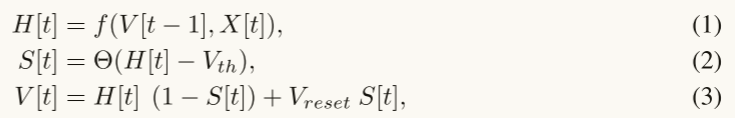
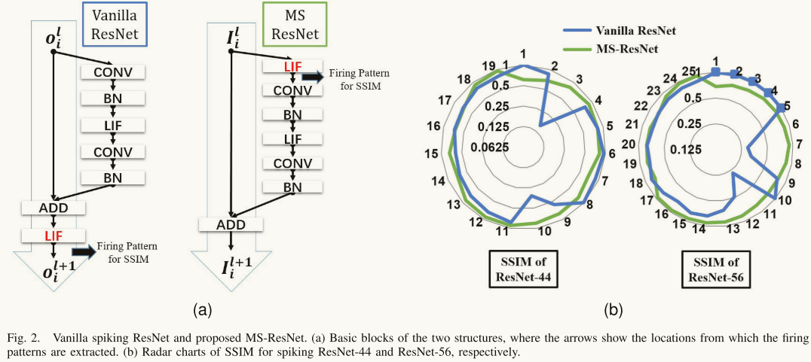
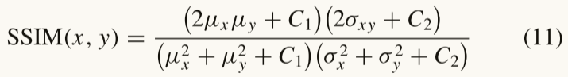
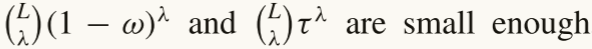

# 关于文献阅读

阅读完文献后，至少要回答以下问题:

1. 这篇文章到底在解决什么问题？
2. 这个问题为什么在这个领域重要？
3. 这些作者是如何解决这个问题的？
4. 这个问题的解决有什么亮点，局限，有什么应用？

看5-10遍，能够回忆起研究目的，研究方法，研究过程，研究成果，研究结论就可以了，至于公式的推导，确实需要花费大量时间的，不重要的可以不去推导。

文献可以分为写的好的和写的差的，写的差的没必要看懂，写的很好的看不懂就很正常了。

不要只看不写，早点动手写论文。

前期是大量的泛读，然后总结。通过标题摘要大概了解这个领域多少人用了什么类型的方法，有全局的思维，基础的了解。之后有选择的精读文献。 精度不是一次就读懂，需要慢慢来。对好的文章多读。

对自己领域的文章进行精读是确保不要让自己和别人想法一样或者自己想法已经被证明是错误的。

## 1. ==Deep Residual Learning in Spiking Neural Networks==

[知乎链接](https://zhuanlan.zhihu.com/p/561909077)
在脉冲神经网络中的深度残差学习 
这篇论文有代码，https://github.com/fangwei123456/Spike-Element-Wise-ResNet
这篇文章提到了第四篇文章，两者都是基于Resnet想到的S-ResNet

* **期刊**：NeurIPS 2021会议论文  

* **作者：** Fang Wei  北大 计算机科学与技术系

* **摘要：** 脉冲神经网络（SNNs）由于离散的二进制激活和复杂的时空动态，对基于梯度的方法提出了优化困难。考虑到ResNet在深度学习中的巨大成功，训练深度脉冲神经网络进行残差学习是很自然的选择。先前的S-ResNet模仿了人工神经网络中的标准残差块，并简单地将ReLU激活层替换为脉冲神经元，其存在退化问题，==几乎无法实现残差学习==。在本文中，我们提出了Spike-Element-Wise(脉冲元素形式的)（SEW）ResNet，以实现深度脉冲神经网络中的残差学习。我们证明了==SEW ResNet可以轻松实现恒等映射，并克服了S-ResNet的梯度消失/爆炸问题==。我们在ImageNet、DVS Gesture和CIFAR10-DVS数据集上评估了SEW ResNet，并展示了SEW ResNet在准确性和时间步数方面优于最先进的直接训练SNNs。此外，SEW ResNet只需添加更多层即可实现更高的性能，为训练深度SNNs提供了一个简单的方法。据我们所知，==这是首次实现直接训练超过100层深度的SNN==

* **介绍：**在ANN to SNN 中有篇文献是将训练完的ResNet转为S-ResNet，然后用于测试，发现效果不错，这篇文章说的是虽然其效果不错，但是如果直接训练S-ResNet，梯度消失或者爆炸的问题依然是很严重的，可见S-ResNet并没有真正实现残差，那这篇文章提出了SEW ResNet，并和S-ResNet一起用于训练网络，发现SEW ResNet直接训练依然有很好的效果，且层数超过了100层，借此说明S-ResNet并不如他们的网络。

* **相关工作：** 

  * SNN的学习方法
    ANN到SNN的转换[20, 4, 46, 49, 12, 11, 6, 54, 33]和使用替代梯度进行反向传播[40]是获得深度SNN的两种主要方法。

    （1）ANN to SNN方法首先训练具有ReLU激活的ANN，然后通过将ReLU替换为脉冲神经元 (==IF神经元==)，并添加诸如权重归一化和阈值平衡之类的缩放操作，将ANN转换为SNN。一些最近的转换方法已经在VGG-16和ResNet上实现了接近零损失的准确性。然而，由于转换是基于速率编码的，转换后的SNN需要更长的时间才能与原始ANN在精度上匹敌，这会增加SNN的延迟并限制其实际应用。

    （2）反向传播方法可以分为两类[26]。

    ​	    第一类方法通过在模拟时间步上展开网络来计算梯度[31, 19, 58, 50, 30, 40]，这类似于BPTT（BP的RNN版本），且使用代理梯度，编码方式不仅可以使用速率编码，也可以使用时间编码。

    ​	第二种方式是计算现有脉冲发放时间相对于膜电位在发放脉冲时间的梯度[5, 39, 24, 65, 63]。
    The second method computes the gradients of the timings of existing spikes with respect to the membrane potential at the spike timing [5, 39, 24, 65, 63].  ==这里应该说的是stdp，计算的是时间差==

  * Spiking Residual Structure——脉冲残差架构

    胡等人[17]（==这就是阅读的第四篇文章==）是第一个在ANN to SNN中引入残差结构，并在SNN中应用缩放的快捷路径以匹配原始ANN的激活的研究。其余学者也有进行后续研究的。也有改进归一化方法的。

* **本文方法：** 

  * **脉冲神经元模型**（介绍现有的脉冲神经元模型，及数学公式。 论文中使用代理梯度方法，也就是，将σ的梯度用于反向传播，σ是与不可微的阶跃函数形状类似的可微函数） 

    

    公式1、2和3介绍了现有脉冲神经元的统一模型，公式1中的f（）有多种形式，公式4和5是IF神经元和LIF神经元模型的函数形式，是对公式1的补充说明。
    公式2是一个Heaviside阶跃函数，x大于等于0，y值为1，x小于0，y值为0。
    公式3的意思就是 有脉冲的话，就将电压恢复至重置电压，如果没有脉冲，就2等于公式1计算出的新的电压值。

    

  * **S-ResNet的缺点**

    **有相关文献证明：** ResNet的一个关键概念是恒等映射（identity mapping）。He等人[14]指出，如果添加的层实现了恒等映射，则一个更深的模型的训练误差不会大于其较浅模型的训练误差。

    符号含义：F是残差函数，X是输入，S也是输入（只不过是脉冲形式），Y和O是输出，右上角标代表第$$l$$​层(layer)，[t]代表时刻t，SN代表脉冲神经元(spiking neuron)。

    

    * ==第一个缺点：S-ResNet 不适用于所有神经元模型去实现恒等映射。==

      

      ​	公式6可以实现恒等映射，因为当残差为0，公式变为 $$Y^l = ReLU(X^l)$$，而$$X^l$$ 是上一层经过ReLU函数之后的值，所以此时公式的结果就变为  $$Y^l = X^l$$
      ​	公式7难以实现恒等映射，因为输入的脉冲序列$$S^l[t]$$ 里面的值只有 0 和 1 ， 当残差为0，公式7变为$$O^l[t] = SN(S^l[t])$$ , 而$$SN(S^l[t]) == S^l[t]$$ 这一公式很难成立。 当使用的神经元为IF神经元时，我们需要保证$$V[t-1] = 0$$, 且 $$0< V_{th} <= 1$$,  这样公式4变为  $$H[t] = X[t]$$, 而X[t] 本身为 [1, 0 , 0 ,1 ,0 ]这样的序列，这样的序列统一减去一个小于等于1的整数后，序列中的1变为大于等于0，而0变为负数，经过公式2之后，仍然为 X[t]，这样也就做到了输入等于输出。其余更复杂的神经元就更难实现了。

    * ==第二个缺点：S-ResNet存在梯度爆炸/消失的问题==

      

      ​	==本人观点：== 这也是很好理解的，因为每次导数都一致。 依然要注意这里的前提是假设恒等映射可以发生，如果很难发生，那么其都无法构建很深的网络。   表明即使给了很多先决条件，也还是很难做到恒等映射。

    * 基于上述分析，作者认为先前的 Spike-ResNet 忽略了脉冲神经元引起的高度非线性，并且很难实现残差学习。

    * 但是因为从ANN转SNN的关键步骤是使用发射率去匹配激活函数，相当于是有参考的来学习，而不是靠自己学习。

  * **Spike-Element-Wise ResNet   脉冲元素形式的残差网络**

    

    ​	式（9）描述了图1中的右图，也就是本文新提出的方法。 实际就是，把残差F用SN激活一下，转换成脉冲A，然后脉冲A与输入脉冲S做 g 运算。公式（7）让非脉冲和脉冲做加法运算，就比较别扭；这里统一了形式，让脉冲和脉冲运算，就比较自然，g是element-wise function，这也是SEW ResNet的来源，即**s**piking **e**lement-**w**ise。论文中为g运算准备了3种形式。

    

    其中，第二种形式要求  残差 $$A^l[t]$$  = 1，这是比较难实现的，而第三种IAND相当于对第二种形式的改进，和第一种一样，实现恒等映射时，残差 $$A^l[t]$$  = 0， 只需要保证在每一个块的最后设置权重和偏差为0即可实现。

    * **关于下采样块的设计**、

      

      ​	ResNet和 Spike-ResNet 两个网络在设计下采样块时，都是在残差连接之后接激活函数，而SEW网络则是在残差连接之前给残差和下采样的结果均接入激活函数==（因为多了下采样，是否可以不用这么麻烦，之前是因为形式不统一，现在形式统一了。）==

    * **解决梯度消失和梯度爆炸的问题**

      ==RBA块的形式如公式10所示：==

      

      $$X^l$$是上一层ReLu的产物，这里把残差F也ReLU一下，再和X做加法运算，这就和本文提到的SEW块结构非常相似了。
      RBA块被何凯明老师批判，因为两个加数都是经过ReLU的，自然都是大于等于0的，二者相加会导致Y≥X，随着层数加深，这种放大效果会越来越大。在实际的实验中也证明了RBA块效果不好。

      ==SEW块为何不会出现梯度消失和爆炸的问题?==

      

      假设恒等映射已经实现，我们可以得到公式11，与之前讨论公式8的形式一样 。

* **结果：** 在ImageNet数据集上，本文的SEW-ResNet网络具有很好的泛化性，且随着网络层数增加，效果不断变好，反观S-ResNet却随着网络层数的加深，效果越来越差。

  

* **讨论与结论：** 

  * 作为激活函数，SN比ReLU的非线性强得多，可能会有其他应用或效果。

  * 脉冲的二进制特点再次显现：RBA会有无穷大问题，但与RBA结构类似的SEW就不会，因为SNN传递的输入输出是二进制的。今后如果涉及什么无穷大、无穷小、上下界，都可以从二进制脉冲角度考虑一下。

  * 论文的切入点，应该是二元运算的成员，应该是相同种类的（都是脉冲）。在原ResNet中，都是浮点数。

    

## ==2. Advancing Spiking Neural Networks Toward Deep Residual Learning==

简称：MS-ResNet
中文翻译： 推进脉冲神经网络向深度残差学习发展
期刊： IEEE Transactions on Neural Networks and Learning Systems 

2021年就发在了arxiv， 22年六月份投稿在了本期刊，2024年正式发表在了
而sew resnet 也是2021年就发在了arxiv， 且在2021年中了会议neurIPS

第一作者是清华大学学生，通讯作者是李国齐，中国科学院自动化所研究员、国家杰出青年基金获得者
[李国齐简介](https://mp.weixin.qq.com/s?__biz=MzI4NjcwODgyOA==&mid=2247487216&idx=1&sn=7938ef06a1067cda376fba558272a821&chksm=ebd98bc3dcae02d555339347eb89a5e2ae60b06e80d7e81cc82e3a41998f49ddbb5d33e531e1&scene=27)    他和田永鸿教授合作开发了惊蛰框架
**下载的文献版本中没有关于代码的介绍。**

* **期刊：**IEEE Transactions on Neural Networks and Learning Systems   1区top

* **摘要：**  

  1. **背景：** 尽管神经形态计算取得了迅速进展，脉冲神经网络（SNNs）的容量不足和表示能力不足严重限制了它们在实际中的应用范围。残差学习和快捷方式被证明是训练深度神经网络的重要方法，但之前的研究很少评估这些方法对==基于脉冲的通信和时空动态特性的适用性==。 这种忽视导致了先前残差SNN中信息流受阻和随之而来的性能退化问题。
     - **Spike-based Communication** 是神经系统中信息传递的核心方式，通过脉冲信号来进行高效的交流和信息处理。
     - **Spatiotemporal Dynamics** 关注系统在空间和时间上的变化，这有助于理解神经系统如何动态地处理信息和适应环境。
  2. **本文工作：**为了解决这一问题，我们提出了一种新颖的 SNN-oriented 的残差架构，称为MS-ResNet，该架构建立了基于膜的短连接路径，并进一步证明通过引入块动态等距理论（block dynamical isometry theory），可以在MS-ResNet中实现梯度范数等式，这确保了网络在深度不敏感的情况下可以表现良好。
     - **Dynamical Isometry** 是一个用来描述矩阵在不同维度下如何保持某种几何性质的理论。在高维数据分析中，特别是在稀疏表示和低秩矩阵分解中，这种理论用于确保算法在高维数据空间中仍能有效地近似和恢复原始结构。
  3. **工作意义：** 因此，我们能够显著扩展直接训练的SNN的深度，例如，在CIFAR-10上达到482层，在ImageNet上达到104层，而没有观察到任何轻微的性能退化问题。
  4. **实验结果：** 为了验证MS-ResNet的有效性，我们在基于静态帧数据集和神经形态数据集上进行了实验。MS-ResNet104在ImageNet上达到了76.02%的优越准确率，这在直接训练的SNN领域中是我们所知的最高结果。同时也观察到很高的能效，每个神经元平均只需要一个脉冲即可对输入样本进行分类。

* **介绍：**

  ​	具有丰富神经元动态和多样编码方案独特特性的脉冲神经网络（SNNs），代表了一种典型的仿脑计算模型。与传统的人工神经网络（ANNs）不同，SNNs能够通过时空动态编码信息，并利用异步二进制脉冲活动进行事件驱动通信。近年来神经形态计算的进展显示出它们在能效方面的巨大潜力。**理论上，SNNs至少与ANNs一样具备计算能力，并且通用逼近定理也适用 SNNs。**因此，不足为奇的是，SNNs已在各种应用任务中得到报道，如图像分类、目标检测和跟踪、语音识别、光流估计等。然而，实际中，缺乏强大的SNN模型严重限制了它们在复杂任务中的应用能力。

  ​	在本文中，我们首先说明了训练深度SNN时使用普通ResNet时的退化问题。我们观察到脉冲PlainNet和普通ResNet随深度增加的准确率改善趋势分别停在14层和令人惊讶的仅20层。为了解决这一退化问题并充分释放深度SNN的潜力，我们提出了面向SNN的残差架构MS-ResNet，其中去除了块间的LIF(·)，构建了一个干净的快捷连接，对整个网络施加了恒等映射。然后，我们**从前向传播和梯度范数两个角度分析了新结构的优越性**。观察到MS-ResNet可以避免推理中无效的残差表示，这指的是一个块的残差路径对网络的整体能力没有贡献。此外，我们证明了MS-ResNet可以通过块动态等距框架[32]实现梯度范数的平等，而普通的脉冲ResNet则不能。因此，我们的模型表现出了很好的可扩展性，并且可以至少扩展到在CIFAR-10上的482层和在ImageNet上的104层，而不观察到退化问题。

* **Preliminaries and  Motivation  准备工作和动机：** 

  1. 这项工作使用的是文献7中提到的迭代LIF模型。

     

     ​	[7] Wu, Yujie, et al. "Direct training for spiking neural networks: Faster, larger, better." *Proceedings of the AAAI conference on artificial intelligence*. Vol. 33. No. 01. 2019.
     ​	其中，$u^t_i$ 是第i个神经元在时间步为t时的膜电位，$τ_{mem}$是泄漏的衰减因子，突触输入是来自前一层输出脉冲的加权和。函数g(⋅) 描述了被阈值$V_{th}$控制的发放活动，一旦脉冲发放，$u^t_i$ 将被重置为$V_{reset}$，即$o^t_i = 1$。神经元的超参数，包括时间步数量和电位的详细信息见**附录B**。替代梯度的定义如 [21] 所示：
     ​	[21] Wu, Yujie, et al. "Spatio-temporal backpropagation for training high-performance spiking neural networks." *Frontiers in neuroscience* 12 (2018): 331.

     

     ​	引入系数 $a$​ 是为了确保该函数的积分为 1。通过这种方式，可以在主流深度学习库的自动求导框架中进行反向传播通过时间（BPTT）。

     ==附录B：==

     

     ​	对于计算机视觉任务，{Conv-BN-Nonlinearity} 的堆叠是一种符合 VGG 网络基本理念的通用架构 [41]，在图 1（左）中称为 PlainNet。在模型的末尾，一个全连接层计算整个仿真过程中来自最后特征图每个神经元的脉冲数量，并作为分类器做出最终决策。我们在脉冲模型中采用了最近的 TDBN 技术 [29] 作为批量归一化（BatchNorm），其公式如下：
     ​	[29]H. Zheng, Y. Wu, L. Deng, Y. Hu, and G. Li, “Going deeper with directly-trained larger spiking neural networks,” in Proc. AAAI Conf. Artif. Intell., May 2021, vol. 35, no. 12, pp. 11062–11070. [Online]. Available: https://ojs.aaai.org/index.php/AAAI/article/view/17320

     

     

     其中$$μ_{c_i}和σ^2_{c_i}$$​​ 分别是通道维度上的平均值和方差。

     

     残差路径的表示： 如图1

     

  2. The Degradation Problem in SNNs  脉冲神经网络的退化问题

     ​	训练更高质量模型的最直接方法是增加其规模，特别是在有大量有标签训练数据可用的情况下 [43]。然而，直接加深网络在脉冲神经网络（SNN）领域似乎从未是一个值得信赖的实现更高准确度的方法。

     ​	**我们希望探索现有的 面向SNN的   BN技术和有助于增加脉冲模型可扩展性的短连接**，因此在 CIFAR-10 [44] 上进行了仅以深度为变量的实验。需要指出的是，我们的重点是网络对其深度的响应以及潜在的退化问题，而不是获得最先进的结果，因此我们使用了深但相对狭窄的架构，总结见表 I。模型以 3 × 3 的卷积开始，并以一个全连接层结束。其余主体可以根据特征图的大小划分为三个阶段，每个阶段有 2n 层。通过将 n 设置为不同的数字，获得了具有可变深度但相似架构的模型。==1+2n表示的是第一个卷积层+第一个stage阶段，随后的2n,2n分别表示第二个stage和第三个stage，最后是一个全连接层。==

     ​	表 II 显示了深度分析的结果。PlainNet 的准确度在深度达到 14 层时开始下降，令人惊讶的是，采用捷径连接只是将峰值移至 20 层。尽管峰值后略有下降，但脉冲 ResNet 在达到 56 层时仍然出现严重的准确度下降。
     ​	**尽管采用了 TDBN 和捷径连接，退化问题依然存在，这表明直接将 ResNet 移植到 SNN 并未有效奏效，从而使得构建足够深且强大的 SNN 模型成为一项不平凡的任务。有趣的是，我们注意到，当去除残差块之间的脉冲激活函数 LIF(·) 并将其在残差路径中保持为非线性时，56 层的深度内的退化问题可以得到缓解。基于这一观察，我们主要将退化的关键因素认定为块间的 LIF(·)，并将在第 III 节中提供与我们提出的架构相关的进一步见解。**  	
     ​	==从表2中可以看出的是本文工作随着模型深度的提高，精确度没有降低。==

     

     

  3. Spiking residual blocks 脉冲残差块

     这一节作者开始解释为什么Vanilla ResnNet中的LIF神经元会出现退化问题并介绍他们所提模型的优越性。

     首先展示一下作者提出的残差块（==感觉属实有点牵强==）

     

     短连接中的信息流动在概念上更接近于神经元膜的突触输入总和（不是脉冲与脉冲的相加，而是float值的相加，所以才说和脉冲活动不太一样），而不是原始结构中的脉冲活动，因此将新结构命名为 Membrane-Shortcut ResNet（MS-ResNet），以突出快捷路径的变化。

     * **Residual Representation and Workload Balance at Inference  推理时的残差表示和工作负载平衡**

       ​	在普通脉冲 ResNet 中，恒等映射可以通过块轻松实现，即捷径中的一个脉冲始终能诱发下一层的放电，并且当我们将阈值 $$V_{th} < 1,例如0.5$$ 时，未激活的神经元不会激活其后续神经元，而残差部分接近于零。注意到下面的公式是基于层来说的，并没有扩展时间这个维度，
       ​	==按理来说，实现恒等映射，需要设置残差为0，阈值小于等于1,  保证前一时间步电压为0，但是这里作者并没有说明。且在sew_resnet网络中，认为这些条件太过于苛刻，导致vanilla spiking ResNet难以实现恒等映射。所以两者的说法不一致，我更认同sew_resnet的说法。==

       

       作者基于这一点，说了一句：在脉冲神经网络中实现恒等映射并不能真正解决退化问题（==不认同==）

       ​	接下来，我们将重点关注放电模式在经过残差块后的变化，以便研究跨层累积的扰动（perturbations）。我们倾向于检查一个神经元的放电状态何时会与对其施加恒等映射的神经元不同，即

       

       成功改变放电状态的概率可以分解为两个条件，可以写作：

       

       ​	在这里，为了简化起见，省略了衰减膜电位的部分。由于残差路径末端的神经元对输入具有较大的感受野，我们忽略了单个放电状态对输出分布的影响，即条件概率 与 大致相等。
       ​	假设残差路径的输出是一个具有概率密度函数 的连续随机变量，我们有：

       

       以zheng等人 [29] 在 TDBN 中采用的参数为例，残差输出符合正态分布 ，其中 $σ_x = V_{th} = 0.5$，我们有 P(si ∈ S) ≈ 16% 的神经元能够在下一层引起成功的状态变化。对于剩余的84%的神经元，残差路径所传递的信息在此时无法影响放电状态，只会贡献出随着时间泄漏的累积膜电位。**此外，由于重置机制，残差路径所带来的增量会被那些放电神经元遗忘，使得该块的残差表示在空间和时间维度上都变得完全无效。**特别是，当只考虑来自于在层 l 和层 l + 1 之间没有发生状态变化的神经元的输入时，我们有：

       

       这表明第 l+1 层的残差路径在时间步 t 上并未对网络的整体能力做出贡献，我们将其视为无效的残差表示。一个直接的解决方案是增加残差输出的方差 σ²x，这会导致神经元状态变化的概率更高，从而减少无效的残差路径。**然而，我们并不打算在这里讨论最优方差，因为这一解决方案无法完全防止无效的残差表示，过分强调残差路径等同于降低恒等映射的重要性，这违反了 ResNet 的扰动学习规则。**

       **实际上，跨块 LIF(·) 的阈值门控二进制特性使得一个块的输出在某种程度上只是两个分支之间的选择，而不是我们预期的由残差路径辅助的主要快捷方式。**而对于 MS-ResNet，去除跨块 LIF(·) 为信息流提供了一条清晰的通道，残差路径的汇聚将不会受到门控函数的判断，因此无论神经元的放电状态是否实际变化，都不会出现无效的残差表示。小的残差表示总是可以累积为：

       

       其中 $I^{t,l}$ 表示第 $l$​ 层的突触输入向量。为了更直观地验证在不同层的残差块中，放电模式如何变化，我们采用结构相似性指数度量（SSIM）来量化相似度，其公式可表示为：

       
     
       其中，µx、σ²x、µy 和 σ²y 分别是图像 x 和 y 的均值和方差，σxy 是 x 和 y 的协方差，C1 和 C2 是两个稳定常数。我们计算每两个相邻块中一对放电图像的 SSIM 值。图像的像素值是特征图中神经元的放电率。图 2(a) 中的箭头指示提取特征图放电模式的位置。SSIM 的值范围从 -1 到 +1，只有当两幅图像相同时才等于 +1。如果放电模式在层之间均匀变化，我们希望它在 SSIM 的雷达图中显示为一个圆形。我们在图 2(b) 中比较了普通脉冲 ResNet 和 MS-ResNet 的雷达图，结果发现我们的 MS-ResNet 显示出比普通脉冲 ResNet 更加圆形的曲线。尤其是在 spiking ResNet-56 中，有五层的 SSIM 值为 +1，这表明当信息通过残差块流动时，放电模式并未发生变化，而这些层未能帮助特征提取。因此，后续层需要补偿前面层的无效性，这在第六层表现为随之而来的剧烈信息变化。网络中不平衡的信息工作负载，尤其是在训练深层网络时，确实反映了脉冲 ResNet 的不合理性，而在 MS-ResNet 中得到了有效缓解。
     
     * Gradient Evolvement at Backpropagation   反向传播中的梯度演变
     
       ==动态等距性（Dynamical Isometry）是一个在数学和物理学中使用的概念，特别是在研究动力系统、流形和某些几何结构时。简单来说，动态等距性指的是在某种变换或演化过程中，系统的某些性质（例如距离或形状）保持不变。在数学上，特别是在理论深度学习和神经网络的研究中，动态等距性经常用来描述一种现象：在网络的训练过程中，信息的传播不改变输入数据的几何性质，比如距离或方向。这种性质有助于改善训练效果，并确保在深度网络中信息不会在传递过程中被过度扭曲。==
     
       动态同态性，即输入-输出雅可比矩阵（Jacobian matrix）的奇异值均衡，近年来已被发展为对神经网络行为良好的理论解释。在本小节中，我们使用动态同态性框架分析，MS-ResNet可以实现梯度范数的均等，而普通脉冲ResNet则不能。
     
       神经网络的一般形式可以表示为（多个层的堆叠）：
     
       
     
       $$θ_i$$是第$$i$$层的参数矩阵，定义 $$∂f_j / ∂f_{j-1} = J_j$$,
     
        $ϕ(J) 为规范化迹 tr(J) 的期望值$， $φ(J) = ϕ(J^2)  − ϕ(J)^2$。
     
       公式12表示的一般神经网络，将第j个块的雅可比矩阵表示为$$J_j$$，
     
       **定义1(Definition 1)（块动态同构 ）**：考虑一个可以表示为 公式(12) 的神经网络，第j个block的雅可比矩阵记为 $J_j$。如果
        ∀ j, $ϕ(J_j J_j^T) ≈ 1 且 φ(J_j J_j^T) ≈ 0$，则该网络实现了块动态同构。

       **引理 1（Lemma 1）**：[37, 命题 5.8] 假设在神经网络中的每个 L 个顺序块中，我们有 $ϕ(J_i J_i^T) = ω + τϕ(\tilde{J_i} \tilde{J_i}^T)，$其中 $J_i$ 是其雅可比矩阵。给定 $λ ∈ N^+ < L$，如果 ，则当两个网络都有$∀ i, ϕ(J_i J_i^T) ≈ 1$，L层的网络将和 λ 层网络一样稳定。

       **根据定义 1 和引理 1，我们可以判断一个网络是否能够在残差 SNN 的具体情况下实现梯度范数相等。**

       **命题 1：**假设两个神经网络均由 L 个顺序块组成，普通脉冲 ResNet 并未实现块动态同构，而 MS-ResNet 可以像一个满足 $ϕ(J_i J_i^T) ≈ 1 且 λ ∈ N^+ < L$  的 λ 层网络一样稳定。

       **证明： ** 根据附录 A 中的引理 2，整个网络的雅可比矩阵可以分解为多个 block 的雅可比矩阵的乘积。我们期望每个块都应满足 $∀ i, ϕ(J_i J_i^T) ≈ 1$，以便提供稳定的梯度演变。神经网络的共同成分及其谱矩已在 [37] 中总结，因此我们在此主要关注 LIF(·) 的分析。定义在公式 (2) 中的门函数及其在公式 (3) 中的替代梯度都是逐元素操作，因此 g(·) 的雅可比矩阵 $J_g$ 是一个对角矩阵，其元素为 0 或 (1/a)。其概率密度函数满足：

       

       其中 p 表示 $|x − V_{th}| ≤ (a/2)$ 为真的概率。因此，我们有：

       
     
       其中 a 是一个固定的全局超参数，而概率 p 会随着权重更新和输入数据的变化而动态变化，因此在不同层之间匹配这两个量变得困难。在这种情况下，门函数使得 LIF(·) 不符合定义 1 中的串行块的要求。
     
       我们将块中残差路径的雅可比矩阵记作 $\tilde{J_i}$。当不包括块间的 LIF(·) 时，根据附录 B 中的引理 3，我们有 $ϕ(Ji Ji^T) = 1 + γ²ϕ(\tilde{J_i} \tilde{J_i}^T)$，其中 γ 来自于残差路径底部归一化中的线性变换 γx + β。MS-ResNet 可以被视为引理 1 的一个极端例子，当 (1 − ω) → 0 时。因此，对于的值接近零，而 只要 γ 在初始化时设为相对较小的值，就可以足够小。这样，非最优块的误差将只在 λ 层内产生影响，而 MS-ResNet 将像一个更浅的 λ 层网络一样稳定。而
     
       对于普通脉冲 ResNet 的残差块，我们有  $ϕ(Ji Ji^T) = (1 + γ²ϕ(\tilde{J_i} \tilde{J_i}^T)) * ϕ(Jg Jg^T) = ((p/a²) + γ²(p/a²)ϕ(\tilde{J_i} \tilde{J_i}^T))$，这表明普通脉冲 ResNet 的梯度流动难以保持稳定，并可能表现为退化问题。总之，我们发现 LIF(·) 作为块之间的串行函数不适合实现块动态同构，这可能表现为退化问题。然而，MS-ResNet 可以避免这个缺陷，并通过构成一个实际比看起来更浅的网络来获得较大的稳定性，以保持梯度范数。
     
     * Spike-based Convolution and an Extra LIF(·) at the Top  基于脉冲的卷积 以及 顶部的LIF 神经元
     
       ​	**需要指出的是，缺少块间 LIF(·) 的普通 ResNet 对于脉冲神经网络（SNNs）来说也是不理想的。**
     
       ​	神经形态计算的主要能源效率来源之一是基于脉冲的卷积（CONV），这意味着卷积层将接收并处理二进制脉冲输入，并且有可能将人工神经网络（ANNs）中的乘加（MAC）操作替换为脉冲驱动的突触累积（AC）操作。可以对其进行特定的优化，例如查找表 [45]，从而进一步提升其在神经形态设备上的效率。然而，一旦移除块间 LIF(·)，下一个块顶部的卷积层将接收到连续输入，而不是二进制脉冲，这会导致难以从基于脉冲的操作和丰富的输入输出稀疏性中受益。此外，移除块间 LIF(·) 会使得残差路径中的卷积层与其后续块顶部的卷积层相连，即在两个相邻块之间形成 {CONV-BN-CONV-BN-LIF} 的结构。这两个 3×3 的卷积层在实际效果上等同于一个 5×5 的卷积层，这使我们推测网络实际上将是一个更浅的结构，从而削弱其特征提取能力。事实证明，**移除 LIF(·) 的准确率将在退化问题发生之前低于原始模型（表 II）**。
     
       ==这里作者是不是说错了，移除了 LIF(·) 以后，模型的退化问题并没有发生，且相比于原始的spike resnet，模型的准确率更高。==
     
       因此，我们在每个残差路径的顶部放置了一个额外的 LIF(·)，以便保持基于脉冲的卷积，并充分利用卷积层。**还需要注意的是，在整个卷积部分的末尾还放置了一个额外的 LIF(·)，以确保即使部分信息仅通过快捷连接流动，后续的全连接分类器仍会接收到脉冲信号。**
     
       
     
       其实就是对其提出的结构解释。 
     
     * Depth Analysis on CIFAR-10  在CIFAR-10数据集上对深度进行分析
     
       ​	我们还对CIFAR-10使用MS-ResNet进行了深度分析实验。表II显示的结果表明，我们的MS-ResNet可以扩展到更大规模，而不会像普通脉冲ResNet那样面临退化问题，同时与W/O LIF(·)相比，能够保持浅层网络的更高准确性。此外，为了避免像普通脉冲ResNet一样仅能将准确性峰值推移至一定程度的可能性，我们将n设置为36和80，得到了在CIFAR-10上非常深的MS-ResNet110和MSResNet482，它们的测试准确率分别为91.7%和91.9%。尽管由于有限的正则化方法和由此产生的过拟合问题，测试准确率的提升并不显著，但这确实证明了我们模型的可扩展性和避免退化的能力。

* **试验：** 

  * A. Benchmark Results

     

     1. 对 CIFAR-10 的深度分析：我们在 CIFAR-10 上使用 MS-ResNet 进行深度分析实验。结果如表 II 所示，表明我们的 MS-ResNet 可以扩展到更大的规模，而不会面临普通脉冲 ResNet 的退化问题，同时与无 LIF(·) 的浅层网络相比，保持了更好的准确性。此外，为了避免 MS-ResNet 仅能够将其准确率峰值移动到某个程度（如普通脉冲 ResNet），我们将 n 设置为 36 和 80，分别获得非常深的 MS-ResNet110 和 MS-ResNet482，其测试准确率分别为 91.7% 和 91.9%。尽管由于有限的正则化方法和由此产生的过拟合问题，测试准确性的提升不是很显著，但这无疑证明了我们模型的可扩展性和避免退化的能力。

        

     2. ImageNet：我们在 ImageNet 2012 数据集 [48] 上评估我们的模型。模型在 1.28M 的训练图像上训练，并在 50K 的验证图像上测试。训练配方最初简单地遵循 He 等人 [32] 的 MS-ResNet18 和 MS-ResNet34。然而，我们发现 MS-ResNet104 会遭受严重的过拟合。尽管在验证集上的准确性提高不大，但其训练准确性却提升了显著的幅度。我们假设这是因为 MS-ResNet104 具有更高的模型容量。为了充分释放深层脉冲模型 MS-ResNet104 的潜力，采用了更强的数据增强和正则化的高级训练配方，并提出了一种由 T = 1 的预训练阶段和正式训练阶段组成的两阶段训练过程，以节省训练时间（更多训练细节见附录 B）。表 III 中观察到，随着网络加深，准确性呈现令人满意的上升趋势。与其他先进工作相比，MS-ResNet34 的准确率为 69.42%，超越了所有直接训练的同深度 SNN，而 MS-ResNet104 的准确率为 74.21%，即使在推理所需的时间步长远少于转换的 SNN，也与之相当。据我们所知，这是首次在 ImageNet 上报告直接训练 SNN 的如此高性能。我们还发现，仅将推理图像从 224 × 224 放大到 288 × 288 就可以提高准确率，达到更具竞争力的 76.02%。这些结果证明了我们模型的可扩展性，并清楚地表明了在大规模数据集上加深 SNN 模型的潜力。

        

     3. CIFAR10-DVS：CIFAR10-DVS 是一个用于物体分类的事件流数据集 [53]；来自 CIFAR-10 的 10,000 帧图像由动态视觉传感器 (DVS) 记录并转换为事件流。我们使用该数据集测试我们的模型处理时空事件数据的能力，并采用与 Fang 等人 [52] 相同的数据预处理。我们的 MS-ResNet20 在 CIFAR10-DVS 上创下了新纪录（表 IV）。该模型主要遵循表 I 中的范例，只是在第一个卷积阶段添加了额外的下采样，因为输入大小较大。尽管模型很深，但我们的模型实际上参数数量较少，仅约为 Yao 等人 [51] 和 Fang 等人 [52] 的六分之一，这表明深层模型在保持竞争性表达能力的同时，仍然可以有效利用参数。

  * B. Experimental Validation of Block Dynamical Isometry

     

     ​	为支持我们对梯度的理论分析，我们进行额外的实验，以检查两个 32 层模型中残差块的动态等距性和梯度范数。首先，我们计算 MS-ResNet 和普通脉冲 ResNet 中残差块的初始输入-输出雅可比矩阵，卷积层的权重初始化为 [55]，并检查 $ϕ(J J^T)和 φ(J J^T) $ 是否满足**定义 1** 中的块动态等距性。网络根据特征图的大小分为三个阶段。如表 V 所示，在 MS-ResNet 中，$ϕ(J J^T)≈1和 φ(J J^T)≈0 $​  的情况很好地成立，这意味着实现了块动态等距性，而普通脉冲 ResNet 则远未达到这些指标。

     

     ​	其次，我们提供了一个梯度范数结果，直接显示训练后两个网络中每个残差块梯度的分布。数据是在 100 个随机的 CIFAR-10 测试样本上收集的。图 3 显示了 MS-ResNet32 和普通脉冲 ResNet-32 中每个残差块输入的梯度范数 $||Δθ||_2$。结果表明，MS-ResNet 的梯度范数动态表现得更为良好，这可以有效防止网络变深时出现梯度消失或爆炸。这些实验结果验证了我们对梯度理论分析的有效性，并支持 MS-ResNet 在梯度动态方面优于普通脉冲 ResNet 的优势。

  * C. Firing Patterns of MS-ResNet

     ​	在 MS-ResNet 中观察到高稀疏性。脉冲发放率定义为每个神经元在每个时间步的放电概率，并通过 r = (Spike/Neuron·T) 在一批随机样本下进行估计，其中 Spike 表示在 T 个时间步内的脉冲数量，Neuron 表示网络中的神经元数量。MS-ResNet34 和 MS-ResNet104 的发火率分别为 0.225 和 0.192。鉴于需要五到六个时间步，MS-ResNet 维持了这样的稀疏性，在处理单个 ImageNet 样本的整个过程中，平均每个神经元仅发出约一个脉冲。

     

     ​	图 4(a) 显示了逐层发放率。ImageNet 上的模型可以通过内部的下采样层分为四个阶段。在前三个阶段中，平均发放率稳步下降，而在最后一个阶段可能会反弹。有趣的是，可以注意到在交替层中存在某种模式，即每个残差路径中第二个 LIF(·) 的神经元往往比第一个 LIF(·) 的神经元活跃度更低。特别是在 MS-ResNet104 （a图中的第一个）的第三阶段，第二个 LIF(·) 的发火率低至 5.2%，而第一个 LIF(·) 的发火率几乎高出五倍，这表明我们的残差块在短连接中具有相对活跃的表示（如果我们将突触输入的流转换为脉冲），而残差分支中的脉冲活动保持平静且稀疏。这与残差路径将对恒等映射提供扰动的观点是一致的。

     ​	**图 4(b) 显示了脉冲的更详细的光栅图。它表明神经元的发放可以是规律性的，低发放率主要受到大量静默神经元的影响，这与事件驱动的类脑芯片相得益彰。**   ==不会看这个光栅图，所以也得不出作者的结论。==

  * Energy Efficiency Estimation

     ​	正如前面所提到的，我们模型中有意保持的一个特征是基于脉冲的卷积（CONV）。为了进一步展示能量效率，我们基于不同操作的运算数量和45纳米技术的数据来估计能量成本 [54]。我们的主要关注点是残差路径中的两个卷积层，因为它们占据了网络浮点操作（FLOPs）的主要部分。这项估计不包括所有处理实值图像的残差块之前的第一个卷积层以及下采样快捷路径，因为这两个部分不满足基于脉冲的卷积要求。尽管如此，这些部分的固定成本在 ResNet-34 中仅占 FLOPs 的 4%，在 ResNet-104 中占 1%。此外，需要注意的是，这些卷积层的 FLOPs 并不构成我们模型的精度增益，因为我们仅添加了带有简洁快捷路径的基本块来加深模型。

     

     ​	随着网络的加深，单张图像的能量消耗比率 $(E(SNN)/E(ANN))将接近 T∗firing\_rate∗ (E(AC)/E(MAC))$​ 的值。由于发火的稀疏性和短暂的模拟周期，MS-ResNet 可以实现大约相同数量的突触操作（SyOPs），而不是 FLOPs（见表 VI），这对应于每个神经元平均仅发出一个脉冲。对于单个 ImageNet 图像，SNN 的能量成本仅为同结构 ANN 的三分之一到五分之一。在处理时空流数据时，ANNs 被期望具备序列处理的能力，因此引入了递归连接来记忆之前的状态并表现出时间动态 [56]。与静态图像的处理不同，递归 ANN 和 SNN 都需花费多个时间步来执行基于帧的信息整合，以完成序列学习任务。值得注意的是，时间步数 T 不会对能量消耗比率 (E(SNN)/E(ANN)) 产生影响，因此能量效率将更加显著。对于 CIFAR10-DVS，MS-ResNet20 的平均发火率为 22.19%。由于二进制和稀疏的脉冲活动，SNN 在处理每帧 CIFAR10-DVS 时的能量消耗仅为 ANN 的二十四分之一。

  * The Loss Landscape of MS-ResNet

     

     

     

* **讨论与总结：**

7. ## ==测试==

   

   * **期刊：**
   * **作者及单位：**
   * **摘要：**
   * **介绍：**
   * **方法：**
   * **试验：**
   * **讨论与总结：**