# ==一、 Bag of Tricks for lmage Classification with Convolutional Neural Networks==

LIMU  2018年   [==参考链接==](https://blog.csdn.net/qq_41776136/article/details/137920956)

* **摘要：**  使用之前深度学习中用的一些优化策略，并进行消融实验，最终去评估使用哪一个或者哪些策略能够提升模型的效果。

* **一、Introduction：** 改进包括**损失函数的变化、数据预处理和优化方法**。在本文中，我们将检验一些训练过程和模型架构的改进，这些改进提高了模型的精度，但几乎没有改变计算的复杂度。

* **二、Training Procedures：**  训练过程    表 2

  需要首先训练基模型并和原始文献中的训练结果作对比。

  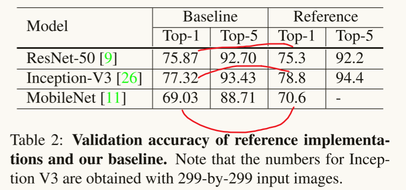

  1. Baseline Training Procedure  基线训练过程

     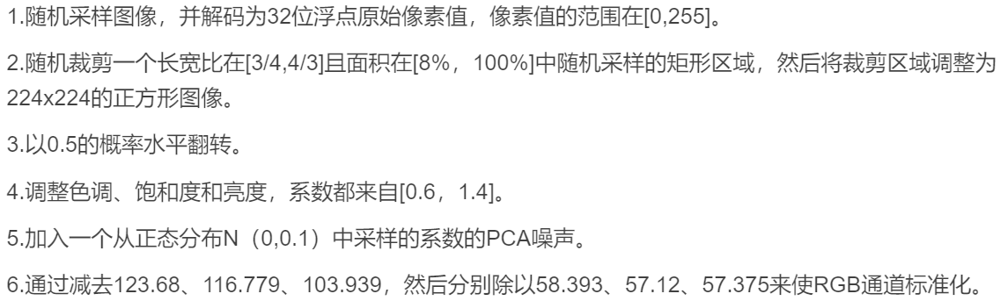

     对图像训练数据集的预处理。

     在验证过程中，我们将每幅图像的短边调整为256像素，同时保持其长宽比。接下来，我们在中心裁剪出224x224的区域，并和训练过程一样将RGB通道规范化。我们在验证期间不执行任何随机增强。

     ==网络初始化算法：==  **Xavier算法**。

     ==两种初始化算法的比较：==

     * Kaiming 初始化（也称为 He 初始化）适用于使用ReLU激活函数且深度较深的网络，目的是保证不发生梯度消失或者梯度爆炸的问题。 保证权重为正值且为输入方差的2倍，有效缓解relu激活函数只保留正值的带来的信息损失问题。

     * 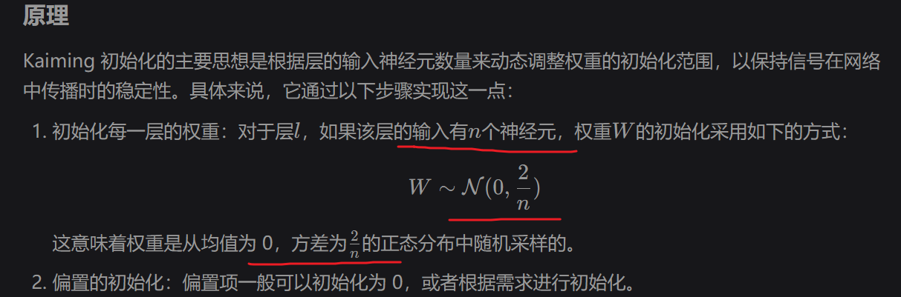

       ```python
       import torch
       import torch.nn as nn
       
       # 定义一个简单的神经网络
       class SimpleNN(nn.Module):
           def __init__(self):
               super(SimpleNN, self).__init__()
               self.fc1 = nn.Linear(784, 256)
               self.fc2 = nn.Linear(256, 10)
       
               # 应用 Kaiming 初始化
               nn.init.kaiming_normal_(self.fc1.weight, mode='fan_in', nonlinearity='relu')
               nn.init.kaiming_normal_(self.fc2.weight, mode='fan_in', nonlinearity='relu')
       
           def forward(self, x):
               x = torch.relu(self.fc1(x))
               x = self.fc2(x)
               return x
       ```

       

     * Xavier 初始化（也称为 Glorot 初始化）

       Xavier初始化特别适用于Sigmoid和Tanh激活函数的网络层。它的目标是使得每层的输入和输出保持在一个适当的范围内，从而加速训练过程并提高模型的收敛性。

       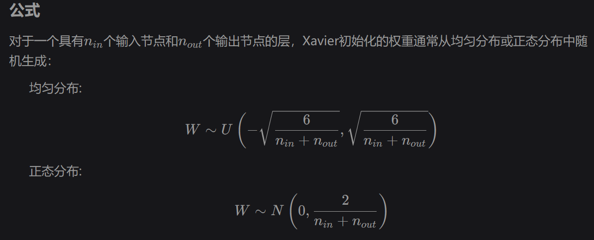

       ```python
       import torch
       import torch.nn as nn
       
       # 定义一个简单的神经网络
       class SimpleNN(nn.Module):
           def __init__(self):
               super(SimpleNN, self).__init__()
               self.fc1 = nn.Linear(784, 256)
               self.fc2 = nn.Linear(256, 10)
       
               # 应用 Xavier 初始化
               nn.init.xavier_uniform_(self.fc1.weight)
               nn.init.xavier_uniform_(self.fc2.weight)
       
           def forward(self, x):
               x = torch.tanh(self.fc1(x))
               x = self.fc2(x)
               return x
       ```

       ==学习率采取的是阶跃变化：== 学习率初始化为0.1，然后在第30个、第60个和第90个阶段除以10。

  2. Experiment Results
     上面的表2显示出由于训练流程的不同，ResNet网络得到的结果超过了参考结果，而Inception-v3和MobileNet略低于参考结果。

* **三、Efficient Training：**    表3---实验结果    表4--消融实验
  由于硬件的发展，许多与性能相关的权衡的最佳选择都发生了变化，现在在训练过程中使用较低的数值精度和更大的批处理规模更有效

  1. Large-batch training

     * Linear scaling learning rate.

       小批量SGD将多个样本分组到一个小批中，以提高并行性和降低通信成本。然而，使用大的批处理可能会减缓训练进度。**对于凸问题，收敛速度随着批处理大小的增加而减小**。

       ​	在小批量SGD中，梯度下降是一个随机过程，因为在每个批中样例都是随机选择的。增加批大小不会改变随机梯度的期望，而会减小其方差。换句话说，==大批量减少了梯度中的噪声，所以我们可以提高学习率，沿梯度方向取得更大的步长。==  --------------**大批量适合使用大的学习率，小批量适合小的学习率。**

     * Learning rate warmup.

       训练初，因为所有参数都是随机的，此时使用较大的学习率会导致数值不稳定。前几次稳定增加学习率到初始值，后几次稳定降低学习率到0

     * Zero $γ$​​.

       最后一个块的BN层中，将参数γ置为0，这样的话经过这个块时，输入等于输出，让网络在初期更容易训练。

     * No bias decay.

       权重衰减通常应用于所有可学习的参数，包括权重和偏差。**无偏置衰减启发式**遵循了这一建议，它只将权重衰减应用于**卷积层和全连接层**中的权重。 BN层中的偏差、γ和β，都不使用权重衰减。

  2. Low-precision training  低精度训练
     TFLOPS 是“万亿次浮点运算每秒”（Tera Floating Point Operations Per Second）

     Nvidia V100在FP32中提供14个TFLOPS，但在FP16中提供超过100个TFLOPS。如表3所示，在V100上，从FP32切换到FP16后，整体训练速度加快了2~3倍。

     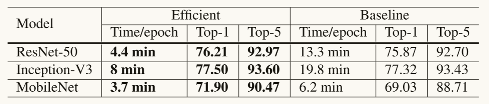

  3. Experiment Results

     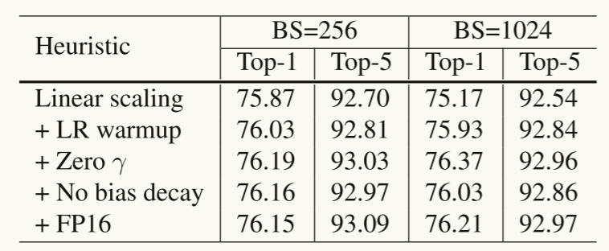

* **四、Model Tweaks：**  模型的调整  使用resnet来演示
  
  这是对网络架构的一个小调整，几乎不会改变计算的复杂度，但可能对模型的精度产生不可忽视的影响。
  
  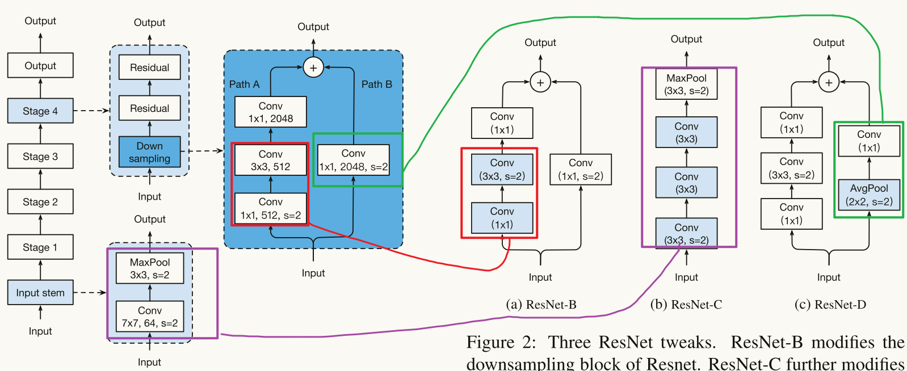
  
  1. ResNet Architecture
  2. ResNet Tweaks    ResNet 调整
  3. Experiment Results  表5
  
  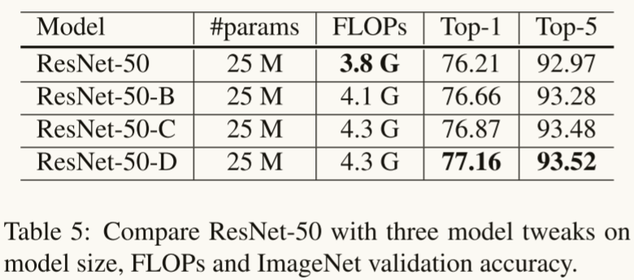
  
* **五、Training Refinements：**

  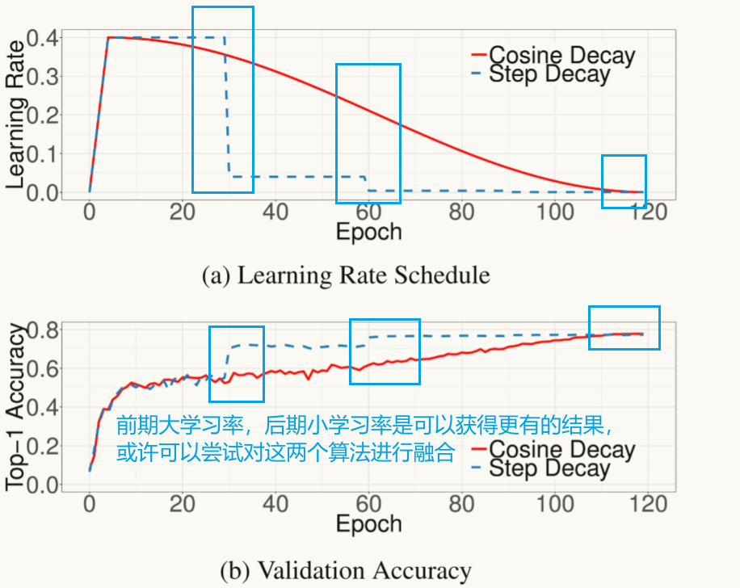

  ==一种想法是前60次迭代学习率使用阶跃衰竭，后60次迭代学习率使用余弦退火衰减。==

  ==两种想法的融合应该是每隔几个epoch，就降低一次学习率==

  1. Cosine Learning Rate Decay

  2. Label Smoothing（为了解决过拟合问题）

     ​	原始的交叉熵损失函数以及依据真实值构建的损失函数，鼓励输出分数的显著不同，这可能会导致过拟合。

     ​	使用标签平滑以后，模型会鼓励来自全连接层的有限输出，减小过拟合的风险。

     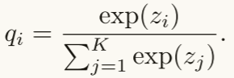  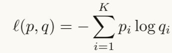   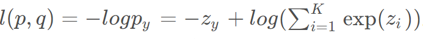 
     	此时，关于函数的最优解为$z^* = inf$。 

       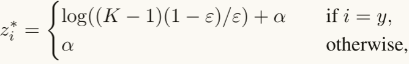  

     ​	标签平滑以及最求解的求导，其中设置 $α$ 为一个实值，其实就是非目标神经元的输出值。

     ​	当 $ε = 0$ 时，目标神经元的最优输出值与其他神经元最优输出值的 $gap = log((K-1)(1-ε)/ε) = ∞$ ，随着$ε$增大，gap减小。特别是当 $ε = (K-1)/K$ , 所有最优的 $z^*$ 均为 $α$，下面的图是示例：

     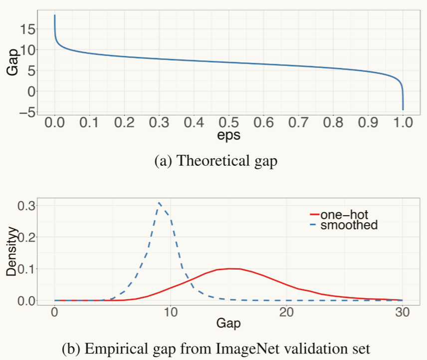

     ​	第二个图是使用标签平滑和没有使用标签平滑在验证集上的gpa分布，就是神经元输出值的差距，可以看出，使用标签平滑具有较少的极值。

  3. Knowledge Distillation

     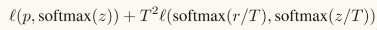  
     其中，T为温度超参数，使softmax输出更平滑，从而从教师模型的预测中提取出标签分布的知识。

  4. Mixup Training  混合训练    --------------  需要更长的训练epoch来更好地收敛（从120到200）

     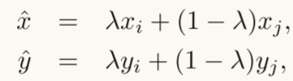 
     随机抽取两个样本，然后使用上述公式得到一个新的样本，在混合训练中只使用这些新的样本。
     $λ∈[0,1]是从Beta（α，α）$ 分布中抽取的一个随机数。 $Beta（α，α）$​ 是什么？
     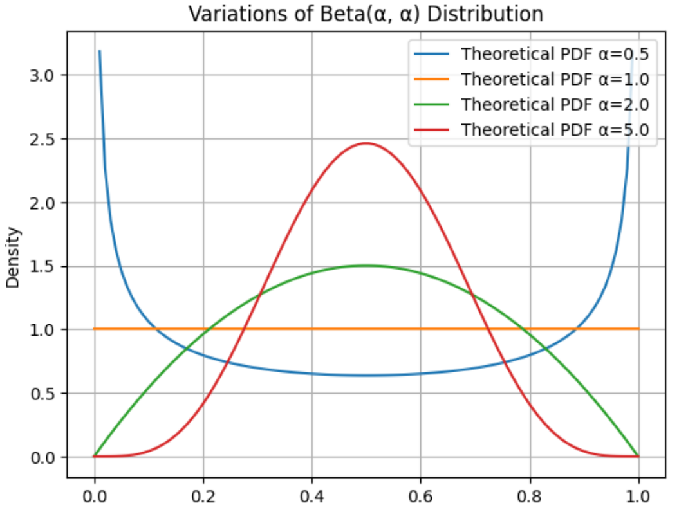       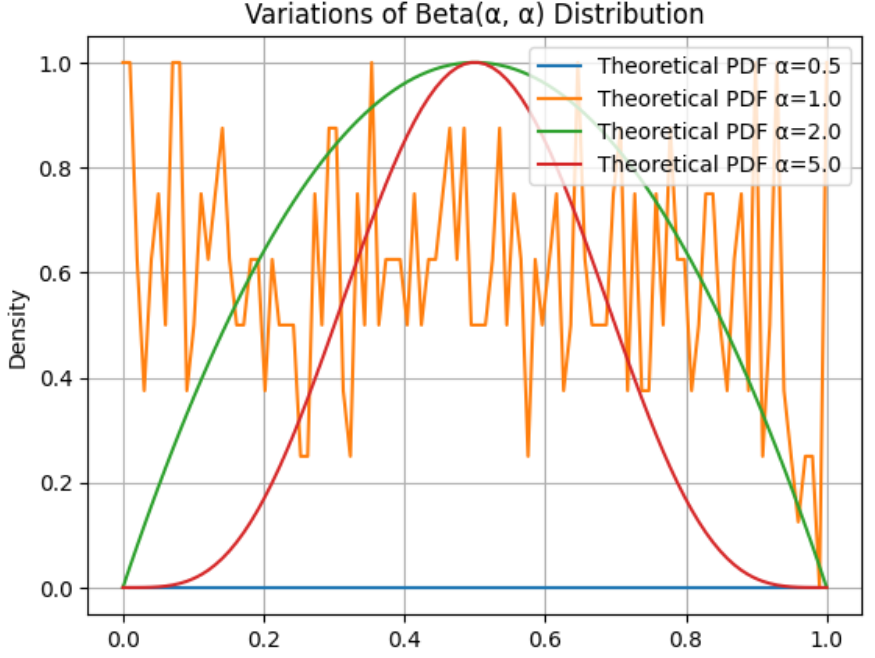

     第一个图是归一化之前的理论概率密度，第二个是归一化之后的理论概率密度。   
     上述两个图是gpt给的代码生成的，感觉不太对                        

  5. Experiment Results

     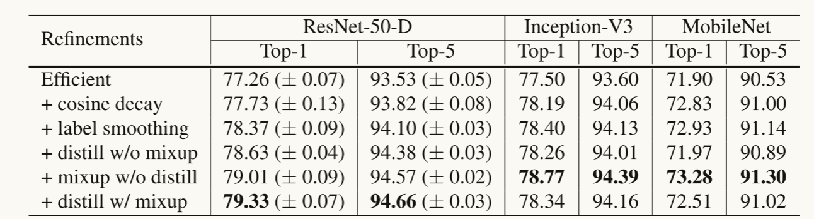

     

* **六、Transfer Learning：**

  1. Object Detection   目标检测的目标是定位图像中对象的边界框。

     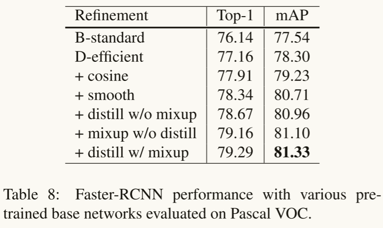

     

  2. semantic segmentation  语义分割从输入的图像中预测每个像素的类别。

     

* **讨论与总结：** 

  ​	在本文中，我们调查了十几种训练深度卷积神经网络以提高模型精度的技巧。这些技巧对**模型体系结构**、**数据预处理**、**损失函数**和**学习率计划**进行了微小的修改。

Nesterov Accelerated Gradient（NAG） 优化算法。

- **加速收敛**：相比标准的梯度下降方法，NAG 能够更快地接近最优解。
- **减少振荡**：它有效地减少了在曲面上振荡现象，使优化过程更平滑。


# ==深度神经网络模型训练中的 tricks（原理与代码汇总）==

[参考链接](https://mp.weixin.qq.com/s?__biz=MzI1MjQ2OTQ3Ng==&mid=2247623923&idx=1&sn=62e0171a281b870211c45813182b4435&chksm=e9efed78de98646e8334ff83b707050098d5ba313c6369ce0d80a483550dead3f24f2dbc82f6&scene=27)

* **warmup：**    
  因为从一个很小的学习率一下变为比较大的学习率可能会导致训练误差突然增大。论文[3]提出了gradual warmup来解决这个问题，即从最开始的小学习率开始，每个iteration增大一点，直到最初设置的比较大的学习率。

  ```python
  # 学习率调度函数
  def create_lr_scheduler(optimizer,
                          num_step: int,
                          epochs: int,
                          warmup=True,
                          warmup_epochs=1,
                          warmup_factor=1e-3,
                          end_factor=1e-6):
      assert num_step > 0 and epochs > 0
      if warmup is False:
          warmup_epochs = 0
  
      def f(x):
          """
          根据step数返回一个学习率倍率因子， 这个倍率因子乘以学习率等于我们最终使用的lr
          注意在训练开始之前，pytorch会提前调用一次lr_scheduler.step()方法
          """
          if warmup is True and x <= (warmup_epochs * num_step):
              alpha = float(x) / (warmup_epochs * num_step)
              # warmup过程中lr倍率因子从warmup_factor -> 1
              return warmup_factor * (1 - alpha) + alpha
          else:
              current_step = (x - warmup_epochs * num_step)
              cosine_steps = (epochs - warmup_epochs) * num_step
              # warmup后lr倍率因子从1 -> end_factor
              return ((1 + math.cos(current_step * math.pi / cosine_steps)) / 2) * (1 - end_factor) + end_factor
  
      return LambdaLR(optimizer, lr_lambda=f)
  ```
  
  
  
* **Linear scaling learning rate**：

  ​	Linear scaling learning rate是在论文[3]中针对比较大的batch size而提出的一种方法。

  ​	在凸优化问题中，随着批量的增加，收敛速度会降低，神经网络也有类似的实证结果。随着batch size的增大，处理相同数据量的速度会越来越快，但是达到相同精度所需要的epoch数量越来越多。也就是说，使用相同的epoch时，大batch size训练的模型与小batch size训练的模型相比，验证准确率会减小。

  ​	上面提到的gradual warmup是解决此问题的方法之一。另外，linear scaling learning rate也是一种有效的方法。在mini-batch SGD训练时，梯度下降的值是随机的，因为每一个batch的数据是随机选择的。增大batch size不会改变梯度的期望，但是会降低它的方差。也就是说，大batch size会降低梯度中的噪声，所以我们可以增大学习率来加快收敛

  ​	具体做法很简单，比如ResNet原论文[1]中，batch size为256时选择的学习率是0.1，当我们把batch size变为一个较大的数b时，学习率应该变为 0.1 × b/256。

* **Label-smoothing**

  ```python
  # 最终得到的就是标签平滑后的张量，使用独热编码
  import torch
  import torch.nn as nn
  class LSR(nn.Module):
      def __init__(self, e=0.1, reduction='mean'):
              super().__init__()
              self.log_softmax = nn.LogSoftmax(dim=1)
              self.e = e
              self.reduction = reduction
      def _one_hot(self, labels, classes, value=1):
          """
              Convert labels to one hot vectors
              思路就是：首先创建一个二维张量，接着按照标签的个数创建一个值为 value 的列，使二维张量对应的标签位置加上这个值。
          Args:
              labels: torch tensor in format [label1, label2, label3, ...]
              classes: int, number of classes
              value: label value in one hot vector, default to 1
          Returns:
              return one hot format labels in shape [batchsize, classes]
          """
          one_hot = torch.zeros(labels.size(0), classes)
  #         labels and value_added  size must match
          labels = labels.view(labels.size(0), -1)
          value_added = torch.Tensor(labels.size(0), 1).fill_(value)
          value_added = value_added.to(labels.device)
          one_hot = one_hot.to(labels.device)
          # (dim, index, src)
          one_hot.scatter_add_(1, labels, value_added)
          return one_hot
  
      def _smooth_label(self, target, length, smooth_factor):
          """convert targets to one-hot format, and smooth
          them.
          Args:
              target: target in form with [label1, label2, label_batchsize]
              length: length of one-hot format(number of classes)
              smooth_factor: smooth factor for label smooth
          Returns:
              smoothed labels in one hot format
          """
          one_hot = self._one_hot(target, length, value=1- smooth_factor)
          one_hot += smooth_factor / length
          return one_hot.to(target.device)
      
  
  # 使用交叉熵损失函数时，如何使用标签平滑
  class LabelSmoothing(nn.Module):
      """NLL loss with label smoothing.
      """
      def __init__(self, smoothing=0.0):
          """Constructor for the LabelSmoothing module.
          :param smoothing: label smoothing factor
          """
          super(LabelSmoothing, self).__init__()
          self.confidence = 1.0 - smoothing
          self.smoothing = smoothing
  
      def forward(self, x, target):
          logprobs = torch.nn.functional.log_softmax(x, dim=-1)
          nll_loss = -logprobs.gather(dim=-1, index=target.unsqueeze(1))
          nll_loss = nll_loss.squeeze(1)
          smooth_loss = -logprobs.mean(dim=-1)
          loss = self.confidence * nll_loss + self.smoothing * smooth_loss
          return loss.mean()
    
  # 使用CrossEntropyLoss 可以直接设置标签
  loss_func = nn.CrossEntropyLoss(label_smoothing = 0.3)
  v = torch.LongTensor([2, 1, 0])
  loss_func(predict ,v)
  # tensor(1.3883)
  ```

* **Random image cropping and patching**

  Random image cropping and patching (RICAP)[7]方法随机裁剪四个图片的中部分，然后把它们拼接为一个图片，同时混合这四个图片的标签。

  RICAP在caifar10上达到了2.19%的错误率。

  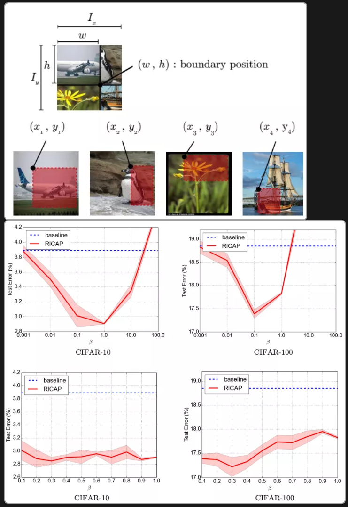

  
  
* **Knowledge Distillation**

  ​	提高几乎所有机器学习算法性能的一种非常简单的方法是在相同的数据上训练许多不同的模型，然后对它们的预测进行平均。但是使用所有的模型集成进行预测是比较麻烦的，并且可能计算量太大而无法部署到大量用户。
  ​	Knowledge Distillation[8]方法就是应对这种问题的有效方法之一。 

  ​	==依据上面讲的论文==

* **Cutout**

  ​	Cutout [9] 是一种新的正则化方法。原理是在训练时随机把图片的一部分减掉，这样能提高模型的鲁棒性。它的来源是计算机视觉任务中经常遇到的物体遮挡问题。通过cutout生成一些类似被遮挡的物体，不仅可以让模型在遇到遮挡问题时表现更好，还能让模型在做决定时更多地考虑环境(context)。

  ```python
  import torch
  import numpy as np
  
  class Cutout(object):
      """
      Randomly mask out one or more patches from an image.
      Args:
          n_holes (int): Number of patches to cut out of each image.
          length (int): The length (in pixels) of each square patch.
      """
      def __init__(self, n_holes, length):
          self.n_holes = n_holes
          self.length = length
      def __call__(self, img):
          """
          Args:
              img (Tensor): Tensor image of size (C, H, W).
          Returns:
              Tensor: Image with n_holes of dimension length x length cut out of it.
          """
          h = img.size(1)
          w = img.size(2)
          mask = np.ones((h, w), np.float32)
          for n in range(self.n_holes):
              y = np.random.randint(h)  # 在 0到h之间产生一个随机整数
              x = np.random.randint(w)
              y1 = np.clip(y - self.length // 2, 0, h) # 确保y1在0到y之间，下同
              y2 = np.clip(y + self.length // 2, 0, h)
              x1 = np.clip(x - self.length // 2, 0, w)
              x2 = np.clip(x + self.length // 2, 0, w)
              mask[y1: y2, x1: x2] = 0.  # 将这部分图像的像素置为0
              mask = torch.from_numpy(mask) # NumPy 数组转换为 PyTorch 张量 (tensor)
              mask = mask.expand_as(img) # mask 张量的形状扩展为与 img 张量相同的形状
              img = img * mask # 执行逐元素乘法操作，即将两个张量 img 和 mask 中对应位置的元素相乘
          return img
  ```
  
* **Random erasing**

  Random erasing[6]其实和cutout非常类似，也是一种模拟物体遮挡情况的数据增强方法。区别在于，cutout是把图片中随机抽中的矩形区域的像素值置为0，相当于裁剪掉，random erasing是用随机数或者数据集中像素的平均值替换原来的像素值。而且，cutout每次裁剪掉的区域大小是固定的，Random erasing替换掉的区域大小是随机的。

  ```python
  class RandomErasing(object):
      '''
      probability: The probability that the operation will be performed.
      sl: min erasing area
      sh: max erasing area
      r1: min aspect ratio 最小高宽比，一般指的是宽高比
      mean: erasing value
      '''
      def __init__(self, probability = 0.5, sl = 0.02, sh = 0.4, r1 = 0.3, mean=[0.4914, 0.4822, 0.4465]):
          self.probability = probability
          self.mean = mean
          self.sl = sl
          self.sh = sh
          self.r1 = r1
      def __call__(self, img):
          if random.uniform(0, 1) > self.probability:
              return img
          for attempt in range(100):
              # 总区域大小
              area = img.size()[1] * img.size()[2]
              # 目标区域大小  比例*总区域大小
              target_area = random.uniform(self.sl, self.sh) * area
              # 让高宽比在 这两个值之间
              aspect_ratio = random.uniform(self.r1, 1/self.r1)
              # 擦除区域的高
              h = int(round(math.sqrt(target_area * aspect_ratio)))
              # 擦除区域的宽
              w = int(round(math.sqrt(target_area / aspect_ratio)))
              # 挑选擦除区域 高和宽的 起始点
              if w < img.size()[2] and h < img.size()[1]:
                  # 高的起始点
                  x1 = random.randint(0, img.size()[1] - h)
                  # 宽的起始点
                  y1 = random.randint(0, img.size()[2] - w)
                  # 如果图像是三通道
                  if img.size()[0] == 3:
                      img[0, x1:x1+h, y1:y1+w] = self.mean[0]
                      img[1, x1:x1+h, y1:y1+w] = self.mean[1]
                      img[2, x1:x1+h, y1:y1+w] = self.mean[2]
                  # 图像是单通道
                  else:
                      img[0, x1:x1+h, y1:y1+w] = self.mean[0]
                  # 返回擦除的图像
                  return img
          # 尝试100次都没有找到需要擦除的图像后就返回原图像
          return img
  ```
  
* **Cosine learning rate decay**

  ​	在warmup之后的训练过程中，学习率不断衰减是一个提高精度的好方法。其中有step decay和cosine decay等，前者是随着epoch增大学习率不断减去一个小的数，后者是让学习率随着训练过程曲线下降。

  step decay

  ```python
  
  ```
  
  
  
* **Mixup training**

  ​	Mixup[10]是一种新的数据增强的方法。Mixup training，就是每次取出2张图片，然后将它们线性组合，得到新的图片，以此来作为新的训练样本，进行网络的训练，如下公式，其中x代表图像数据，y代表标签，则得到的新的xhat, yhat。

  ```python
  for(images, labels) in train_loader:
      l = np.random.beta(mixup_alpha, mixup_alpha)
      index = torch.randperm(images.size(0))
      images_a, images_b = images, images[index]
      labels_a, labels_b = labels, labels[index]
      mixed_images = l * images_a + (1- l) * images_b
      outputs = model(mixed_images)
      loss = l * criterion(outputs, labels_a) + (1- l) * criterion(outputs, labels_b)
      acc = l * accuracy(outputs, labels_a)[0] + (1- l) * accuracy(outputs, labels_b)[0]
  ```
  
  
  
* **AdaBound**

  AdaBound是最近一篇论文[5]中提到的，按照作者的说法，AdaBound会让你的训练过程像adam一样快，并且像SGD一样好。

  ```python
  pip install adabound
  optimizer = adabound.AdaBound(model.parameters(), lr=1e-3, final_lr=0.1)
  ```

* **AutoAugment**

  ​	数据增强在图像分类问题上有很重要的作用，但是增强的方法有很多，并非一股脑地用上所有的方法就是最好的。那么，如何选择最佳的数据增强方法呢？AutoAugment[11]就是一种搜索适合当前问题的数据增强方法的方法。该方法创建一个数据增强策略的搜索空间，利用搜索算法选取适合特定数据集的数据增强策略。此外，从一个数据集中学到的策略能够很好地迁移到其它相似的数据集上。

  ​	AutoAugment在cifar10上的表现如下表，达到了98.52%的准确率。

* **其他经典的tricks**

  - Dropout
  - L1/L2正则
  - Batch Normalization
  - Early stopping
  - Random cropping
  - Mirroring
  - Rotation
  - Color shifting
  - PCA color augmentation

* 

# 二

# ==1==


* **摘要：**  
* **介绍：**
* **方法：**
* **试验：**
* **讨论与总结：**