# 关于文献阅读

阅读完文献后，至少要回答以下问题:

1. 这篇文章到底在解决什么问题？
2. 这个问题为什么在这个领域重要？
3. 这些作者是如何解决这个问题的？
4. 这个问题的解决有什么亮点，局限，有什么应用？

看5-10遍，能够回忆起研究目的，研究方法，研究过程，研究成果，研究结论就可以了，至于公式的推导，确实需要花费大量时间的，不重要的可以不去推导。

文献可以分为写的好的和写的差的，写的差的没必要看懂，写的很好的看不懂就很正常了。

不要只看不写，早点动手写论文。

前期是大量的泛读，然后总结。通过标题摘要大概了解这个领域多少人用了什么类型的方法，有全局的思维，基础的了解。之后有选择的精读文献。 精度不是一次就读懂，需要慢慢来。对好的文章多读。

对自己领域的文章进行精读是确保不要让自己和别人想法一样或者自己想法已经被证明是错误的。


--------------------------

-----------------------------------------

总结当前训练SNN的方式：**STDP训练**，**ANN to SNN**, **Surrogate gradient**，**ANN distill SNN**（包含了多种方式，大体过程为训练一个强大的ANN，接着去构建一个结构相似的小型SNN，这个小型SNN也可以是抽取ANN的中间层并进行转换的,最后使用SNN训练ANN, 这个训练可以使用替代梯度+BPTT，也可以使用稳态下的平均发放率去掉时间这个维度，接着使用正常的梯度下降就行。），**Hybrid SNN Training**（ANNtoSNN +  Surrogate gradient训练SNN），**Using ANN to Enhance SNN**（参考MAE和SpikformerV2，就是在训练过程中，用ANN当做解码器来训练SNN抽取特征的能力，接着用SNN去下游任务微调。）


# ==**Training Spiking Neural Networks Using Lessons From Deep Learning**==

本文作为一个教程和视角，展示了如何将几十年来在深度学习、梯度下降、反向传播和神经科学方面的研究经验应用于生物学上合理的尖峰神经网络。

* **摘要：**  大脑是寻找灵感以开发更有效的神经网络的理想场所。我们的突触和神经元的内部工作方式让我们得以一窥深度学习的未来。
  	本文作为一个教程和视角，展示了如何将几十年来在深度学习、梯度下降、反向传播和神经科学方面的研究经验应用于生物学上合理的脉冲神经网络。
  	我们还探讨了将数据编码为脉冲和学习过程之间的微妙相互作用;将基于梯度的学习应用于SNN的挑战和解决方案;时间反向传播和脉冲时间依赖的可塑性之间的微妙联系;以及深度学习如何向生物学上合理的在线学习发展。
  	有些想法在神经形态工程界中被广泛接受和普遍使用，而另一些想法则是首次提出或证明。还提供了一系列使用我们的Python包snnTorch对本文进行补充的配套交互式教程。 [==参考链接==](https://snntorch.readthedocs.io/en/latest/tutorials/index.html)

* **关键词：** 

  Deep learning; neural code; neuromorphic; online learning; spiking neural networks (SNNs).

* **介绍：**

  这除了处理大量的感官输入之外，还要确保我们的无意识生物过程不会中断。如果我们的大脑像最先进的深度学习模型一样散发热量，那么自然选择早在我们发明机器学习之前就会抹去人类。公平地说，没有一个作者能够模仿莎士比亚的风格，或者用与ChatGPT相同的艺术风格写出音乐吉他谱。

  A. Neuromorphic Computing: A Quick Snapshot

  1. Neuromorphic sensors
     神经形态传感器受生物传感器（如视网膜或耳蜗）的启发，通常记录信号的变化而非定期对其进行采样。只有在发生变化时才会产生信号，这种信号被称为“脉冲”。
     ==这里有个疑问：如果是只对变化产生信号，那不就意味着采样间隔时间是非常短的？连续采样， 或者解释为连续采样某些最容易变得点的值，而不是像传统信号记录一样，每次采样记录全部的值，这就能解释功耗大大降低了。==

  2. Neuromorphic algorithms

     SNNs是指能够学习理解脉冲的神经形态算法。与浮点数值不同，SNNs使用单比特的二进制激活（脉冲），而非以强度表示信息，而是通过时间编码信息。因此，SNNs利用低精度参数以及高空间和时间稀疏性。
     图1为SNN的使用提供了一个小窗口，它们的领域只会继续扩展。尖峰算法已被用于在医疗、机器人和混合现实领域以及许多其他领域实现低功耗人工智能算法。考虑到它们的功率效率，最初的商业产品通常针对边缘计算应用程序，靠近数据记录的地方。

  3. Neuromorphic hardware
     这些模型的设计考虑了在专用类脑硬件上高效能的执行。稀疏激活减少了芯片内外的数据移动，从而加速了类脑工作负载，相较于在传统硬件上执行相同任务，这种方式可带来显著的功耗和延迟优势。
     （说的是好处）

  B. Neuromorphic Systems in the Wild  自然环境中的神经形态系统

  ​	整体目标是将已经在广泛领域证明了其价值的人工神经网络（ANNs）与脉冲神经网络（SNNs）的潜在高效性相结合[34]。脉冲算法已被用于在医学、机器人学和混合现实等领域实现低功耗人工智能算法，此外还有更多其他领域。

  ​	领域包含：初期的商业产品--边缘计算应用，生物信号监测--脑机接口，脉冲信号分类，生物信号异常监测，无人机芯片，音频信号的处理，追踪天空中的卫星，监测材料应变---电力远距离传输，玩游戏---桌上足球，测试关于自然只能如何产生的理论---从大脑高级学习规则和记忆如何形成到神经元和突触层的更低层级的。

​       C. Overview of This Article

​	

* **2. From artificial to spiking neural nerworks：**

  “the three S’s"

  1. Spikes
     	脉冲神经网络与低精度ANN不同，因为时间这个维度，同时可使用分布在数字电路上的时钟信号来实现。
     	在层之间以及芯片之间传递高精度激活信息需要耗费大量资源。将高精度激活值与高精度权重相乘需要先将其转换成整数，然后将乘法转化为多次加法，这会引入进位传播延迟。另一方面，基于脉冲的方法只需要将权重与脉冲（“1”）相乘。这种方法通过简单地从内存中读取权重数值来替代繁琐的乘法过程。

  2. Sparsity

     ​	矩阵所占用的存储空间随数量的增多而增多，但是脉冲序列的存储只需要存储非零值的位置，大大减小空间使用。

  3. Static suppression

     ​	感觉外周包含多种机制，这些机制在受到动态、变化刺激时能提高神经元的兴奋性，同时抑制其对静态、不变信息的反应。  
     ​	空间对比或边缘区域------空间不变区域------------神经节细胞和初级视觉皮层
     ​	变化频率------静态频率-----------频谱时间感受野  spectrotemporal receptive fields  

     Dynamic Vision Sensor (DVS)  动态视觉传感器 or  silicon retina  硅视网膜
     每个像素独立于其他像素被激活

     A. Spiking Neurons: LIF神经元   

     ​	所有输入脉冲同时到达神经元体的可能性极低。这表明存在一种时间动态，这种动态使得膜电位能够在时间维度上保持稳定。 ----==设计SNN网络时加入这个脉冲无法同时达到的机制？==

     ​	在深度学习中，输入的权重因子通常是可学习的参数。如果我们放宽到目前为止所做的物理上可行的假设，那么方程（3）中的输入电流的系数（1 - β）可以被整合进一个可学习的权重W中。

     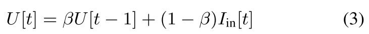

     

     

     B. Alternative Spiking Neuron Models

     ​	IF,LIF(一阶低通滤波)
     ​	Current-based(CuBa,二阶低通滤波，相比LIF更加平滑)
     ​	Recurrent neurons(神经元的输出被重新连接到输入，可用于任何神经元的拓扑结构，one to one和all to all,  其中all to all 其实就是全连接层，每一个神经元在反馈到自己时，需要和所有的神经元进行加权求和。one to one 就是自己反馈给自己)。
     ​	Kernel-based models（也叫做spike-response model脉冲响应模型，将内核定义为任何形状的选择提供了灵活性。）
     ​	Deep learning inspired spiking neurons (SpikeGPT，transformer用于改善长程记忆依赖)
     ​	Higher complexity neuroscience-inspired models（Hodgkin–Huxley模型，Izhikevich模型）

  ​       主要观点总结如下：根据你的任务选择合适的神经元模型。对于追求能效的深度学习，LIF（泄漏积分发放）模型更为适用。而要提升性能，可能需要采用递归脉冲神经网络（SNN）。如果希望进一步提高性能（往往以效率为代价），则可能需要借助深度学习衍生的方法，比如脉冲长短期记忆网络（LSTM）和递归脉冲变换器。或者，也许深度学习并不是你的目标。如果你旨在构建一个大脑模型，或者探索将底层动力学（如离子、导电驱动等）与高阶大脑功能相联系的过程，那么更为详细和生物物理准确的模型将会对你很有帮助。

  ​	在以离散时间递归形式构建脉冲神经元后，我们可以“借用”在训练递归神经网络（RNNs）和基于序列的模型中所取得的进展。这种递归通过“隐式”递归连接来展示，以描述膜电位的衰减，并与“显式”递归相区别，后者是将输出脉冲反馈到输入中，类似于递归脉冲神经网络。
  ​	需要注意的是，基于核的神经元模型将隐式递归替换为一个时变滤波器。

  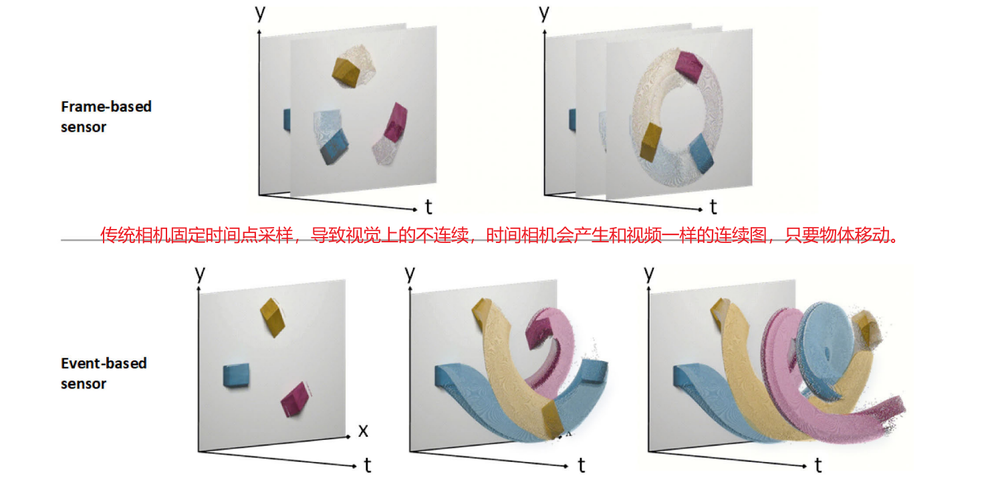

* **3. Neural Code:**

  ​	光是我们所见，当视网膜将光子转化为脉冲时。气味是我们所闻，鼻子将挥发的分子处理为脉冲。触觉感知是我们所感知，当神经末梢将压力转化为脉冲。大脑以脉冲这一全局通用的“货币”进行交流。如果所有脉冲都被一视同仁，那它们又如何传递意义呢？关于脉冲编码，神经网络的两个部分必须分开处理。
  ​	**A. Input Encoding**

  ​	输入数据到脉冲神经网络并不一定要被编码为脉冲。可以接受连续值作为输入，类似于光的感知开始于不断照射到我们光感受器细胞上的光子数量。静态数据，例如图像，可以视作直流（dc）输入，在每个时间步长将相同的特征传递给SNN的输入层。然而，这并未充分利用SNN从时间数据中提取意义的方式。一般来说，关于输入数据，有三种编码机制受到广泛关注。

  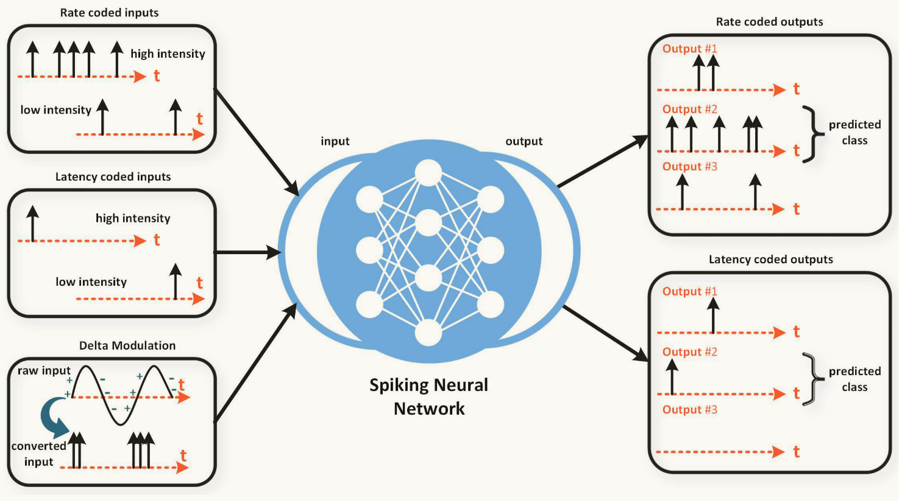

  1) Rate coding ：converts input intensity into a firing rate or spike count.
     	最简单的方法是对一个神经元施加输入刺激，统计其产生的动作电位总数，再将其除以实验的时间长度。虽然这一过程相对直接，但问题在于神经元的动态变化随着时间而不同。我们无法保证实验开始时的放电率与结束时的放电率相近。
  
  2) Latency (or temporal) coding： converts input intensity to a spike time.
  
  3) Delta modulation： converts a temporal change of input intensity into spikes and otherwise remains silent.
  
    
  
    **B. Output Decoding**
  
    ​	将输入数据编码为脉冲可以视为感觉外围向大脑传递信号的一种方式。另一方面，解码这些脉冲则为我们提供了大脑如何处理这些编码信号的深刻洞察。在训练脉冲神经网络的背景下，编码机制并不限制解码机制。那么，转移我们对SNN输入的关注，我们该如何解读输出神经元的放电行为呢？
  
  1. Rate coding chooses the output neuron with the highest firing rate, or spike count, as the predicted class.
  
  2. Latency (or temporal) coding chooses the output neuron that fires first as the predicted class.
  
     ​	延迟编码作为输出编码，因为只需要记录最早产生脉冲的神经元位于那个类别，而不考虑之后的神经元产生的脉冲，所以节省了大量能量。在硬件上，可以大大减少==内存的访问频率==--- 这是深度学习加速器的负担之一。
     ​	大脑平均放电率为10Hz，这个10Hz是上限(upper limit)。 故种群编码是大脑最有可能采取的机制。
  
  3. Population coding relies on multiple neurons per class. This is typically used in conjunction with rate coding, rank order coding, or N-of-M coding.
  
     这一问题可以通过在神经元群体中采用分布式的信息表示来解决：如果单个神经元在短时间内的脉冲计数受到限制，那么我们只需增加神经元的数量。来自一组神经元的脉冲可以汇聚在一起，从而实现更快速的决策。有趣的是，群体编码在==顺序处理与并行处理==之间进行权衡，而在使用GPU训练脉冲神经网络时，后者显得更加高效。
  
  4. Rate Versus Latency Code.
  
     ​	神经元如何编码信息，是频率、延迟还是其他方式，一直是科学界争论不休的议题。本文并不试图破解神经编码之谜，而是旨在探讨在何种情况下，脉冲神经网络（SNN）会更偏向于采用频率编码或延迟编码。	
     ​	速率编码的优势：错误容忍，更多的脉冲可以促进更多的学习，或者说加速学习。但种群编码增加了功耗。
     ​	延迟编码的优势：功耗更低，内存访问频率也更低。 人类在250ms可以处理2-3个脉冲，而延迟编码只需要一个脉冲，所以可能更加符合大脑工作机制。
  
  5. 还有一些涉及到预测机制的编码，一些人坚信编码就在速率和时间之间。一些人觉得这两个编码共存。
     深度学习从业者只需要关注什么更有用就行了。

​	**C. Objective Functions**

		尽管我们的脑部不太可能使用像交叉熵损失函数这样明确的方式，但可以公平地说，人类和动物确实具有一些基本目标。生物变量，如多巴胺释放(dopamine release)，已被有意义地与强化学习中的目标函数关联起来。预测编码模型通常旨在最小化感官编码的信息熵，使得大脑能够主动预测即将到来的信号，同时抑制已经预期的内容。大脑功能的多面性很可能要求存在多个目标。尽管如何利用这些目标来优化大脑仍然是一个谜，但我们可以从多目标优化中获得一些启示。 
		多种损失函数可以用于鼓励网络的输出层以频率或时间编码的形式发放脉冲。最佳选择仍然没有定论，往往取决于网络的超参数和面临(at hand)任务的复杂性。以下所描述的所有目标函数都成功地训练了网络，使其在多种数据集上达到了竞争性的结果，尽管它们各自都有其权衡。

​		**1. Spike Rate Objective Functions**

​	尖峰率目标函数：表2总结了在监督学习分类任务中，常用的通过脉冲神经网络促进正确神经元类别以最高频率发放脉冲的方法。一般而言，交叉熵损失或均方误差会应用于神经元输出层的脉冲计数或膜电位。随着时间步数的增加，脉冲计数作为目标函数的使用更加广泛，因为它直接针对脉冲进行操作。==膜电位则作为一个替代指标，用于增加脉冲计数，但也并非可观测变量，这可能部分削弱了使用脉冲的计算优势。==
​	交叉熵方法旨在抑制来自错误类别的脉冲，这可能导致网络中的权重减小到零。这种情况在没有额外正则化的情况下，可能使得某些神经元陷入静默。通过使用均方脉冲率，该方法为每个类别指定一个目标脉冲数，从而可以让输出神经元处于即将发放脉冲的状态。因此，网络能够更快速地适应变化的输入，其响应时间可能优于那些完全被抑制的神经元。
​	==在模拟有限时间步数的网络中，权重的微小变化不太可能导致输出的脉冲计数发生改变。在这种情况下，将损失函数直接应用于更“连续”的信号，例如**膜电位**==，可能更加合适。然而，这也意味着需要在一个==完整精度==的隐藏状态上进行操作，而==不是仅依赖脉冲==。另一种选择是==利用群体编码==，将计算负担分散到多个神经元上，从而增加权重更新改变输出层脉冲行为的可能性。此外，这种方法还增加了误差反向传播的多条通路，提高了权重更新引发全局损失变化的机会。

```
总结：膜电位和脉冲计数两个值各有优劣，当时间步数较少时，膜电位更有优势，但这也意味着需要使用全精度而不是脉冲值---------对最后一层使用全连接层是否就够了。     均方误差相比交叉熵损失应该更适用于SNN。   同样也可以考虑群体编码，将最后的计算分摊到多个神经元，比如使用几个神经元的值表示一个类别，输出类别是10，设置输出神经元的数量为50个，5个为一组。
```

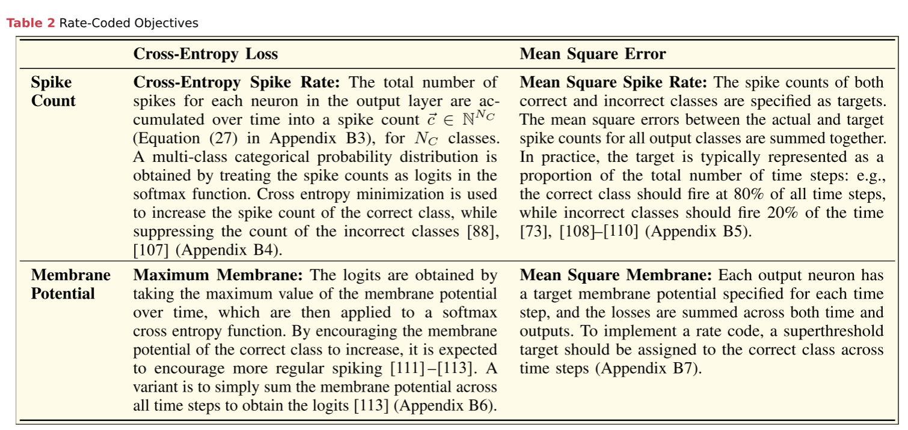

​		**2. Spike Time Objectives:**

​	实现突发时间目标的损失函数使用得比基于频率的目标要少。这可能有两个原因：一是错误率通常被视为深度学习文献中最重要的指标，而频率编码对噪声的容忍度更高；二是时间编码的实现相对更加复杂。表3总结了相关的方法。这些目标的使用场景与脉冲发放率目标相似。使用脉冲时间时，一个微妙的挑战在于默认实现假设每个神经元至少会突发一次，但这并非总是如此。当某个神经元未激活时，可以通过强制在最终时间步发出一次突发来解决这一问题。
​	许多先进模型在输出层完全抛弃了脉冲神经元，而是通过“读出层”来训练模型。这通常由一个无限高阈值的IF层（即永远不会发出脉冲）或使用标准激活函数（如ReLU、sigmoid、softmax等）的典型人工神经元构成。尽管这通常提高了准确性，但这可能不算作完全的脉冲网络。那么，这真的重要吗？如果仍然能够实现能效的提升，工程师就会满意，而这往往是最重要的。

```
总结：使用频率编码的比较多，许多新的模型在输出层不直接使用脉冲神经元，而是通过训练一个 “read-out layer”去获得结果。可能这看起来不像是全脉冲神经网络，但是只要效果好，对我们来说就够了。
```

		

​	**D. Learning Rules**

​		**1.Spatial and Temporal Credit Assignment**

```
	一旦损失被确定，就必须以某种方式利用这一损失来更新网络参数，以期网络在训练任务上能够逐步提升。每个权重都为其在总损失中的贡献承担一定的责任，这被称为“归因分配”。 credit assignment
	这一过程可以分为空间归因分配和时间归因分配两种问题。
	空间归因分配旨在寻找导致错误的权重的空间位置，而时间归因分配则关注权重对错误贡献的时刻。
	反向传播已被证明是一种非常有效的方法来解决归因分配的问题，但大脑在应对这些挑战时面临着更多的限制。
	动作电位沿轴突传播被认为是单向的 unidirectional
	神经元作为有向边的这一约束正逐渐被放宽，这可能是错误被指派给突触的一种机制。在单个神经元内部，出现了许多双向的非线性现象，这些现象或许有助于错误找到正确的突触。例如，在大多数前馈连接的地方，都可以观察到反馈连接的存在。
```

​		**2.Biologically Motivated Learning Rules**

​	生物启发的学习规则：考虑到神经元的复杂动态可能蕴含反向传播的多种变体，我们有哪些选项可以修改反向传播，以缓解与生物学上合理的空间信用分配相关的一些挑战？一般而言，更为广泛采用的方法依赖于==将部分梯度计算替换为随机性==，或者==将全局误差信号与局部误差相互替换==。想象出一种实时机器（如大脑）可以实施的替代信用分配方法，不仅有助于深入理解生物学习，也能降低硬件中的数据传输成本。例如，==使用局部误差可以减少信号在芯片中传播的距离==。==随机方法则可以利用电路中自然而然产生的噪声来权衡计算开销==。一些常见的缓解空间信用分配问题的方法将在以下部分简要总结。
​	Perturbation learning:==通过随机扰动网络权重来测量误差的变化==。单个权重变化的影响常常被其他权重变化所带来的噪声所掩盖。在实际操作中，可能需要进行大量的实验才能有效抑制这种噪声。
​	Random feedback: 随机反馈机制用随机矩阵替代了前向权重矩阵，从而减少了每次权重更新对网络中分布式组件的依赖。==前向和反向传播的数据通过对称权重矩阵进行缩放，而这一机制在大脑中并不存在。==在简单网络和任务上，随机反馈的表现与反向传播相似，这让人们对精准梯度在良好表现中是否必要产生了希望。
​	Local losses：在深度学习中，==贪婪的逐层训练为每一层独立分配一个成本函数==。每一层依次被赋予成本函数，以确保浅层网络可以进行训练。目标传播也源于将重建标准分配给每一层的动机。这种方法==利用了训练浅层网络比训练深层网络更为容易的事实==，并旨在通过确保错误信号无需传播得过远来解决空间信用分配的问题。
​	Forward–forward error propagation：在这种方法中，==模型的反向传播被替代为第二次前向传播==，此时输入信号根据误差或相关指标进行调整。不过截至目前，这些方法尚未用于脉冲神经网络，但可以预见，未来必将有人迎接这一挑战。

​	这些学习方法在图 8(a) 中得到了说明。虽然它们是在监督学习的背景下描述的，但许多学习理论也强调自组织和无监督的方法。Hebbian plasticity 就是一个显著的例子。然而，自监督学习中可能存在一个交集，其中特征网络的目标直接由数据本身决定。有些神经元可能会代表事实、特征或概念，只有在接收到特定刺激时才会激活。另一些神经元则可能是为了减少重构误差而发放信号。考虑到我们周围自然存在的时空相关性，这些神经元可能会以预测未来事件为目的而激活。有关生物学合理性在目标函数中的更严格处理，可以参考文献 。

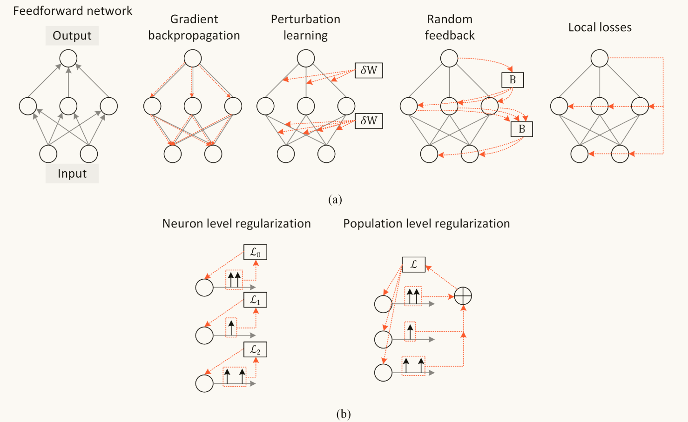

​	**E. Activity Regularization**

```python
	使用脉冲神经网络的一个重要动机在于其在特定设计的硬件上所展现出的能效。这种优势不仅源自通过脉冲进行的单比特层间通信，还得益于脉冲的稀疏出现。前面提到的一些损失函数，特别是那些促进速率编码的函数，若不加以控制，可能会无差别地增大膜电位和/或放电频率，且没有上限。通过对损失进行正则化，可以惩罚过度放电（或者相反，可以惩罚放电不足，这样有助于防止神经元死亡）。传统上，正则化用于限制损失最小化的解空间，从而在减小方差的同时可能增加偏差。但需要谨慎，因为过度的活动正则化可能导致偏差过高。
	活动正则化可被用于改变单个神经元或神经元群体的行为。活动正则化通过在损失函数中添加额外的项来约束神经元的激活值。这一额外的惩罚项通常是与网络激活值的某种范数（如L1或L2范数）相关，以减少不必要的复杂性。
```

​		**Population level regularization**

```
	使用L1正则化进行脉冲发放率的限制或者使用脉冲数量发放阈值来限制。
```

​		**Neuron level regularization**

```
	正则化也可以在个体神经元层面进行，通过为每个神经元增加惩罚来实现。
	较低的活动阈值则定义了每个神经元在施加正则化惩罚之前允许放电的最低限度。
```

​	最近的实验表明，==基于速率编码的网络在输出端对稀疏性促进的正则化项表现出较强的鲁棒性==。然而，依赖首次脉冲时间方案的网络表现却不那么理想，这也并不令人意外，因为==它们的时间输出本身就已经相对稀疏==。
​	鼓励每个神经元保持一个基线的放电频率，有助于通过原本不活跃的路径进行误差反向传播。==通过上下限的正则化项，可以有效地找到每一层神经元放电活动的最佳状态==。如文献 [151] 中详细解释，激活值的方差应尽量接近“1”，以避免梯度消失或梯度爆炸。虽然现代深度学习实践依赖于适当的参数初始化来实现这一目标，但这些方法并不适用于不可微分的激活函数，如脉冲。==通过监测并适当地补偿神经元活动，这可能成为成功训练深度脉冲神经网络的关键因素==。

* **4. Training spiking neural networks**
  
  ​	脉冲神经网络丰富的时间动态特性使得神经元的放电模式可以以多种方式进行解释。这自然意味着有多种方法可以训练脉冲神经网络。通常，这些方法可以归纳为以下几类：
  
  ​	阴影训练：首先训练一个非脉冲的人工神经网络（ANN），然后将其转换成脉冲神经网络，通过将激活值变为放电频率或脉冲时间。  ==机器学习和深度学习中常用的方式。==
  
  ​	使用脉冲的反向传播：脉冲神经网络可以通过原生的误差反向传播进行训练，通常采用时间序列处理的方法，类似于顺序模型的训练方式。
  
  ​	局部学习规则：权重更新仅依赖于与该权重在空间和时间上相近的信号，而不是像误差反向传播那样使用来自全局信号的信息。
  
  ​	每种方法都有适合的时机和场合，使其在众多选择中脱颖而出。我们将重点关注将反向传播直接应用于脉冲神经网络的方案，但通过探索影子训练和各种局部学习规则，我们也能获得宝贵的见解。
  
  
  
  * A.Shadow Training 影子训练
  
    死神经元问题可以用过ANNtoSNN来解决。  
    两个问题：1.常用的静态数据集不能充分调动SNN的时间动态特性；2.激活值的高精度转换需要较长的时间步。
    真正的问题是：转换只是近似，因此转换的精度永远无法超过ANN。
    ==混合神经网络：== 使用ANN训练，接着SNN使用替代梯度接着训练，这样会较少推理步长，但是进一步降低精度。
  
  * B.Backpropagation Using Spike Times  使用脉冲时间进行反向传播
  
    绕过死神经元的另外一个解决方法是：直接在脉冲时刻进行求导。这就是SpikeProp方法，首次提出的使用反向传播训练多层SNN的方法。==这就意味着每个神经元必须发放脉冲，一旦神经元变得不活跃，它们的权重就会被冻结。== SpikeProp通过调整参数初始化来应对此问题（即增加权重，直到触发尖峰）。
  
    ==初始化的目标是为各层之间设定一个常数激活方差，而缺少这一点可能会导致在时空中出现梯度消失或爆炸的问题。--------还有其他作用==   **避免对称破坏**  **加速收敛**  **提高最终性能**  **平衡梯度**
  
    - **Xavier 初始化**：为了 Sigmoid 和 Tanh 激活函数设计，旨在使激活的方差在每层保持相同。
    - **He 初始化**：适用于 ReLU 激活函数，旨在保持激活方差，以避免在激活为零的情况下造成“死神经元”。
  
    降低神经元的放电阈值可以考虑，在隐藏层施加活动正则化以鼓励放电，但是会导致准确率降低。
    该算法要求每个神经元只能放电一次，这与动态变化的数据不相容，可以考虑使用周期性时间编码解决该问题。
  
    **这个算法仍然是唯一一种能够在多层脉冲神经网络中计算无偏梯度而不进行任何近似的方式**
  
  * C.Backpropagation Using Spikes
  
    常使用就是ASR。无论神经元是否发放都会考虑。 需要使用替代梯度
    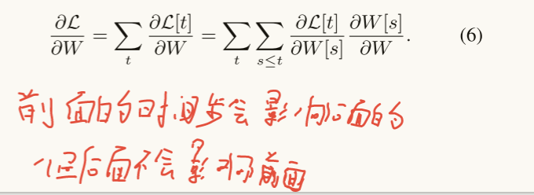
  
  * D.Surrogate Gradients  替代梯度
  
    替代梯度主要用于克服死神经元的问题。
    $U<θ,\frac{\partial S}{\partial U} = 0$
    $U>θ,\frac{\partial S}{\partial U} = 0$
    $U=θ,\frac{\partial S}{\partial U} = ∞$​
  
    总之，==代理梯度使得误差能够传播到更早的层次，无论是否存在脉冲==。然而，脉冲仍然是触发权重更新的必要条件。替代梯度的形式：triangular functions, fast sigmoid and sigmoid functions, straight through estimators, and various other weird shapes. ==那么，是否存在最佳的代理梯度呢？==在我们的经验中，我们发现以下函数是一个很好的起点：
  
    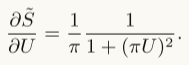
  
    另外一种形式：  （被称为 arctan 替代梯度） 反正切函数，这一函数同时是SNNtorch中的默认替代梯度。
  
    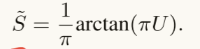
  
    反向传播过程中使用随机矩阵替代权重，也可以理解为局部近似。
  
  * E. Bag of Tricks in BPTT With SNNs
  
    ​	深度学习的诸多进展源于一系列==增量技术(incremental techniques)==，这些技术显著提升了模型的学习能力。它们通常被联合应用，以增强模型的性能。例如，He等人在“Bag of tricks for image classification with
    convolutional neural networks”一文中，不仅在标题中准确的反映了深度学习的现状，还进行了对多种“技巧”的消融研究，这些技巧可以组合使用，以在训练过程中优化效果。某些技术可以从深度学习直接移植到脉冲神经网络，而其他一些则是专门针对SNN的。本节提供了这些技术的非详尽列表。由于这些技术较为经验性，每一项都可以单独撰写“实用说明”。
  
    1. **The reset mechanism**： 不参与反向传播，且即使使用了替代梯度，也不对重置机制反向传播
  
    2. **Residual connections**
  
    3. **Learnable decay**：将泄露因子视为参数而不是超参数，这使得SNN更接近传统的RNN。这样做已被证明可以提高具有时变特征的数据集的测试性能[57]。。
  
    4. **Graded spikes**：分级脉冲，每个神经元都有一个可学习的额外参数，决定如何调整输出脉冲的强度。这就导致神经元的激活不止在 ${0,1}$ 之间了。
  
    5. **Learnable thresholds**：没有被证明这个措施是有效的，估计是由于阈值的离散性。对输入阈值进行归一化能够显著提升效果。在卷积网络中采用批归一化有助于提升性能，而可学习的归一化方法可能作为可学习阈值的有效替代。
  
    6. **Pooling：** 卷积网络中使用池化进行下采样达到平移不变性(translational invariance)是非常有效的，但是在一个稀疏的张量上进行池化意义不大。 或许可以在数据被阈值化为 ${0,1}$​ 之前进行池化------数据进入脉冲神经元之前进行池化或者对膜电位进行，但是这并不一定能实现很好的性能。 
  
       ​	fang等人将池化用于脉冲本身（==当在池化窗口中出现多个脉冲时，便会在它们之间随机决策，其实就是对脉冲直接使用池化==），当池化窗口出现多个脉冲时，没有解释原因，但是获得了很好的性能。
       W. Fang, Z. Yu, Y. Chen, T. Huang, T. Masquelier“Deep residual learning in spiking neural networks,” 
        作者团队猜测，这种随机性起到了一种正则化的作用。
  
       ​	使用最大池化还是平均池化可以视为一个超参数。SynSense’s neuromorphic hardware 采用了sum pooling，其实就是不做平均和最大化了，直接使用求和值。
  
    7. **Optimizer：** 大多数SNN默认采用Adam优化器，因为它们在使用序列模型时被证明具有良好的鲁棒性。【但实际当SNN的深度变得很大时，stochastic gradient descent with momentum 似乎超过了Adam优化器。
  
  * F. Intersection Between Backprop and Local Learning     反向传播和局部学习的交互
  
    当比较经过不同时间步反向传播的结果时-------隐藏层在时间步上的求导为：
  
    $\frac{\partial U[t]}{\partial U[t-1]} = β $ ,  对于n个时间步，就是求导结果的连乘 $β^n$ 。对于LIF神经元， $β<1$，从而导致后面时间步的权重更新呈指数衰减。
  
    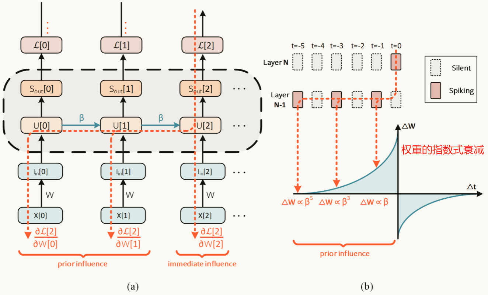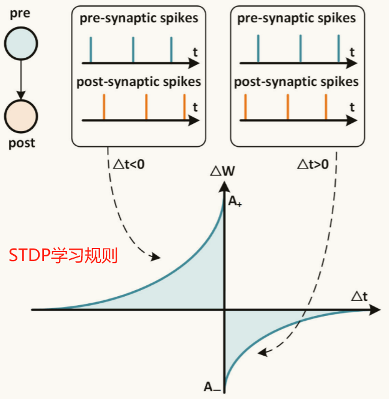
  
    也就是说，BPTT权重更新曲线和STDP学习规则是类似的。==反向传播通过函数优化而得==，而==时序依赖突触可塑性则源自于生物观察==。尽管它们是通过完全独立的方法发展而来，却意外地收敛于相同的结果。这可能会带来直接的实际应用，例如，训练模型的硬件加速器可以剔除一部分反向传播，取而代之的是成本更低且局部有效的时序依赖性突触可塑性规则。采用这种方法，可以被视为反向传播的在线变体，或是时序依赖性突触可塑性的梯度调制形式。
  
  * G.Long-Term Temporal Dependencies 长程时序依赖
  
    ​	神经元和突触的时间常数通常在毫秒级别，可能从一毫秒到几百毫秒，这使得处理长时程依赖变得困难，这个问题在自然语言处理和强化学习中普遍存在。slow dynamics被用来解决这个问题。
  
    ​	在SNN里面 to complement the fast timescales of neural dynamics with a variety of slower dynamics应该是很有效的，slower dynamics是下面这几个：
  
    1. Adaptive thresholds
  
       神经元的不应期可以通过提高发放阈值来处理。在发放脉冲一段时间后，阈值逐渐回到稳态。例如STDP有助于处理神经元的稳定性，==同时对基于梯度学习的SNN也有帮助==。
  
    2. Recurrent attention  循环注意力
  
       ​	自注意力机制通过一次性将所有序列输入提供给模型，发现了长序列中各个标记之间的相关性。但这与大脑处理信息的方式并不完全相同。SpikeGPT则是首次在脉冲神经网络领域应用自注意力这一概念，并成功实现了语言生成。除了更复杂的state-based computation ，SpikeGPT还采用了随时间变化的动态权重。
  
    3. Axonal delays  轴突延迟
  
       轴突长度的多样性造成了脉冲传播延迟的差异，轴突延迟可以是一个跨越多个时间步的学习参数。 
       轴突延迟，树突延迟，结合他们。
  
    4. Membrane dynamics
  
       ==膜电位可以触发脉冲，那么脉冲如何影响膜电位？==  解释：电压的快速变化会导致电场聚集，从而引起细胞内的温度变化。焦耳加热与电压变化呈二次方关系，这影响了神经元的几何结构，并进而改变膜的电容（以及时间常数）。
       ==脉冲发放所引起的衰减率调制可以作为一种二阶机制，生成特定于神经元的反应动力学。==
  
    5. Multistable neural activity 多稳态神经元活动
  
       ==吸引子神经网络==，是大脑工作记忆的基础，通常归因于前额叶皮层。
       ==使用梯度下降法训练此类网络面临挑战，迄今为止尚未尝试在尖峰神经网络中应用。==
  
    一些基础的slow timescale dynamics 在基于梯度的SNN训练方法中得到了有效的验证(**S. B. Shrestha and G. Orchard, “SLAYER: Spike layer error reassignment in time**，------ **G. Bellec, D. Salaj, A. Subramoney, R. Legenstein, and W. Maass, “Long short-term memory and learning-to-learn in networks of spiking neurons,”**)。LSTMs解决了RNN的短期记忆问题。 将更为细致(nuanced)的神经特征转化为基于梯度的学习框架，增强SNN表示动态数据。    learning-to-learn   学会去学习，也就是学习能力的提升。
  
* **5. Online learning**
  
  ==加入dropout，合理利用这种正则化，是否可以达到较好的效果？==
  
  * A. Temporal Locality
  
    ​	我们的神经元不太可能==突破时空连续性==，明确引用历史状态来运行反向传播时间算法（BPTT）。------生物神经元并没有像BPTT那样明确地回顾和使用历史状态，它们在学习过程中更依赖于==最近的活动和信号之间的时序关系==。这意味着在时间深度学习中表现最佳的方法，即反向传播时间算法，并不符合生物学上的可行性。
  
  * B. Real-Time Recurrent Learning  RTRL   该算法的变体：[194], [195], [196], [197], [198]
  
    ​	RTRL在时间上是局部的，在空间上不是。BPTT的内存使用随着==时间和神经元数量的乘积==而增加，其复杂度为$O(nT)$。对于RTRL，需要引入额外的一组计算，以使网络能够跟踪随时间变化的梯度。这些额外的计算导致其内存需求达到$O(n³)$​​​，通常超过了BPTT的需求。
  
    ​	推导为了实现脉冲神经网络的实时梯度计算，需要向前传播哪些新信息。瞬时损失$L[t]$是瞬时预测输出$Yˆ[t]$与目标输出$Y[t]$之间匹配程度的衡量指标。根据所使用的损失函数类型，$Yˆ[t]$可能是最终层的脉冲输出$Sout[t]$，也可能是膜电位$U[t]$​。，无论是哪种形式，∂L[t]/∂U[t] 求导时都不依赖其他时刻的值 ，所以可以以在线方式计算该项，主要是求导 ∂U[t]/∂W， 使得它仅依赖 t-1时刻 和 t时刻的值。
  
    ​	将参数 W 对膜电位 U[t] 的影响定义为 m[t]，这个值就是 当前膜电位对于 W的导数。
  
    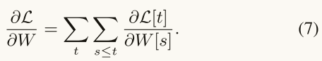
  
    
  
    
  
    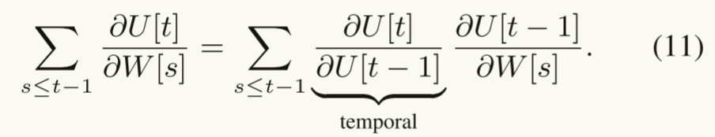
  
    ​	基于公式4，我们可以知道，公式11的前一项可以表示为β，作为系数提出来，根据公式10，后一项可以表示为m[t-1]，根据公式4，公式10的后一项可以表示为X[t]，所以可以得到公式12：
  
    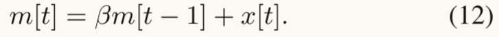
  
    梯度的求导可以表示为：  其中 $c[t] = ∂L[t]/∂U[t]$  c一把，公式打不出一把
  
    
  
    为了与下图对应，上面这个公式应该被进一步写为：
  
    $\frac{\partial L[t]}{\partial W} = \frac{\partial L[t]}{\partial U[t]} \times (m[t-1] + x[t]) $     只看前一步，所以不用继续往下写了。
  
    也就是说现在输入$x[t]$ 不仅影响膜电位，还会影响$m[t]$，这样的话就能以在线方式计算损失。
  
    
  
    解释：==通过前向模式微分将梯度计算中的时间项投射到未来，同时利用反向模式微分在空间项上的计算复杂度。==
  
  * C.RTRL Variants in SNNs
  
    自2020年以来，针对脉冲神经网络出现了一系列前向模式学习算法。这些研究主要通过修改、重新推导或近似实时递归学习（RTRL）来进行。
  
    1. e-Prop：RTRL与替代梯度下降相结合，采用了递归脉冲神经元。在这种模型中，输出脉冲经过线性变换后反馈回同一神经元的输入。计算图在显式的递归操作处被断开，但在隐式递归（即膜电位随时间演变）中仍然保持连接。
    2. decolle：“Deep continuous online learning" 将 RTRL 与替代梯度下降相结合。在这一过程中，每一层都采用贪婪的局部损失。这意味着==误差只需逐层反向传播==，避免了在庞大网络中逐层传递，从而减轻了空间信用分配问题的负担。然而，这也带来了两个挑战：并非所有问题都能以可定义的局部损失形式进行处理；而贪婪的局部学习则优先关注短期收益，往往忽视整体目标。
    3. OSTL：Online spatiotemporal learning  rederives 重新推导了实时递归误差传播（RTRL）。这种方法将反向传播中的空间成分和时间成分拆分为两个独立的项，比如一个跟踪“即时”影响，另一个则反映来自先前时刻的“影响”。
    4. ETLP：Event-based three-factor local plasticity  
       “基于事件的三因素局部可塑性” 将e-prop与直接随机目标投影（direct random target projection，DRTP）相结合。因此，最终层的权重更新是基于对递归时序学习（RTRL）的一种近似。早期层的更新依赖于局部的偏导数，这些更新并不依赖于全局损失，而是与该层的空间位置密切相关。相应地，目标输出被用来调节这些梯度。这一方法通过使用来自目标的信号来解决空间信用分配的问题，而不是在（10）式的直接影响项中反向传播梯度。然而，这种方法的代价是，它同时继承了e-prop和DRTP的缺点。DRTP注重即时收益，而没有顾及整体目标，类似于贪婪的局部学习方式。
    5. OSTTP：Online spatiotemporal learning with target projection  “在线时空学习与目标投影”将OSTL（功能上相当于RTRL）与DRTP结合在一起。尽管它继承了DRTP的一些缺陷，但同时解决了空间信贷分配的问题。
    6. FPTT：Forward propagation through time   “时间反向传播”考虑了在带有时间变化损失的序列到序列模型中的RTRL（反向传播通过时间算法）。在每一步的损失中加入了正则化项，以确保训练过程的稳定性。随后，Yin等人将FPTT应用于具有更复杂神经元模型和丰富动态的脉冲神经网络（SNNs）。
  
    这是一份非详尽的RTRL替代方案列表，初看可能让人感到不知所措。然而，所有这些方法实际上都是源于RTRL。主要的研究趋势包括：
  
    1. 对RTRL进行近似，以测试训练过程能容忍多少近似而不至于完全失败 [109]；
    2. 用全局调制替代瞬时影响，以解决空间信用分配的问题 [110]，[202]，[203]；3）
    3. 修改目标以促进稳定的训练动态 [204]；
    4. 通过将RTRL分解为资格追踪和/或三因子学习规则，从而识别与生物学的相似性 [109]，[202]，[205]。==强化学习的内容==
  
    一些RTRL变体声称在损失最小化方面优于BPTT，但我们对这些说法持谨慎态度，因为在权重更新延迟到序列末尾的情况下，这两者实际上是相同的。此外，我们也警惕那些声称改进RTRL的说法，因为RTRL可以看作是应用于任何通用架构的前向模型学习的最一般情况。大多数计算复杂度的减少是因为它们仅针对特定架构进行了狭义考虑，或者在模型中引入了近似。相较之下，Tallec和Ollivier [194] 提出了一个“unbiased online recurrent
    optimization”方案，通过使用随机噪声并最终将其抵消，从而使计算复杂度与网络规模的关系为平方（而非立方）。
  
  * D.Spatial Locality
  
    ​	时间局部性依赖于仅基于网络当前状态的学习规则，而空间局部性要求每次更新都必须基于与参数紧邻的一个节点。Section III-D 部分描述的生物学启发的学习规则通过将全局误差信号替换为局部误差，或者将解析/数值导数替换为随机噪声，解决了空间信用分配问题。这种“自然”的在线学习方式被认为是通过无监督学习和突触可塑性规则实现的----SRDP
  
    ​	一个普遍的误解是，反向传播（backprop）与类似STDP的学习规则相对立。一方面，人们认为STDP应该获得更多关注，因为它在复杂度上比反向传播更具扩展性。STDP在处理远距离的挑战性数据集时无法与反向传播竞争。反向传播的设计初衷是功能优化，而STDP则起源于生理观察。令人为奇的是，STDP竟能够在原本旨在监督学习的任务上（比如MNIST数据集的分类）获得具有竞争力的结果(该任务比较简单)。
  
    ​	Section IV-F部分展示了通过 BPTT 的替代梯度下降如何包含STDP的效果。尖峰时间的差异导致权重更新幅度呈指数衰减，从而使得STDP学习窗口的一半已经在BPTT算法中得到了体现。Bengio等人曾指出，STDP类似于随机梯度下降，前提是STDP辅以梯度反馈。这一观点尤其适用于将一个神经元的发放率为激活值的情况。在此，我们证明了BPTT算法无需任何修改即可考虑STDP类效应，也不局限于特定的神经编码，如发放率。
  
* **6. Outlook**

  设计神经网络曾被视为纯粹的工程问题，而对大脑的映射则是一种科学好奇心。然而，随着深度学习与神经科学的交集不断拓宽，且大脑在解决复杂问题时展现出更高的效率，这种看法正在发生变化。从科学家的角度来看，深度学习与大脑活动之间表现出许多相关性，这让我们相信，人工神经网络在理解生物学习的宏伟追求中能够提供更多未被挖掘的洞察。例如，神经网络各层之间的活动与实验中大脑的活动屡屡显示出相似之处，这包括卷积神经网络与视觉皮层和听觉处理区域的测量活动之间的联系。

  尽管许多研究量化了神经元群体的活动水平，但脉冲神经网络可能能为我们揭示这种活动的具体性质。从工程师的角度来看，基于实验结果的神经元模型让我们能够设计出在专为脉冲神经网络优化的硬件上具有极高能效的网络。相比于传统的人工神经网络在嵌入式硬件上的加速，这种设计在能耗上提升了两个到三个数量级，验证了脆冲、稀疏性以及静态数据抑制（或事件驱动处理）这三项优势带来的显著益处。

  这些能量和延迟的好处来自于将神经元模型应用于连接主义网络，但仍有许多领域等待我们去探索。可以说，脉冲所带来的能效优势是毋庸置疑的。然而，更具挑战性的问题是：脉冲在计算中真的有效吗？或许，这些经过数年进化所形成的脉冲解决了生物体长距离信号传输的问题，而其他一切也都不得不适应这一限制。如果这一假设成立，那么基于脉冲的计算在能效和延迟方面将是最优的。然而，在我们尚未积累更多脉冲目的的证据之前，我们对脉冲在计算中崭露头角的领域已有了一些直觉。
  
  * Hybrid dynamical systems 混合动态系统
  
    SNN可以通过将离散和连续时间动态结合为一个系统，从而建模广泛的动态系统。许多物理系统中都存在不连续性，而SNN恰好能够自然地模拟这样的动态。
  
  * Discrete function approximators 离散函数近似
  
    神经网络是通用的函数近似器，离散函数可以通过连续近似来进行充分建模。而脉冲则能够精确地定义离散函数，无需近似。
  
  * Multiplexing  复用
  
    脉冲可以通过脉冲率、脉冲发放时间或脉冲数量来编码不同信息。重新利用同一组脉冲为系统减少计算量提供了合理的方案。
  
  * Message packets
  
    通过压缩信息的表示，脉冲可以视为在网络中传播时不太可能发生碰撞的消息包。相比之下，数字系统则需要一个同步时钟来指示通讯通道是否可用以传递消息（即使在建模异步系统时也如此）。
  
  * Coincidence detection   重合检测
  
    神经信息可以根据在目标神经元上空间分散但时间接近的输入脉冲进行编码。孤立的输入脉冲有可能不足以引发输出神经元的脉冲。然而，如果两个发射脉冲的发生时间快于目标神经元膜电位衰减速率，这可能会使电位超出阈值，触发输出脉冲。在这种情况下，虽然这些神经元并不直接相连，但却实现了联想学习。尽管重合检测可以在没有脉冲的连续时间系统中进行编程，但理论分析表明，重合检测神经元的处理速率快于信息传递给神经元的速率。
  
  * Noise robustness
  
    尽管模拟信号极易受到噪声干扰，数字信号在长距离通讯中则展现出更强的鲁棒性。神经元似乎通过在细胞体内进行模拟计算和沿轴突进行数字通讯来解决了这个问题。在细胞体内进行模拟计算时发生的噪声可能会被纳入神经元的亚阈值动态中，从而得以消除。在神经编码方面，脉冲率和脉冲时间之间也可以作类似的类比。容易受到对抗攻击或时间扰动的通路可以学习以速率进行表示，从而减轻在时间编码中发生的时间干扰。
  
  * Modality normalization
  
    将感官输入（例如视觉和听觉）统一表示为脉冲，体现了自然对数据进行归一化的方式。虽然这一优势并不专属于脉冲（即，非脉冲网络中的连续数据流也可以被归一化），但早期实证证据已显示出多模态脉冲神经网络在相应任务上优于卷积神经网络的实例。
  
  * Mixed-mode differentiation
  
    混合模式微分：虽然大多数现代深度学习框架依赖于反向模式自动微分，但这与生物体在空间信用分配问题上的处理方式截然相反。如果我们要将反向传播与大脑进行类比，更可能的是实际上使用的是前向模式自动微分的近似。方程（12）描述了如何在时间上前向传播与梯度相关的项，以实现在线学习，其中这些项可以通过资格迹来近似，资格迹追踪的是突触前神经元的活动，例如钙离子的形式，并随着时间的推移而衰减。脉冲神经网络（SNNs）提供了一种自然的方式，利用混合模式微分，通过前向模式微分将梯度计算中的时间项投射到未来，同时利用反向模式自动微分在空间项上的计算复杂性。

​	深入理解脉冲最适合解决的问题，超越单纯的能效提升，将对指导 SNN 完成有意义的任务至关重要。上述列表仅为我们直觉上的起点，虽不能穷尽所能探讨的领域，但已有所指引。迄今为止，我们主要通过考察单个脉冲来理解 SNN 的优势。例如，稀疏性和单比特通信所带来的优势，都是在个别发放脉冲的神经元层面得以实现的：一个脉冲如何促进稀疏性，如何助力神经编码策略，以及如何与现代深度学习、反向传播和梯度下降结合使用。尽管这种以脉冲为中心的视角带来了诸多进展，但我们必须警惕目光狭隘。新的突破可能来自对脉冲集体行为的更深入理解，正如物理学中从原子到波动的演化过程。设计能够模拟大脑表现的学习规则，要远比简单地将一组人工神经元替换为脉冲神经元复杂得多。如果能够让统一的原则主导大脑的学习，那将是极具优雅的构想。然而，神经元的多样性、功能的复杂性以及大脑区域的多元化，暗示着一个目标丰富且具有多样化突触更新规则的异质系统更为可能，这可能要求我们充分利用机器学习工具的所有资源。

​	对生物学习的更深理解，可能需要观察分布在大脑区域的脉冲集合的行为。持续取得的大规模神经元电生理记录进展，为我们提供了观察脉冲群体如何高效地协调处理信用分配的窗口，至少，为我们提供了更为精细的工具，去发展可能推动深度学习的理论。毕竟，硅革命并非源自单个原子，而是来自一群粒子及其集体场的协同效应。对脉冲计算优势的更深理解，可能需要我们在“脉冲场”的层面上进行更大规模的思考。随着SNN已知的优势体现在能量与延迟的物理量上，光凭机器学习的思维无法穿越那复杂的百兆突触高速公路。将脉冲置于深度学习的主导地位，需要机器学习工程师、神经科学家和电路设计师的共同努力。


# 十二

# ==1==


* **摘要：**  
* **介绍：**
* **方法：**
* **试验：**
* **讨论与总结：**