# 关于文献阅读

阅读完文献后，至少要回答以下问题:

1. 这篇文章到底在解决什么问题？
2. 这个问题为什么在这个领域重要？
3. 这些作者是如何解决这个问题的？
4. 这个问题的解决有什么亮点，局限，有什么应用？

看5-10遍，能够回忆起研究目的，研究方法，研究过程，研究成果，研究结论就可以了，至于公式的推导，确实需要花费大量时间的，不重要的可以不去推导。

文献可以分为写的好的和写的差的，写的差的没必要看懂，写的很好的看不懂就很正常了。

不要只看不写，早点动手写论文。

前期是大量的泛读，然后总结。通过标题摘要大概了解这个领域多少人用了什么类型的方法，有全局的思维，基础的了解。之后有选择的精读文献。 精度不是一次就读懂，需要慢慢来。对好的文章多读。

对自己领域的文章进行精读是确保不要让自己和别人想法一样或者自己想法已经被证明是错误的。

## LaSNN: Layer-wise ANN-to-SNN Distillation for Effective and Efficient Training in Deep Spiking Neural Networks

Di Hong, Jiangrong Shen, Yu Qi∗, Yueming Wang∗    浙江大学

逐层人工神经网络到脉冲神经网络的蒸馏：有效且高效的深度脉冲神经网络训练

* **摘要：**  

  layer-wise ANN-to-SNN knowledge distillation(LaSNN).

  ​	==背景：== 脉冲神经网络在生物真实感和低功耗计算方面具有良好的前景，主要得益于其事件驱动机制。然而，SNN的训练在各种任务中通常会遭遇准确性损失，相较于人工神经网络的表现不尽人意。为了解决这一问题，提出了一种转换方案，旨在通过将训练好的ANN参数映射到相同结构的SNN中来获得竞争力的准确性。然而，这种转换的SNN在推理时需要大量的时间步，进而失去了能效优势。（该段说明了ANN to SNN 的缺点）

  ​	==本文工作：== 为充分发挥ANN的准确性优势和SNN的计算效率，我们提出了一个新颖的SNN训练框架—逐层ANN到SNN的知识蒸馏（LaSNN）。

  ​	==具体工作：== 为了实现竞争力的准确性和降低推理延迟，LaSNN通过知识蒸馏将学习从经过良好训练的ANN迁移到小型SNN，而不是直接转换ANN的参数。引入注意力机制，弥补了异构ANN和SNN之间的信息差距，使得ANN中的知识得以有效压缩并通过我们逐层的蒸馏范式高效转移。

  ​	==实验：==  验证LaSNN在三个基准数据集（CIFAR-10、CIFAR-100和Tiny ImageNet）上的有效性、高效性和可扩展性。与ANN相比，我们在top-1准确率上表现出竞争力，并实现了相较于转换后SNN快20倍的推理速度，同时保持相似的性能。更重要的是，LaSNN灵活性强且可扩展，能够轻松适应不同架构/深度以及输入编码方式的SNN，为其潜在的 发展提供了有力支持。

* **介绍：** 

  ​	那么，接踵而来的问题便是：是否存在一种最佳方式，既能借助经过良好训练的ANNs的指导（如转换方案），又能同时保持基于脉冲计算的效率（如替代方案）？为此，我们通过逐层知识蒸馏的方法，开发了一个新颖的框架，称为LaSNN。与转换方法类似，它利用经过良好训练的ANN来指导SNN的训练过程。然而，我们并不是直接转换网络参数，而是提出从ANN向目标SNN进行知识蒸馏，以实现低功耗和快速推理。

  ​	实现这一目标的关键在于如何有效地将知识从ANN蒸馏到SNN中。知识蒸馏通常是在强大的教师模型（性能较高）与较小的学生模型之间传递学习。尽管知识蒸馏在提升分类准确性和模型压缩方面具有良好的前景，但其应用主要受到同质模型的约束（例如，从ANN到ANN）。由于SNN的脉冲表示和计算方式与使用模拟值的ANN存在显著差异，以往的蒸馏方法和训练技术无法直接应用于异构模型。

  ​	==本文贡献如下：==

  1) 我们提出了一种ANN到SNN的知识传递方法，而非简单地将网络参数直接转换。这一方法利用注意力机制作为共享信息表示，旨在弥补ANN与SNN之间的信息差距。

  2) 我们提出了一种逐层ANN到SNN的蒸馏框架，能够有效地将知识从ANN转移到SNN。LaSNN的训练流程分为三个阶段：首先，训练一款复杂的ANN作为教师模型；其次，利用ANN到SNN的转换方法初始化学生SNN的参数；最后，基于逐层蒸馏方案对初始SNN进行训练，使其能够模仿教师ANN的推理过程。该框架使得SNN能够压缩来自大型ANN的知识，从而实现准确和高效的计算。

  3) 我们在CIFAR-10、CIFAR-100和Tiny ImageNet数据集上进行详细实验，以评估我们的方法。实验结果表明，LaSNN在Top-1准确率上与ANN们相当，并且推理速度比转换后的SNN快20倍，同时保持相似的准确性。更重要的是，LaSNN适用于不同的架构、深度和编码方法。因此，我们的研究强烈表明，LaSNN在训练深度SNN方面具有显著优势。

* **相关工作：** 

  ​	训练SNN的算法可以分为三类：突触可塑性的学习规则，替代梯度训练，ANN to SNN.

  * ==突出可塑性的学习规则：==  依据神经元发放脉冲的时间间隔更新连接到权重值，缺乏全局信息，所以只能用于简单的任务和神经形态图片的处理。文章中就不做介绍了。

  * A. ==Training of SNNs== 

    1. Surrogate-gradient Algorithms

       使用近似函数替代阶跃函数的导数
       缺点：需要计算每个时间步的梯度和反向传播误差，故计算量大且速度慢，且近似函数带	   来的误差会累加，对于深层SNN的训练不友好。

    2. ANN-to-SNN Conversion

       之前的转换需要较多的时间步(2000-2500个时间步)来匹配ANN的激活值；
       最近的研究中，作者专注于逐层校准SNN的参数，以使转换后的激活相匹配。然而，这种方法需要复杂的架构，并且对于小型SNN并不具备可扩展性。
       [参考文献-A free lunch from
       ann: Towards efficient, accurate spiking neural networks calibration](https://proceedings.mlr.press/v139/li21d/li21d.pdf)

    3. Hybrid SNN Training  

       结合了反向传播和ANN to SNN，一方面克服BPTT的高计算需求，同时保持推理的低延迟（100-250个时间步）。
       具体来说，SNN是从预训练的ANN转换而来的，随后使用代理梯度或BPTT进行微调。
       然而，该方法仍然依赖内在信息来优化SNN的权重，缺乏额外的指导。
       因此，我们需要进一步优化准确性与延迟之间的平衡。
       
       [参考文献](https://openreview.net/pdf?id=B1xSperKvH)

  * B. Knowledge Distillation

    ​	知识蒸馏已被证明是一个有效的模型压缩方法，通过将复杂模型（教师模型）的知识转移到小型模型（学生模型）中，实现了这一目标。通常，使用的软标签包含比单热编码标签更多的信息，这些软标签在交叉熵损失函数中被用来规范化学生模型的学习过程。以往的研究主要集中在人工神经网络（ANN）之间的蒸馏，通过重新构建监督信号(上文提到的软标签)来实现更有效的知识转移，例如注意力转移等方法。

    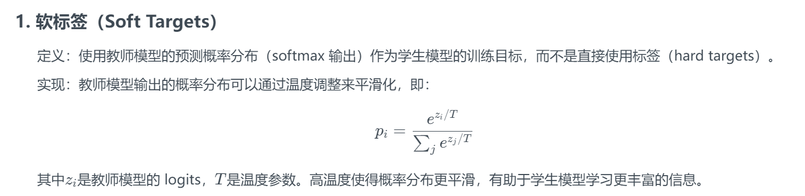

    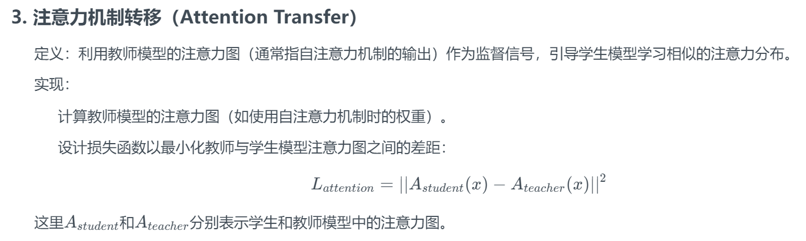

  * C. SNN Training with Knowledge Distillation

    ​	之前的工作都是基于标签信息的蒸馏，这篇文章要做一个基于注意力的蒸馏来进一步提高SNN的性能。

    ​	在本文中，我们首先介绍了一种基于注意力的蒸馏方法，旨在弥合人工神经网络与脉冲神经网络之间的信息表示和传递差距。基于这一注意力机制，我们提出了一种分层蒸馏框架，称为LaSNN，该框架能够有效且高效地转移模型的学习过程。此外，我们采用了替代梯度方法，以优化知识蒸馏过程中SNN的参数。

* **The LASNN Framework：**

  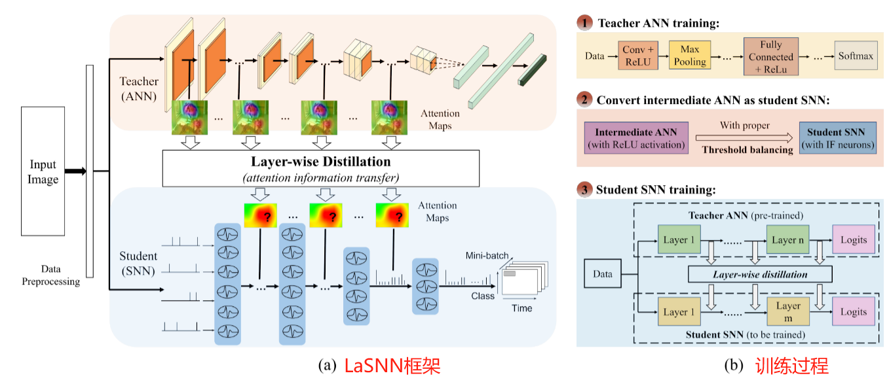

  1. SNN model

     * Encoding Method

       ​	我们采用时间编码方案，将输入图像（模拟值）编码为时空模式（脉冲序列），因为在脉冲神经网络中，信息的表示和传递通过脉冲进行。输入图像的像素值被归一化到[-1, 1]的范围内。当将这些归一化值输入到泊松编码器时，其输出的泊松脉冲序列的速率(平均脉冲发放率)与相应像素的强度成正比。具体而言，在输入图像后，泊松编码器将在每个时间步产生每个像素的随机数，然后将这些随机数与归一化值进行比较。当随机数小于归一化值时，就会输出脉冲。因此，从长时间来看，这些泊松分布的脉冲序列与像素值是相等的。
       （理解：当时间步非常多时，我们可以认为每个像素编码成的脉冲序列值是一致的，这样的话，这样一来，序列中的数值是否小于当前像素值也是确定的，故相同像素值发放脉冲的数量是一致的，且像素值越大，发放的脉冲数量越高。）

     * Spiking Neuron

       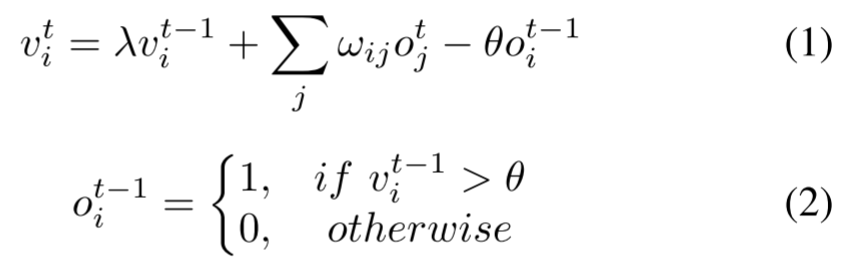

       使用的还是LIF神经元，其中阈值θ在同一层内的值不变，而泄露因子λ为全局固定值。

       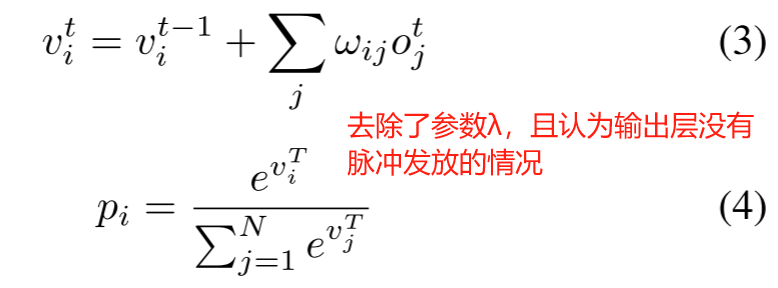

       也就是最终使用的是膜电位来进行分类预测。输出层中神经元的数量和分类目标的数量是一致的。最终输出的是概率

     * Network Architectures

       ​	架构与传统ANN中的VGG，Residual结构类似。但是有一些细节需要被修改来最小化转换过程中的损失。
       ​	首先，由于采用偏置项会增加阈值平衡的难度及转换损失的概率，因此我们不使用偏置项。
       ​	由于去除了偏置项，Batch Normalization也未被采用（BN层里面会涉及到偏置项，当然也可以将BN层的偏置项置为0），这使得每一层的输入偏置都变为零。
       ​	我们在ANN和SNN中都使用了Dropout作为一种可选择的正则化方法。
       ​	其次，我们采用平均池化操作来减少特征图的大小。引入最大池化操作可能会导致显著的信息损失，因为SNN中的激活是二值的。（最大池化选择最大值的操作，可能会造成数值的剧烈变化，导致脉冲发放不平稳）
       ​	我们将残差架构中的原始大卷积核（7x7，步幅2）替换为一个由三个小卷积层（3x3，步幅1）和两个Dropout层组成的替代模块。

  2. ANN-to-SNN Distillation
         教师模型是一个经过充分训练的复杂ANN，包含丰富而准确的注意力信息，而学生模型则是一个具有相似ANN架构的小型SNN。我们将阐述两种表示注意力信息的方法：
     1）基于激活的方案
     2）基于梯度的方案
     这两者共同缩小了真实值ANN与离散信号SNN之间的知识差距。

     * Distilling Activation-based Attention 
       	假设隐藏神经元相对于特定输入的重要性由其绝对值表示，定义$A∈R^{C*H*W}$,表示人工神经网络卷积层的激活张量，定义下面的映射函数：

       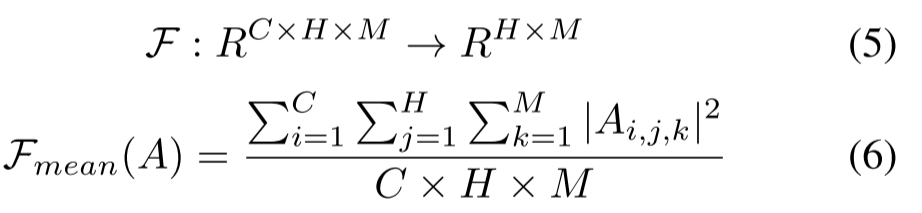

       其中对A进行了平方，是为了增加区分度。这样的话教师模型和学生模型之间的损失就多了一项，如下所示：

       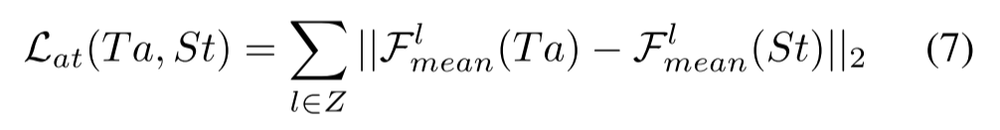

       Ta为教师模型，St为学生模型，$Z$为网络的层数，使用了$L2$​ 范数，将各层的损失进行平方累加求和并开根号。

       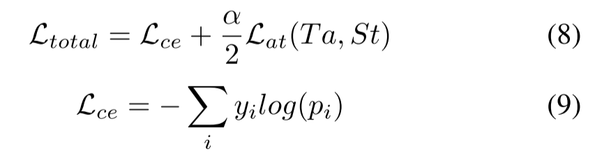

       总的损失就得到了，其中a是一个超参数，$p_i$ 是教师模型输出的概率分布，$y_i$ 是学生模型的输出。

     * Distilling Gradient-based Attention

       ​	假设一个像素的细微变化会对模型的预测产生显著影响，那么模型就会对该像素给予特别关注。在这种情况下，我们定义了一种基于梯度的注意力，这被视为网络所学习的输入敏感性知识。换句话说，模型对输入特定空间位置的关注反映了其输出预测对该位置变化的敏感度。因此，教师模型关于输入的损失梯度定义如下：

       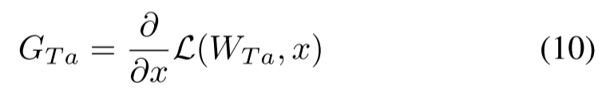

       ​	受到脉冲激活图（Visual explanations from spiking neural networks using inter-spike intervals，SAM）的启发，我们利用前向传播中的脉冲活动来定义输入敏感性函数。

       

       ​	$t^{’}$ 表示上一次脉冲发放时间，集合 $O_{h,m}$ 位于(h,m)处的神经元上一次发放脉冲的时间，这里的(h,m)就是每一层中图片的长和宽。

       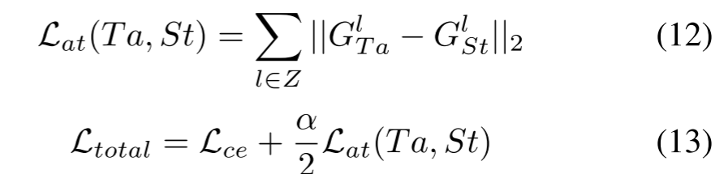

       这里是假定了相同层时，学生模型和教师模型的特征图相同，如果不同的话，就采用插值法或者下采样法进行形状的匹配。

  3. Layer-wise Supervision Strategy

     ​	以往的研究表明，模型每一层的不同部分包含着不同的注意力信息。在低层，神经元表现出强烈的激活；在中层，神经元的激活则倾向于集中在可识别的区域，如脚或眼睛；而在高层，神经元的激活则反映整个物体的特征。

     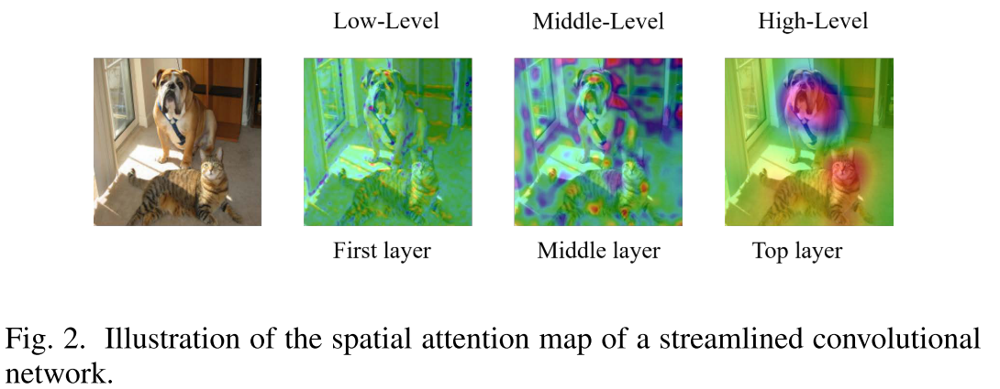

     ​	为了实现最小损失，我们将学习到的注意力知识分为三个层次，从低到高，以充分蒸馏来自教师ANN的注意力信息，并通过设计的损失函数（方程7或12）来监督迁移损失的过程。

  4. Three-stage Training Process of LaSNN

     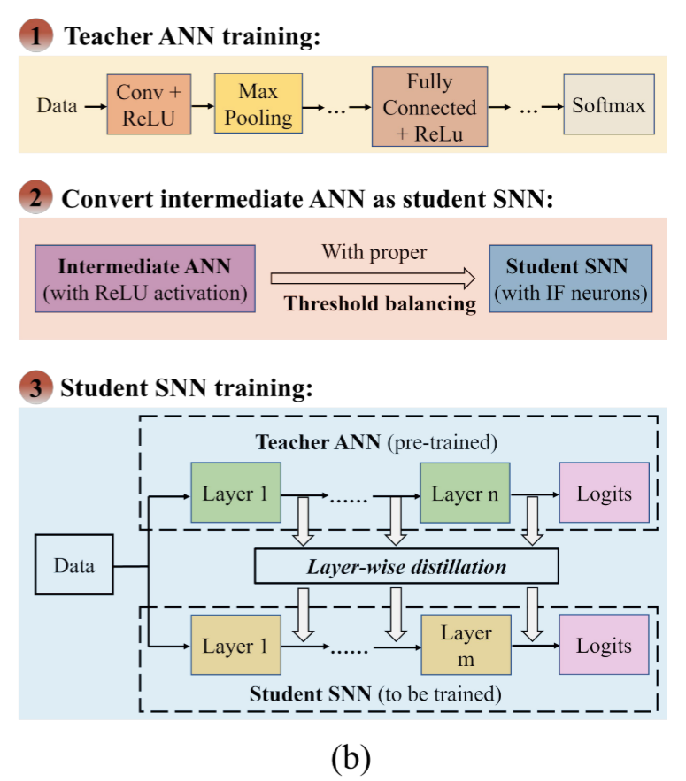

     ​	首先，训练一个带有偏置项和批归一化的教师（大型）ANN。
     ​	其次，将一个较小的单一ANN（中间ANN）转换为学生SNN，并采用脉冲神经元。在转换过程中，我们采用阈值平衡的方法，保持权重不变，然后由最大预激活值进行归一化。
     ​	第三，在教师模型训练完成及学生模型转换后，采用逐层方案将教师ANN的知识转移至学生SNN，包括蒸馏策略和损失函数的设计。
     ​	此外，学生SNN通过反向传播进行优化，利用线性替代梯度来近似不连续梯度。梯度函数如下：

     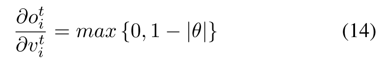

     ​	为了增加稳定性，引入了一个衰减项λ：

     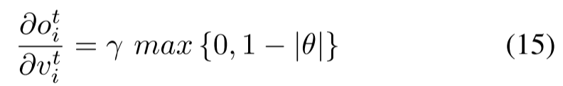

     ​	最终损失关于权重的导数如下：

     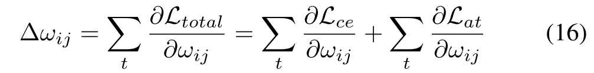

     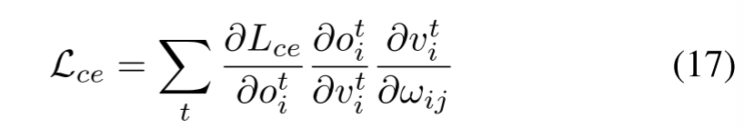

  5. 训练过程的伪算法：

     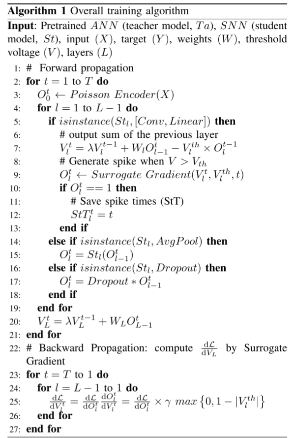

     

* **试验：**

  1. 数据集

     cifar-10,cifar-100,tiny-ImageNet(200个类别，每个类别500张训练，50张验证和50张测试，64*64，RGB)

  2. 训练细节

     首先训练一个大的ANN和小的ANN，其中大的ANN在300次迭代以后收敛，小的ANN在200次迭代以后收敛，接着将小的ANN转为SNN，使用的时间步为2500，然后利用大的ANN进行知识蒸馏给SNN，迭代次数为100，batch_size为16，时间步设置为100，利用上文提到的逐层蒸馏和基于标签的蒸馏。 
     3090，24GB

  3. 结果
     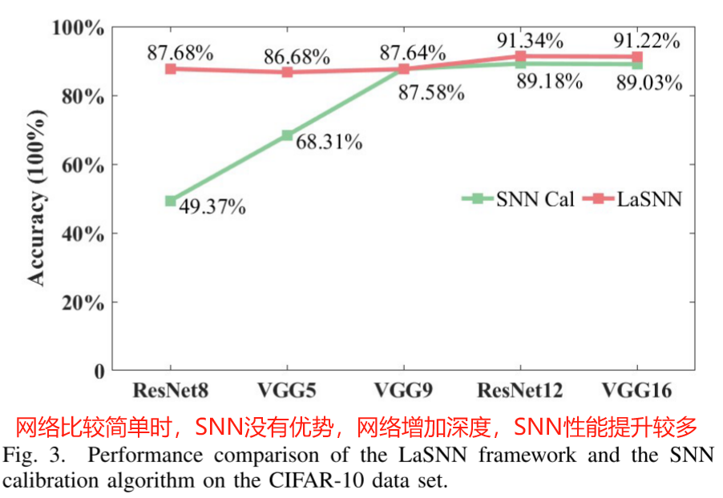

     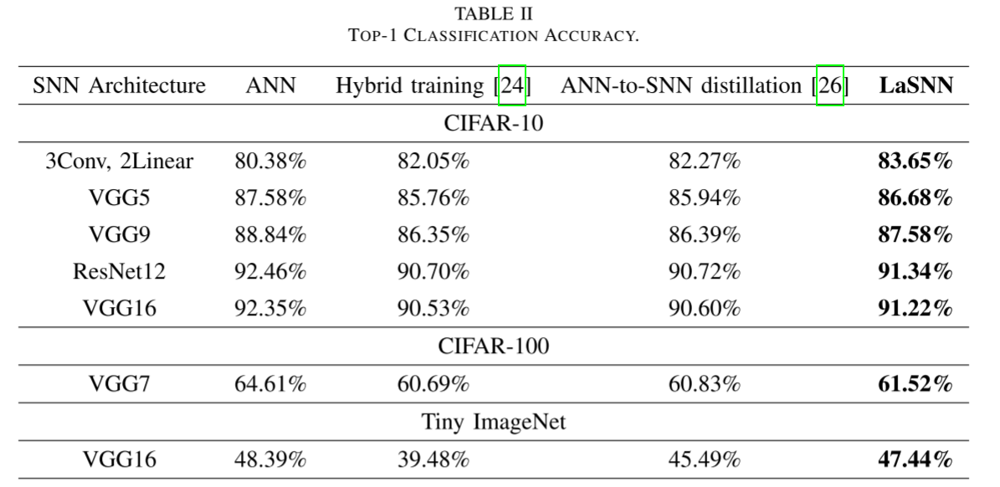

     ​	从结果上看，这篇论文提到的蒸馏方式提高了精度，但是观察网络模型不难发现，这篇论文连ResNet32或者ResNet50都没有用，有两种可能：网络更深时，训练时间以及转换时间太长，作者没有做这个实验，另外一种可能就是，网络更深时，文中所提到的方法效果并不好甚至精度可能很低，所以作者并没有说。

  4. 还有多个实验比较，这里就不列出来了。另外这篇文章并没有给出代码。

     

* **讨论与总结：**

# Constructing Deep Spiking Neural Networks from Artificial Neural Networks with Knowledge Distillation

从人工神经网络构建深度脉冲神经网络的知识蒸馏方法

CVPR2023，大连理工大学(Dalin University of Technology)，浙江大学的教授是通讯

* **摘要：**  

  ==背景：== 当前SNN性能受网络架构和训练方法的限制。SNN不可导的问题，无法直接使用梯度下降。
  knowledge distillation（KD）

  ==工作：== 使用知识蒸馏的方式，ANN作为教师模型，SNN为学生模型，避免了从头开始训练SNN.

  ==意义：== 本文方法可以合理地构建更高效的深度脉冲结构，而且与直接训练或ANN to SNN的方法相比，用更少的时间步数训练整个模型。更重要的是，该方法在面对各种人工噪声和自然信号时展现出卓越的抗噪能力。所提出的新方法为通过构建更深的结构以高吞吐量的方式提高SNN的性能提供了有效途径，具有在实际场景中应用于轻量化和高效的大脑启发计算的潜力。

* **介绍：** 

  1. 使用替代梯度的方法直接训练SNN需要花费很多的计算资源。
  2. 混合模型的训练比较难
  3. 直接将训练后的ANN转换为iSNN,利用的是激活值和脉冲发放率相等。[文章-Optimal ANN-SNN conversion for fast and accurate inference in deep spiking neural networks](https://arxiv.org/pdf/2105.11654)
  4. 和传统ANN to SNN 框架必须的方式不一样，知识蒸馏中的ANN 和 SNN 框架可以不一致。这种方法可以加速训练时间并节约内存。
  5. 使用了三个数据集：MNIST, CIFAR10, and CIFAR100
  6. 主要是测试了模型抗噪能力，证明SNN的知识蒸馏可应用于某些场景。

* **相关工作和动机：**  Related Work and Motivation
  ==总结当前训练SNN的方式：STDP训练，ANN to SNN, Surrogate gradient，ANN distill SNN，Hybrid SNN Training（先训练ANN,接着转为SNN，接着训练SNN），Using ANN to Enhance SNN==

  1. ANN-to-SNN Conversion Methods

     ANN的训练和SNN的转换都非常消耗资源，丧失了实时更新时空信息的能力。

  2. Surrogate Gradient Training Methods

     尽管在某种程度上，替代梯度可以缓解神经脉冲的不可导性，但从本质上来看，这仍然是一种梯度训练方法，生物学上并不太具备可信性。

  3. Motivation

     ​	基于上述的问题，提出知识蒸馏的SNN，结合ANN-to-SNN 和 surrogate gradient，在本文中，我们提出了两种ANN-SNN联合损失函数，以更好地实现从SNN到ANN的知识蒸馏。第一种方法分别利用ANN和SNN的一个输出层，而第二种方法则在多个中间层与输出层之间构建了联合损失函数。

     ​	通过所提出的知识蒸馏训练过程，构建的学生SNN模型能够从教师ANN那里学习到丰富的特征信息，从而使ANN和SNN的结构得以异构。该方法不仅采用ANN到SNN的转换，尽可能保持ANN和SNN的输出接近，还利用了替代梯度方法，将不可微分的函数替换为连续函数，并在梯度计算过程中应用，从而高效地训练深层SNN。

* **方法：**

  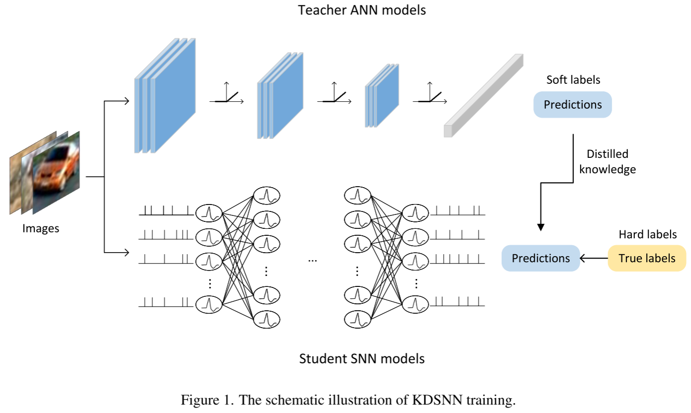

  1. Spiking Neuron Model

     使用IF神经元作为SNN模型

  2. Joint ANN-to-SNN Knowledge Distillation Method
     我们的方法分为两种：基于响应的知识蒸馏和基于特征的知识蒸馏。第一种方法仅从教师ANN模型最后一层的输出中提取知识。第二种方法则从教师ANN模型的多个中间层中提取知识。

     * KDSNN with response-based knowledge distillation.
       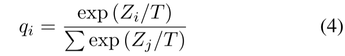

       $Z_i$ 代表的是教师模型的输出，T是为了使得输出值更加平滑。

       首先，对教师ANN模型进行预训练，并在训练学生SNN模型时固定教师ANN模型的权重。随后，学生SNN模型通过公式(4)从教师ANN模型的输出中学习隐含知识。当然SNN也要学习真实标签。

       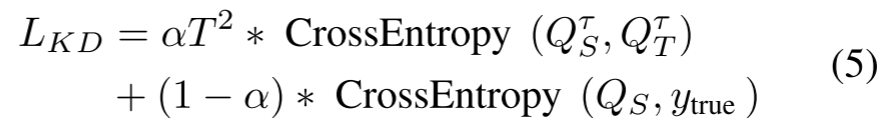

       $T>=1$，α是用来控制那一部分更重要的，a>=0 且a<=1

       

     * KDSNN with feature-based knowledge distillation.

       基于响应的知识蒸馏只能学习到最后几层的知识，无法获取整个ANN的知识，所以才有了这个基于特征的知识蒸馏方式，让SNN学习ANN中间层的特征知识。

       学生SNN模型的特征是通过发放率进行编码的。

       对于resnet，就是在每个block之后进行特征的学习，当特征图尺寸不匹配时，就使用1x1的卷积来操作。

       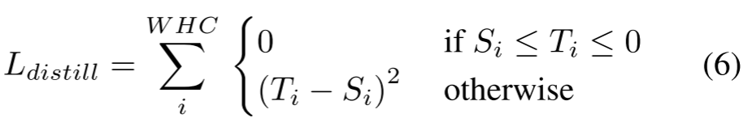

       ==和上一篇文章一模一样，有没有，大同小异。==

       其中，$T_i$指的是经过1×1卷积层转换后的学生SNN模型的中间层特征。为了抑制负面信息的影响，教师ANN模型的特征需要经过边缘ReLU进行转换，而 $S_i$​ 则是经过转换后基于脉冲的特征。

       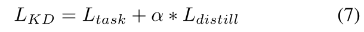

       $L_{task}$​ 就是上文中提到的SNN与真实标签的交叉熵损失

       

     * Training of student SNN model.

       使用替代梯度的方法进行训练。

       文章伪算法：

       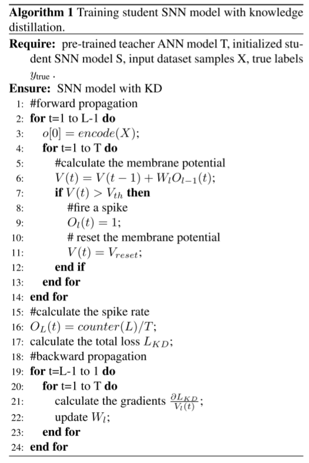

     ​	在第一步中，我们选择具有更高准确性和更复杂模型的人工神经网络模型作为教师模型。教师模型是预训练的，并且在训练学生SNN时，教师ANN模型的权重参数是固定的。

     ​	在第二步中，我们选择一个SNN模型作为学生SNN模型。接着，我们利用教师ANN模型的隐含知识来指导学生SNN模型的训练。在前向传播的过程中，使用相同的数据集样本作为教师ANN模型和学生SNN模型的输入。学生SNN模型将输出转换为脉冲频率作为其特征。预训练的教师ANN模型计算教师模型的输出或从教师模型的中间层提取特征。随后，我们可以得到带有隐含知识的总损失函数，即公式（5）或公式（7）。在误差反向传播的过程中，采用代理梯度方法计算总损失函数的导数，从而更新学生SNN模型的突触权重。

* **试验：**

  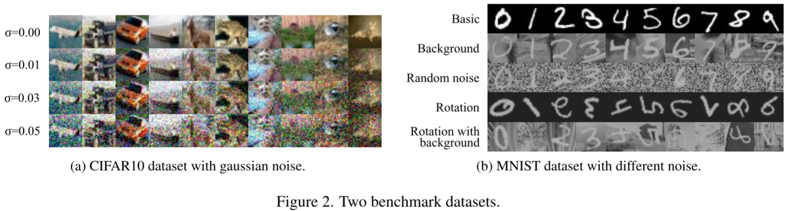

  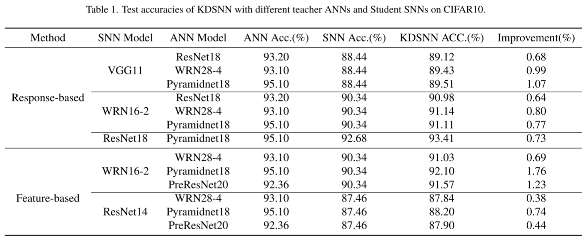

  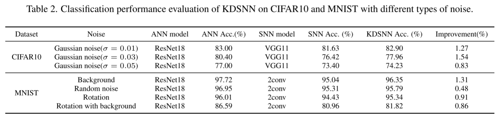

  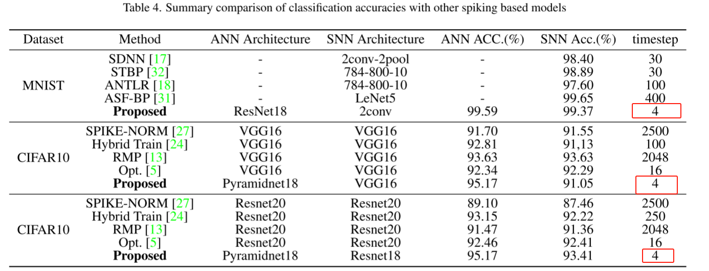

  

# Joint A-SNN: Joint training of artificial and spiking neural networks via self-Distillation and weight factorization

Joint A-SNN：通过自蒸馏和权重分解对 ANN 和 SNN 进行联合训练

中国航天科工集团智能科学与技术研究院
2022年11月1日提交的文章，2023年3月18修订的文章，2023年4月27在线发表。

* **摘要：**  

  ==背景：== 这也导致了训练SNN从头开始需要重新定义发射函数以计算梯度的内在障碍。与之相比，ANN是完全可微的，可以通过梯度下降进行训练。

  ==工作：== 在本文中，我们提出了一种ANN和SNN的联合训练框架，其中ANN可以指导SNN的优化。该联合框架包含两个部分：首先，利用网络中的多个分支，将ANN中的知识蒸馏到SNN。其次，我们对ANN和SNN的参数进行了限制，使它们共享部分参数并学习不同的独立权重。

  ==实验：== 在多个广泛使用的网络结构上的大量实验表明，我们的方法始终优于许多其他最先进的训练方法。例如，在CIFAR100分类任务上，通过我们的方法训练的脉冲ResNet-18模型只需4个时间步长即可达到77.39%的Top-1准确率。

* **介绍：** 

  SNN的时序处理能力使得其学习时空信息和ANN不同。
  STDP算法缺乏关于误差的全局信息。
  替代梯度使得SNN的训练不稳定，收敛慢，相比于ANN。
  ANN to SNN  需要很长的时间步去推理，且这样的话SNN没有自己学习的特征

  ​	在这项工作中，我们提出采用ANN和SNN的联合训练框架。在训练期间，ANN和SNN的部分参数是共享的。
  ​	具体而言，我们使用奇异值分解（SVD）进行权重矩阵分解，并让ANN和SNN优化各自的奇异值权重，但保持奇异向量相同。---**奇异值不同，但是奇异值向量相同**。
  ​	其次，我们在网络中添加多个分支，从而实现知识从ANN到SNN的蒸馏，这被称为自我蒸馏。	
  ​	我们的方法可看作是ANN to SNN 和 替代梯度 训练的结合。
  ​	我们不改变SNN中的替代梯度，但在SNN的训练过程中提供指导。
  ​	不像ANNtoSNN，这两者共享相同的参数，我们增加了自由度 (例如参数中的不同奇异值)，但限制它们完全不同。

  ==扩展知识：== 权重矩阵分解（Weight Matrix Decomposition）是一种通过将权重矩阵分解成几个较小矩阵的乘积来优化模型的技术。这种方法在深度学习中具有减少模型参数、降低计算复杂度和提升模型性能等多种好处。
  	==方法：== 奇异值分解，低秩分解，张量分解，分块矩阵分解。
  	==应用领域：== 卷积神经网络（将3D卷积分解为多个1D卷积），全连接层（权重矩阵的分解），模型压缩与加速，知识蒸馏。
  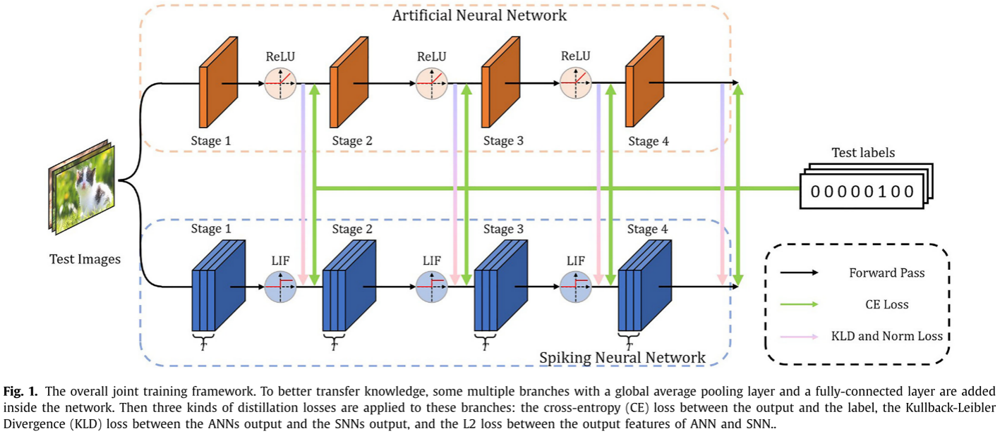

* **相关工作：**

  1. SNN（ANNtoSNN, Surrogate gradient）——之前的工作都没有很好的解决脉冲发放函数以及梯度消失/爆炸的问题。
  2. Knowledge distillation

* **Preliminary：**

  1. Leaky integrate-and-Fire model

     考虑到直接输出脉冲的数量来计算噶概率会丢失掉太多的信息（ANN输出有正负，但是SNN的输出只有正值），本文选择整合网络的输出。

     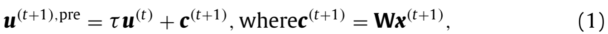

     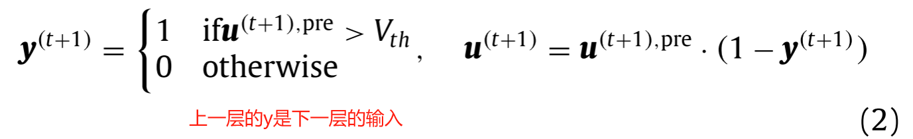

     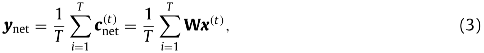

     之后就可以根绝真实标签和Softmax（$y_{net}$）去计算损失了。

* **Method:** 

  首先是阐述了本工作的动机，例如梯度计算问题，其次介绍了自蒸馏算法，最后是参数的权重分解

  1. Motivation

     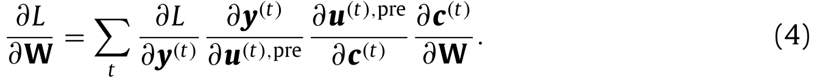

     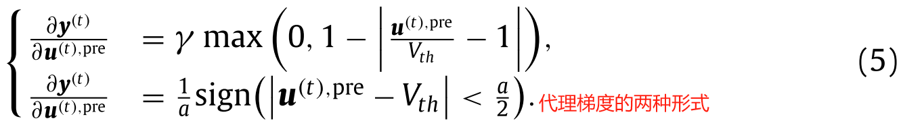

     它们都有一个超参数来控制替代梯度的宽度和锐度。如果$V_{th}=0.5 且a=1$​​，矩形函数将变成Straight-Through Estimator(反向传播时梯度为恒定值。

     SNN的输出是0或者1，存在梯度消失或者爆炸的问题，即使有了残差块，仍然存在.(可以参考之前讲解的SEW_Resnet网络)

     ==扩展知识：== 替代梯度的宽度和锐度    the width and the sharpness
     宽度指的是梯度的覆盖程度，宽度越大，梯度更加平滑，但可能导致梯度不精确。
     锐度指的是梯度的陡峭程度，锐度越高，梯度更加陡峭，但可能导致梯度消失问题。

  2. Self distillation

     仿照残差块，在每个block之后，添加分支，用于知识蒸馏，共添加了四个分支。蒸馏框架的整体损失如下：

     * 中间分支都要和真实标签做损失，$z$为真实标签

       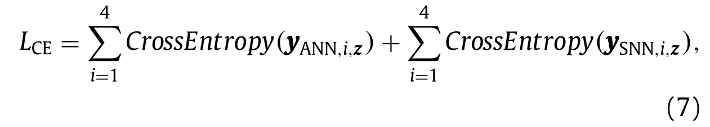

     * ANN 和 SNN 输出之间的 KL散度损失。这一损失函数基于softmax（即类别概率）进行计算，确保SNN的输出应该模仿ANN的输出。其公式可以表示为：

       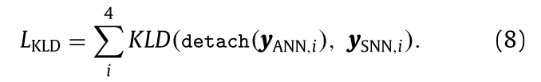

       此时ANN的输出在计算时是梯度分离的，否则会导致准确率下降。

     * 由于SNN架构中的时间维度和二进制激活，ANN中的特征和SNN中的特征可能具有不同的量纲。因此，我们在ANN和SNN的输出特征之间施加L2范数损失，其公式为：

       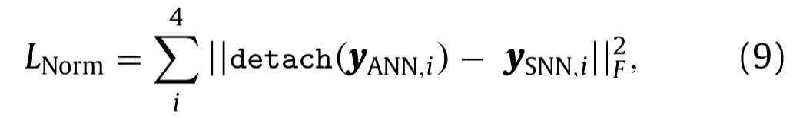

       ​	我们将这三个损失函数同时优化，以将知识从ANN转移到SNN。值得注意的是，==来自第一阶段和第二阶段输出的损失函数为浅层提供了指导信息==，从而缓解了梯度爆炸/消失的问题。总体损失函数可以写作:

       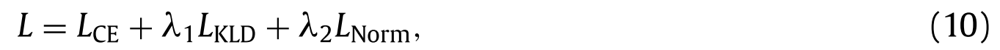

       $λ_1和λ_2是超参数，用于控制蒸馏的损失。$

  3. Weight-Factorization training（WFT） **partial weight-sharing**

     ​	对权重参数应用奇异值分解（SVD），并共享ANN和SNN的特征向量，同时分别优化ANN和SNN的特征值
     ​	对一个全连接层权重值进行奇异值分解： $W ∈ R^{c_{in} ×c_{out}}$

     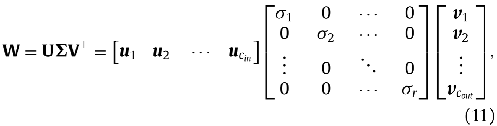

     σ是奇异值，r是奇异值的数量，SVD可以把权重分解成：

     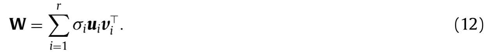

     在本文的权重因子化训练中，SNN和ANN具有相同的特征向量，但是具有不同的特征值：

     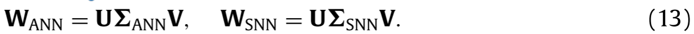

     在梯度下降中，这几个矩阵 $U,V,∑_{ANN},∑_{SNN}$​  是同步更新的。

     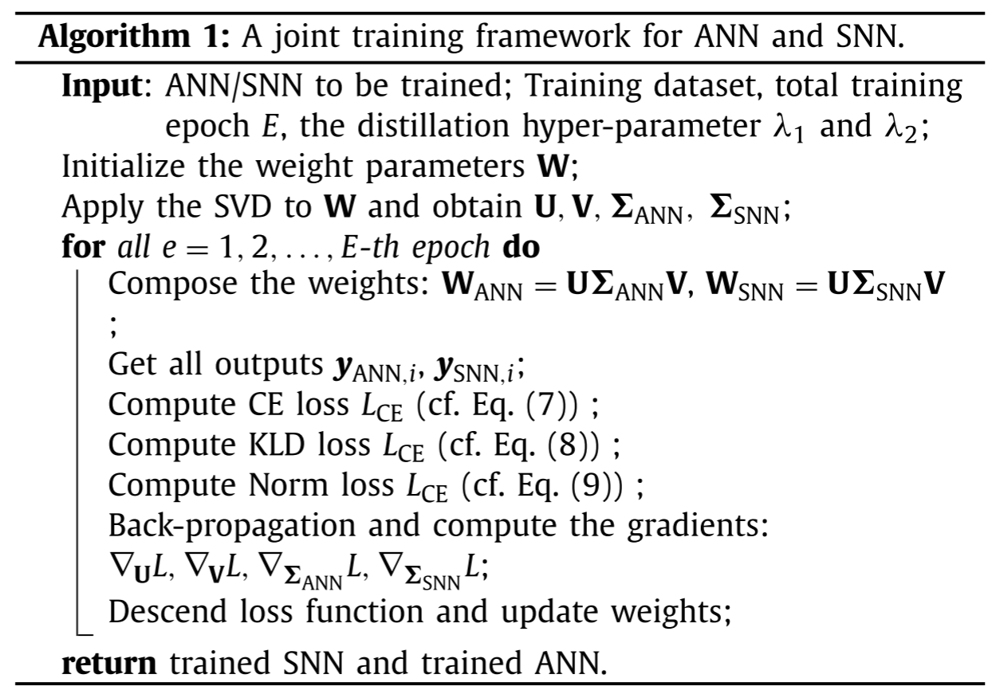

**结果:** 

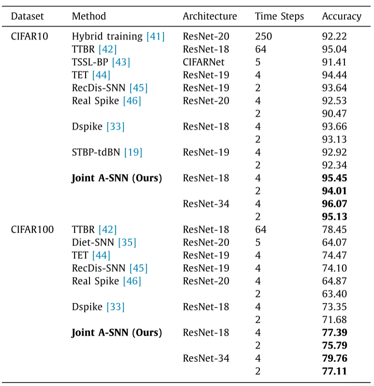

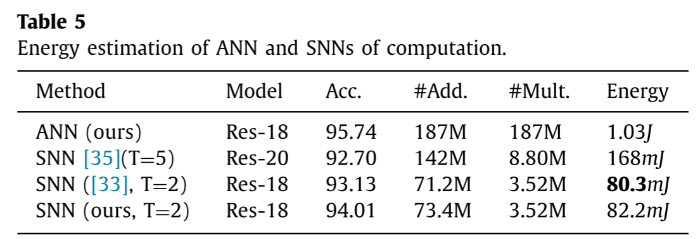

**Computational Energy Cost： ** ANN中 multiply-accumulate (MAC)的操作 消耗 4.6pJ。 SNN中accumulation的操作消耗0.9pJ，
 ==参考文献1:== Diet-snn: direct input encoding with leakage and threshold optimization in deep spiking neural networks  
 ==参考文献2:==  1.1 computing’s energy problem (and what we can do about it),

**Data Movement Energy Cost：** 

==总结:==  该方法在多个广泛使用的网络结构上，较原始基线和现有最先进技术都带来了显著的提升。由于ANN在空间特征处理方面表现卓越，但在时间特征处理上相对较弱，因此依赖ANN的指导将在一定程度上限制SNN的时空处理能力。未来，我们将进一步研究ANN与SNN结合的方式，以优化基础代码，并保留SNN的时空处理能力。（有点扯）

奇异值分解：[参考链接](https://mp.weixin.qq.com/s?__biz=MjM5NzEyMzg4MA==&mid=2649469857&idx=7&sn=516b3ae2bee08db0a450c46c826d9c45&chksm=bec1d1e689b658f044cf9896ae3fb5ce5472f00cfd6ad61611239dfcc1e44fecf08838d3d770&scene=27)

# SpikingBERT: Distilling BERT to Train Spiking Language Models Using Implicit
Differentiation

通过隐式微分对BERT进行蒸馏以训练脉冲语言模型

[代码地址](https://github.com/NeuroCompLab-psu/SpikingBERT)

* **摘要：**   

  ​	==背景：== 尽管大型语言模型（LLMs）日益强大，但其神经元和突触的数量仍远远少于人脑。然而，它们的运行所需的功耗却显著更高。

  ​	==工作：== 在本研究中，我们提出了一种新的仿生脉冲语言模型，旨在通过借鉴大脑中突触信息流的原理，降低传统语言模型的计算成本。本文展示了一种框架，利用神经元在**平衡状态下的平均脉冲频率**，通过隐式微分技术训练神经形态脉冲语言模型，从而克服SNN的不可微问题，而无需使用任何替代梯度。

  ​	==细节：== 脉冲神经元的稳态收敛特性使我们能够设计一种脉冲注意力机制，这对于实现可扩展的脉冲语言模型至关重要。此外，利用神经元在平衡状态下的平均脉冲频率的收敛性，我们开发了一种基于ANN-SNN知识蒸馏的新技术，其中使用经过预训练的BERT模型作为“教师”，来训练我们的“学生”脉冲架构。尽管本文中提出的主要架构受BERT的启发，但该技术也可延伸至不同类型的大型语言模型。

  ​	==实验：== 我们的工作首次展示了一个可操作的脉冲语言模型架构在多个不同任务上的性能，基于GLUE基准测试。

  

* **介绍：**

  大语言模型比较耗能，而使用SNN具有节能的优势，预期可以获得更好的能耗比。
  任务的复杂性，加上所需模型体系结构不断增长的深度，使得BPTT实际应用不可行。
  并没有使用BPTT，而是利用前向阶段到平衡状态的平均脉冲发放率（在历经所有时间步之后）

  ==average spiking rate (ASR)  平均脉冲率==
  在收敛后，可以从基础模型中推导出固定点方程，并随后对得到的稳态进行隐式微分，从而有效地训练模型参数。

  隐式微分训练主要应用于==深度平衡模型（deep equilibrium models，DEQ）==（Bai, Kolter, 和 Koltun 2019，**我下载了这篇论文，然后这些作者在2020年还更新了这个算法--MDEQ，另外这个DEQ第一次被使用，且已经发表的论文我也下载了---Xiao et al. 2021**）。最近，这一方法也被用于基于卷积的脉冲神经网络架构，以应对视觉相关任务。这种方法在训练过程中展现出卓越的内存效率，相较于需要大量内存来存储庞大计算图的反向传播通过时间（BPTT）方法，它更加高效。此外，==通过隐式计算梯度，这种方法消除了对代理梯度方法的需求，进而规避了脉冲模型的非可微性问题。==在特定约束下，这种学习形式与生物合理和基于能量的训练方法如平衡传播相似，从而进一步支持了神经形态学习的视角。

  在本论文中讨论的基于Transformer的语言模型中，注意力机制是一个至关重要的组成部分。然而，传统的注意力机制在本质上并不具备脉冲特性，因为它依赖于一系列实值向量来表示查询、键和值。我们在此提出了一种脉冲注意力机制，利用脉冲输入，并在模型收敛所需的时间步数（$T_{conv}$​）上进行运算。在神经元达成平衡状态时的脉冲发放率（ASR）收敛，使我们能够在脉冲注意力层的ASR与传统注意力之间建立密切的等价关系。

  ==本文贡献：== 

  1. SpikingBERT with Spiking Attention
     提出了脉冲注意力，在平衡状态下近似于普通的脉冲注意力。
  2. Spiking LM Training
     在理论上和实践上证明了所提的训练方法能够收敛，且不使用替代梯度。具有可扩展性。
  3. ANN-SNN KD using Equilibrium States
     在脉冲网络达到平衡状态时，使用知识蒸馏框架去更有效的训练SNN，使用大型ANN可以得到小型SNN。对于SNN来说，参数不用增加。

* **相关工作：**  

  1. Spiking Architectures  脉冲网络的架构：

     * 基本都是在图像分类上，很少又在NLP任务上的。大部分模型都是没有注意力的浅层模型。

     * GPT是一个基于解码器的架构，而BERT是一个基于编码器的架构，可以捕捉双向上下文信息，更适合文本分类问题。在很多GLUE benchmark的任务上较好。
     * ==之前也有关于知识蒸馏的SNN，但是还是基于BPTT和替代梯度的。提到了上面介绍的其中两篇文章。==

  2. Efficient LMs  有效的语言模型

     * 先前关于语言模型的蒸馏也做了很多的工作，包括将BERT精简化，BERT蒸馏，甚至将BERT蒸馏到LSTM上。
     * 由于目前尚无合适的神经形态基准，我们将所提议的模型与现有的标准自然语言处理模型和高效语言模型进行了比较。   ==standard NLP models and efficient LMs==

* **方法：** 

  ​	在本节中，我们将首先探讨我们方法的基本原则。随后，我们将深入网络结构的细节，以提供全面的理解。我们研究了==在使用隐式微分法训练的脉冲神经网络中， 平均脉冲率(ASR)收敛的理论和实证基础==。此外，我们提出了一种创新的方法，以利用这一收敛现象设计脉冲注意力机制，并引入了一种==新颖的知识蒸馏机制==，采用预训练的BERT模型作为“教师”，从而提升学习过程。我们还详细阐述了使用隐式微分技术训练我们脉冲架构的框架。

  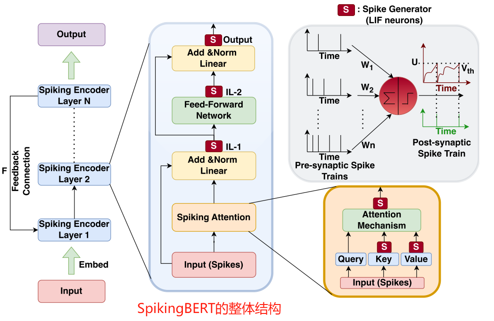

  1. Spiking Neural Networks
     使用的是LIF神经元

     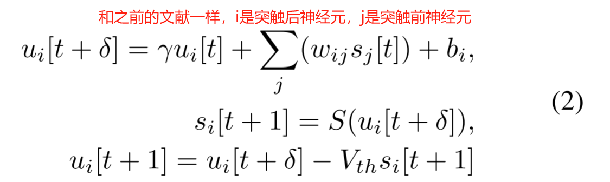

  2. Implicit Modeling    隐式建模

     ​	隐式建模采取了一种不同的方法，不是==明确地定义==模型从输入到输出的具体计算过程，而是通过对模型==施加特定的约束==，确保这些约束得以满足，以实现预期的结果。
     ​	$首先是一个简单的例子，x ∈ X,z ∈ Z, z = h(x)$，为了隐式的表达这个函数，定义一个新的函数 $g：X*Z，且 g(x,z)=h(x)-z,$  $那么我们的目标就变为了求 g(x,z) = 0 的解$，虽然这个例子展示的是代数方程，但这些方法可以扩展到不动点方程，从而发展DEQ(deep equilibrium models)算法。

     ​	一个固定点方程，设 $z = f_θ(z)，θ是一个参数,z依赖θ$，设这个方程在 $T_{conv}$ 个时间步后收敛，此时  $z_{T_{conv}} = z_{T_{conv}+1}$ , 相应的，可以得到对应的等式 $g_θ(z) = f_θ(z)-z$，定义的损失函数将使用平衡时z值，$z_{T_{conv}} = z^*$ ,使用DEQ算法中得到的结果，可以得到：

     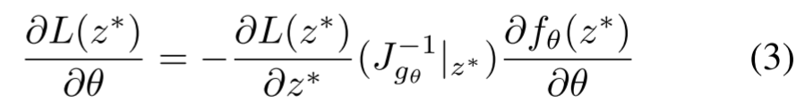

     ==这里自己推导一下该过程：== 

      $ \frac{\partial L(z^*)}{\partial θ}  = \frac{\partial L(z^*)}{\partial z^*} \times \frac{d z^*}{d θ}$， 接下来就是求 $\frac{d z^*}{d θ}$​

     平衡状态下，我们可以将 $z^*$ 视作是 $θ$ 的函数，对该式 $z^*=f_θ(z^*)$ 进行求导 ：

     $\frac {dz^*}{dθ} = \frac {\partial f}{\partial z^*} \times \frac{dz^*}{dθ} +  \frac {\partial f}{\partial θ}$

     变换形式可以得到：

     $\frac{dz^*}{dθ} = (I-f^{\prime}(z^*))^{-1}  \times \frac {\partial f}{\partial θ}$      **表达1**

     当$ z = z^*$, $g_θ(z^*) = f_θ(z^*)-z^*$, 此时$z^*$ 为常数，

     方程两边对$z^*$求导，可以得到 $\frac{\partial g}{\partial z^*} = \frac{\partial f}{\partial z^*} - 1$，等式两边同时加个负号，就可以替换**表达1**

     所以理论上g和f可以互换，后续还需要看原论文的所有推导方式。==DEQ==

     ---------------------

     ----------------------------------

     # ==知识补充==

     ### 固定点方程

     固定点方程描述了系统在某一特定状态下保持不变的点。
  固定点方程通过将差分方程中的自变量设为常数，并令方程左右两边相等而得到的。
     求解固定点方程可以得到一个或多个平衡点，这些平衡点对于理解系统的动态行为和稳定性至关重要。
     
     在差分方程的稳定性分析中，平衡点的稳定性是一个核心问题。
  判断平衡点稳定性的主要方法是利用线性化技术，即在平衡点附近对差分方程进行线性化处理，然后分析线性化方程的特征根。==根据特征根的性质，可以判断平衡点的稳定性：如果特征根的模小于1，则平衡点是稳定的；如果特征根的模大于1，则平衡点是不稳定的；如果存在特征根的模等于1，则平衡点处于临界稳定状态==。
     
     ### 深度平衡模型DEQ

     深度平衡模型（Deep Equilibrium Models，简称DEQ）是一种创新的深度学习架构，它引入了一种新颖的==隐式深度架构==，通过直接求解和反向传播无限深网络的固定点平衡状态，彻底改变了我们对深度学习的理解。
  DEQ模型的核心在于其隐式深度特性，它利用固定点求解器（如Anderson加速和Broyden方法）来迭代求解网络的平衡状态，这种设计不仅简化了网络结构，还通过雅可比正则化等技术增强了模型的稳定性。
     
     DEQ模型具有以下几个显著特点：

     1. **无尽深度**：DEQ模型以等价于无限层网络的平衡态进行计算，无需实际堆叠大量层，从而实现了理论上的无限深度。
  2. **高效内存管理**：DEQ模型在保持高性能的同时，仅需O(1)的内存，显著减少了对硬件资源的需求。
     3. **兼容现代结构化层**：DEQ模型支持Transformer等现代结构化层，使得其在自然语言处理（NLP）和计算机视觉（CV）等任务中都能达到最先进的性能。
     4. **稳定性工具**：DEQ模型提供了雅可比正则化等工具，帮助稳定隐式模型的训练过程。
     5. **易于扩展**：DEQ模型的项目结构清晰，代码简化，便于用户根据自己的需求进行扩展和定制。
     
     -----------------------------------------------------------------

     --------------------------------------------------------

  3. Architecture

     从生物学的角度来看，反馈连接存在于人类大脑中，并且在某些情况下即使是具有递归连接的浅层网络，其性能也与深层架构相当或更佳。

     整体架构和BERT类似，且添加了反馈机制，论文中说和视觉任务添加了反馈连接表现不一样，在语言任务上，反馈连接并没有显著提高性能，但仍然是一个可选项，并希望在未来任务中继续使用。

     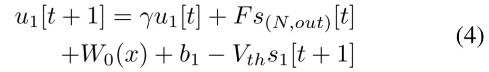

     ​	$W_0$ 是嵌入层对输入进行的变换，最终输出向量$y ∈R^{N_s×D_{emb}}$。 长度x维度
     F是最后一个编码层返回的结果，作为权重反馈连接, b1是偏差，$s_{(N,out)}[t]$  是第N个脉冲编码层在前一个时间步中产生的脉冲，其他就是原始的LIF神经元。
  
     ​	接下来是其它层膜电位的变化，此时就没有反馈连接了：

     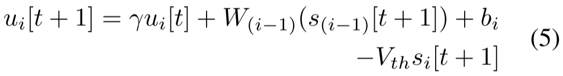

     ​	第 $i$​​ 层的平均脉冲发放率为，$γ$ 是前面提到的泄露因子：

     ​								 $a_i[t] =  {\sum_{τ=1}^{t} γ^{t-τ} s_i[τ] \over \sum_{τ=1}^{t} γ^{t-τ}}$

     ​	从公式可以看出，前面的时间步由于$γ$ 的指数项比较大，所以比重比较小，而后面的时间步，比重比较大，相当于是对第t步的平均脉冲发放率应该是与它最近的几个时间步 连接权重比较大。

     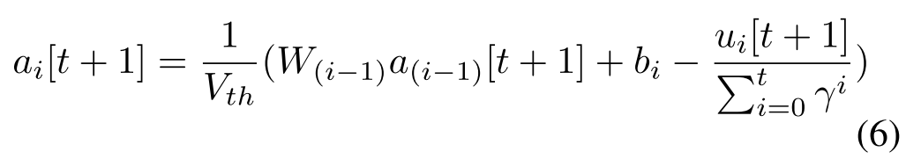

     ==探寻一下这个公式的形成过程：==

     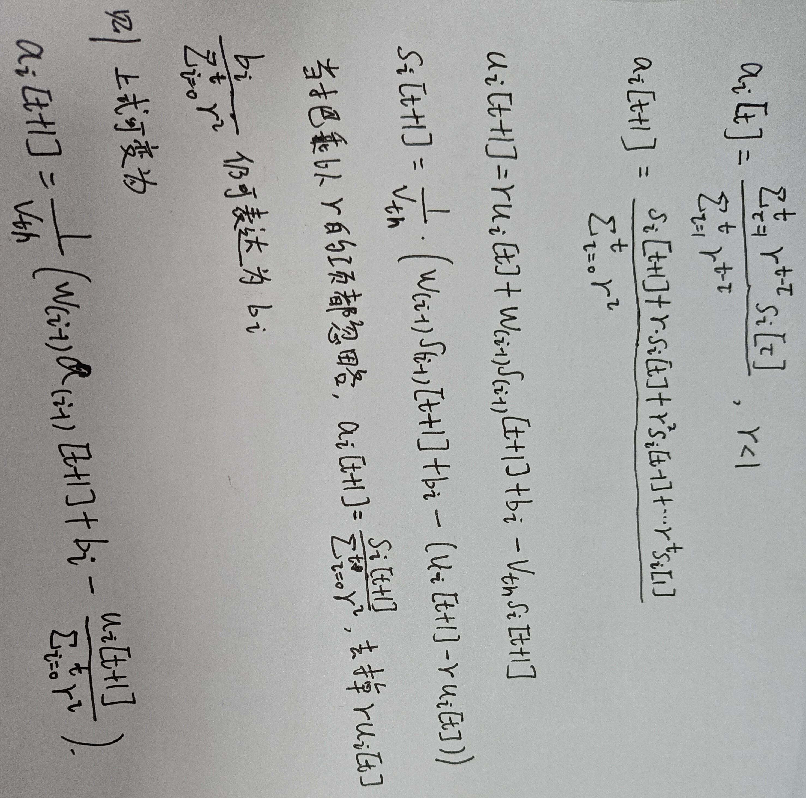

     $x[t](平均输入) → x^∗， a_i[t] → a_i^∗$， 在平衡状态下，平均发放率的关系如下：

     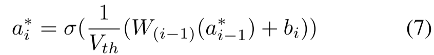

     $σ函数就是将控制输出在[0,1]$  上面很容易，因为平衡状态下，膜电位的值，脉冲发放都成了固定值。

     

     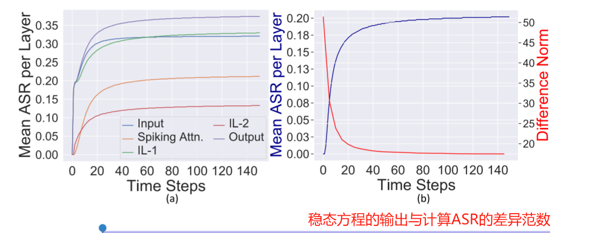

     对于脉冲注意力层，在平衡状态下的替代稳态等式为：

     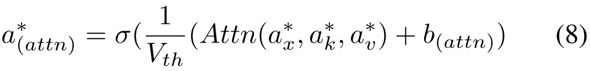

     第一层稳态下加了反馈连接的输出：

     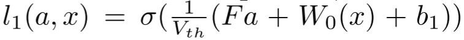

     ==整个求导过程都使用的是ASR，也就是没有在时间步上进行反向传播，这就大大减小了反向传播时的计算机内存和功耗，故即使此处使用的时间步很大，也不会增加多少资源消耗。==

     

  4. Spiking Attention Mechanism

     本文提出的脉冲自注意力机制，这里的 $x 等同于 原始自注意力机制的Q$：

     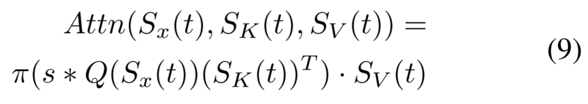

     qkv都是输入的值与权重相乘得到的，$π$是softmax函数,s是缩放因子。
     参考系统框架图，里面显示的只有Q矩阵是float值，其余矩阵都是脉冲值，而在原始的Attention中都是float值，自然计算复杂度就降低了很多。原始的的复杂度为$O(n^3)$, 且为乘法和加法的操作，在这个脉冲注意力中，复杂度也为$O(n^3)$,但只有加法操作。
  
  5. ANN-SNN KD using Equilibrium States

     这篇文章的蒸馏框架：   使用学生SNN中间层的稳态ASR去逼近ANN中间层的激活值。

     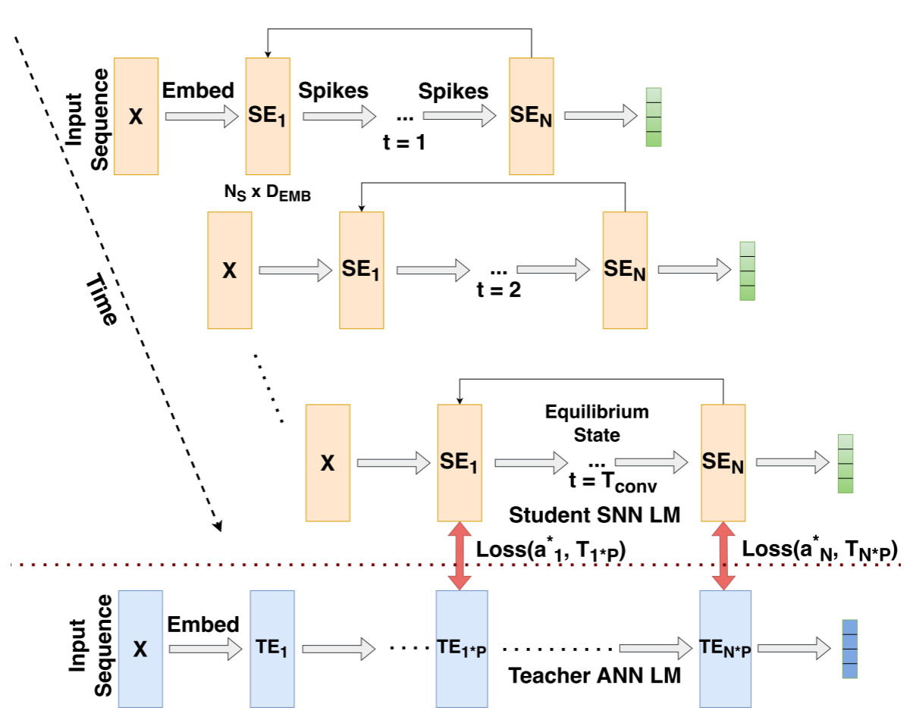

     蒸馏过程中使用到的损失函数如下：

     

     $W_{T_d}$​ 是一个将学生模型的维度映射为和教师模型一致的变换。

     教师模型的编码层数量是比学生模型的数量多的，就需要进行选择性的学习，将学生模型的编码成对应到教师层的某些层上。

     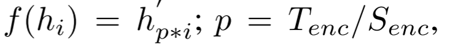

     这儿训练的时候，同样使用的是公式3，把里面的 $z^*替换为a^*$。

     

     中间层蒸馏完之后，当然对预测层也需要蒸馏，$c是一个线性映射，t'就是一个调控参数$。

     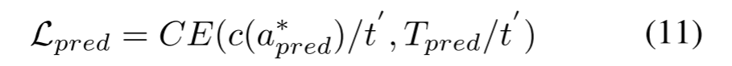

     ==自己推断：以此类推，其实也可以增加对网络第一层出来之后的蒸馏，就是数据编码部分==
     
     蒸馏分两部分进行，第一部分是对ANN大模型使用通用领域的知识而不是专门的任务进行预训练，第二部分是对ANN具体任务上进行微调，这个过程中SNN跟着一起训练。通过这个过程，大大减小SNN尺寸。
     ==参考文献： Tinybert: Distilling  bert for natural language understanding==
  
* **试验：** 6个分类任务，1个回归任务。    ==internal layer KD（IKD）==

* 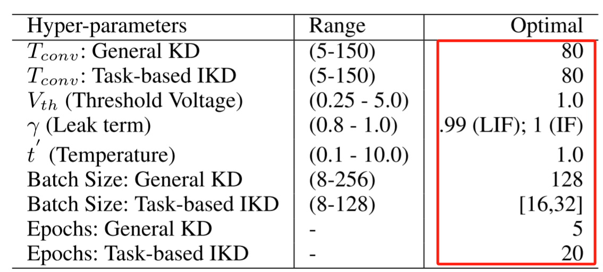

  ​	中间提到了一个SpinkingGPT，这个网络在参数为45M的时候在SST-2数据集上实现了80.39的准确率，而在参数量为216M的情况下，实现了88.76%的准确率，但是本文设计的网络参数量为50M，实现了88.19%的准确率，其实查看下面这个结果，不难发现，这篇文章提出的网络之所以能够所有数据集上都有不错甚至最有的效果，主要原因应该是使用了==通用数据的预训练==，所以之后如果考虑这个方向，可以看看==如何改进现有的比较统一的知识蒸馏的方法==。  知识蒸馏的作用应该主要是进一步提高准确率吧

  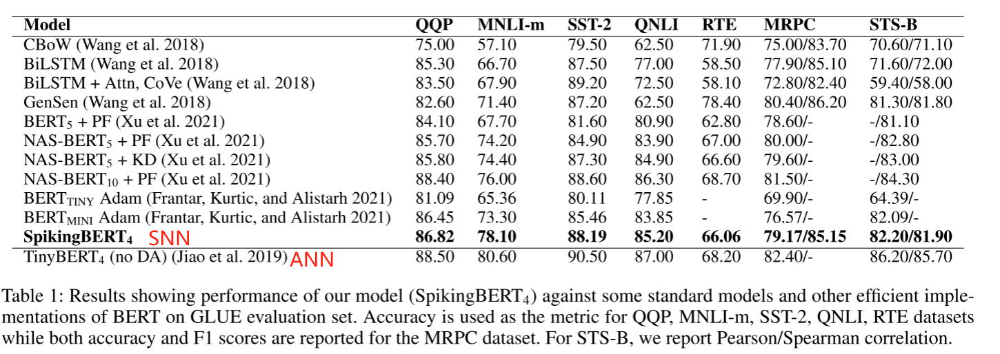

* **Analysis of Power & Energy Efficiency：**  电力与能源效率分析

  计算操作数使用到了这个公式：

  $Norm\#OPS = {\sum_{i} IFR_i \times Layer\#OPS_{i+1} \over \sum{Layer\#OPS}}$
  $IFR_i是第i层所有神经元在多个时间步上的脉冲数的平均数。$ 
  $对于ANN来说，所有神经元都会被激活，所以Norm\#OPS=1$

  $根据先前的理论，一个ACC(SNN)操作消耗能量是0.9pj，一个MAC(ANN)的操作消耗能量是4.6pj，
  是ACC的5.1倍。$

  $可以得到ANN/SNN的能量效率比为 ： e = {1 \over {{1 \over 5.1} \times Norm\#OPS}},也就是 e = ({{1 \over 5.1} \times Norm\#OPS})^{-1}$

  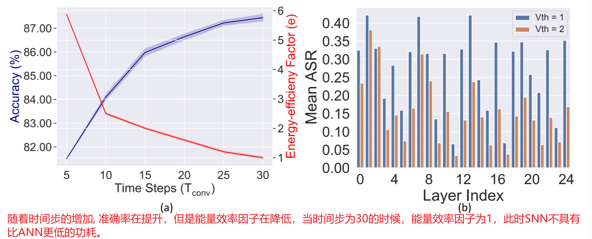

  ​	图b显示了增阈值增加，可以减小脉冲平均发放率，但是更难收敛，所以会带来时间步的增加，这也就是最终选择阈值为1，时间步为16。当然最有的是80个时间步。文中还提到，减小阈值，可以大大降低瞬时功耗，因此适用于边缘计算。

* **讨论与总结：**

​	借鉴人脑的惊人复杂性，这种复杂性超越了任何现有的语言模型，我们有机会利用这些见解，构建出不仅能够模拟生物学上合理的行为，还能通过最低的能量消耗提供高效解决方案的模型。在本文中，我们提出了一种脉冲语言模型（spiking LM），并在GLUE基准测试中进行了多任务评估。我们引入了脉冲注意机制，利用稳态收敛，提出了一种新颖的基于人工神经网络（ANN）和脉冲神经网络（SNN）的知识蒸馏方法，以实现更快和更高效的学习，同时通过隐式微分来探索脉冲语言模型的训练，从而克服影响SNN模型训练的多种问题。在洛希2（Loihi 2）等神经形态硬件上实施我们的模型进行推理，将有助于开发出一种低功耗的解决方案，潜在地可在边缘设备上应用。未来，我们还可以进一步扩展这种方法，以设计其他脉冲语言模型，如GPT等。不过，目前所提出的脉冲语言模型与基于BERT的微调模型之间仍存在一定的性能差距。我们可以通过深入研究多样的脉冲神经元模型、考察时间编码方案以及引入渐变脉冲等策略，努力缩小这一差距。

​	从上面几篇论文中，不难发现，都在强调替代梯度存在梯度爆炸或消失或梯度不可导的问题，这种情况下有两种解决办法：一种是优化网络结构（SEW_ResNet）并使用替代梯度的方式，一种是网络结构不用怎么变但是去优化梯度替代的方式（使用DEQ，深度平衡网络），==同时后续改进知识蒸馏可以是一个方式。==

# 十二

# ==1==

* **摘要：**  
* **介绍：**
* **方法：**
* **试验：**
* **讨论与总结：**