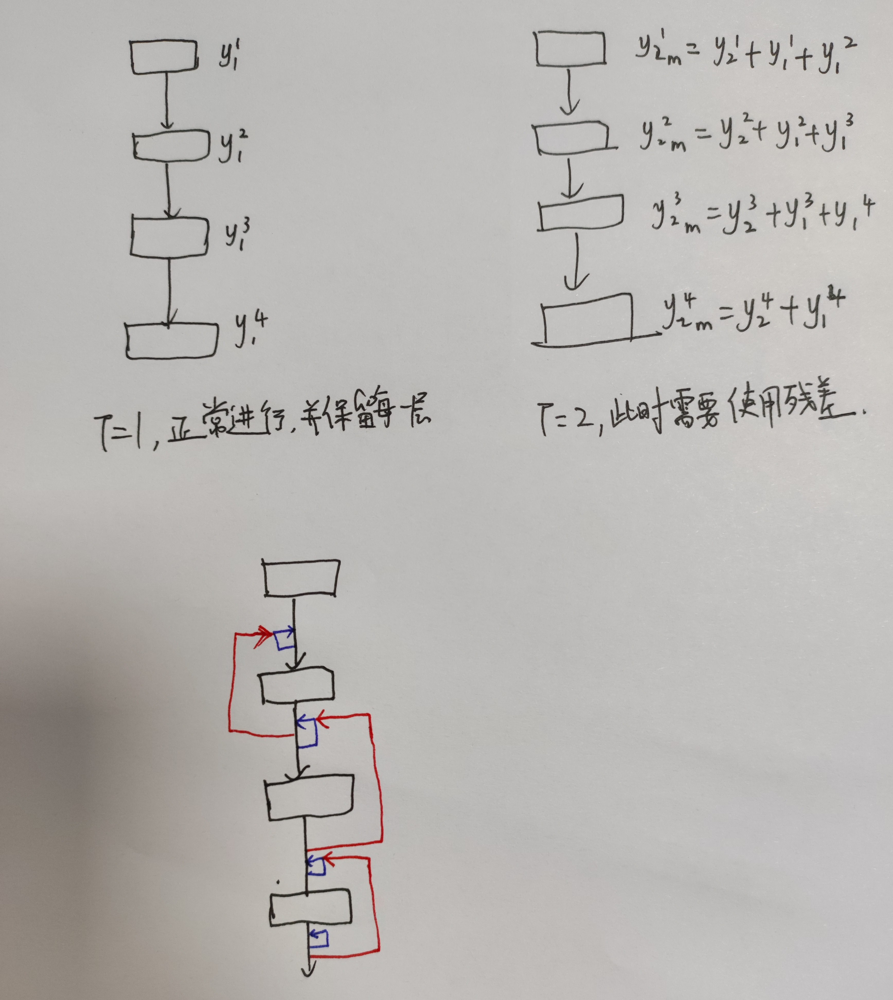
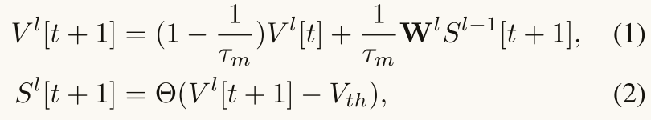
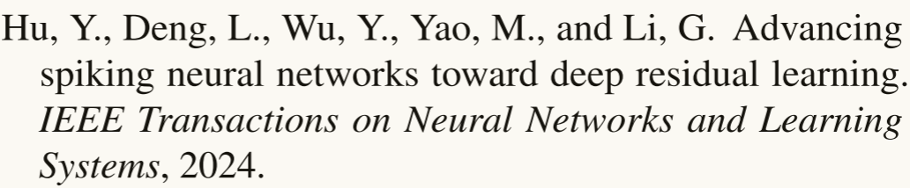

# 关于文献阅读

阅读完文献后，至少要回答以下问题:

1. 这篇文章到底在解决什么问题？
2. 这个问题为什么在这个领域重要？
3. 这些作者是如何解决这个问题的？
4. 这个问题的解决有什么亮点，局限，有什么应用？

看5-10遍，能够回忆起研究目的，研究方法，研究过程，研究成果，研究结论就可以了，至于公式的推导，确实需要花费大量时间的，不重要的可以不去推导。

文献可以分为写的好的和写的差的，写的差的没必要看懂，写的很好的看不懂就很正常了。

不要只看不写，早点动手写论文。

前期是大量的泛读，然后总结。通过标题摘要大概了解这个领域多少人用了什么类型的方法，有全局的思维，基础的了解。之后有选择的精读文献。 精度不是一次就读懂，需要慢慢来。对好的文章多读。

对自己领域的文章进行精读是确保不要让自己和别人想法一样或者自己想法已经被证明是错误的。

# 一   ==High-Performance Temporal Reversible Spiking Neural Networks with O(L) Training Memory and O(1) Inference Cost==

==简介：==

* 翻译：高性能时间可逆的SNN，具有 O(L) 的训练内存和 O(1) 的推理成本。  题目表明了他们提出算法的推理成本很低，且可以在时间维度上进行反向传播。   ==这篇文章有源码==  [源码链接](https: //github.com/BICLab/T-RevSNN.)

* 由北京大学田永鸿、自动化所徐波、李国齐等研究人员发表于ICML2024。

* 实验发现：SNN（ResNet）中每个阶段的最后一层的时间维度梯度比较重要，其他层倒不重要。

* 设计了Temporal Reversible SNN（T-RevSNN），仅保留每个阶段最后一层脉冲神经元的时间维度。

* 将第 $l$ 层后面所有层的神经元在前一个时间步长的膜电势向前传递。

* **摘要**：

  1. 背景：**多时间步模拟的 SNN 在训练过程中提升了内存需求，并增加了推理的能量成本**。目前的训练方法无法同时解决训练和推理的难题。
  2. 本文工作：提出了一种新颖的时间可逆架构（T-RevSNN）来统一解决训练和推理的挑战
  3. 本文核心：==改变 SNNs 的前向传播==。我们关闭了大多数脉冲神经元的时间动态，并在时间动态开启的脉冲神经元上设计了多层次的时间可逆交互，从而实现 O(L) 的训练内存。结合时间可逆的特性，我们重新设计了 SNNs 的输入编码和网络架构，以实现 O(1) 的推理能量成本。然后，我们精细调整了 基SNN模块的 内部单元和残差连接，以确保稀疏时间信息交互的有效性。
  4. 本文结果：T-RevSNN 在 ImageNet 上实现了优异的准确率，同时内存效率、训练时间加速和推理能量效率分别显著提高了 8.6 倍、2.0 倍和 1.6 倍。
  5. 本文展望：本研究有望突破大规模 SNNs 在维持高性能和低推理能量成本下显著增加内存成本和训练时间的技术瓶颈。

* **介绍：** 

  1. SNNs因其类脑神经元动态和基于脉冲的通信而被认为是ANNs低功耗的替代方案。脉冲神经元通过复杂的动态融合时空信息，并在其膜电位超过阈值时发射二进制脉冲作为输出。基于脉冲的通信使得 SNNs 的事件驱动计算范式成为可能，并在 TrueNorth（2014）、Loihi（2018）、Tianjic（2019）和 Speck（2024）等神经形态芯片上具有极高的能效。==通过将脉冲神经元的非线性微分方程离散化为迭代版本，SNNs 可以直接使用时间反向传播（BPTT）和替代梯度进行训练。==

  2. 多时间步模拟在 SNN 训练中需要 O(L×T) 的内存，其中 L 是层数，T 是时间步数。特别是在静态视觉任务中，例如图像分类，通常通过重复输入来利用 SNN 的动态性，以达到高性能。在这种情况下，推理(测试阶段)能量是 O(T)。例如，训练具有 10 个时间步的脉冲 ResNet-19 所需的内存约为 ResNet-19 的 20 倍（==惊蛰框架的论文==）。为解决内存困境，已经进行了大量努力。

     * 主流想法是==将 SNN 的训练与时间步解耦==，例如修改时间上 BPTT 的方式，以 T = 1 进行训练，然后微调至多个时间步。
     * 关于在推理期间缩短时间步的一个想法是==将训练好的多时间步模型微调为单时间步==，或采用额外的控制器来适应性地调整推理时间步。  

     **上面作者说训练期间内存的节省和推理期间能耗的节省是两个主流方向，下面就开始说他们将这两个方向进行结合。**

  3. ==具体做法：==然而，它们都无法同时实现低成本的训练内存和低推理能耗，因为它们往往只优化一个方向。在本研究中，我们通过一种新颖的时间可逆架构来一石二鸟，解决 SNNs 的问题。我们的动机简单且直观。已有研究表明，==SNNs 通过时间进行的 BPTT 对最终梯度的贡献微乎其微==。因此，Xiao 等人（2022）和 Meng 等人（2023）不计算时间梯度以提高训练速度。那么，我们是否可以==仅在关键位置保留时间前向传播，而关闭其他脉冲神经元的时间动态呢==？基于这个简单的想法，我们设计了时间可逆的 SNNs（图 1(b)）。首先，为了减少训练内存，我们仅启用每个阶段输出脉冲层的时间动态，并设计可逆的时间传输。具体而言，可逆性（Gomez et al., 2017） **reversibility** 的意思是我们不需要存储所有脉冲神经元的膜电位和激活值来计算梯度。

     ==关于可逆性的理解：== 不是字面上的意思，就是按照他这里的理解，因为通常来说我们是用所有的参数计算梯度。

     其次，由于关闭的脉冲神经元没有时间动态，我们只需要让这些神经元不再重用时间维度中的参数。为了不增加参数和能量成本，我们仅对输入进行一次编码，并将输入特征和整个网络分为 T 组（图 1(b)）。

     第三，为了提高性能，==阶段之间的信息传输以多层次的形式进行==。我们还基于 ConvNeXt（这个网络我在心音分类中也使用到了）的风格重新设计 SNN 模块，并调整残差连接，以确保信息传输的有效性。总之，==SNNs 的反向传播将通过其前向传播进行改变，从而实现训练内存和推理成本的低费用并行==。

  4. 我们验证了 T-RevSNN 在  静态数据集（ImageNet-1k (Deng et al., 2009)）和生物仿真数据集（CIFAR10DVS (Li et al., 2017) 和 DVS128 Gesture (Amir et al., 2017)）上的效果。
     我们的贡献包括：  
     • 我们简单直观地重新设计了 SNNs 的前向传播，以同时实现低训练内存、低功耗和高性能。  
     • 我们在三个方面进行了系统设计，以实现所提出的想法，包括==关键脉冲神经元的多层次可逆前向信息传输==、==输入编码和网络架构的分组设计==，以及对 ==SNN 模块和残差连接的改进==。  
     • 在 ImageNet-1k 上，我们的模型在最小内存和推理成本下，实现了基于 CNN 的 SNNs 的最新准确率，并且训练速度最快。与Spike-driven transformer (Yao et al., 2023b) 相比，我们的模型在准确性上接近，同时在内存效率、训练时间加速和推理能量效率上，分别提升了 8.6 倍、2.0 倍和 1.6 倍。

     

     

     

* **相关工作：**

  1. ==SNN 的训练。==

     * SNN 的两种主要深度学习技术是 ANN2SNN 和直接训练 。ANN2SNN 方法是使 SNN的平均脉冲发放率 近似 ANN中的激活。它能够实现与人工神经网络接近的准确率，但正确的脉冲发放率估计需要很多时间步。
     * 直接训练方法利用替代梯度来解决由二进制脉冲发射引起的不可微分问题。通过 BPTT，SNN的训练只需要较少的时间步。直接训练脉冲神经网络与人工神经网络之间存在性能差距，但这个差距正在缩小。在本研究中，我们重点关注直接训练。 

  2. ==SNN 架构和训练的改进==。

     * ==Spiking ResNet==（Hu et al., 2024; Fang et al., 2021a）和 ==Spiking Transformer==（Zhou et al., 2023; Yao et al., 2023b）是两个基准架构，分别受到经典 ResNet（He et al., 2016b;a）和 Transformer（Vaswani et al., 2017; Dosovitskiy et al., 2021）的启发。为提高准确性，提出了多种训练方法，例如归一化（Zheng et al., 2021; Kim & Panda, 2021; Duan et al., 2022）、梯度优化（Perez-Nieves & Goodman, 2021; Lian et al., 2023）、注意力机制（Yao et al., 2021; Qiu et al., 2024; Deng et al., 2024; Yao et al., 2023a;c）、膜 ( ==**电位？**==) 优化（Guo et al., 2022a;b;c）。

       由于需要存储多个时间步的激活值，训练大规模 SNN 所需的内存远高于 ANN 的内存。一些研究致力于降低训练的内存成本，包括时间在线训练（Online Training Through Time，OTTT）（Xiao et al., 2022）、时间空间学习（SLTT）（Meng et al., 2023）等。==我们在第 4.4 节中将 T-RevSNN 与这些训练优化方法进行比较==。

  3. ==可逆神经网络==。可逆神经网络（Gomez et al., 2017）的目标是在训练网络时减少内存成本。其核心理念是每一层的激活值都可以基于后续可逆层的激活值进行计算。这使得可逆神经网络能够在不存储激活值的情况下进行反向传播，除了一些不可逆层。可逆的思想已应用于多种架构，如递归神经网络（RNNs）（MacKay et al., 2018）、ResNet（Sander et al., 2021; Cai et al., 2023）、vision transformer（Mangalam et al., 2022）、U-Net（Brügger et al., 2019）等。最近，这种可逆性思想被应用于 SNN（Zhang & Zhang, 2024），其在空间上是可逆的，我们将其命名为 S-RevSNN (spatially reversible)。与之相比，我们的方法是时间可逆的 (time reversible)。  

      ==到此就能看出其实本篇文章也并非是开创性的工作，就是借鉴了S-RevSNN，然后SNN具有时间这个维度，就有了T-RevSNN，当然也需要大量阅读前人的工作才能做出不一样的工作。==

* **准备工作（Preliminaries）**

  LIF神经元

  Spatio-Temporal BackPropagation (STBP) is a combination of BPTT and surrogate gradient (Wu et al., 2018; Neftci et al., 2019), where the latter is used to solve the nondifferentiable of spike signals.

* **方法：**

  1. Motivation  动机    

     * 之前的研究（Xiao et al., 2022; Meng et al., 2023）观察到==空间梯度主导了导数的最终计算==。因此，他们放弃了时间梯度的计算以加速训练。

     * 相反，我们的思路是==关闭大多数脉冲神经元在时间上的前向传播，从而自然地大幅减少时间梯度的计算==。且作者分析了哪些脉冲神经元对时间信息传递相对重要。设置了以下实验。

       首先，我们使用 STBP 在 CIFAR-10 数据集上训练 SNN。计算得出的梯度称为“基准梯度”，它需要保持先前时间步的空间和时间计算图。

       一般来说，典型的神经网络分为四个阶段，每个阶段的特征层次各不相同（He et al., 2016b）。

       一个直观的想法是，在 SNN 的两个阶段交界处，时间信息的传递可能是重要的。因此，我们使用 STBP 训练另外两个 SNN。其中一个（case 1）在训练过程中丢弃大部分时间梯度，仅保留每个阶段最后一层的时间梯度。另一个（case 2）则采取相反的行为，仅丢弃每个阶段最后一层脉冲神经元的时间梯度。

       然后，我们通过计算网络中空间梯度的余弦相似度来比较baseline、case 1 和 case 2 之间的差异。结果下图 所示。在左图中，相似度始终保持在较高水平，特别是在训练周期增加时。相反，在右侧子图中，相似度始终较小。因此，每个阶段最后一层的时间梯度在重要性上大于前面阶段脉冲神经元的时间梯度。

     

     ==我的想法： 仅通过这样的比较得出结论是否不合适？且从左图和右图联合比较来看，在时间步T=6，tau=1.1时得到的结果都是最好的。从这样的结果来看，时间步T越大，差异也会越明显？==

  2. Temporal-Reversible Spike Neuron   时序可逆的脉冲神经元

     * 仅开启每个阶段最后一层脉冲神经元在时间维度上的传递，如下图所示
       

     * T-RevSNN中的脉冲神经元有两种状态：在时间维度上开启或关闭。

       ==关闭状态的脉冲神经元的前向传播是==

       

       给出使用STBP进行权重更新时的公式：

       

       

       

       

       权重更新仅取决于空间梯度：(就是公式4不考虑第二项，只有第一项，并把公式5的第一项代入)

       

       在更新关闭状态脉冲神经元的权重 $W^l$​ 时，梯度需要在每个时间步的子网络上计算。我们禁用 关闭脉冲神经元在时间维度上的权重重用,也就是 $l$ 层第t步的权重仅作用于第t步，和其余时间步无关系。上式就可以简化为下式：  简单来说 8式是7式集合中的一个子集。

       

       8式意味着在时间步t的所有权重的更新仅需要执行 $O(L)$​ 计算，也就是仅对网络的层数进行遍历。

       ==开启状态的脉冲神经元的前向传播是等式1，权重更新就是等式3==

     * 受到可逆性概念（**这篇论文值得一看**）的启发（Gomez et al., 2017），我们观察到等式1本来就是可逆的。因此等式1可以重写为公式9。
       （**疑问：刚开始我还以为可逆性不是字面意思，现在这么说那可逆性就是字面意思。**）

       

       

       这意味着在计算第一个时间步的梯度时，无需存储所有时间步的膜电位和激活值。我们只需存储 $V_l[T]$ ，并可以通过方程 9 反推所有前一个时间步的膜电位和激活值。这减少了SNN多时间步训练所需要的内存。

       关于时间复杂度，时间开启脉冲神经元的梯度过程与 STBP 一致，即 $O(T^2)$。

       SNN 的时空神经动力学本来就包含两个层级的特征，其中空间输入来自低层特征（同一时间步的前一层），时间输入来自同层特征（同一层的前一个时间步）。SNN 中现有的残差连接也带来了低层特征。

     * 在本工作中，我们在相邻时间步之间建立了更强的多层连接。我们将更深层的高层特征纳入当前时间步的信息融合中，就是下面图示的意思。

       

       一般来说，我们可以构造如下的前向信息传递（公式1和公式9 的变形就是 公式10 和 公式11）：

       

       

       如图3所示，我们仅在各个 stage 之间建立高层特征的融合。在多层交互中，我们通过上下采样来实现特征对齐。

  3. Basic SNN Block  基础SNN块

     

     

     如图 4 所示，我们设计了基本的 SNN 模块，参考了 (Liu et al., 2022,就是convnext的文章)，以有效提取局部信息。该模块由两个深度可分离卷积（DWConv/PWConv）和一个残差连接组成，其中 DWConv 的卷积核大小为 5 × 5。我们去掉了所有的 BN层，以减少因存储特征的均值和方差而造成的内存开销（Xiao et al., 2022）。为了  解决因丢失 BN 而导致的训练不稳定性，网络中所有层的权重均经过适当的归一化处理（Brock et al., 2021）。
     ---------------==这块并没有说：适当的归一化处理具体是啥，还要看原文了。==-------------------------

     

     此外，将 ReZero 技术（Bachlechner et al., 2021）应用于  膜短连接 （Hu et al., 2024）以增强网络在初始化后满足动态等距性的能力，并促进网络的高效训练。为了确保推理过程中只发生加法运算，我们可以通过重参数化将 ReZero 的 scale(其实就是一个缩放因子)（如图 4中的α）合并到层 $l$ 的权重 $W^l$ 中。

     **补充说明1：**ReZero 的核心思路

     1. **残差连接**：ReZero 基于残差连接（Residual Connections），这种连接通常是将输入直接添加到输出，帮助信息在网络中流动，缓解梯度消失问题。

     2. **可学习的缩放因子**：与传统的残差连接不同，ReZero 引入了一种新的特性，即将输入与输出的连接通过一个可学习的缩放因子进行缩放。这个因子初始为零：

        $y=f(x)+α⋅x$

        其中f(x)*f*(*x*)是网络的前向传播，α*α*是一个可学习的参数，初始化为 0。

     3. **适应性激活**：通过让α*α*在训练过程中动态学习，ReZero 使得网络在开始时能够简单地“忽略”未训练的部分（即保持剩余部分为零），减少初始训练的不稳定性。随着训练的进行，α*α*会逐渐学习添加输入，从而改善模型的表达能力

     **补充说明2：** 除了膜短连接（Hu et al., 2024）外，SNNs 中常用的另一种残差类型是Spike-Element-Wise (SEW) (Fang et al., 2021a)，由于其非线性操作（结尾是LIF）和无法进行重参数化，无法利用该技术。

     **补充说明3：** 重参数化是一种优化技术，通常用于将具有复杂后验分布的模型转化为较简单形式，以便于采样和梯度估计。 卷积层与BN层都可以使用重参化。

     在深度学习中，重参数化（Reparameterization）通常用于优化和训练生成模型，例如变分自编码器（Variational Autoencoders，VAEs）。重参数化的主要思想是==将随机变量的采样过程转换为确定性函数的操作==，从而使模型的梯度可以通过常规的反向传播算法进行优化。==这种方法的核心在于将噪声与模型的可学习参数分离==。在标准的变分推理中，我们希望通过优化某个潜在变量的分布来逼近真实数据的分布。具体来说，如果我们用正态分布来表示潜在变量z，则可以表示为：

     ​	$z∼N(μ,σ^2)$

     这里μ和σ是由神经网络输出的可学习变量。直接从这个分布中采样会导致不易进行反向传播，从而难以优化。

     重参数化技巧在这里的作用是将这个采样过程重写为：

     ​	$z=μ+σ⋅ϵ$

     其中 $ϵ∼N(0,1)$ 是一个标准正态分布的噪声项。这样，潜在变量 $z$  就被表示为可学习参数μ和 σ 的确定性函数，和一个随机噪声项的组合。通过这种方式，模型可以在训练过程中直接优化 μ 和σ ，而噪声项则不参与梯度计算，从而简化了优化过程并使得模型能够有效学习。总的来说，重参数化允许我们将随机性引入到模型中，同时保持模型的可训练性，这在许多现代深度学习应用中是一个重要的技术。

     -------------  ==什么是膜短连接？==  看下面这篇论文，我之前也分享过。--------------------------------------------11

     

     

     

     之前我读这篇论文的时候，分析过ms-resnet 和 sew-resnet的结构差距，ms-resnet 作者说spiking resnet 结尾的这个LIF神经元使得残差块的输出在某种程度上仅仅是两者之间的选择（0和1），而不是和我们期望的那样，由残差路径辅助的主路径得出最终的结果。==同时这篇文章还得到了一个结论：实现恒等映射并不能真正解决退化问题，这个与我们之前所讲的SEW-ResNet的说法是很不一样的，因为SEW-ResNet一直强调的是Spiking-Resnet
     因为无法实现恒等映射而造成了网络退化问题。==

     首先脉冲神经网络是有时间步的，所以并不是两者之间的选择，通过求脉冲平均发放率就达到了值的多元化。另外个人觉得如果按照 ms-resnet 这样来做，那在进行ADD的时候，又变成了两个float值相加，和SNN的高效计算式背道而驰的。其次这里作者说的恒等映射不能解决退化问题，我觉得是必然的，之前自己在电脑上试过，针对中小数据集，网络加深，测试集性能并不会提升多少，所以应该是一个相对概念。

     --------------------------------------------------------------------------------------------------------------------------1

  4. Training and Inference Complexity Analysis  训练和推理的复杂度分析-----表1和图5

     

     

     STBP算法所需的内存和计算量，以从最后一个时间步的最后一层输出计算到第一个时间步的第一层输入的梯度，构成了训练脉冲神经网络（SNNs）的内存和时间复杂度。在表1和图5中分析了所提出的T-RevSNN及其他SNN训练优化方法的训练内存和时间复杂度。

     * STBP需要在所有时间步长保留所有脉冲神经元的激活状态，因此训练内存为 O(LT)。时间梯度在两个脉冲神经元层之间传播。当更新层 $l$  的权重时，需要计算并求和 $T$ 个梯度。这意味着每个层的时间复杂度为 O(T)，因此 STBP 的整体训练时间复杂度为 O(LT)。

     * OTTT ==不计算时间梯度，可以在线训练。每个时间步仅需保留当前时间步的激活状态==，因此训练内存和时间分别为 $O(L) 和 O(LT)$ 。

     * SLTT-K 仅在 OTTT 的基础上计算最重要的 K (K <= T) 个时间步的梯度，从而训练内存和时间复杂度分别为 $O(L) 和 O(LK)$。

     * S-RevSNN（Zhang & Zhang，2024）==保留时间梯度==。由于空间可逆性，S-RevSNN 只需在每个时间步存储空间可逆层的激活状态。因此，==训练内存和时间复杂度均为 O(T)==。 ------==这篇文章后续应该读一下==

       空间可逆就代表在求梯度的时候，第T个时间步网络从 $1到l-1层$ 的膜电位等等都可以由第 $l$ 层的膜电位求得。这样的话只需要存储 所有时间步 第 $l$ 层的参数即可，所以训练内存和时间复杂度均为 $O(T)$.

       ​        题目：Memory-Effcient Reversible Spiking Neural Networks 内存高效的可逆脉冲神经网络

       

     * T-RevSNN（本研究）。我们==舍弃大部分时间连接并具有时间可逆性==，因此 T-RevSNN 的训练内存与 OTTT/SLTT 一致，即 O(L)。T-RevSNN 的训练时间与脉冲神经元（开启/关闭）相关。OTTT/SLTT/S-RevSNN 的优化不改变前向传播，因此它们的推理都是 O(T)。所提议的 T-RevSNN 重新设计输入编码并拆分网络，从而推理为 O(1)。

       时间可逆就代表在求梯度的时候，网络的第 $l$ 层第 T-1个时间步的膜电位可以由第T个时间步的膜电位求得。网络分为几个stage，每个stage的前 l-1 层 只有一个时间步， 第l 层有T个时间步，但是只需要保存第T步的参数，所以训练内存为O(L)。

       训练时间就是视情况而定了，当关闭脉冲神经元的时间状态时，网络的训练时间为O(L)，
       在每个stage的 l 层，打开脉冲神经元的时间状态，计算所有时间步的膜电位，所以训练时间是O(1*T)

       

* **Experiments：**

  1. Main Results

     * IMAGENET-1K

       比较 T-RevSNN 与现有工作，包括参数、训练时间、内存、推理能耗和 Top-1 准确率。

       在表2中，作者将现有的直接训练的脉冲神经网络（SNN）分为三类， namely spiking ResNet, spiking Transformer, and SNNs with training optimization.

       

       ​	在ImageNet-1K上的评估。我们将现有的直接训练脉冲神经网络（SNN）分为三种类型，从上到下分别是Spiking ResNet、Spiking Transformer，以及具有训练优化的SNN。我们测量了所有模型的内存消耗以及完成一个训练周期所需的时间。每张图像的内存是指在训练过程中每张图像占用的峰值GPU内存，参照S-RevSNN（Zhang & Zhang, 2024）。我们基于相应的Spiking ResNet估计这些模型的功耗，例如，我们假设SEW-ResNet-50的一个时间步的功耗为4.0/4 = 1.0mJ。在我们的模型中，384/512代表最后阶段的通道数量，用于控制参数。

       与Spiking ResNet Baselines 相比。在SNN领域，有两种主要的Spiking ResNet Baselines，即SEW-ResNet（Fang et al., 2021a）和MS-ResNet（Hu et al., 2024）。所提出的T-RevSNN在尖峰ResNet系列中取得了最佳的准确率，所需的训练内存、时间和推理能耗都是最低的。

       与Spiking Transformer Baselines相比。Spiking Transformer是一种在SNN中最近变得流行的架构。典型的工作包括SpikFormer（Zhou et al., 2023）和Spike-driven Transformer（Yao et al., 2023b）。

       与 Training Optimization SNNs 相比。从上表可以看出，作者所提出的模型也还是具有较高的准确率的。

     * CIFAR10-DVS AND GESTURE

       与编码重复输入的静态数据集不同，神经形态数据集在每个时间步输入不同的信息（Deng 等，2020）。因此，在神经形态任务中，所有脉冲神经网络（SNN）模型的推理复杂度为 O(1)。

       与静态图像任务中仅编码一次不同，在这里我们在每个时间步都对输入进行编码，这与之前的 SNNs 一致。

       

  2. Ablation Studies

     在Imagenet数据集上进行消融实验。设置epoch = 100，参数量为15.2M。

     * Timestep
       	由于我们固定了总参数数量，增加 T 意味着每个时间步的子网络变得更小。训练内存相应减少（T-RevSNN 的训练内存复杂度为 O(L)），但训练时间会增加。

       

     * Multi-level Temporal Reversible

       如果不把上一个时间的下一个stage的特征融合到当前阶段，网络的准确率将降低1.2%(68.6% → 67.4%).

       

     * Scaled Residual Connection

       如果残差连接不是可调的，而是固定的，那么训练期间收敛会变慢。

       

     * SNN Block Structure

       SNN Block Structure 对于最终性能至关重要。在我们的设计中，我们将时间可逆性的思想应用于ConvNeXt风格的架构（Liu et al., 2022）。在表6中，这一思想应用于MS-ResNet（Hu et al., 2024）和SRevSNN（Zhang & Zhang, 2024）。  
       ==作者说S-ResSnn没有提供在Imagenet上的准确率，所以这里就没有写准确率。==

       

       

* **Conclusion：** 
        我们提出了 T-RevSNN，以解决多时间步模拟在 SNN  中带来的训练内存和推理能耗挑战。由于SNN中的时间梯度并不重要，我们能否仅保留关键位置的时间前进方向，并关闭其他脉冲神经元的时间动态？为此，我们进行了系统设计，包括关键脉冲神经元的多级时间可逆前向信息传递、输入编码和网络结构的分组设计以及对 SNN 块和残差连接的改进。在静态和类脑数据集上进行了广泛的实验，验证了 T-RevSNN 在训练、推断和准确性方面的优势。我们希望我们的研究能为大规模 SNNs 的进一步研究和 SNNs 的更多应用铺平道路。

# 二   ==High-Performance Temporal Reversible Spiking Neural Networks with O(L) Training Memory and O(1) Inference Cost==

* **摘要：**  
* **介绍：**
* **方法：**
* **试验：**
* **讨论与总结：**

# 三   ==High-Performance Temporal Reversible Spiking Neural Networks with O(L) Training Memory and O(1) Inference Cost==

* **摘要：**  
* **介绍：**
* **方法：**
* **试验：**
* **讨论与总结：**
