### linux命令学习

```python
pwd  查看当前工作目录
ls /usr/local  查看该服务器下有几个cuda
cd /   用于将当前工作目录更改为根目录 
cd ~/  改变当前工作目录到用户的主目录
df -h  查看所有文件系统的磁盘使用情况，使用了多少，还有多少可以使用。
df -h /  查看根文件系统的磁盘使用情况
df -h data 查看data目录的磁盘使用情况
du -sh */   查看当前目录下所有目录占用的磁盘空间
df -h ../../home  每个用户都是在home文件下的磁盘，所以需要查看home文件还有多少空间
vim .bashrc 编辑某个文件
	在Vim中，按 i 进入插入模式以进行编辑。
	编辑完成后，按 Esc 退出插入模式。输入 :wq 保存并退出，输入 :q! 退出而不保存。
sys_5和sys_3的服务器账户：wangjuliang   密码：wjl68622 

服务器5的公钥：
ssh-rsa AAAAB3NzaC1yc2EAAAADAQABAAABAQDuIW6I0ArWfPL7ERii8s3PGrcvxSjAHuwzv5IrVq9FN41jb9tghbHiYFubUcS46Jenf9e2ZREWSr4MTICMgRUbkVYjL/e3rEMNHIVMspXfb/CD9WmRDFL/IwHKODf6NuI4ehUdlH4PhrPlzOvyPGDzVPxA6EMmG7qI1UAbG2dYlvNDrod4Nqo/nWSML649QhQoiG7LIC9V/iI+78NRaFvtnkfkHy9j/geqkRtbLgcJ/a6xIKXE9p3GD5SzrVtlXS72HTGXVQclCd4wlL5mH9knCuhqaqPTEmEj7uvwNbw0jAsamXZhCNZ8yjU/UT7pAejtSBzIjn+J9z4Jmz3K274D root@systemAI-5
服务器3的公钥：
ssh-rsa AAAAB3NzaC1yc2EAAAADAQABAAABAQDSAKVXtoS/TViLrPTEgMjZGZPoWaqvKItQQXcarNwfobeDe+0NVWvHBUhsSAUMB8xpMWO4aTUyOCV/BW9G+pvkUuzQ0cqsVnv+PfMS4ObGRWGvGSsdisT0Hfx1sM+aKR4pa4grbR5L1kEvMI6zOyprKGy0TYOeCYzzEAwN8VOKYc6GMzwv9Ag3NqxHCdnWYSSZEq0//rVr7SWd6sEBt+5+w/Jq/rf9hK7NKIzDpbPMsEAniey31sUAFrvUSxbO3ocgbcHoItVDI7ETsjvf7vNm8+SHj4gzgaMogMhBxyUTOwmPAEdzlJTXSve685GetxC+lIzIHA1WZqNl8LeI10J/ root@systemAI-3
本地生成的公钥：
ssh-rsa AAAAB3NzaC1yc2EAAAADAQABAAACAQDaqaBm/psOn4gCrCt04GDVFF//T+KmWUpCGS7NET+fjNJy+Ppmm7JEe/dHzZoS3DnqJNP9rnFzml+AG3rgpo3GsJ4Eukqej+rdzLBOSYyrmOSpsjZJSx2MmniFBEQg0tpR0JqNEPCJc/yw1KSbbU+jf+Gbya9jI7EbzHTl5RQo5a5LgOgyLbsRHoJagocScwZWEGkpJiu56+srcN76fuR+CIY6lzcU4UApWEunKcjTmNhyris5cbF4olO0Tc8vhAFZAQx+h01xBHKyCaEN5KRtBBLW+71MJGSws0Qy3sRGKDcHTZ8AR3RTqfu9QNOh4TsrGWmDRtFmR1vL6TAoyoXEtMtumLufq+u/PaTszqmp3L1rpq1WCGLD9abC3mZzjOYi2gSsjAyZwo7pqExatExwxxv9q4EY5kZjoP4OQ954nQlQJtQCUAiQpRP4TEk/lEJquGNp/5hn3Quo+DlNiYQZ3wSKRRalIvxM8wsydTE2Ggr0WZwge+7agvZIBELgA6yqzjb1jXNLGU1Ay4IiB9obvaUF/zgFchmTonnmh/f+IsDrR4R+j64x5Q68ji6t6UyYdGU1gu4r8643fwGCx6PfBxVjEzhVvWMcHJJPdNF1M5KdM+uMsBHEu41kzlwuutGoKndxtFI7HEplUDeyA0ZeM+6ubEUdPy22T1c4H0rg3Q== aliang@DESKTOP-86I45CO
```

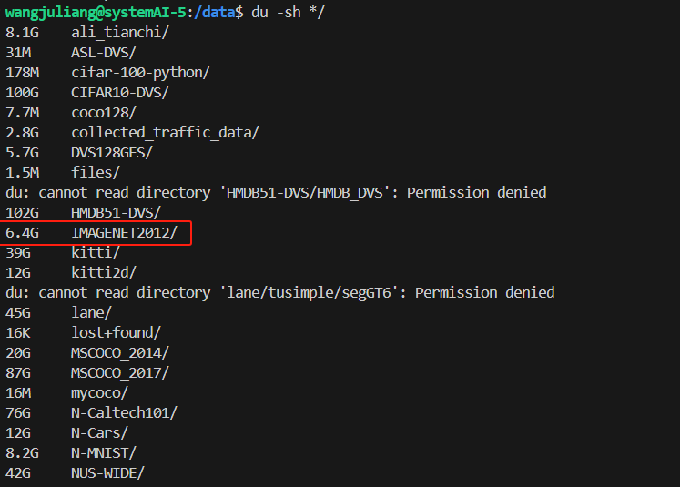

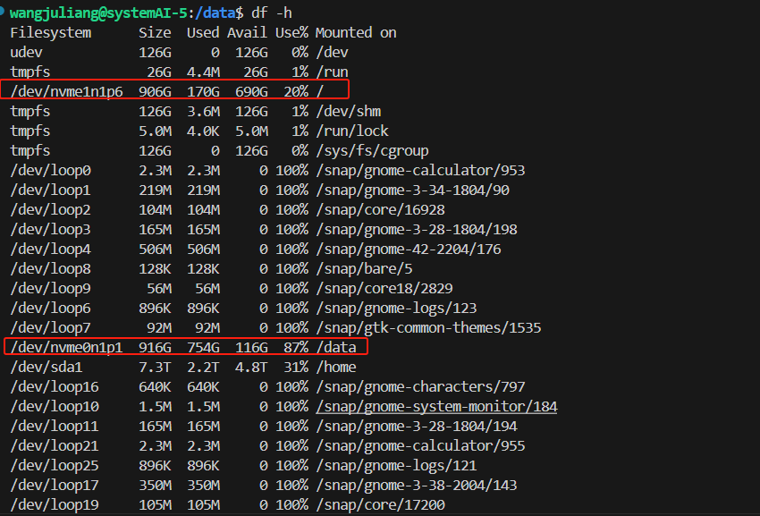

### 关于公钥私钥的问题

即使给同一局域网下的两台服务器使用相同的秘钥，也不会存在冲突，因为这两个服务器所使用的公网IP端口不一样，存在一个映射关系，如下：

```
将公网 IP 的端口 2222 转发到 Server 1 的 22 端口
将公网 IP 的端口 2223 转发到 Server 2 的 22 端口
```

所有本地生成一对公私钥之后，就可以给两个服务器的  ~/.ssh/authorized_keys 均写入生成的公钥，这样，下次使用xftp访问时，可以选择本地生成的秘钥进行访问，而无需使用服务器生成的秘钥

### 服务器配置     ==先看这个，上面的两个内容都是拓展==

1. 联系服务器管理人员分配账号（当前是任启宁同学）

2. 将秘钥⽂件 wangjuliang_5 放置在~/.ssh/⽬录下，windows⽤⼾⼀般为： C:\Users\你的 ⽤⼾名\.ssh ，如果没有.ssh⽂件夹，则⾃⼰创建一个这样的文件夹。

3. 在.ssh文件夹下添加或修改config文件，config新增内容如下：

   ```python
   # 服务器5，直接使用这个
   Host sys5   
   HostName 222.20.94.93 
   Port 1522   # sys2对应1222，sys3对应22，sys4对应1422，sys5对应1522
   User wangjuliang 
   PreferredAuthentications publickey
   IdentityFile ~/.ssh/wangjuliang_5
   ServerAliveInterval 120
   # 服务器3，直接使用这个
   Host sys3
   HostName 222.20.94.93
   Port 22
   User wangjuliang 
   PreferredAuthentications publickey
   IdentityFile ~/.ssh/wangjuliang_3
   ServerAliveInterval 120
   
   # 服务器5，使用服务器3当做跳板机，接着使用局域网连接到sys5，但因为现在公网不可用，只能在连接校园网的情况下使用服务器，所以上面那种不使用跳板机也可以。
   Host sys5
   HostName 192.168.0.105  #服务器局域⽹ip，⼀般改最后⼀位，sys2对应2，sys3对应3，sys4对应4，sys5对应5
   Port 22
   User wangjuliang 
   PreferredAuthentications publickey
   IdentityFile ~/.ssh/wangjuliang_5
   ProxyCommand ssh -W %h:%p sys3
   ServerAliveInterval 120
   
   ```

4. 打开vscode，确保下载了remote-ssh,接着就可以直接进入了。

5. 设置如何使用xftp连接到远程服务器：
   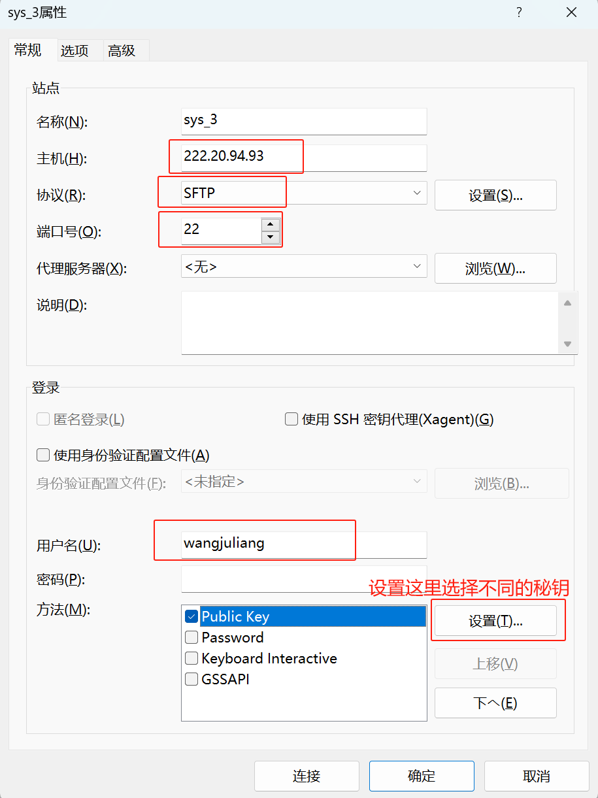    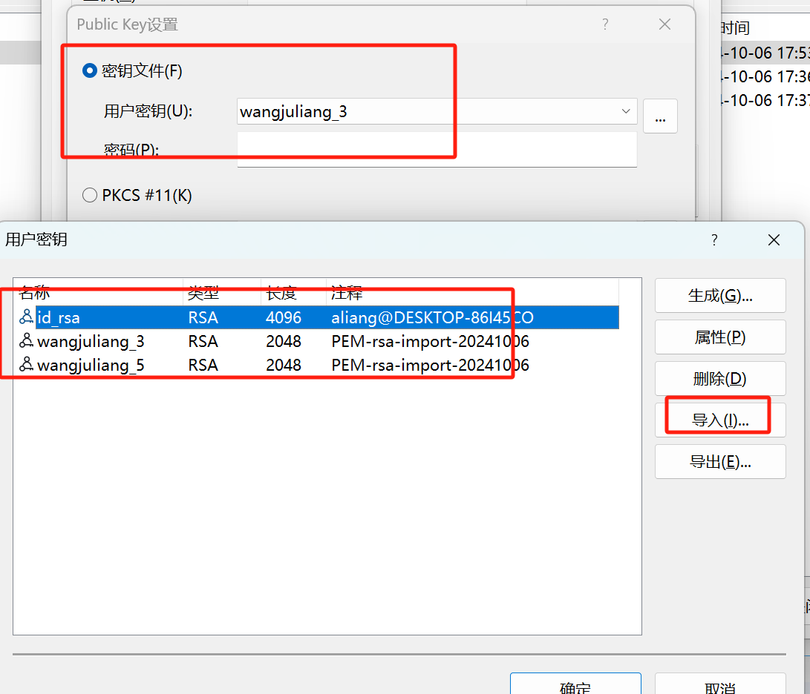

   这里的导入就是不同的秘钥文件，服务器上已经将公钥写入进去了

6. ==window命令行直接连接==

   打开cmd，输入

   ```python
   # sys5就是之前配置config的host，sys3一样
   ssh sys5
   ssh sys3
   # 退出，输入exit即可
   exit
   ```

   

   

7. ==更改用户密码==

   ```python
   # 用vscode连接上以后，直接在终端输入下面的命令，初始密码是用户名
   passwd username
   # 先输⼊初始密码，初始密码为你的用户名
   # 再输⼊两次新的密码，新密码不要太简单
   ```

8. 在window下使用cmd命令行给服务器远程传输文件：  

   ==P后面是端口号,C:\Users\ALiang\.ssh\wangjuliang_5 是秘钥所在的地方，test.txt是要传输的文件（应该换成具体的路径，这里我是因为当前路径下就有这个文件，所以直接写了）wangjuliang@222.20.94.93是用户名和公网ip，:/home/wangjuliang/data是导入文件的目录==

   ```python
   scp -P 1522 -i C:\Users\ALiang\.ssh\wangjuliang_5 test.txt wangjuliang@222.20.94.93:/home/wangjuliang/data
   # 上面是指定了使用哪个秘钥文件，但是因为已经在config中配置了默认的，所以也可以不告诉秘钥的位置，如下面的命令
   scp -P 1522 D:\test.txt wangjuliang@222.20.94.93:/home/wangjuliang/data
   # 这两个命令都会覆盖掉原来的同名文件，所以需要小心使用。
   scp -P 22 D:\test.txt wangjuliang@222.20.94.93:/home/wangjuliang/cuda
   # 这两个命令都会覆盖掉原来的同名文件，所以需要小心使用。
   ```

9. window本地生成公钥和私钥并写入到服务器，之后可以使用本地的私钥进行连接

   ```python
   ssh-keygen -t rsa -b 2048  # 这后面的2048是字节数，4096等等都可以
   ssh-keygen -t rsa -b 2048 -f C:/Users/ALiang/.ssh/test2_rsa # -f 指定生成的目录及名称，经过查看，每次生成的公钥都不一样，即使什么都不操作，只是按几次回车。
   ```

   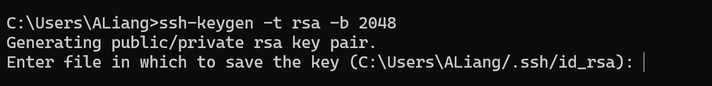

   回车就行，接着会在 C:\Users\ALiang\.ssh 目录下看到 id_rsa  和 id_rsa.pub，其中id_rsa.pub就是公钥，id_rsa是私钥，打开id_rsa.pub,将里面的内容全部复制到下面这个文件

   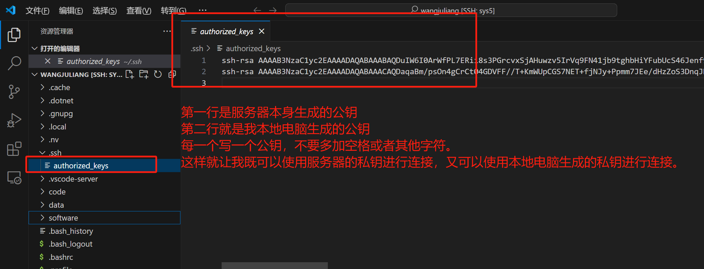

   之后进行连接测试：

   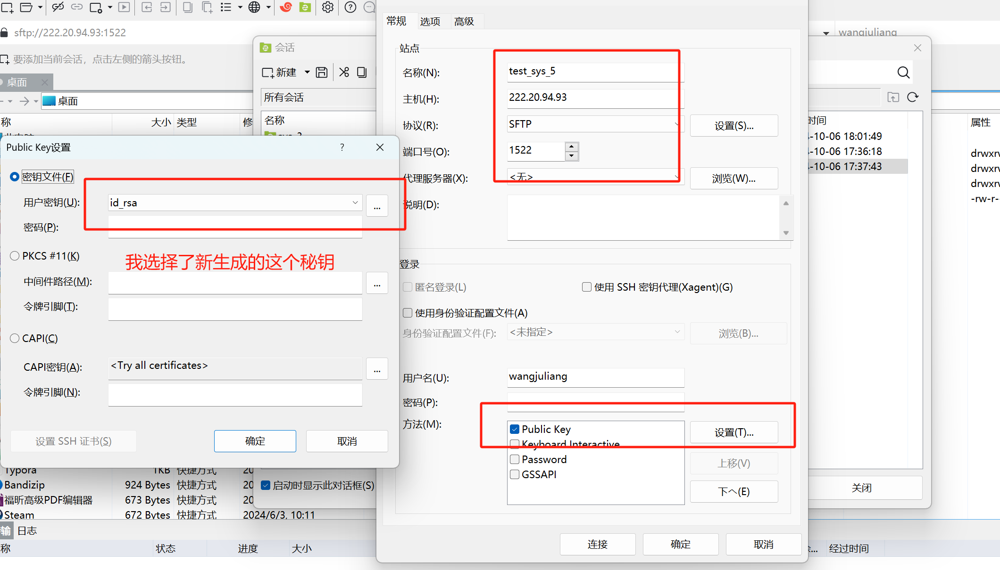

   测试成功。

10. **环境配置**

   ```python
   ls /usr/local # 查看当前系统下现有的cuda版本,目前最新的是11.8，所以这里选择11.8
   # cuda环境配置
   # # 服务器2
   # export PATH=/usr/local/cuda/bin:$PATH
   # # 服务器3
   # export PATH=/usr/local/cuda/bin:$PATH
   # 服务器5
   export PATH=/usr/local/cuda-11.8/bin:$PATH
   
   # Anaconda 环境配置
   # # sys2
   # export PATH=/home/guest/anaconda3/bin:$PATH
   # sys3-sys5
   export PATH=/usr/local/anaconda3/bin:$PATH
   ```

   将这些代码写入到 ~/.bashrc 文件的末尾，并保存，之后在终端执行  `source ~/.bashrc`，接着执行 `conda init` 
   	`source ~/.bashrc` 命令的作用是重新加载当前用户的 `.bashrc` 配置文件，使其中的环境变量、别名、函数和其他设置在当前 Shell 会话中立即生效。

   ​	执行 `conda init` 命令的主要作用是配置你的 Shell 环境，以便能够使用 Anaconda 或 Miniconda 提供的命令和功能。

11. **安装新的cuda**  
    ==这一步不行，因为没有管理员权限，无法删除 /tmp/cuda_installer.log，现在服务器5最新的cuda版本是11.8==
    [参考链接1-完整安装---cuda12.1,包含了报错信息](https://blog.csdn.net/weixin_71109434/article/details/137469555)
    [参考链接2-完整安装----cuda10.2](https://blog.csdn.net/qq_35082030/article/details/110387800)
    [参考链接3-无法安装自己的cuda](https://blog.csdn.net/bcfd_yundou/article/details/118028315)

    ```python
    # cuda官网，安装的时候需要看自己的系统和版本能够对应，低版本的系统一般安装不了最新的cuda，例如sys5的Ubuntu版本为18.04，所以现在最新只能使用的cuda版本为12.1.1，注意这里可以看第12步的开头，一般来说我们确定的cuda版本可以与gpu算法匹配。
    https://developer.nvidia.com/cuda-downloads
    # 12.1.1链接，当然我也已经下载好了，笔记本路径为 E:\mycode\linux下cuda安装包-ubuntu18.04
    https://developer.nvidia.com/cuda-12-1-1-download-archive
    lsb_release -a  # 查看系统
    ls /usr/local # 查看当前系统下现有的cuda版本
    grep -i cuda /etc/profile        #查看cuda的全局变量，打印出了关于cuda的全局变量，下面是打印信息
    #########################cuda11.4####################
    # export PATH=$PATH:/usr/local/cuda-11.1/bin
    # export LD_LIBRARY_PATH=$LD_LIBRARY_PATH:/usr/local/cuda-11.1/lib64
    
    grep -i cuda /etc/bash.bashrc   # 查看cuda的全局变量，但没有打印信息，证明在这里面没有配置
    
    chmod +x cuda_12.1.1_530.30.02_linux.run  # 修改该文件权限
    sh cuda_12.1.1_530.30.02_linux.run  # 安装12.1.1的cuda
    
    source ~/.bashrc  # 修改用户的cuda环境变量并写入到用户的.bashrc文件中
    ```

    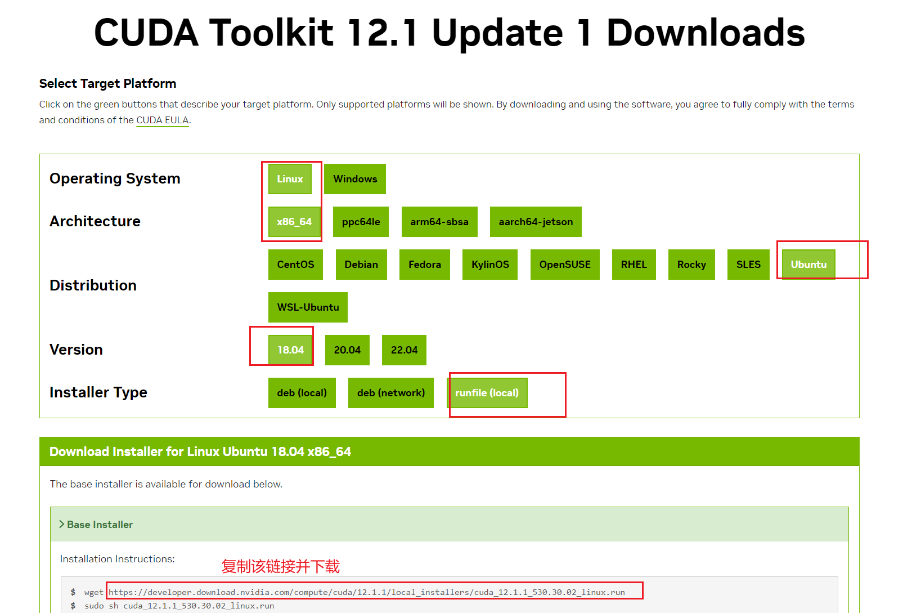

12. ==tmux的使用：==

    ```python
    # 新建tmux窗⼝  test_1是会话名称，可以自己定义
    tmux new -s test_1
    # 分离会话
    快捷键：Ctrl+b（一起松开），然后按d
    命令：tmux detach
    # 查看所有tmux会话
    tmux ls
    # 重新连接会话
    tmux attach -t test_1
    # 杀死会话
    tmux kill-session -t test_1
    # 或者在会话中ctrl+d
    
    # 在会话中查找历史输出，进入复制模式
    ctrl+b (一起松开) 按[  
    # 此时按下 g 输入数字，可以跳转到对应的行， 输入 q 退出复制模式
    ```

13. ==僵尸进程==

    ```python
    # 查看所有进程，找到僵⼫进程的PID ,这条语句应该只能列出当前用户使用的进程，而无法看到其他用户的进程
    fuser -v /dev/nvidia*
    # 杀死进程
    kill -9 [PID]
    
    # 上⾯的两条命令需要配合使⽤，有时候产⽣的进程太多了，懒得⼀条⼀条删，可以⽤下⾯的命令
    # 下⾯命令存在缺点：会杀死所有正在运⾏的python命令
    ps -ef | grep python | awk '{print $2}' | xargs kill -9
    ```

14. ==conda创建用户的虚拟环境及pytorch安装==

    ```python
    # gpu算法与cuda对应版本，该链接需要外网 注意显卡算力对应的cuda版本是要求的最低版本，可以选择更高的版本，说明cuda版本是向下兼容的，只是有最低版本的要求。
    https://link.zhihu.com/?target=https%3A//en.wikipedia.org/wiki/CUDA
    # 介绍的链接
    https://blog.csdn.net/yangyin007/article/details/141428373
    # 版本对应关系  torch与python  
    https://github.com/pytorch/vision 
    # pytorch历史版本
    https://pytorch.org/get-started/previous-versions/
    # pytorch最新版本安装
    https://pytorch.org/
    # 整体安装流程的介绍
    https://www.jindouyun.cn/document/industry/details/180235#63_torch_601
    # 在pytorch中指定显卡
    https://zhuanlan.zhihu.com/p/629952314
    ```

    ```python
    # 创建环境，我用的是python3.11
    conda create --prefix software/my_envs/my_torch python=3.11 pip
    # 激活环境
    conda activate software/my_envs/my_torch
    # 删除环境，一般不用
    conda remove --prefix software/my_envs/my_torch --all
    # 在 .bashrc 中更改激活环境的命令为 mt，以方便访问
    alias mt='conda activate /home/wangjuliang/software/my_envs/my_torch'
    # 使得更改生效 接着直接在命令行输入 mt 就激活了自己的环境了
    source ~/.bashrc
    
    # 测试torch是否安装成功及gpu使用
    import torch,os
    print(torch.cuda.is_available())
    # 查看当前cuda设备号
    print("Current CUDA device:", torch.cuda.current_device())
    # 查看可以用的设备数量
    print("Number of GPU devices available:", torch.cuda.device_count())
    # 查看所有cuda设备号
    cuda_devices = [(i, torch.cuda.get_device_name(i)) for i in range(torch.cuda.device_count())] if torch.cuda.is_available() else "CUDA is not available."
    # 打印出来设备号
    print(cuda_devices)
    # 设置当前文件执行时可使用的cuda设备，仅对当前文件生效，在代码中调用时的索引还是从0开始
    os.environ['CUDA_VISIBLE_DEVICES'] = "5,6,7"
    # 取消cuda设备的限制，可以使用任意cuda
    del os.environ['CUDA_VISIBLE_DEVICES']
    # 导入模型
    import torchvision.models as models
    # 加载预训练的 ResNet-18 模型
    model = models.resnet18(pretrained=True)
    # 将模型加载到单卡上，使用第一个设备
    model.cuda(0)  或者  model.cuda("0") 
    # 使用第二个设备
    model.cuda(1)  或者  model.cuda("1")
    # 将模型加载到多卡上
    model=torch.nn.DataParallel(model)
    # 加载到指定设备
    model=torch.nn.DataParallel(model,device_ids=[1,2])
    
    # 使用多卡进行训练时的规范步骤--------------------------------------------------------------------------
    # 这句话必须放到代码的第一句
    import os
    os.environ['CUDA_VISIBLE_DEVICES'] = "6,7" # 可以有多个
    
    device = torch.device("cuda:0" if torch.cuda.is_available() else "cpu")
    # 加载模型时使用的语句，只有gpu数量大于1，才会使用并行计算
    net = sew_resnet18(input_channels=args.in_channel, num_classes=args.num_classes, connect_f='ADD', T=args.T,
                           data_type=args.data_type).to(device)
    # 如果有多个gpu，就并行训练
    if torch.cuda.device_count() > 1:
    	# 使用 nn.DataParallel，这是一种将数据进行等分并放在多个gpu上进行训练的方法
        net = nn.DataParallel(net).to(device)
        print(f"使用了{torch.cuda.device_count()}个gpu")
    
    # 如果是dvs数据集，在模型中需要有下面的代码
    def _forward_impl(self, x):
        # 数据没有时间维度
        if self.data_type == 0:
            # 网络的类型，先进行普通卷积，在进行时间维度的增加
            if self.net_type == 0:
                x = self.layer01(x)
                x.unsqueeze_(0)  # 这一步经过实验可以去掉，因为x.repeat会自动添加维度
                x = x.repeat(self.T, 1, 1, 1, 1)  # T,B,C,H,W
            # 网络的类型，先进行时间维度的增加，在进行卷积，此时卷积的操作就相当于是编码过程
            else:
                x.unsqueeze_(0)  # 这一步经过实验可以去掉，因为x.repeat会自动添加维度
                x = x.repeat(self.T, 1, 1, 1, 1)  # T,B,C,H,W
                x = self.layer01s(x)
        # 数据有时间维度
        else: 
            # 将数据维度由  [N, T, C, H, W] 变为  [T, N, C, H, W]
            x = x.transpose(0, 1)
            x = self.layer01s(x)
    # -------------------------------------------------------------------------------------------------------
    ```

    

    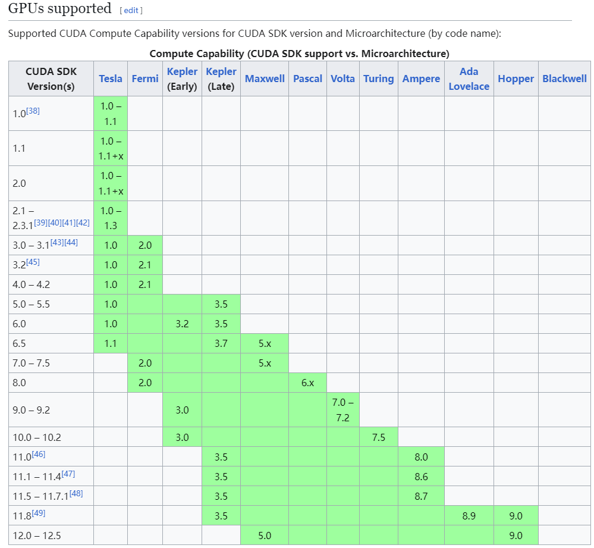

    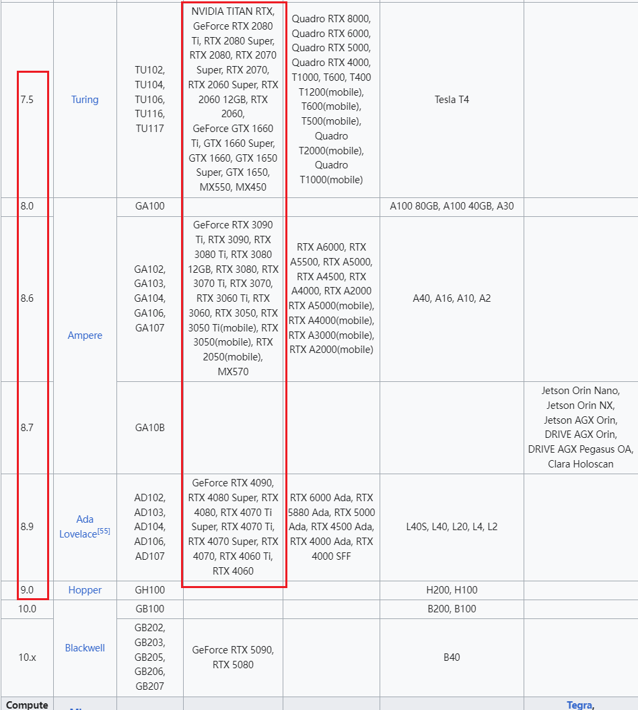

15. ==一些方面操作的脚本==

    [shell的快捷键版本](https://github.com/Oswells/bashrc)   很简单，就是下载 .myshell到自己的用户目录下，接着执行 

    ```\
    curl https://raw.githubusercontent.com/Oswells/bashrc/main/.myshell -o ~/.myshell && echo source ~/.myshell >> ~/.bashrc && source ~/.bashrc
    ```

    然后就可以使用他给的快捷键了
    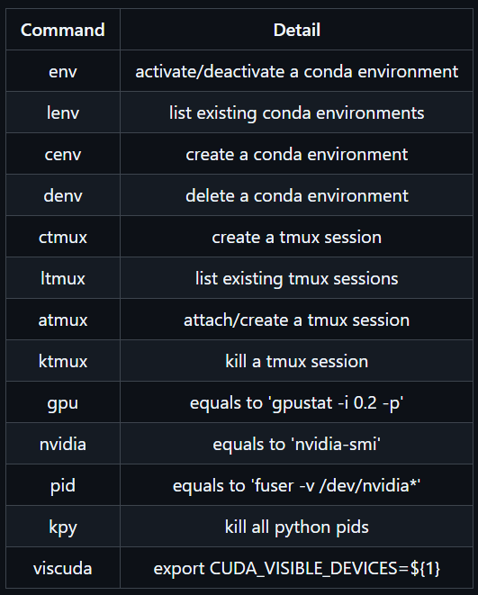

    

    [GCR,方便文件的传输，这个我没有细看，因为我用了xftp测试，速度够用了](https://github.com/gaojunbin/GCR?tab=readme-ov-file)

    

16. ==本地对CIFAR10DVS数据集划分完，结果在服务器上不能使用，一直报错：找不到某些文件的路径？==

    ```python
    # 解决方法：不在window系统下生成划分文件的数据，而是直接在linux系统下进行生成。这样生成的文件是可以自动找到对应图像的。且经过测试，只要是在window系统下用sptt进行文件索引的划分，形成的索引路径只能是： '../data/CIFAR10DVS\\frames_number_20_split_by_number\\frog\\cifar10_frog_337.npz'  
    # 显然在linux系统下无法访问该文件。
    
    # 在linux系统下执行下面的代码即可。
    from start2 import *
    # from spikingjelly.datasets.cifar10_dvs import CIFAR10DVS
    # import torch
    # from spikingjelly.datasets import split_to_train_test_set as sptt
    
    data_path = r'../data/CIFAR10DVS'
    T = 20
    num_classes = 10
    data = CIFAR10DVS(root = data_path, data_type='frame', frames_number=T, split_by='number')
    train_set, test_set = sptt(train_ratio = 0.8,origin_dataset = data,num_classes = num_classes,random_split = False)
    torch.save(train_set, r'../data/CIFAR10DVS/split/t20/train0.8.pth')
    torch.save(test_set, r'../data/CIFAR10DVS/split/t20/test0.2.pth')
    train_data = torch.load(r'../data/CIFAR10DVS/split/t20/train0.8.pth')
    test_data = torch.load(r'../data/CIFAR10DVS/split/t20/test0.2.pth')
    print(len(train_data), len(test_data))
    
    ```

    

17. 本地连接远程服务器并通过tensorboard查看训练结果    [参考链接](https://blog.csdn.net/Guangli_R/article/details/143210091)

    ```python
    # 本地打开命令行窗口，逐行输入以下代码
    ssh -L 12345:127.0.0.1:6006 sys5  # 端口的映射
    tensorboard --logdir=./save_models/CIFAR10DVS --host 0.0.0.0 --port 6006  # 打开tensorboard
    http://127.0.0.1:12345/  # 在本地浏览器输入该网址即可
    ```

    

18. 

