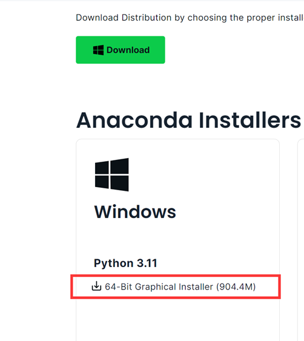
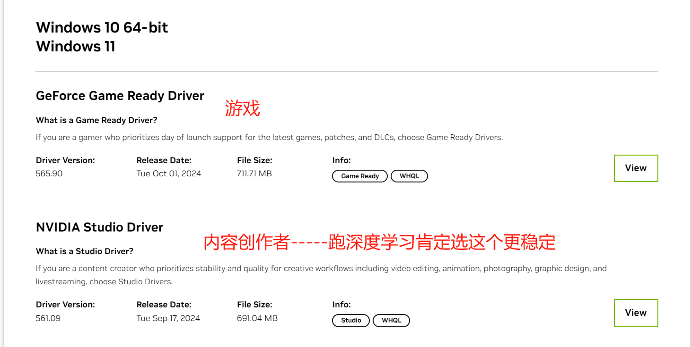
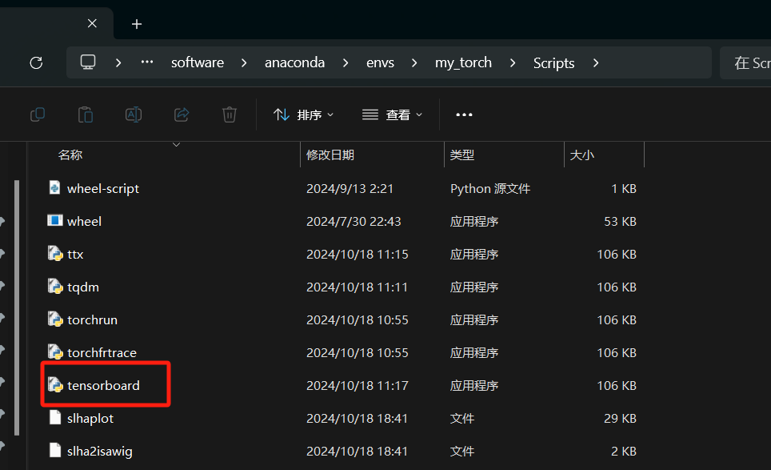

# ==Anaconda完全卸载==

[完全卸载Anaconda（2024最新教程）](https://blog.csdn.net/m0_66047447/article/details/141110374)

不是完整卸载的话，再次安装anaconda就会发现c盘少了很多空间，不清楚为啥。。。和下面这个链接的问题一样
[anaconda卸载之后重新安装c盘少了很多空间](https://tieba.baidu.com/p/8165545624)

# ==pycharm以及visio软件==


# ==Vscode软件==

==vscode设置中文：==


 插件里面安装这个

==vs设置滚轮调节大小==


# ==pycharm软件==  

==pycharm设置完全汉化==


==pycharm关闭自动更新==


==pycharm使用conda环境==


等待配置完成即可。

==pycharm设置鼠标滚轮控制字体大小==


==pycharm设置软件包的镜像源，解决无法安装软件包的问题：==    

```python
# 镜像源
https://pypi.tuna.tsinghua.edu.cn/simple
```

[参考链接](https://blog.csdn.net/Mr_dffan/article/details/135385174)


==pycharm设置可以运行jupyter==


==pycharm notebook降级，新版本不习惯==


==pycharm 换源，使得下载速度变快==


==pycharm技巧==


# ==jupyter notebook 安装及路径更改==
[参考链接1](https://blog.csdn.net/m0_52394560/article/details/135585997)
Anaconda3-2023.09 里面的版本就是jupyter7.0版本之前的最新版本，从Anaconda2024.02-1开始，自带的jupyter就是7.0及以后的版本了

在7.0的之前的版本中，修改路径只需要找到 the directory to use , 把下面的内容更改为 notebook_dir前面的#去掉，并更改为自己的路径即可，如下：   （D:\jupyter-notebook是我的位置，你可以替换成你自己的路径。）

```
c.NotebookApp.notebook_dir = 'D:\jupyter-notebook'
```

但是在7.0及以后的版本中是没有c.NotebookApp.notebook_dir，那自己可以手动添加，在 # c.ServerApp.root dir ="的下面一行添加：

```
c.NotebookApp.notebook_dir = 'D:\jupyter-notebook'
```

# ==jupyter notebook 安装及路径更改==

[Jupyter Notebook介绍、安装及使用教程](https://zhuanlan.zhihu.com/p/691619249)
[Jupyter Notebook版本更新日志](https://jupyter-notebook.readthedocs.io/en/stable/changelog.html)

* 问题：新版Anaconda（2024版本及之后的版本）安装好以后，默认安装的jupyter notebook是7.x版本的，自己用不习惯，所以想降级到6.x版本。
* 操作：打开anaconda 输入命令：pip install -U "notebook<7.0"。这样安装的就是 6.5.7的版本，只不过在官方文档中看到6.x版本最新的为6.4.8，这个不影响使用。安装好之后，点击jupyter notebook 快捷键，发现闪退问题，此时需要更改一下快捷方式的目标位置。
* 
* 如上图所示，红圈圈住的就是我们需要更改的内容，修改为自己电脑的以下位置即可，上图中我已经修改好了。
* 

# ==使用惊蛰框架加载CIFAR10DVS数据集时出现的问题==
[参考链接](https://github.com/fangwei123456/spikingjelly/issues/370)

**使用下面这个代码加载CIFAR10DVS数据集时报错：**

```
from spikingjelly.clock_driven import functional
from spikingjelly.datasets import cifar10_dvs
dataset_dir = "D:/Dataset/cifar10dvs/"
T=20
origin_set = cifar10_dvs.CIFAR10DVS(root=dataset_dir, data_type='frame', frames_number=T, split_by='number')
```


上面的报错信息看不出啥，原因是：作者在开发惊蛰框架时写的报错代码，没有给出具体的报错信息，他猜测是原来的多线程出错了，而线程池里面的报错信息不会输出。那么想要看到具体的报错信息就需要替换下载的惊蛰框架代码，如下图：
 

```python
# 新增的代码，需要把原来的代码注释掉
tpe.submit(CIFAR10DVS.read_aedat_save_to_np(source_file, target_file))
```

接着运行数据集加载代码，就可以看到具体的报错信息了，如下图：

出现这个错误的原因是：numpy版本与惊蛰框架版本不兼容，因为惊蛰框架开发时间比较早，numpy在1.20.0这个版本以及后续版本都不能再使用np.bool，需要替换成 np.bool_，或者直接就使用 bool，所以我们需要替换惊蛰框架里面对应的这个代码，具体如下：


```python
# 替换代码
polarity = read_bits(addr, polarity_mask, polarity_shift).astype(bool)
polarity = read_bits(addr, polarity_mask, polarity_shift).astype(np.bool_)
```

# ==grammly-office版本下载与安装==
[grammly office 版本下载链接](https://www.grammarly.com/office-addin/downloading)
[遇到的所有问题可以找的网站](https://support.grammarly.com/hc/en-us/categories/115000018072-Resolve-Issues)
[出现了：Error: We weren't able to find a supported Microsoft Office product on your computer](https://support.grammarly.com/hc/en-us/articles/360036559831-Error-We-weren-t-able-to-find-a-supported-Microsoft-Office-product-on-your-computer)

**window10或11 安装方法：**

* 第一种:   [参考链接](https://blog.csdn.net/weixin_45638544/article/details/117992756)
  

* 第二种：以管理员身份打开word，接着
  
  
  

  ```
  具体的路径就是自己安装的目录，例如我的如下：
  D:\software\grammarly_office\Grammarly for Microsoft Office Suite\6.8.263\BECAE0D61A
  ```

# ==window下安装mathtype==

[下载链接](https://www.yunpan.com/surl_ybJHnVTnemu)    [6.9版本安装教程 ](https://docs.qq.com/doc/DYnJZcmVFcUNRQkFx)    [7.4安装教程](https://docs.qq.com/doc/DYnJzTGtQaWdqWkZv)  [7.7安装教程](https://docs.qq.com/doc/DYkdmeVFMUllMT0JU)
所有解压密码：dzrjk8

安装包笔记本电脑位置：D:\install_package\MathType软件

```python
# MathType 7.7版本安装教程
1.先安装MathType-win-zh-7.7.1.258主程序，安装完成后先不要打开；
2.复制Crack文件夹中的MathType.exe程序到软件的安装目录替换原程序；
（软件的安装目录快捷寻找方式，右键安装好的MathType软件，打开文件所在位置，该位置即为软件的安装目录）
```

# ==window下安装anaconda，cuda，cudnn，pytorch==

[参考链接1](https://blog.csdn.net/enteracity/article/details/135478556)      [参考链接2](https://blog.csdn.net/Blueeyedboy521/article/details/125314920)

****

#### 1. anaconda安装

* [Anaconda官网](https://www.anaconda.com/)   [Anaconda历史版本](https://repo.anaconda.com/archive/)

* **官网最新anaconda版本安装步骤**

  1. 

  2. 

  3. 

  4. 下载完成后，点击安装包，一路next，中间注意选择==安装位置==。
     接着配置环境变量，将安装目录以及conda目录放于系统变量里面的path。

     ```
     D:\software\anaconda        D:\software\anaconda\Library\bin
     ```

     

* **配置jupyter notebook工作路径**
  [参考链接](https://blog.csdn.net/m0_43383082/article/details/112389668?spm=1001.2014.3001.5501)

  1. Jupyter查看默认环境：  打开Anaconda Prompt,输入 jupyter notebook，查看默认的环境（这里我是改过了的，没改过的都在C盘）：
     
  2. 打开 Anaconda Prompt，输入  jupyter notebook --generate-config ，如果之前运行过的话，这里会提示是否重写，输入y就行。
  3. 找到 .jupyter 文件夹，路径为：C:\Users\ALiang\.jupyter，以记事本方式打开 jupyter_notebook_config.py 文件，ctrl+F 查找
     the directory to use， 然后  c.NotebookApp.notebook_dir = 'E:\mycode\jupyter'  即可。如果没有 c.NotebookApp.notebook_dir，就在 # c.ServerApp.root_dir = ‘’ 这一行代码下自己添加一下  c.NotebookApp.notebook_dir = 'E:\mycode\jupyter'  
  4. 对jupyter notebook的图标，右键打开文件位置，接着右键属性，在目标栏删除最后的"%USERPROFILE%"，修改完毕后重启jupyter notebook 即为自己的路径

* **anaconda镜像源配置**

  1. 打开anaconda prompt
     ```python
     # 一行一行的输入下面的代码：
     conda config --add channels https://mirrors.tuna.tsinghua.edu.cn/anaconda/pkgs/main/
     conda config --add channels https://mirrors.tuna.tsinghua.edu.cn/anaconda/cloud/pytorch/
     conda config --add channels https://mirrors.ustc.edu.cn/anaconda/pkgs/main/
     conda config --add channels https://mirrors.ustc.edu.cn/anaconda/pkgs/free/
     conda config --add channels https://mirrors.ustc.edu.cn/anaconda/cloud/conda-forge/
     conda config --add channels https://mirrors.ustc.edu.cn/anaconda/cloud/msys2/
     conda config --add channels https://mirrors.ustc.edu.cn/anaconda/cloud/bioconda/
     conda config --add channels https://mirrors.ustc.edu.cn/anaconda/cloud/menpo/
     conda config --add channels https://mirrors.tuna.tsinghua.edu.cn/anaconda/pkgs/free/
     conda config --add channels https://mirrors.tuna.tsinghua.edu.cn/anaconda/cloud/conda-forge
     conda config --add channels https://mirrors.tuna.tsinghua.edu.cn/anaconda/cloud/msys2/
     conda config --set show_channel_urls yes
     # 接着 输入下面的命令查看 channels
     conda config --show
     ```

     配置成功后的界面如下

     

#### 2. cuda安装

* **显卡驱动更新**

  1. [查看自己电脑适合的驱动版本](https://www.nvidia.com/Download/index.aspx)

     

     

     

     上面的方式可以下载，但是也可以选择使用 geforce experience推荐的,和上面一样。
     

* **cuda安装**

  * [Cuda版本说明](https://docs.nvidia.com/cuda/cuda-toolkit-release-notes/index.html)  这个链接往下翻可以看到下面的图，图的意思就是你选择什么样的cuda版本，要保证对应的驱动大于那个版本。
    

    

    还有第二种确定版本的方法： 右键打开nvidia控制面板，下面的图就表明了自己当前的驱动支持的最高cuda版本，当然一般不建议最新的，可能pytorch会不支持，所以还要再看一下==pytorch最新支持到了什么版本==。
    

    

    查看pytorch最新支持的cuda版本：  [pytorch官网](https://pytorch.org/)  可以看到pytorch最高支持的是12.4，所以最高只装12.4。

    **tips: 之前官网最高支持12.1，但是我安装了12.5的cuda，想着不如试一试，结果当然是可行的，但不推荐这样做。**
    

    

    cuda版本也不能太低，你的gpu有对应的算力，那对应的cuda版本就应该不低于某些版本，算力所要求的最低cuda版本，不能低于所要求的版本，然后在标绿的那一列往下走对应的cuda版本都可以安装，例如：40系列算力是8.9，对应的cuda版本最低只能是11.8，12.0-12.5当然也都可以安装，如下面所示：
    [查询链接](https://link.zhihu.com/?target=https%3A//en.wikipedia.org/wiki/CUDA)

    

    

  * [cuda官网](https://developer.nvidia.com/cuda-toolkit-archive)  选择适合的版本下载
    

  * 安装步骤：

    1. 安装cuda时，第一次会让设置临时解压目录，第二次会让设置安装目录
       临时解压路径，建议默认即可，也可以自定义。安装结束后，临时解压文件夹会自动删除。
       安装目录，可以默认，也可以选择自己想要的路径。
       注意:临时解压目录千万不要和cuda的安装路径设置成一样的，否则安装结束，会找不到安装目录的!!!选择自定义安装

    2.  临时路径
       

    3. 自定义安装，因为自己是第一次安装，所以选择自定义，如果不是第一次安装，就选择精简，精简就是只安装cuda，默认不安装其他组件。
       

    4. 不安装visual studio，其余选项全选
       

    5. 到了这一步，每个版本各有不同，下面的三个选项中，samples在12.1中就没了，development在后续版本中也没了，用默认的位置也行，自己创建也行，自己创建就是要 development和document的位置是一样的，但是samples不一样，默认或者自己建一个就行，自建的路径也建议是这样的格式：

       ```python
       D:\cuda\NVIDIA GPU Computing Toolkit\CUDA\v10.2  # development和document
       D:\cuda\NVIDIA Corporation\CUDA Samples\v10.2   # samples
       ```

       

       

    6. 环境变量的添加：貌似都会自动添加好环境变量，不用自己手动添加，当然也可以额外加一个下面这样的路径：路径就是自己安装的cuda路径，如上面的  D:\cuda\NVIDIA GPU Computing Toolkit\CUDA\v10.2

       

       这是自己电脑有的一些关于cuda的环境变量   
    
    7. cmd打开命令行，输入 nvcc -V：
       

* **cuda卸载**
  

#### 3.cudnn安装 

* [下载链接](https://developer.nvidia.com/cudnn-archive)  点击下载即可，首次进入的话可能需要注册，自己注册就行或者用已有的nvidia账号直接登录。最新版本已经到了9.x
  

* 下载完解压，如图所示
  

* 然后将三个文件夹，依次放到 cuda对应的文件夹里面，如图所示  。另外两个文件也是如此。
   当然也可以直接合并，解释就是类似于补丁的形式，和cuda里面对应的文件进行合并。
  

* 进行验证： 

  1. 打开命令行，进入到cuda安装目录下的  extras\demo_suite，分别输入下面两个命令，最后都输出pass即可。
     ```python
     deviceQuery.exe  
     bandwidthTest.exe
     ```

  2. 代码验证
     ```
     from torch.backends import cudnn
     print(cudnn.is_available())  # 输出True即可
     ```

#### 4.pytorch安装

* [官方网址](https://pytorch.org/)   复制这个命令，把pip3替换成pip（不替换也行，不会出错），之后等待即可。
  

  ```python
  pip install torch torchvision torchaudio --index-url https://download.pytorch.org/whl/cu124
  ```
  
* 验证安装成功
  ```
  import torch
  print(torch.__version__)
  print(torch.cuda.is_available())
  ```

#### 5.Anaconda虚拟环境命令

[解决 IProgress not found. Please update jupyter and ipywidgets. 问题](https://blog.csdn.net/qq_44743171/article/details/131526898)

* 命令    [pytorch版本与python的对应关系，一定要查看](https://github.com/pytorch/vision#installation)
  
  ```python
  # 查看当前所有的虚拟环境
  conda env list
  # 创建虚拟环境
  conda create --name my_torch pip   
  # 记住一定要加pip，保证这个新的虚拟环境在 anaconda/envs 这个文件夹下，而不是基于默认的base环境。
  
  # 说明一点：这里如果指定了python的版本，那在后续想要安装其他的包，比如torch，tonic等等千万不要用conda install 安装，因为conda install 可能为了解决一些冲突，就升级你的python环境，升级到最新的，比如3.12.7，这样一来，你在环境中使用 import torch就出现 [WinError 127] 找不到指定的程序。 Error loading "D:\software\anaconda\envs\my_torch\Lib\site-packages\torch\lib\c10_cuda.dll" or one of its dependencies.。， 然后你想解决这个问题，你不仅需要降级python到3.11，执行命令:conda install python=3.11 ，你还需要卸载现有的torch，并重新执行安装命令：pip install torch torchvision torchaudio --index-url https://download.pytorch.org/whl/cu124
  
  # 安装 tonic库出现的问题，安装完之后，显示找不到DLL，查看具体报错，是 DLL加载失败，且指向了 h5py,那么就需要使用下面这个命令  pip install --user  --upgrade h5py   [参考链接](https://www.bilibili.com/read/cv33236709/)
  # 或者说在安装那一步就不成功，也是先更新 h5py, 然后再进行 pip install tonic
  
  conda create -n my_torch python=3.11 pip
  conda create -n tianmouc pip
  # 激活环境
  conda activate my_brainpy
  # 安装brainpy
  pip install brainpy[cuda12] -f https://storage.googleapis.com/jax-releases/jax_cuda_releases.html
  # 删除虚拟环境
  conda remove --name my_brainpy --all
  # 将当前环境导出所有包为一个文件 
  conda env export > my_brainpy.yml
  # 导入先前导出的虚拟环境  
  conda env create -f my_brainpy.yml
  #  注意如何改环境名字，就要点开导出的环境文件，去更改name，但是一般因为是不同的机器，所以不用换名字。 测试最后一行也可以去掉，最后一行是说导出的环境配置来自原机器的哪个环境。
  # 这种导入当时会有点慢，但是可以保证不错，直接复制文件夹，可能会存在路径不对的情况，进而导致出错，所以需要使用这种方式。
  name: base  # 就是把这个base改为自己想要的名字，例如 my_torch,其余不变
  channels:
    - https://mirrors.tuna.tsinghua.edu.cn/anaconda/pkgs/main/
    - https://mirrors.tuna.tsinghua.edu.cn/anaconda/cloud/msys2/
    - https://mirrors.tuna.tsinghua.edu.cn/anaconda/cloud/conda-forge
    - https://mirrors.tuna.tsinghua.edu.cn/anaconda/pkgs/free/
    - https://mirrors.ustc.edu.cn/anaconda/cloud/menpo/
    - https://mirrors.ustc.edu.cn/anaconda/cloud/bioconda/
    - https://mirrors.ustc.edu.cn/anaconda/cloud/msys2/
    - https://mirrors.ustc.edu.cn/anaconda/cloud/conda-forge/
    - https://mirrors.ustc.edu.cn/anaconda/pkgs/free/
    - https://mirrors.ustc.edu.cn/anaconda/pkgs/main/
    - https://mirrors.tuna.tsinghua.edu.cn/anaconda/cloud/pytorch/
    - defaults
  
  # 在激活的环境中，使用以下命令安装 ipykernel：
  pip install ipykernel
  # 将环境添加到jupyter notebook中
  python -m ipykernel install --user --name my_brainpy --display-name "Python (my_brainpy)"
  python -m ipykernel install --user --name my_torch --display-name "Python (my_torch)"
  python -m ipykernel install --user --name=tianmouc --display-name " Python (tianmouc) "
  # 两种命令都可以，不过奇怪的是输入一个不存在的环境名字，jupyter也会自动添加，经过测试发现，应该是找不动对应的虚拟环境，直接使用了默认的BASE环境。
  # 列出所有 Jupyter 内核：
  jupyter kernelspec list
  # 删除对应的内核：
  jupyter kernelspec uninstall my_brainpy
  
  # 安装jaxlib包
  cd D:\install_package\anaconda_package
  pip install jaxlib-0.4.14+cuda12.cudnn89-cp311-cp311-win_amd64.whl
  pip install jax[cuda121]==0.4.14 -f https://whls.blob.core.windows.net/unstable/index.html --use-deprecated legacy-resolver
  
  # 解决报错ImportError: IProgress not found. Please update jupyter and ipywidgets.
  # 进入base环境，安装widgetsnbextension
  # 进入虚拟环境 
  conda activate my_torch
  # 安装 ipywidgets
  pip install ipywidgets
  
  
  ```


#### 6.Git命令

[github仓库创建及git命令](https://blog.csdn.net/weixin_43758272/article/details/142111346)

* [安装过程参考链接](https://blog.csdn.net/qq_45281589/article/details/134650456)     基本上是一路next，只是在开始的第一个有个是否创建桌面快捷图标，自己可选可不选。

* [Git以及github的初级操作](https://zhuanlan.zhihu.com/p/679508907)   

* [git push错误failed to push some refs to的解决](https://blog.csdn.net/qq_44721831/article/details/106699135)

  ```python
  # 问题：
  当我们在github版本库中发现一个问题后，你在github上对它进行了在线的修改；或者你直接在github上的某个库中添加readme文件或者其他什么文件，但是没有对本地库进行同步。结果当你再次有commit想要从本地库提交到远程的github库中时就会出现push失败的问题。
  # 解决：使用下面这个命令
  git pull --rebase origin master  
  main是自己的分支，可以根据自己的设计开发来决定使用什么分支  输入该命令，这条指令的意思是把远程库中的更新合并到本地库中，–rebase的作用是取消掉本地库中刚刚的commit，并把他们接到更新后的版本库之中。
  ```

* git基础设置及创建仓库，删除仓库

  1. 基础设置

     

     

  2. 创建仓库

     

  3. 删除仓库

     

     

     

* 基础命令：

  ```python
  # git官方的公钥：SHA256:+DiY3wvvV6TuJJhbpZisF/zLDA0zPMSvHdkr4UvCOqU
  # 秘钥生成 在git bush中执行，可以看到在C:/Users/ALiang/.ssh/ 多了两个文件：git_rsa和git_rsa.pub
  # 这里的 -C "wjl1395182110@163.com" 其实是信息的备注，通常情况下可以不加这个备注, 下面显示了不同的用户名
  # 也可以直接用 ~/. 替代
  ssh-keygen -t rsa -C "wjl1395182110@163.com" -f C:/Users/ALiang/.ssh/git_rsa
  ssh-keygen -t rsa -C "wjl1395182110@163.com" -f C:/Users/Administrator/.ssh/git_rsa
  ssh-keygen -t rsa -C "wjl1395182110@163.com" -f ~/.ssh/git_rsa
  # 查看公钥对应的指纹 在git bash中输入下面的代码， ~/的作用其实就是  C:/Users/ALiang/
  ssh-keygen -lf ~/.ssh/git_rsa.pub
  # 公钥对应的指纹如下， 后面的邮箱只是起了一个备注作用
  SHA256:Bj6endenlG5glMheSHAmUGG9E+bkzjU+0IB5X9+aQqk wjl1395182110@163.com (RSA)
  # 在 C:/Users/ALiang/.ssh/config 中添加以下内容
  Host github.com  
    HostName github.com  
    User git  
    IdentityFile ~/.ssh/git_rsa
  # 打开github官网，如下图所示，点击new ssh key，复制 git_rsa.pub 里面的内容并添加，名字自己起，我这里为了和本地名称对应，就用了一样的名字，可以看到公钥对应的指纹和我们生成的指纹是一样的。
  # SSH连接测试, 在打开的git bash中输入
  ssh -T git@github.com
  # 接着输入yes,打印下面的内容就证明连接成功了，之后再输入上面这个命令，就只有下面这句话了。
  Hi Aliang-wjl! You've successfully authenticated, but GitHub does not provide shell access.
  ```

  

  

  

  

  

  ```python
  # 初次使用需要执行的命令-----------------------------------------------------------
  git config --global user.name "Aliang-wjl"（用户名，自己命名的）
  git config --global user.email  “wjl1395182110@163.com”（电子邮箱，常用）
  #------------------------------------------------------------------------------------------------
  
  
  # 上传文件  未进行任何提交前，初次使用，之后如果还是这个文件夹，就不使用了，这是在本地新建文件夹的情况---------------------------------------
  git init # 初始化
  git branch -m master main # 重命名为main：本地创建的是master，但是远程是main，为了保持一致。
  ls  # 查看当前分支下的所有文件
  # github新建仓库的主分支是main，但是在本地执行完 git init之后 是master分支，需要重命名本地的分支名称
  git remote add origin git@github.com:Aliang-wjl/test_git.git  # 添加远程仓库
  git branch -a  # 打印本地以及远程分支的信息，未进行提交或者拉去远端文件，本地的main分支是不会被创建的
  git branch    # 打印本地分支的信息
  git pull origin main  # 将仓库中的readme文件拉下来，因为本地并没有这个readme文件，所以如果此时 使用 git push命令，会出错，正确的做法就是先把远程的文件拉下来，然后在同步本地文件到远程
  git branch    # 打印本地分支的信息，此时就有main了
  git add . # 添加文件
  git commit -m “提交所有文件” # 提交，-m后的内容是进行备注
  git push -u origin main # 将内容传给github网页，多了一个-u, 是将本地的main分支与github远程文件关联起来，进而使得在之后的命令中只需要使用 git push或者 git pull 即可
  # -----------------------------------------------------------------------------------------------------
  
  
  # 在一个新电脑上直接拉取远程仓库的文件，并获取到所有分支的内容--------------------------------------
  # 首先安装好git，然后打开git bush,执行下面的命令，生成ssh秘钥
  ssh-keygen -t rsa -C "wjl1395182110@163.com" -f ~/.ssh/git_rsa
  # 进入C:/Users/Administrator/.ssh文件夹，用记事本打开生成的git_rsa.pub，复制，然后打开github官网，添加一下这个公钥，吗，名字可以自己命名，比如我命名的就是台式电脑，如上图所示，接着在本地的/.ssh文件夹下打开config文件(有的话直接打开就行，没有的话就需要创建),新增下面的内容
  Host github.com  
    HostName github.com  
    User git  
    IdentityFile ~/.ssh/git_rsa
  # SSH连接测试, 在打开的git bash中输入
  ssh -T git@github.com
  # 接着输入yes,打印下面的内容就证明连接成功了，之后再输入上面这个命令，就只有下面这句话了。这句话的内容就是SSH认证成功了，但是你之后连接github只能通过git命令进行操作。
  Hi Aliang-wjl! You've successfully authenticated, but GitHub does not provide shell access.
  # 接着在git bush 中输入下面的命令，这些命令的目的是确定好是自己的用户名以及电子邮箱，这样提交内容的时候在github可以看到是谁提交了。
  git config --global user.name "Aliang-wjl"    #（用户名，自己命名的）
  git config --global user.email  “wjl1395182110@163.com”    #（电子邮箱，常用）
  # 在当前文件夹下使用 git clone 克隆远程仓库内容   test111是指定克隆目录，可以不写
  git clone git@github.com:Aliang-wjl/test_git2.git  test111
  git clone git@github.com:Aliang-wjl/test_git2.git
  # 然后你就会看到本地新增了一个test_git2文件夹，进去以后，打开git bush，
  cd test_git2
  git branch -a
  # 打印的内容如下
  * main
    remotes/origin/HEAD -> origin/main   ### 这三行内容都是标红的。
    remotes/origin/main
    remotes/origin/new_branch2
  # 本地有main分支，但是没有new_branch2分支，所以还需要执行命令进行new_branch2分支的拉取，
  git checkout -b new_branch2 origin/new_branch2  #这条命令的作用是创建一个新的本地分支 new_branch2，并将其设置为跟踪远程分支 origin/new_branch2origin/new_branch2的内容
  # 然后第一次更改文件并上传到github上还是要执行 git push -u origin new_branch2，之后就直接 git push就可以。但是这里因为我们是拉取下来的文件，所以实际上已经建立好了连接，所以直接执行 goi push 也没问题， git push -u origin new_branch2 这个命令本身的作用就是将当前分支与远程的这个origin new_branch2分支连接起来。
  --------------------------------------------------------------------------------------------
  
  
  git fetch origin  # 仅更新远程origin下的所有分支
  git merge origin/main  # 将他们进行合并
  # 上面这两条命令的作用合起来就相当于下面这条命令
  git pull origin main
  
  git fetch --all # 这个命令不建议使用，它会更新所有远程仓库中的所有引用和分支。
  
  
  # 为什么使用 git branch -a 本地没有 main 分支？ 执行下列代码---------------------------------------------------  
  # 这个问题的根本就是本地执行 git init默认是master分支，但是github创建下来默认是main分支，结果自己不知道，就去上传文件了，导致远端新建了一个master分支
  git fetch origin  # 获取远程分支信息到本地
  git branch -a   # 打印信息
  git checkout main # 创建main分支
  git branch # 打印信息------------------------------------------------------------------------------
  
  
  # 本地更改完文件以后，进行上传，第二次及以后使用------------------------------------------------------------------
  # 先是自己对本地文件进行更改，删除，增加都可以，之后执行
  git add .
  git commit -m “更改1”
  git push
  # 远程更改了，本地如何同步？
  # 远程删除了文件，新增文件，修改文件等等，之后执行
  git pull
  #--------------------------------------------------------------------------------------------------------
  
  
  # 本地创建新的分支-----------------------------------------------------------------------------------------
  git branch new_branch3  # 创建新分支但不切换到新分支
  git checkout -b new_branch1 # 创建新分支且切换到该分支下
  
  git add .
  git commit -m "Add new feature"
  git push -u origin new_branch1
  # 如果在本地文件夹上传了新的文件，则在所有分支下也会有一个新的文件，当在某一个分支上传完文件后，切换到其他分支，就会发现这个文件没了，也就是说必须经过一次上传，文件才能确定在哪个分支。------------------------------------------------------
  
  
  # 删除 new_branch1 分支----------------------------------------------------------------
  git checkout main # 切换到main分支
  git merge new_branch1 # 将 （可不使用这一条） new_branch1 的内容融合到 main分支
  git branch -d new_branch1 # 删除本地分支 (-d变为-D代表强制删除) 。
  git push origin --delete new_branch1   # 删除github端分支------------------------------------------ 
  
  
  # 本地 main 分支 不小心删除了一个文件，找不到了，如何从远程拉下来？有两种方式--------------------------------------
  # 第一种 从远程分支重新拉取所有更改
  git fetch origin 
  git reset --hard origin/main
  
  # 第二种 仅恢复已删除的文件
  git status  # 查看状态
  # 恢复已经删除的文件， 注意下面的路径需要用括号引用起来，因为里面有空格了。
  git checkout origin/main -- "未读论文/a comprehensive review of spiking neural networks in sound.pdf"
  ls  # 查看当前目录下的文件
  ls 未读论文/  # 查看该目录下的文件
  ls "未读论文/a comprehensive review of spiking neural networks in sound.pdf" # 查看是否有这个文件
  git add "未读论文/a comprehensive review of spiking neural networks in sound.pdf"  # 
  git commit -m "Restore deleted file"
  #-----------------------------------------------------------------------------------------------------------
  
  
  # 克隆别人的仓库到指定目录,测试---------------------------------------------
  git clone git@github.com:Aliang-wjl/test_git2.git  sew_resnet  
  # -------------------------------------------------------------------------------------------
  
  
  # 只删除远程文件，而不删除本地文件
  git rm --cached sew_resnet
  git commit -m "Remove file from remote repository but keep it locally"
  git push
  git status
  
  
  # 执行 git revert HEAD  后文件中的内容全部被删除了，如何恢复?-----------------------------------------------
  git reflog  # 输出日志
  # 下面是输出的内容，看到Revert操作之前的那个哈希值 8c9b2a4
  8b6030e (HEAD -> master) HEAD@{0}: revert: Revert "test1"
  8c9b2a4 HEAD@{1}: reset: moving to 8c9b2a4
  git reset --hard 8c9b2a4  # 执行这句话就回来了--------------------------------------------------------------
  ```

* 更改github网页端的外观：点击右上角头像，点击settings, 左边查看 appearance，就可以选择了，里面还有Theme mode，自己随意设置。

  

#### 7. 使用神舟电脑需要注意的一点： 省电模式下gpu不可用，那么在运行代码时一定注意不要在省电模式下。


#### 8.使用tensorboard

* 添加环境变量  
  
  

* 

* 每次训练必须创建一个新的目录，这样才能在网站访问时看到不同训练的参数
  

* 浏览器输入 http://localhost:6006/

* ```
  # 在命令框里面输入的内容
  tensorboard --logdir=E:\mycode\jupyter\save_models\CIFAR10DVS
  ```

  

#### 9. typora文件恢复与基础设置


#### 10.各种软件的安装方式

1. office

   * [2021软件安装](https://mp.weixin.qq.com/s/q1egAbwUdsLg1p9edaLsXQ)

   * [2024软件安装](https://mp.weixin.qq.com/s/ymusmVMUxIgv1UapeIFayA)
     * 选择我们下载的安装包，右键解压。
     * 解压后，进入Setup文件夹。右键以管理员身份运行Setup安装程序
     * 安装完成，点击关闭。
     * 打开解压后的安装包，进入【Crack】文件夹。.右键以管理员身份运行【Keygen 1】激活工具。
     * 勾选图示选项，点击开始。
       
     * 界面提示“永久激活成功”后点击确定。
     * 附件：备用激活工具“Keygen 2”，打开后输入数字2然后根据提示即可完成永久激活。

2. grammarly （上面已经说了怎么安装）

3. mathtype （上面已经说了怎么安装）

4. typora（安装完以后将两个文件放到安装目录下）

   

5. Visio（和office安装一致）

6. vscode（安装的话就正常一路next，只安装1.85版本的，上面有如何设置） 
   

   [下载VSCode-1.85.2,解决新版本(1.86)服务器不兼容问题](https://blog.csdn.net/qwertyuiop_123abc/article/details/136149323)

7. pycharm(上面有如何设置，安装的话就正常一路next，下面的这个图片有错误，应该是选择基础conda，而不是项目venv)
   

8. xftp(直接一路安装)

9. anaconda（上面有）

10. cuda，cudnn，pytorch（上面有）

11. xmind（把对应文件刚到安装目录下）
    

12. 

#### 11.Windows11家庭版启动用组策略      [==参考链接==](https://blog.csdn.net/zrhsmile/article/details/141821933)

* 桌面新建一个文件，名字改为groupPolicy.bat

* 文件内容如下[经过验证，只有这个能执行成功]

  ```
  @echo off
  
  pushd "%~dp0"
  
  dir /b C:\Windows\servicing\Packages\Microsoft-Windows-GroupPolicy-ClientExtensions-Package~3*.mum >List.txt
  
  dir /b C:\Windows\servicing\Packages\Microsoft-Windows-GroupPolicy-ClientTools-Package~3*.mum >>List.txt
  
  for /f %%i in ('findstr /i . List.txt 2^>nul') do dism /online /norestart /add-package:"C:\Windows\servicing\Packages\%%i"
  
  pause
  ```

* 执行过程中，会有如下的日志信息：

  ```
  操作成功完成。
  
  部署映像服务和管理工具
  版本: 10.0.22000.653
  
  映像版本: 10.0.22000.2538
  
  正在处理 1 (共 1) - 正在添加程序包 Microsoft-Windows-GroupPolicy-ClientExtensions-Package~31bf3856ad364e35~amd64~~10.0.22000.2057
  [==========================100.0%==========================]
  操作成功完成。
  
  部署映像服务和管理工具
  版本: 10.0.22000.653
  
  映像版本: 10.0.22000.2538
  
  正在处理 1 (共 1) - 正在添加程序包 Microsoft-Windows-GroupPolicy-ClientTools-Package~31bf3856ad364e35~amd64~zh-CN~10.0.22000.2360
  [==========================100.0%==========================]
  操作成功完成。
  
  部署映像服务和管理工具
  版本: 10.0.22000.653
  
  映像版本: 10.0.22000.2538
  
  正在处理 1 (共 1) - 正在添加程序包 Microsoft-Windows-GroupPolicy-ClientTools-Package~31bf3856ad364e35~amd64~~10.0.22000.2360
  ```

* 执行完之后，查看C:\Windows\System32中有没有gpedit.msc文件生成

  

* 然后，WIN+R输入 gpedit.msc

#### 12. win11新建一个文件并修改后缀,但是找不到后缀，需要点上文件扩展名，之后就可以改后缀了。


#### 13. window11彻底关闭Microsoft Defender     [参考链接](https://www.sysgeek.cn/disable-windows-defender/#3-%E6%96%B9%E6%B3%95-2%EF%BC%9A%E6%B0%B8%E4%B9%85%E7%A6%81%E7%94%A8-windows-defender)

==企业版或专业版==
对于 Windows 10 和 Windows 11 的专业版和企业版用户，可以通过组策略编辑器永久禁用 Windows Defender 实时保护，具体步骤如下：使用`Windows + R`快捷键打开「运行」对话框，执行`gpedit.msc`打开组策略编辑器。导航至以下路径：

```
计算机配置 > 管理模板 > Windows 组件 > Windows Defender 防病毒
```

双击「关闭 Windows Defender 防病毒」策略，选择「已启用」，然后点击「确定」。
打开「命令提示符」，执行`gpupdate /force`命令强制更新组策略，或者重启计算机以让更改生效。


==家庭版==
使用`Windows + R`快捷键打开「运行」对话框，执行`regedit`打开注册表编辑器；导航至以下路径：

```python
计算机\HKEY_LOCAL_MACHINE\SOFTWARE\Policies\Microsoft\Windows Defender
```

将名为`DisableAntiSpyware`的 DWORD (32位) 值设置为`1`，如果没有就新建。  重启计算机以使更改生效。

再次打开 Windows 安全中心并查看「病毒和威胁防护」时，可能会看到提示：无可用的防病毒提供方。你的设备易受攻击。


==验证 Windows Defender 运行状态==

使用`Windows + R`快捷键打开「运行」对话框，输入`powershell`，然后按`Ctrl + Shift + Enter`以管理员权限打开 Windows PowerShell 窗口。 执行以下命令： 

 ```
 Get-MpComputerStatus | select AMRunningMode
 ```

返回`Normal`表示扔在运行，`Not Running`表示禁用成功。


#### 14. [Windows电脑 连接蓝牙耳机没有麦克风](https://blog.csdn.net/CSDNLPG/article/details/136373244)


#### 15.

#### 16.

#### 17.

