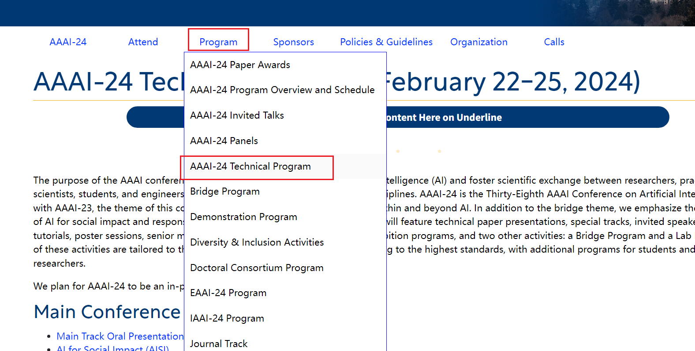

[2024年顶会、顶刊SNN相关论文](https://blog.csdn.net/qq_43622216/article/details/135167498)

# ==一、AAAI 会议论文列表==

1. 进入[官网](https://aaai.org/conference/aaai/)
2. 选择对应年份
   
3. 进入对应选项
   
4. 选择要查看的内容
   
5. [AAAI 2024 | 时间序列（Time Series）和时空数据（Spatial-Temporal）论文总结](https://link.zhihu.com/?target=https%3A//mp.weixin.qq.com/s/zE3UUPgyoUTnxP_N4fXefQ)

# ==二、会议论文列表==

